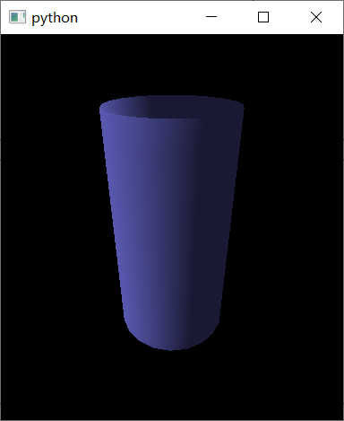

# 3D绘图

补充一些基础知识

3D绘图中，通常是通过绘制一个个小的三角形来绘制物体表面。比如如果想画一个矩形，就需要绘制两个三角形拼起来。无论多复杂的物体表面，都是通过一个个小的三角形拼起来的。

如何绘制这个三角形？

需要顶点（vertices）和面（faces），其中顶点是一个一个三维坐标点，面是一个包含3个顶点的数组。

面的含义就是将这3个点连在一起，就形成了一个三角形的面。`faces`就包含很多很多个有3个顶点的数组，然后把一个个三角形面绘制出来，就形成了3D表面。



## 圆柱体

### 用pyqtgraph提供的圆柱体

```python
gl.MeshData.cylinder(rows=10, cols=20, radius=[5.0, 5], length=20.0)
```

该函数用于创建一个圆柱体的顶点坐标数组，以便在OpenGL中进行渲染。下面是参数的解释：

- `rows`：圆柱体的纵向分割数，即沿着圆柱体的高度方向划分多少个小段，默认值为10。
- `cols`：圆柱体的横向分割数，即沿着圆柱体的周向划分多少个小段，默认值为20。
- `radius`：圆柱体的底面半径和顶面半径，可以分别指定，如果只指定一个值，则认为是底面半径和顶面半径相等，传入一个长度为2的列表或数组，第一个元素是底面半径，第二个元素是顶面半径，默认值为`[5.0, 5]`。
- `length`：圆柱体的高度，即沿着圆柱体的高度方向的长度，默认值为20.0。

函数返回的是一个包含圆柱体顶点坐标、面的索引、法线向量等信息的对象，可以用于创建圆柱体的渲染对象。


```python
cylinder._vertexes[:, 2] = cylinder._vertexes[:, 2] - 10
```

将创建的圆柱体在Z轴方向上下移了10个单位。

`cylinder._vertexes`是圆柱体的顶点坐标数组，其中每个顶点的x、y、z坐标分别对应数组中的第0、1、2个元素。

`cylinder._vertexes[:, 2]`选择了所有顶点的z坐标，并将其减去了10，表示将整个圆柱体在Z轴上下移动了10个单位。


```python
gl.GLMeshItem(meshdata=cylinder, smooth=True)
```

用于创建一个OpenGL中可以渲染圆柱体的对象。下面是参数的解释：

- `meshdata`：用于指定圆柱体顶点坐标、面的索引、法线向量等信息的对象，可以由`gl.MeshData.cylinder`等函数创建得到。
- `smooth`：一个布尔值，用于指定是否启用平滑着色。如果设置为True，则使用平滑着色，否则使用分段着色。默认值为True。
- `shader`：用于指定渲染对象的着色器，可以是字符串或者`gl.GLShaderProgram`对象，默认为None。
- `color`：用于指定渲染对象的颜色，可以是字符串或Qt颜色对象，默认为`None`，表示使用默认颜色。
- `drawEdges`：一个布尔值，用于指定是否绘制渲染对象的边缘线，默认为False。
- `edgeColor`：用于指定绘制渲染对象边缘线的颜色，可以是字符串或Qt颜色对象，默认为`None`，表示使用默认颜色。
- `antialias`：一个布尔值，用于指定是否开启抗锯齿，默认为False。

函数返回的是一个包含圆柱体渲染对象的`GLMeshItem`对象，可以通过`addItem`方法将其添加到OpenGL窗口中。

### 用numpy自己生成的圆柱体