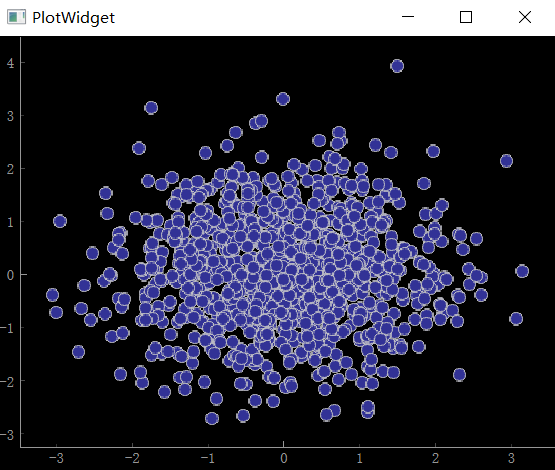
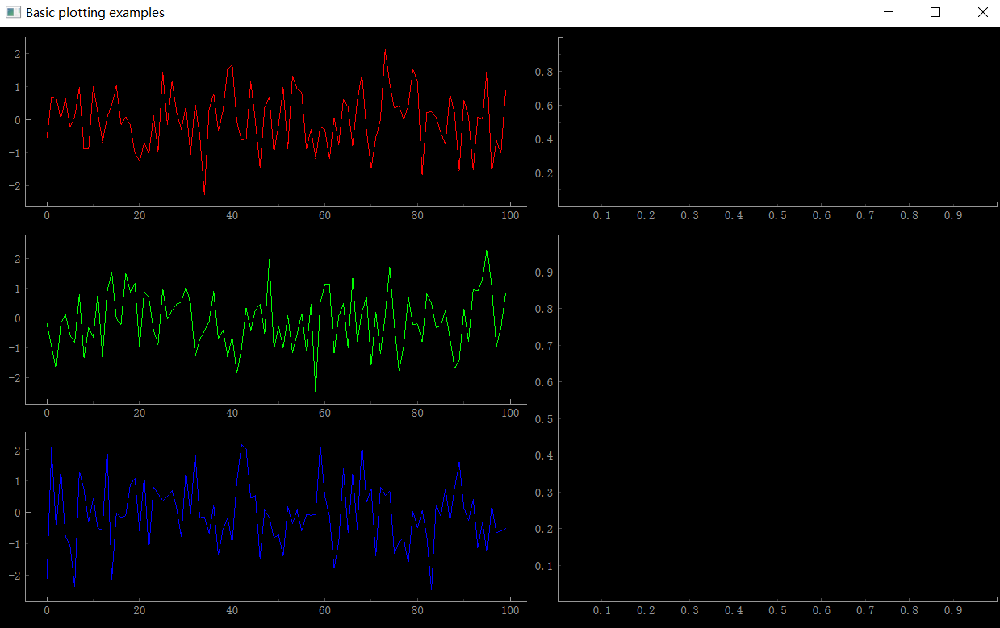
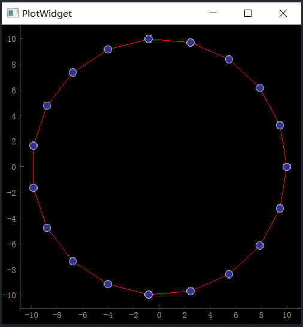

官方文档：https://pyqtgraph.readthedocs.io/en/latest/

# pyqtgraph

查看所有示例

```python
import pyqtgraph.examples
pyqtgraph.examples.run()
```


### 第一幅图

[PlotWidget](https://pyqtgraph.readthedocs.io/en/latest/api_reference/widgets/plotwidget.html#pyqtgraph.PlotWidget)

```python
import pyqtgraph as pg
import numpy as np

x = [1, 3, 2, 5, 4]
y = [1, 2, 3, 4, 5]
pg.plot(x, y)
if __name__ == "__main__":
    pg.exec()
```



### 在PyQt中使用pyqtgraph

可以通过各种[widgets](https://pyqtgraph.readthedocs.io/en/latest/api_reference/widgets/index.html#api-widgets) 在PyQt中使用pyqtgraph，最常用的有：

- [`PlotWidget`](https://pyqtgraph.readthedocs.io/en/latest/api_reference/widgets/plotwidget.html#pyqtgraph.PlotWidget)
- [`ImageView`](https://pyqtgraph.readthedocs.io/en/latest/api_reference/widgets/imageview.html#pyqtgraph.ImageView)
- [`GraphicsLayoutWidget`](https://pyqtgraph.readthedocs.io/en/latest/api_reference/widgets/graphicslayoutwidget.html#pyqtgraph.GraphicsLayoutWidget), 
-  [`GraphicsView`](https://pyqtgraph.readthedocs.io/en/latest/api_reference/widgets/graphicsview.html#pyqtgraph.GraphicsView)

```python
w = pg.GraphicsLayoutWidget()
p1 = w.addPlot(row=0, col=0)
p2 = w.addPlot(row=1, col=0)
p3 = w.addPlot(row=2, col=0)

v1 = w.addViewBox(row=0, col=1)
v1 = w.addViewBox(row=1, col=1, rowspan=2)
```

## 疑问

如何创建最简单的一张图

### `pyqtgraph.plot()`是什么？

https://pyqtgraph.readthedocs.io/en/latest/getting_started/plotting.html

在pyqtgraph中，有以下4种绘图常用的方式

| 函数                                                         | 说明                                                         |
| ------------------------------------------------------------ | ------------------------------------------------------------ |
| [`pyqtgraph.plot()`](https://pyqtgraph.readthedocs.io/en/latest/api_reference/functions.html#pyqtgraph.plot) | 创建一个新的绘图窗口展示你的数据                             |
| [`GraphicsLayout.addPlot()`](https://pyqtgraph.readthedocs.io/en/latest/api_reference/graphicsItems/graphicslayout.html#pyqtgraph.GraphicsLayout.addPlot) | 在网格布局中添加绘图                                         |
| `PlotWidget.plot()`                                          | Calls [`PlotItem.plot`](https://pyqtgraph.readthedocs.io/en/latest/api_reference/graphicsItems/plotitem.html#pyqtgraph.PlotItem.plot) |
| [`PlotItem.plot()`](https://pyqtgraph.readthedocs.io/en/latest/api_reference/graphicsItems/plotitem.html#pyqtgraph.PlotItem.plot) | 在现有的widget上添加新的数据                                 |

其中`pyqtgraph.plot()`是最简单的绘图方式

这些绘图函数接收以下的通用基本参数：

- x：可选参数，如果不传入，则自动匹配y的维度
- y
- pen：绘制线条的pen，如果是None，就不显示线条
- symbol：字符串，每个点的形状，也可以接收字符串列表，这样每个点的形状会不一样
- symbolPen：点的外边缘的pen
- symbolBrush：填充symbol的样式
- fillLevel：对于y下面的部分的填充？Fills the area under the plot curve to this Y-value.
- brush：填充曲线下方时使用的刷子

可以在这里查看这些参数的使用案例： [example](https://pyqtgraph.readthedocs.io/en/latest/getting_started/introduction.html#examples)

同时，上面的函数都会返回绘制曲线时创建的handles，通过这些handles可以在以后更好的定制图像。

### 绘图类的组织架构

在绘图时会涉及好几个类。大部分类都是自动实例化的，但是理解这些类是如何组织并联	在一起的也是有必要的。

PyQtGraph主要基于Qt的GraphicsView框架。如果你还不熟悉这个框架，可以去了解一下，但是不是必须的。

核心知识点：1）QtGUI由QWidget组成，2）一个名为QGraphicsView的特殊小部件用于显示复杂的图形，3）QGraphicsItems定义QGraphics视图中显示的对象。

- 数据类(都是QGraphicsItem的子类)
  - [`PlotCurveItem`](https://pyqtgraph.readthedocs.io/en/latest/api_reference/graphicsItems/plotcurveitem.html#pyqtgraph.PlotCurveItem)  - 给定x,y 绘制线条
  - [`ScatterPlotItem`](https://pyqtgraph.readthedocs.io/en/latest/api_reference/graphicsItems/scatterplotitem.html#pyqtgraph.ScatterPlotItem)   - 给定x,y 绘制散点
  - [`PlotDataItem`](https://pyqtgraph.readthedocs.io/en/latest/api_reference/graphicsItems/plotdataitem.html#pyqtgraph.PlotDataItem) - 结合了`PlotCurveItem`和`ScatterPlotItem`. 上面讨论的绘图函数创建了这种类型的对象。

- 容器类(Container)(QGraphicsItem的子类;包含了其他的 QGraphicsItem 对象，同时只能在GraphicsView类中展示)
  - [`PlotItem`](https://pyqtgraph.readthedocs.io/en/latest/api_reference/graphicsItems/plotitem.html#pyqtgraph.PlotItem) - 包含用于显示数据的ViewBox以及用于显示轴和标题的AxisItems和标签。这是一个QGraphicsItem子类，因此只能在GraphicsView中使用
  - [`GraphicsLayout`](https://pyqtgraph.readthedocs.io/en/latest/api_reference/graphicsItems/graphicslayout.html#pyqtgraph.GraphicsLayout)  - 用于显示items网格的QGraphicsItem子类，用于一起展示多张图
  - [`ViewBox`](https://pyqtgraph.readthedocs.io/en/latest/api_reference/graphicsItems/viewbox.html#pyqtgraph.ViewBox)  - 用于显示数据的QGraphicsItem子类。用户可以使用鼠标缩放/平移ViewBox的内容。通常，所有PlotData/PlotCurve/ScatterPlotItems都显示在ViewBox中。
  - [`AxisItem`](https://pyqtgraph.readthedocs.io/en/latest/api_reference/graphicsItems/axisitem.html#pyqtgraph.AxisItem)  - 显示 axis values、ticks和标签。最常用于PlotItem。
- Container Classes (subclasses of QWidget; may be embedded in PyQt GUIs)
  - [`PlotWidget`](https://pyqtgraph.readthedocs.io/en/latest/api_reference/widgets/plotwidget.html#pyqtgraph.PlotWidget)  - 显示单个PlotItem的GraphicsView子类。PlotItem提供的大多数方法也可通过PlotWidget获得。 
  - [`GraphicsLayoutWidget`](https://pyqtgraph.readthedocs.io/en/latest/api_reference/widgets/graphicslayoutwidget.html#pyqtgraph.GraphicsLayoutWidget) - QWidget 子类，展示单个[`GraphicsLayout`](https://pyqtgraph.readthedocs.io/en/latest/api_reference/graphicsItems/graphicslayout.html#pyqtgraph.GraphicsLayout). [`GraphicsLayout`](https://pyqtgraph.readthedocs.io/en/latest/api_reference/graphicsItems/graphicslayout.html#pyqtgraph.GraphicsLayout)提供的大多数方法也可通过GraphicsLayoutWidget获得。 

[                 ](https://pyqtgraph.readthedocs.io/en/latest/_images/plottingClasses1.png)

See the [UML class diagram](https://pyqtgraph.readthedocs.io/en/latest/api_reference/uml_overview.html#uml-diagram) page for a more detailed figure of the most important classes and their relations.

### PlotWidge是什么

```python
plotWidget = pg.plot(title="Three plot curves")
```

绘图函数产生的对象就是一个`PlotWidge`

### 如何在PyQt中创建一张图

https://www.pythonguis.com/tutorials/plotting-pyqtgraph/

```python
from PyQt5 import QtWidgets
import pyqtgraph as pg
import sys
import os

import numpy as np


class MainWindow(QtWidgets.QMainWindow):
    def __init__(self, *args, **kwargs):
        super(MainWindow, self).__init__(*args, **kwargs)

        self.graphWidget = pg.PlotWidget()
        self.setCentralWidget(self.graphWidget)
        x = np.random.normal(size=1000)
        y = np.random.normal(size=1000)
        self.graphWidget.plot(x, y, pen=None, symbol="o")


def main():
    app = QtWidgets.QApplication(sys.argv)
    main = MainWindow()
    main.show()
    sys.exit(app.exec_())


if __name__ == "__main__":
    main()
```


代码组织，这里是按我个人的思路组织代码。

```python
from PyQt5 import QtWidgets
import pyqtgraph as pg
import sys
import numpy as np


class MyGraphWidget(pg.PlotWidget):
    def __init__(self, parent=None):
        super().__init__(parent)
        x = np.random.normal(size=1000)
        y = np.random.normal(size=1000)
        self.plot(x, y, pen=None, symbol="o")


class MainWindow(QtWidgets.QMainWindow):
    def __init__(self, *args, **kwargs):
        super(MainWindow, self).__init__(*args, **kwargs)

        self.graphWidget = MyGraphWidget()
        self.setCentralWidget(self.graphWidget)


def main():
    app = QtWidgets.QApplication(sys.argv)
    main = MainWindow()
    main.show()
    sys.exit(app.exec_())


if __name__ == "__main__":
    main()
```

把绘图任务全都放在`MyGraphWidget`类的初始化中了。

### 如何多图布局

```python
import pyqtgraph as pg
import numpy as np

w = pg.GraphicsLayoutWidget(show=True, title="Basic plotting examples")
w.resize(1000, 600)

p1 = w.addPlot(row=0, col=0)
p2 = w.addPlot(row=1, col=0)
p3 = w.addPlot(row=2, col=0)

p4 = w.addPlot(row=0, col=1)
p5 = w.addPlot(row=1, col=1, rowspan=2)

p1.plot(np.random.normal(size=100), pen=(255, 0, 0), name="Red curve")
p2.plot(np.random.normal(size=100), pen=(0, 255, 0), name="Green curve")
p3.plot(np.random.normal(size=100), pen=(0, 0, 255), name="Red curve")

# v1 = w.addViewBox(row=0, col=1)
# v2 = w.addViewBox(row=1, col=1, rowspan=2)

if __name__ == "__main__":
    pg.exec()

```



网格布局之，填充空label来更改比例

```python
layout.addLabel(text="", row=0, col=0)
layout.addLabel(text="", row=0, col=1)
layout.addLabel(text="", row=0, col=2)
layout.addItem(p1, row=1, col=0, colspan=2, rowspan=2)
layout.addItem(p2, row=2, col=2)
layout.addItem(p2, row=1, col=2)
```


### `ViewBox`是什么？


### 如何隐藏坐标轴刻度

### 如何隐藏坐标轴

### 如何使坐标轴的XY轴比例一样

```python
# 绘制数据
plot.plot(x, y, pen='r')

# 锁定x轴和y轴的比例
plot.setAspectLocked(True)
```

### 如何修改曲线

```python
curve = p.plot(pen='y')
curve.setData(data)
curve.setData(x, y)
```

### 如何设置xy轴标签

```python
w = pg.GraphicsLayoutWidget(show=True, title="examples")
p = w.addPlot(row=0, col=0)
p.setLabel("left", "折射率")
p.setLabel("bottom", "位置", units="mm")
```

### 调整标签字体大小颜色样式

```python
from PyQt5 import QtWidgets, QtGui
font_style = {"font-size": "15pt", "font-weight": "bold", "color": "black"}

p.setLabel("left", "折射率", **font_style)
p.setLabel("bottom", "位置", units="m", **font_style)
```


### 如何设置双y轴

### 如何设置图例

### 可移动直线InfiniteLine

[InfiniteLine](https://pyqtgraph.readthedocs.io/en/latest/api_reference/graphicsItems/infiniteline.html)

```python
vline = pg.InfiniteLine(
    movable=True,
    angle=90,
    label="x={value:0.2f}",
    hoverPen=(0, 200, 0),
    labelOpts={
        "position": 0.1,
        "color": (200, 200, 100),
        "fill": (200, 200, 200, 50),
        "movable": True,
    },
)

# 改变
vline.setPos(10)
vline.setBounds(0, 10)  # 拖动的范围
# 设置范围

```


### 如何绘制线性区域

:book:[LinearRegionItem](https://pyqtgraph.readthedocs.io/en/latest/api_reference/graphicsItems/linearregionitem.html)

```python
region = pg.LinearRegionItem()
p.addItem(region, ignoreBounds=True)

# 更改
region.setRegion((xmin, xmax))
```

### 如何添加会变的文本

[LabelItem](https://pyqtgraph.readthedocs.io/en/latest/api_reference/graphicsItems/labelitem.html)

```python
label = pg.LabelItem()

label.setText("<span style='font-size: 12pt'>x=%0.1f,   <span style='color: red'>y1=%0.1f</span>,   <span style='color: green'>y2=%0.1f</span>" % (mousePoint.x(), data1[index], data2[index]))
```

css格式

```python
"<p style='color: green; font-size: 12pt'>Hello</p>"
```

### 如何设置图像的全局格式

[Global Configuration Options](https://pyqtgraph.readthedocs.io/en/latest/api_reference/config_options.html)

```python
# 设置抗锯齿，使得曲线更平滑
pg.setConfigOptions(antialias=True)
pg.setConfigOption('font', '微软雅黑')
```

### 坐标轴联动

```python
"""
This example demonstrates the ability to link the axes of views together
Views can be linked manually using the context menu, but only if they are given 
names.
"""

import numpy as np

import pyqtgraph as pg

app = pg.mkQApp("Linked Views Example")
#mw = QtWidgets.QMainWindow()
#mw.resize(800,800)

x = np.linspace(-50, 50, 1000)
y = np.sin(x) / x

win = pg.GraphicsLayoutWidget(show=True, title="pyqtgraph example: Linked Views")
win.resize(800,600)

win.addLabel("Linked Views", colspan=2)
win.nextRow()

p1 = win.addPlot(x=x, y=y, name="Plot1", title="Plot1")
p2 = win.addPlot(x=x, y=y, name="Plot2", title="Plot2: Y linked with Plot1")
p2.setLabel('bottom', "Label to test offset")
p2.setYLink('Plot1')  ## test linking by name


## create plots 3 and 4 out of order
p4 = win.addPlot(x=x, y=y, name="Plot4", title="Plot4: X -> Plot3 (deferred), Y -> Plot1", row=2, col=1)
p4.setXLink('Plot3')  ## Plot3 has not been created yet, but this should still work anyway.
p4.setYLink(p1)
p3 = win.addPlot(x=x, y=y, name="Plot3", title="Plot3: X linked with Plot1", row=2, col=0)
p3.setXLink(p1)
p3.setLabel('left', "Label to test offset")
#QtWidgets.QApplication.processEvents()

if __name__ == '__main__':
    pg.exec()

```

核心就是

```python
p1.setXLink(p2)
p1.setYLink(p2)
```


### 如何禁用坐标轴范围自动更新

```python
self.vb.disableAutoRange(axis="y")
self.vb.disableAutoRange(axis="x")
self.setYRange(-40, 40)
```


在 Pyqtgraph 中，可以使用 `setAutoVisible()` 方法来锁定坐标轴的范围，在更新数据时，坐标轴范围不会自动调整。

>  我发现还是会自动调整，得手动用鼠标在图上拖一下，之后改变数据才不会自动调成

```python
plot.setAutoVisible(x=False, y=False)
```

后来发现要这样设置

```python
plot.vb.disableAutoRange(axis="y")
plot.vb.disableAutoRange(axis="x")
```

自动更新范围限制

95%以上的数据就不显示了

```python
p1.enableAutoRange('y', 0.95)
```

自动缩放时的边距

```python
p1.setDefaultPadding(padding=0.02)
```


### 如何禁用坐标轴鼠标拖动范围

```python
plot = pg.PlotWidget()
plot.getViewBox().setMouseEnabled(x=False)
```


### 鼠标事件

鼠标点击事件：[pyqtgraph.GraphicsScene.mouseEvents.MouseClickEvent](https://pyqtgraph.readthedocs.io/en/latest/api_reference/graphicsscene/mouseclickevent.html#pyqtgraph.GraphicsScene.mouseEvents.MouseClickEvent)

[pyqtgraph.GraphicsScene](https://pyqtgraph.readthedocs.io/en/latest/api_reference/graphicsscene/graphicsscene.html)

其他常用信号

```python
sigMouseClicked(event)
sigMouseMoved(pos)
sigMouseHover(items)
```


```python
proxy = pg.SignalProxy(
    p1.scene().sigMouseClicked, rateLimit=60, slot=mouse_clicked
)

def mouse_clicked(evt):
    evt = evt[0]
    print(evt)
    if evt.double():
        print("double click")
    print("evt.button() = ", evt.button())
    print("evt.pos() = ", evt.pos())  # plot的坐标
    print("evt.scenePos() = ", evt.scenePos())  # 窗口的坐标
    print("evt.screenPos() = ", evt.screenPos())  # 电脑屏幕的坐标
```

```
<MouseClickEvent (110,28) button=1>
evt.button() =  1
evt.pos() =  Point(110.000000, 28.000000)
evt.scenePos() =  Point(159.000000, 225.000000)
evt.screenPos() =  Point(1341.000000, 447.000000)
```

对于`evt.button()`，左键是1，右键是2，中键是4

### 信号代理SignalProxy

```python
proxy = pg.SignalProxy(p1.scene().sigMouseMoved, rateLimit=60, slot=mouseMoved)
```

`rateLimit=60`表示每秒钟最多调用回调函数60次。

```python
p1.scene().sigMouseMoved
```

获取曲线p1所在场景的鼠标移动事件`sigMouseMoved`。

```python
slot=mouseMoved
```

当检测到p1所在场景鼠标移动时，调用我们定义的`mouseMoved`方法。


Pyqtgraph中的SignalProxy在数据发生变化时捕捉并对其进行处理。它能够监测任何已连接的信号，并在信号被触发时调用一个回调函数。SignalProxy被设计用于在实时数据流中获取数据、对数据进行处理、更新显示等。例如，当从网络流式传输数据时，SignalProxy可以用于捕捉数据的变化，并在数据发生变化时更新图表、图像等。

`p1.scene()`

在PyQtGraph中，一个PlotWidget（或其他绘图部件）包含了一个或多个子场景（scene），每个子场景都可以包含一个或多个绘图项（item）。在这种层次结构中，每个子场景都是一个 QGraphicsScene 对象。

在上面的例子中，我们使用了p1.scene()方法来获取曲线所在的场景。具体来说，p1是一个GraphicsObject对象，代表了绘图中的曲线。在这个例子中，曲线被添加到PlotWidget中，因此它所在的场景实际上是 PlotWidget 的默认场景。因此，p1.scene()返回的是PlotWidget的默认场景对象，即 QGraphicsScene 对象。

我们使用 SignalProxy 对象连接曲线的数据变化信号 sigDataChanged 和回调函数 updateData。为了监听此信号，我们需要获取到曲线所在的场景对象。因此，我们使用 curve.scene() 来获取曲线所在的场景对象，并将其作为 SignalProxy 对象的参数之一。这样，SignalProxy 对象就可以监听到曲线的数据变化信号，并在信号被触发时调用回调函数 updateData。

sigMouseMoved是什么意思？

`sigMouseMoved` 是一个 PyQtGraph 内置的信号(signal)，它在鼠标移动时被发出。当鼠标在 Pyqtgraph 的图形区域内移动时，该信号会被触发，并携带有关鼠标位置的信息。

### 坐标轴位置移动

https://pyqtgraph.readthedocs.io/en/latest/api_reference/graphicsItems/plotitem.html#pyqtgraph.PlotItem.getAxis

https://pyqtgraph.readthedocs.io/en/latest/api_reference/graphicsItems/axisitem.html

比如变成十字坐标系

```python
# 创建 AxisItem 对象
xAxis = pg.AxisItem(orientation='bottom')

# 将 AxisItem 添加到 PlotWidget 中
pw.setAxisItems({'bottom': xAxis})

# 将 AxisItem 的位置设置为 y=0 的位置
xAxis.setPos(0)
```

直接获取坐标轴对象

```python
import pyqtgraph as pg

# 创建 PlotWidget 对象
pw = pg.PlotWidget()

# 获取底部轴对象
xAxis = pw.getAxis('bottom')
# 获取左侧轴对象
yAxis = pw.getAxis('left')

```

### showAxes

https://pyqtgraph.readthedocs.io/en/latest/api_reference/graphicsItems/plotitem.html#pyqtgraph.PlotItem.showAxes

第一个参数为True，表示显示所有的坐标轴

```python
# (left, top, right, bottom)
self.p5.showAxes(True, showValues=(True, True, False, False), size=20)
```

showLabel(*axis*, *show=True*)

设置Label的显示开关

### 设置线条样式mkPen

https://pyqtgraph.readthedocs.io/en/latest/api_reference/functions.html#pyqtgraph.mkPen

pyqtgraph 如何设置绘图曲线的样式为虚线，线条样式有哪些？	

在 PyQtGraph 中，您可以使用 `setPen()` 方法来设置绘图曲线的样式。要将线条样式设置为虚线，可以使用 `Qt.QtCore.Qt.DashLine` 作为 `QPen` 的参数之一。除了虚线，还有许多其他可用的线条样式，如实线、点线、点划线等。以下是一些常用的线条样式：

- Qt.QtCore.Qt.SolidLine：实线
- Qt.QtCore.Qt.DashLine：虚线
- Qt.QtCore.Qt.DotLine：点线
- Qt.QtCore.Qt.DashDotLine：点划线
- Qt.QtCore.Qt.DashDotDotLine：双点划线

```python
import pyqtgraph as pg
from PyQt5 import QtCore, QtGui

app = QtGui.QApplication([])
win = pg.GraphicsWindow()
p = win.addPlot()
pen = pg.mkPen(color='r', width=1, style=QtCore.Qt.DashLine)
curve = p.plot([1, 2, 3, 4, 5], [1, 2, 3, 2, 1], pen=pen)

```

### 设置marker样式

```python
"""
This example shows all the scatter plot symbols available in pyqtgraph.

These symbols are used to mark point locations for scatter plots and some line
plots, similar to "markers" in matplotlib and vispy.
"""

import pyqtgraph as pg

app = pg.mkQApp("Symbols Examples")
win = pg.GraphicsLayoutWidget(show=True, title="Scatter Plot Symbols")
win.resize(1000,600)

pg.setConfigOptions(antialias=True)

plot = win.addPlot(title="Plotting with symbols")
plot.addLegend()
plot.plot([0, 1, 2, 3, 4], pen=(0,0,200), symbolBrush=(0,0,200), symbolPen='w', symbol='o', symbolSize=14, name="symbol='o'")
plot.plot([1, 2, 3, 4, 5], pen=(0,128,0), symbolBrush=(0,128,0), symbolPen='w', symbol='t', symbolSize=14, name="symbol='t'")
plot.plot([2, 3, 4, 5, 6], pen=(19,234,201), symbolBrush=(19,234,201), symbolPen='w', symbol='t1', symbolSize=14, name="symbol='t1'")
plot.plot([3, 4, 5, 6, 7], pen=(195,46,212), symbolBrush=(195,46,212), symbolPen='w', symbol='t2', symbolSize=14, name="symbol='t2'")
plot.plot([4, 5, 6, 7, 8], pen=(250,194,5), symbolBrush=(250,194,5), symbolPen='w', symbol='t3', symbolSize=14, name="symbol='t3'")
plot.plot([5, 6, 7, 8, 9], pen=(54,55,55), symbolBrush=(55,55,55), symbolPen='w', symbol='s', symbolSize=14, name="symbol='s'")
plot.plot([6, 7, 8, 9, 10], pen=(0,114,189), symbolBrush=(0,114,189), symbolPen='w', symbol='p', symbolSize=14, name="symbol='p'")
plot.plot([7, 8, 9, 10, 11], pen=(217,83,25), symbolBrush=(217,83,25), symbolPen='w', symbol='h', symbolSize=14, name="symbol='h'")
plot.plot([8, 9, 10, 11, 12], pen=(237,177,32), symbolBrush=(237,177,32), symbolPen='w', symbol='star', symbolSize=14, name="symbol='star'")
plot.plot([9, 10, 11, 12, 13], pen=(126,47,142), symbolBrush=(126,47,142), symbolPen='w', symbol='+', symbolSize=14, name="symbol='+'")
plot.plot([10, 11, 12, 13, 14], pen=(119,172,48), symbolBrush=(119,172,48), symbolPen='w', symbol='d', symbolSize=14, name="symbol='d'")
plot.plot([11, 12, 13, 14, 15], pen=(253, 216, 53), symbolBrush=(253, 216, 53), symbolPen='w', symbol='arrow_down', symbolSize=22, name="symbol='arrow_down'")
plot.plot([12, 13, 14, 15, 16], pen=(189, 189, 189), symbolBrush=(189, 189, 189), symbolPen='w', symbol='arrow_left', symbolSize=22, name="symbol='arrow_left'")
plot.plot([13, 14, 15, 16, 17], pen=(187, 26, 95), symbolBrush=(187, 26, 95), symbolPen='w', symbol='arrow_up', symbolSize=22, name="symbol='arrow_up'")
plot.plot([14, 15, 16, 17, 18], pen=(248, 187, 208), symbolBrush=(248, 187, 208), symbolPen='w', symbol='arrow_right', symbolSize=22, name="symbol='arrow_right'")
plot.setXRange(-2, 4)

if __name__ == '__main__':
    pg.exec()

```


### 文本

```python

# 创建一个 DraggableTextItem 对象，并将其添加到 PlotItem 中
text = pg.TextItem("Hello World")
text.setPos(0, 0)  # 设置文本的位置
plot.addItem(text)
```

### 如何设置标题字体

首先可以通过

```
plot.setTitle("title")
```

设置标题的文本格式，直接写html格式

```
plot.setTitle("<span style='font-size: 18px; font-weight: bold'></span>")
```


### 如何修改图像比例

https://stackoverflow.com/questions/64402919/how-set-stretch-factor-for-chart-in-pyqtgraph

### ROI 可拖动的矩形框

https://pyqtgraph.readthedocs.io/en/latest/api_reference/graphicsItems/roi.html

region-of-interest 

### 背景设置为白色

```python
import pyqtgraph as pg
w = pg.GraphicsLayoutWidget
w.setBackground("#FFFFFF")
pg.setConfigOption("foreground", "k")
```


# 案例

## 绘制圆

```python
import pyqtgraph as pg
import numpy as np


theta = np.linspace(0, np.pi * 2, 20)
r = 10
y = np.sin(theta) * r
x = np.cos(theta) * r
w = pg.plot(x, y, pen="red", symbol="o")  ## setting pen=None disables line drawing
w.resize(400, 400)
if __name__ == "__main__":
    pg.exec()

```



## 鼠标移动时显示数值

案例解读

[LinearRegionItem](https://pyqtgraph.readthedocs.io/en/latest/api_reference/graphicsItems/linearregionitem.html)

```python
"""
Demonstrates some customized mouse interaction by drawing a crosshair that follows 
the mouse.
"""

import numpy as np

import pyqtgraph as pg

#generate layout
app = pg.mkQApp("Crosshair Example")
win = pg.GraphicsLayoutWidget(show=True)
win.setWindowTitle('pyqtgraph example: crosshair')
label = pg.LabelItem(justify='right')
win.addItem(label)
p1 = win.addPlot(row=1, col=0)
# customize the averaged curve that can be activated from the context menu:
p1.avgPen = pg.mkPen('#FFFFFF')
p1.avgShadowPen = pg.mkPen('#8080DD', width=10)

p2 = win.addPlot(row=2, col=0)

region = pg.LinearRegionItem()
region.setZValue(10)
# Add the LinearRegionItem to the ViewBox, but tell the ViewBox to exclude this 
# item when doing auto-range calculations.
p2.addItem(region, ignoreBounds=True)

#pg.dbg()
p1.setAutoVisible(y=True)


#create numpy arrays
#make the numbers large to show that the range shows data from 10000 to all the way 0
data1 = 10000 + 15000 * pg.gaussianFilter(np.random.random(size=10000), 10) + 3000 * np.random.random(size=10000)
data2 = 15000 + 15000 * pg.gaussianFilter(np.random.random(size=10000), 10) + 3000 * np.random.random(size=10000)

p1.plot(data1, pen="r")
p1.plot(data2, pen="g")

p2d = p2.plot(data1, pen="w")
# bound the LinearRegionItem to the plotted data
region.setClipItem(p2d)

def update():
    region.setZValue(10)
    minX, maxX = region.getRegion()
    p1.setXRange(minX, maxX, padding=0)    

region.sigRegionChanged.connect(update)

def updateRegion(window, viewRange):
    rgn = viewRange[0]
    region.setRegion(rgn)

p1.sigRangeChanged.connect(updateRegion)

region.setRegion([1000, 2000])

#cross hair
vLine = pg.InfiniteLine(angle=90, movable=False)
hLine = pg.InfiniteLine(angle=0, movable=False)
p1.addItem(vLine, ignoreBounds=True)
p1.addItem(hLine, ignoreBounds=True)


vb = p1.vb

def mouseMoved(evt):
    pos = evt[0]  ## using signal proxy turns original arguments into a tuple
    if p1.sceneBoundingRect().contains(pos):
        mousePoint = vb.mapSceneToView(pos)
        index = int(mousePoint.x())
        if index > 0 and index < len(data1):
            label.setText("<span style='font-size: 12pt'>x=%0.1f,   <span style='color: red'>y1=%0.1f</span>,   <span style='color: green'>y2=%0.1f</span>" % (mousePoint.x(), data1[index], data2[index]))
        vLine.setPos(mousePoint.x())
        hLine.setPos(mousePoint.y())


proxy = pg.SignalProxy(p1.scene().sigMouseMoved, rateLimit=60, slot=mouseMoved)
#p1.scene().sigMouseMoved.connect(mouseMoved)


if __name__ == '__main__':
    pg.exec()

```

setAutoVisible

设置自动范围在确定显示范围时是否仅使用可见数据

setZValue() 我猜是类似于matplotlib的zorder ，用于控制叠放次序

### ignoreBounds

在 Pyqtgraph 中，addItem()方法用于将一个可绘制的对象添加到绘图区域中。其中，ignoreBounds 参数是一个布尔值，用于指定是否忽略绘图对象的边界。如果设置为 True，则绘图区域会自动调整以适应绘图对象的大小，不管对象的边界是什么样子。如果设置为 False，则绘图区域会根据绘图对象的边界自动调整大小。

ignoreBounds 参数的作用是控制绘图区域的大小调整方式。在某些情况下，绘图对象的边界可能不准确，或者用户希望手动控制绘图区域的大小，此时可以将 ignoreBounds 设置为 False。另一方面，如果绘图对象的边界准确，并且希望自动调整绘图区域以适应对象的大小，则可以将 ignoreBounds 设置为 True。

### sigRangeChanged

在拖动图片时，随着x轴和y轴范围的改变，会产生一个信号

```python
p1.sigRangeChanged.connect(updateRegion)
```

发送x，y轴改变后的范围数据`viewRange`

```python
def updateRegion(window, viewRange):
    rgn = viewRange[0]
    print(viewRange)
    region.setRegion(rgn)
```

viewRange的格式

```python
# [[xmin, xmax], [ymin, ymax]]
[[369.1917742544734, 602.7165598696131], 
 [13680.598259925408, 26074.633542882537]]
```

然后通过

```python
region.setRegion(rgn)
```

设置范围

### 交叉线

```python
vLine = pg.InfiniteLine(angle=90, movable=False)
hLine = pg.InfiniteLine(angle=0, movable=False)
```

### vb

在 Pyqtgraph 中，vb 是一个 ViewBox 类的实例，用于控制图形绘制区域的显示和缩放。

ViewBox（视图框）是 Pyqtgraph 中用于显示图形的区域，可以用于显示 2D 或 3D 图形。它提供了缩放、平移、旋转等交互功能，使用户可以自由地浏览和探索数据。

vb 是 Pyqtgraph 中的一个 ViewBox 实例，可以通过添加子项来将图形添加到 vb 中进行显示。vb 还可以与其他部件（如坐标轴、图例等）进行关联，以实现复杂的数据可视化。vb 还提供了许多方法和属性，用于控制视图框的行为和外观，例如设置坐标轴标签、网格线、背景颜色等。

总之，vb 在 Pyqtgraph 中扮演了重要的角色，是控制图形显示和交互的核心部件之一。

```python
vb = p1.vb
```

### mouseMoved事件

窗口的左上角是(0, 0)

```python
def mouseMoved(evt):
    pos = evt[0]
    print(pos)
```

```
PyQt5.QtCore.QPointF(630.0, 73.0)
```

pos是一个PyQt5的QPointF对象

### 判断某个框是否包含点

```python
if p1.sceneBoundingRect().contains(pos):
    pass
```

### 将像素位置转换为图像坐标位置

```python
mousePoint = vb.mapSceneToView(pos)
```


## 可以拖动的垂直线

案例解读

InfiniteLine

```python
"""
This example demonstrates some of the plotting items available in pyqtgraph.
"""

import numpy as np

import pyqtgraph as pg
from pyqtgraph.Qt import QtCore

app = pg.mkQApp("InfiniteLine Example")
win = pg.GraphicsLayoutWidget(show=True, title="Plotting items examples")
win.resize(1000, 600)

# Enable antialiasing for prettier plots
pg.setConfigOptions(antialias=True)

# Create a plot with some random data
p1 = win.addPlot(
    title="Plot Items example", y=np.random.normal(size=100, scale=10), pen=0.5
)
p1.setYRange(-40, 40)

# Add three infinite lines with labels
inf1 = pg.InfiniteLine(
    movable=True,
    angle=90,
    label="x={value:0.2f}",
    labelOpts={
        "position": 0.1,
        "color": (200, 200, 100),
        "fill": (200, 200, 200, 50),
        "movable": True,
    },
)
inf2 = pg.InfiniteLine(
    movable=True,
    angle=0,
    pen=(0, 0, 200),
    bounds=[-20, 20],
    hoverPen=(0, 200, 0),
    label="y={value:0.2f}mm",
    labelOpts={"color": (200, 0, 0), "movable": True, "fill": (0, 0, 200, 100)},
)
inf3 = pg.InfiniteLine(
    movable=True,
    angle=45,
    pen="g",
    label="diagonal",
    labelOpts={"rotateAxis": [1, 0], "fill": (0, 200, 0, 100), "movable": True},
)
inf1.setPos([2, 2])
p1.addItem(inf1)
p1.addItem(inf2)
p1.addItem(inf3)

targetItem1 = pg.TargetItem()

targetItem2 = pg.TargetItem(
    pos=(30, 5),
    size=20,
    symbol="star",
    pen="#F4511E",
    label="vert={1:0.2f}",
    labelOpts={"offset": QtCore.QPoint(15, 15)},
)
targetItem2.label().setAngle(45)

targetItem3 = pg.TargetItem(
    pos=(10, 10),
    size=10,
    symbol="x",
    pen="#00ACC1",
)
targetItem3.setLabel(
    "Third Label",
    {
        "anchor": QtCore.QPointF(0.5, 0.5),
        "offset": QtCore.QPointF(30, 0),
        "color": "#558B2F",
        "rotateAxis": (0, 1),
    },
)


def callableFunction(x, y):
    return f"Square Values: ({x**2:.4f}, {y**2:.4f})"


targetItem4 = pg.TargetItem(pos=(10, -10), label=callableFunction)

p1.addItem(targetItem1)
p1.addItem(targetItem2)
p1.addItem(targetItem3)
p1.addItem(targetItem4)

# Add a linear region with a label
lr = pg.LinearRegionItem(values=[70, 80])
p1.addItem(lr)
label = pg.InfLineLabel(
    lr.lines[1], "region 1", position=0.95, rotateAxis=(1, 0), anchor=(1, 1)
)

if __name__ == "__main__":
    pg.exec()

```

### InfiniteLine

[InfiniteLine](https://pyqtgraph.readthedocs.io/en/latest/api_reference/graphicsItems/infiniteline.html)

```python
inf1 = pg.InfiniteLine(
    movable=True,
    angle=90,
    label="x={value:0.2f}",
    hoverPen=(0, 200, 0),
    labelOpts={
        "position": 0.1,
        "color": (200, 200, 100),
        "fill": (200, 200, 200, 50),
        "movable": True,
    },
)
```

### TargetItem

可以拖动的标记

```python
targetItem2 = pg.TargetItem(
    pos=(30, 5),
    size=20,
    symbol="star",
    pen="#F4511E",
    label="vert={1:0.2f}",
    labelOpts={"offset": QtCore.QPoint(15, 15)},
)
targetItem2.label().setAngle(45)
```

## 三幅图一条可以拖动的线

```python
import numpy as np

import pyqtgraph as pg
from pyqtgraph.Qt import QtCore

app = pg.mkQApp("三幅图一条可以拖动的线")
win = pg.GraphicsLayoutWidget(show=True, title="三幅图一条可以拖动的线")
win.resize(600, 600)

p1 = win.addPlot(title="图1", row=0, col=0)
p2 = win.addPlot(title="图2", row=1, col=0)
p3 = win.addPlot(title="图3", row=2, col=0)

x1 = np.linspace(0, 100, 100)
x2 = np.linspace(0, 100, 100)
x3 = np.linspace(0, 100, 100)
y = np.random.normal(size=100, scale=10)
p1.plot(x1, y, pen="red")
p2.plot(x2, y, pen="green")
p3.plot(x3, y, pen="blue")


def get_vline():
    vline = pg.InfiniteLine(
        movable=True,
        angle=90,
        label="x={value:0.2f}",
        labelOpts={
            "position": 0.1,
            "color": (200, 200, 100),
            "fill": (200, 200, 200, 50),
            "movable": True,
        },
    )
    return vline


vline1 = get_vline()
vline2 = get_vline()
vline3 = get_vline()

vline1.setPos([2, 0])
vline2.setPos([2, 0])
vline3.setPos([2, 0])

p1.addItem(vline1)
p2.addItem(vline2)
p3.addItem(vline3)

# vline移动时，其他的也跟着动
def update_lines(evt):
    xpos = evt.pos().x()
    if evt is vline1:
        vline2.setPos(xpos)
        vline3.setPos(xpos)
    elif evt is vline2:
        vline1.setPos(xpos)
        vline3.setPos(xpos)
    elif evt is vline3:
        vline2.setPos(xpos)
        vline1.setPos(xpos)


vline1.sigPositionChanged.connect(update_lines)
vline2.sigPositionChanged.connect(update_lines)
vline3.sigPositionChanged.connect(update_lines)

if __name__ == "__main__":
    pg.exec()

```

### sigPositionChanged事件

```python
def update_lines(evt):
    pos = evt.pos()
    print(pos.x(), pos.y())

vline1.sigPositionChanged.connect(update_lines)
```

evt是一个GraphicsItem，可以查看https://doc.qt.io/qt-6/qgraphicsobject.html，获取其属性。

最简单的找到其`x`，`y`坐标的方式就是

```python
evt.pos().x()
```

