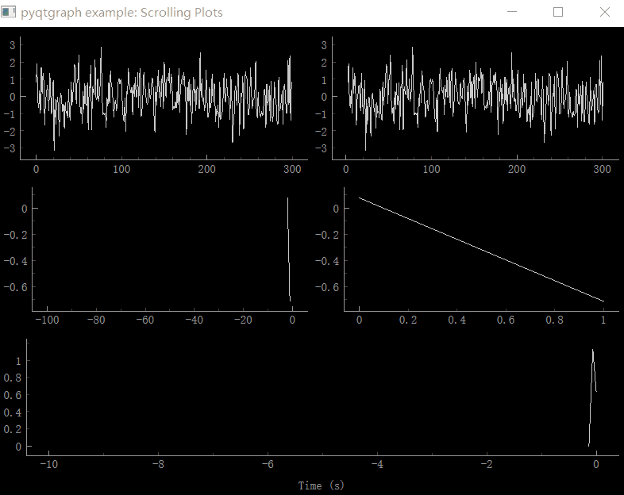

### 预览

效果



完整代码

```python
"""
Various methods of drawing scrolling plots.
"""

from time import perf_counter

import numpy as np

import pyqtgraph as pg

win = pg.GraphicsLayoutWidget(show=True)
win.setWindowTitle("pyqtgraph example: Scrolling Plots")


# 1) Simplest approach -- update data in the array such that plot appears to scroll
#    In these examples, the array size is fixed.
p1 = win.addPlot()
p2 = win.addPlot()
data1 = np.random.normal(size=300)
curve1 = p1.plot(data1)
curve2 = p2.plot(data1)
ptr1 = 0


def update1():
    global data1, ptr1
    data1[:-1] = data1[1:]  # shift data in the array one sample left
    # (see also: np.roll)
    data1[-1] = np.random.normal()
    curve1.setData(data1)

    ptr1 += 1
    curve2.setData(data1)
    curve2.setPos(ptr1, 0)


# 2) Allow data to accumulate. In these examples, the array doubles in length
#    whenever it is full.
win.nextRow()
p3 = win.addPlot()
p4 = win.addPlot()
# Use automatic downsampling and clipping to reduce the drawing load
p3.setDownsampling(mode="peak")
p4.setDownsampling(mode="peak")
p3.setClipToView(True)
p4.setClipToView(True)
p3.setRange(xRange=[-100, 0])
p3.setLimits(xMax=0)
curve3 = p3.plot()
curve4 = p4.plot()

data3 = np.empty(100)
ptr3 = 0


def update2():
    global data3, ptr3
    data3[ptr3] = np.random.normal()
    ptr3 += 1
    if ptr3 >= data3.shape[0]:
        tmp = data3
        data3 = np.empty(data3.shape[0] * 2)
        data3[: tmp.shape[0]] = tmp
    curve3.setData(data3[:ptr3])
    curve3.setPos(-ptr3, 0)
    curve4.setData(data3[:ptr3])


# 3) Plot in chunks, adding one new plot curve for every 100 samples
chunkSize = 100
# Remove chunks after we have 10
maxChunks = 10
startTime = perf_counter()
win.nextRow()
p5 = win.addPlot(colspan=2)
p5.setLabel("bottom", "Time", "s")
p5.setXRange(-10, 0)
curves = []
data5 = np.empty((chunkSize + 1, 2))
ptr5 = 0


def update3():
    global p5, data5, ptr5, curves
    now = perf_counter()
    for c in curves:
        c.setPos(-(now - startTime), 0)

    i = ptr5 % chunkSize
    if i == 0:
        curve = p5.plot()
        curves.append(curve)
        last = data5[-1]
        data5 = np.empty((chunkSize + 1, 2))
        data5[0] = last
        while len(curves) > maxChunks:
            c = curves.pop(0)
            p5.removeItem(c)
    else:
        curve = curves[-1]
    data5[i + 1, 0] = now - startTime
    data5[i + 1, 1] = np.random.normal()
    curve.setData(x=data5[: i + 2, 0], y=data5[: i + 2, 1])
    ptr5 += 1


# update all plots
def update():
    update1()
    update2()
    update3()


timer = pg.QtCore.QTimer()
timer.timeout.connect(update)
timer.start(50)

if __name__ == "__main__":
    pg.exec()

```

### 简单的会移动的图像

```python
from time import perf_counter
import numpy as np
import pyqtgraph as pg

win = pg.GraphicsLayoutWidget(show=True)
win.setWindowTitle("pyqtgraph example: Scrolling Plots")

p1 = win.addPlot()
data1 = np.random.normal(size=300)
curve1 = p1.plot(data1)


def update1():
    global data1, ptr1
    data1[:-1] = data1[1:]
    # (see also: np.roll)
    data1[-1] = np.random.normal()
    curve1.setData(data1)


# update all plots
def update():
    update1()


timer = pg.QtCore.QTimer()
timer.timeout.connect(update)
timer.start(50)

if __name__ == "__main__":
    pg.exec()

```


## 拓展

运动的线

```python
from time import perf_counter
import numpy as np
import pyqtgraph as pg

win = pg.GraphicsLayoutWidget(show=True)
win.setWindowTitle("pyqtgraph example: Scrolling Plots")


p1 = win.addPlot()
p1.vb.disableAutoRange(axis="y")
p1.vb.disableAutoRange(axis="x")
p1.setYRange(-3, 3)
p1.setXRange(0, 10)
theta = np.linspace(0, 2 * np.pi, 100)
x = np.linspace(0, 10, 100)
y = np.sin(x / 10 * np.pi)
curve1 = p1.plot(x, y + 0.5)
curve2 = p1.plot(x, y - 0.5)

k = 0

def update1():
    global x, y, k
    y2 = y * np.sin(theta[k])
    # (see also: np.roll)

    curve1.setData(x, y2 + 0.5)
    curve2.setData(x, y2 - 0.5)
    k = (k + 1) % len(theta)


# update all plots
def update():
    update1()


timer = pg.QtCore.QTimer()
timer.timeout.connect(update)
timer.start(50)

if __name__ == "__main__":
    pg.exec()

```


v2 

增加了光棒截面的变化图

增加了圆心的波动曲线示意图

```python
```

