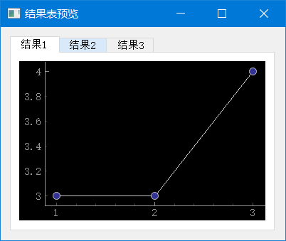

Tab 标签页与 pyqtgraph

```python
import sys
from PyQt5.QtWidgets import QApplication, QWidget, QVBoxLayout, QTabWidget
import pyqtgraph as pg


class TableWidget(QWidget):
    def __init__(self, *args, **kwargs):
        super().__init__(*args, **kwargs)
        vbox = QVBoxLayout()

        tab_widget = QTabWidget()

        # 第一个标签页
        tab1 = QWidget()
        tab1_layout = QVBoxLayout(tab1)
        tab1_layout.addWidget(MyPlotWidget(symbol="o"))
        tab_widget.addTab(tab1, "结果1")

        # 第一个标签页
        tab2 = QWidget()
        tab2_layout = QVBoxLayout(tab2)
        tab2_layout.addWidget(MyPlotWidget(symbol="x"))
        tab_widget.addTab(tab2, "结果2")

        # 第一个标签页
        tab3 = QWidget()
        tab3_layout = QVBoxLayout(tab3)
        tab3_layout.addWidget(MyPlotWidget(symbol="s"))
        tab_widget.addTab(tab3, "结果3")

        vbox.addWidget(tab_widget)
        self.setLayout(vbox)
        self.setWindowTitle("结果表预览")
        self.setGeometry(200, 200, 400, 300)


class MyPlotWidget(pg.PlotWidget):
    def __init__(self, symbol):
        super().__init__()
        self.plot([1, 2, 3], [3, 3, 4], symbol=symbol)


if __name__ == "__main__":
    app = QApplication(sys.argv)
    w = TableWidget()
    w.show()
    sys.exit(app.exec_())

```



