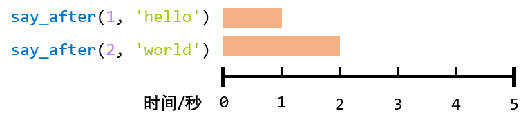

https://docs.python.org/zh-cn/3/library/asyncio-task.html#coroutines

# 协程的最简单应用

下面这个代码就是最简单的协程应用，先打印`hello`，等待2秒后打印`world`

```python
import time
import asyncio

async def main():
    print('%s: hello' % time.strftime('%X'))
    await asyncio.sleep(2)
    print('%s: world' % time.strftime('%X'))

asyncio.run(main())
```

这里等待了两秒

```
14:34:02: hello
14:34:04: world
```

注：使用Jupyter Notebook时会报错，建议使用命令行来运行python脚本。


使用`async`定义函数后，`main()`返回的就是一个协程对象。

直接调用`main()`不会执行

```
>>> main()
<coroutine object main at 0x00000199748C5540>
```

# 运行协程的三种方式

- 方式一：`asyncio.run(<func>)`就是第一个例子的方式
- 方式二：`await <func>`等待一个协程运行完后，运行下一个协程
- 方式三：使用`asyncil.create_task()`来并发运行asyncio任务。

## 方式二：等待一个协程

下面的例子会在1秒后打印`hello`，**再**等2秒后打印`world`。一共执行了3秒。


```python
import asyncio
import time

async def say_after(delay, what):
    await asyncio.sleep(delay)
    print('%s: %s' % (time.strftime('%X'), what))

async def main():
    print(f"started at {time.strftime('%X')}")

    await say_after(1, 'hello')
    await say_after(2, 'world')

    print(f"finished at {time.strftime('%X')}")

asyncio.run(main())
```

预期输出

```
started at 14:39:16
14:39:17: hello
14:39:19: world
finished at 14:39:19
```

## 方式三 并发运行多个协程

下面的例子会先打印`hello`，过1秒后打印`world`。总共执行2秒。



```python
import asyncio
import time

async def say_after(delay, what):
    await asyncio.sleep(delay)
    print(what)
    
async def main():
    task1 = asyncio.create_task(
        say_after(1, 'hello'))

    task2 = asyncio.create_task(
        say_after(2, 'world'))

    print(f"started at {time.strftime('%X')}")

    # Wait until both tasks are completed (should take
    # around 2 seconds.)
    await task1
    await task2

    print(f"finished at {time.strftime('%X')}")
    
asyncio.run(main())
```

结果会比方式二快1秒。

```
started at 14:40:08
14:40:09: hello
14:40:10: world
finished at 14:40:10
```

# 可等待对象

如果一个对象`<obj>`可以用`await <obj>`，那这个对象就是**可等待对象(awaitable)**。主要有三种可等待对象：协程、任务、和Future

## 协程

- 协程函数：以`async def`定义的函数
- 协程对象：协程函数返回的对象

像之前的代码，等待的就是**协程**，会等上面执行完了才执行下面的：

```python
await say_after(1, 'hello')
await say_after(2, 'world')
```

## 任务

使用`asyncio.create_task()`可以把一个协程函数打包成一个任务。

使用`await task`时，会立即运行该任务。

比如方式三的这段代码，等待的就是**任务**，会一起执行这两个函数。

```python
task1 = asyncio.create_task(
        say_after(1, 'hello'))

task2 = asyncio.create_task(
        say_after(2, 'world'))

await task1
await task2
```

## future对象

这个东西，一般不会用到。略

# asyncio.run

这个东西一般只调用一次

```python
asyncio.run(main())
```

负责管理asyncio事件循环、终结异步生成器、关闭线程池。:question:

# 并发运行任务

```python
asyncio.gather(*aws, loop=None, return_exceptions=False)
```

并发运行`aws`序列中的可等待对象

如果`aws`中有协程，会自动把这个协程打包成任务加入日程

如果所有可等待对象都成功完成，结果将是一个由所有返回值聚合而成的列表。结果值的顺序与 *aws* 中可等待对象的顺序一致。

# 屏蔽取消

保护一个可等待对象，防止其被取消

```python
# awaitable
asyncio.shield(aw, *, loop=None)
```

如果 *aw* 是一个协程，它将自动作为任务加入日程。

```python
res = await asyncio.shield(something())
# 相当于
res = await something()
```

前者如果包含它的协程被取消，`something()`中的任务会继续运行。

# 超时

```python
# coroutine
asyncio.wait_for(aw, timeout, *, loop=None)
```


如果发生超时，任务将取消并引发 [`asyncio.TimeoutError`](https://docs.python.org/zh-cn/3/library/asyncio-exceptions.html#asyncio.TimeoutError).

要避免任务 [`取消`](https://docs.python.org/zh-cn/3/library/asyncio-task.html#asyncio.Task.cancel)，可以加上 [`shield()`](https://docs.python.org/zh-cn/3/library/asyncio-task.html#asyncio.shield)。

如果 *aw* 是一个协程，它将自动作为任务加入日程。

# 例子

模拟爬虫的获取页面和解析页面：

在爬虫任务中，通常来说有两个步骤

- 获取页面信息，这里定义为`get()`函数，假设需要2秒
- 解析页面信息，这里定义为`parse()`函数，假设需要1秒

如果有3个url需要解析，总共花费的时间就是(2 + 2) * 3 = 12 秒

用程序模拟的话就是

```python
import time

def get(n):
    print('%s: 获取第%s个页面' % (time.strftime('%X'), n))
    time.sleep(2)
    parse(n)

def parse(n):
    print('%s: 解析第%s个页面' % (time.strftime('%X'), n))
    time.sleep(2)

print('start at %s' % time.strftime('%X'))
for i in range(3):
    get(i + 1)
print('end at %s' % time.strftime('%X'))
```

预期结果

```
start at 15:03:13
15:03:13: 获取第1个页面
15:03:15: 解析第1个页面
15:03:17: 获取第2个页面
15:03:19: 解析第2个页面
15:03:21: 获取第3个页面
15:03:23: 解析第3个页面
end at 15:03:25
```

如果使用协程，获取页面的任务无须等待解析，那一共只需要花费2 * 3 = 6秒。

```python
import time
import asyncio

async def get(n):
    print('%s: 获取第%s个页面' % (time.strftime('%X'), n))
    await asyncio.sleep(2)
    parse_task = asyncio.create_task(parse(n))

async def parse(n):
    print('%s: 解析第%s个页面' % (time.strftime('%X'), n))
    await asyncio.sleep(2)

print('start at %s' % time.strftime('%X'))
for i in range(3):
    asyncio.run(get(i + 1))
    
print('end at %s' % time.strftime('%X'))
```

预期结果

```
start at 15:04:37
15:04:37: 获取第1个页面
15:04:39: 解析第1个页面
15:04:39: 获取第2个页面
15:04:41: 解析第2个页面
15:04:41: 获取第3个页面
15:04:43: 解析第3个页面
end at 15:04:43
```

### 测试

```python
import time

def do_something():
    print(time.strftime('%X'), ': do something')
    for i in range(7000_000_0):
        a = i * i
        
def main():
    for i in range(3):
        do_something()
        
print("start at:", time.strftime('%X'))
main()
print("end at:", time.strftime('%X'))
```

```
start at: 15:20:26
15:20:26 : do something
15:20:30 : do something
15:20:34 : do something
end at: 15:20:38
```

改版1：和上面并没有区别啊

```python
import time
import asyncio

async def do_something():
    print(time.strftime('%X'), ': do something')
    for i in range(7000_000_0):
        a = i * i
        
async def main():
    for i in range(3):
        await do_something()
        
print("start at:", time.strftime('%X'))
asyncio.run(main())
print("end at:", time.strftime('%X'))
```

```
start at: 15:21:53
15:21:53 : do something
15:21:57 : do something
15:22:01 : do something
end at: 15:22:05
```

改版2：同样没有区别

```python
import time
import asyncio

async def do_something():
    print(time.strftime('%X'), ': do something')
    for i in range(7000_000_0):
        a = i * i
        
async def main():
    for i in range(3):
        await do_something()
        
loop = asyncio.get_event_loop()
print("start at:", time.strftime('%X'))
loop.run_until_complete(main())
print("end at:", time.strftime('%X'))
```

```
start at: 15:24:22
15:24:22 : do something
15:24:25 : do something
15:24:29 : do something
end at: 15:24:32
```

改版3：还是没有用

```python
import time
import asyncio


async def do_something():
    print(time.strftime('%X'), ': do something')
    for i in range(7000_000_0):
        a = i * i


async def main():
    for i in range(3):
        await do_something()


loop = asyncio.get_event_loop()
print("start at:", time.strftime('%X'))
tasks = asyncio.gather(*[do_something() for i in range(3)])
loop.run_until_complete(tasks)
print("end at:", time.strftime('%X'))
```

改版4：还是失败！

```python
import time
import asyncio


async def do_something():
    print(time.strftime('%X'), ': do something')
    for i in range(7000_000_0):
        a = i * i


async def main():
    await asyncio.gather(*[do_something() for i in range(3)])

print("start at:", time.strftime('%X'))
asyncio.run(main())
print("end at:", time.strftime('%X'))
```


后来发现，可能是这种代码不起作用

```python
async def do_something():
    print(time.strftime('%X'), ': do something')
    for i in range(7000_000_0):
        a = i * i
```

如果改成

```python
async def do_something():
    print(time.strftime('%X'), ': do something')
    await asyncio.sleep(2)
```

改版2无效，改版3有效，改版4有效