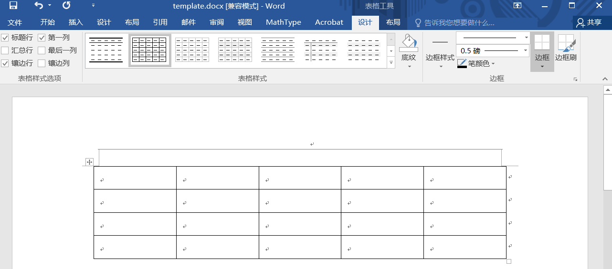
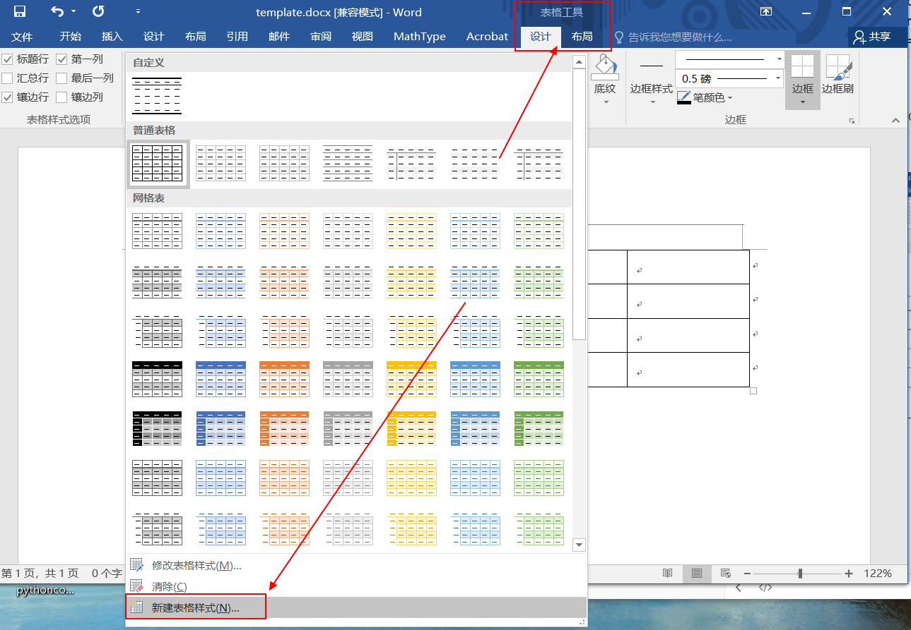
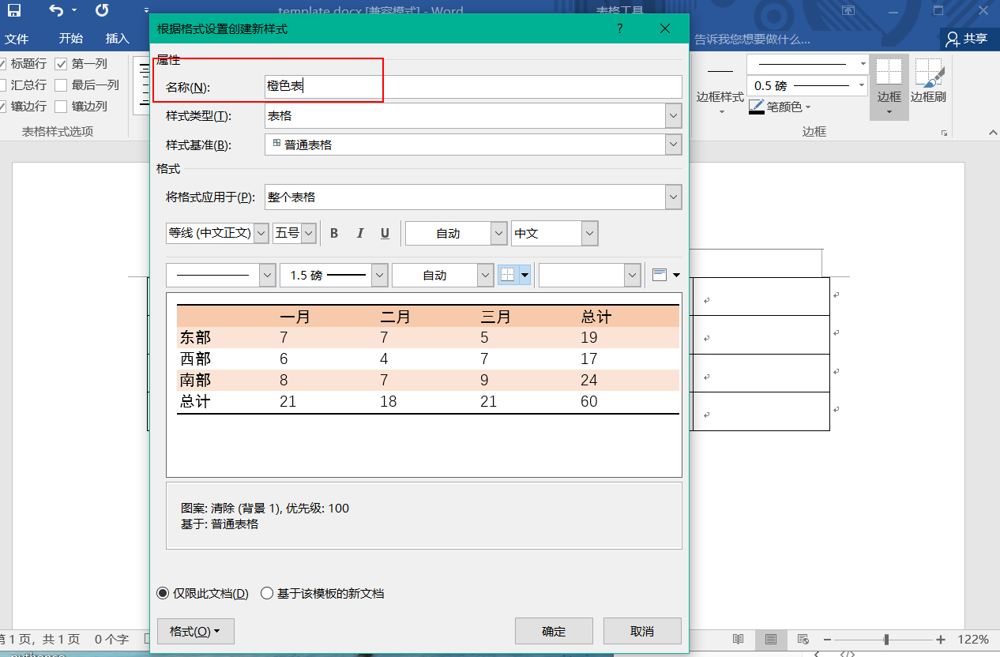
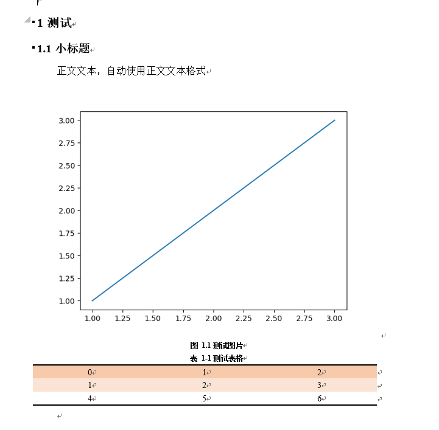

# word自动化工具包

参考资料：

python-docx官方文档：https://python-docx.readthedocs.io/en/latest/index.html

win32com介绍：https://zhuanlan.zhihu.com/p/67543981

```
文件目录
|-word.py  # 工具包
|-使用说明.md  # 工具包说明
|-template.docx  # word模板文档
|-demp.py  # 测试代码

|-demo.png  # 运行测试代码生成的演示图片
|-demo.docx  # 运行测试代码生成演示文档
```


这个工具包其实是对python-docx又进行了一层封装，主要是为了更方便地调控文本样式，快速插入图片和表格。

**插入图片的优化**：图片会自动居中，图片太大的话会自动缩放，可以插入图片的同时插入图片题注。

**插入表格的优化**：直接传入pandas的DataFrame格式的数据即可插入表格，同时可以指定表格的样式，可以插入表格的同时插入表格题注。

>光棒的自动化报告就是把分析过程中的图片和表格通过这个工具包插入word内，逐步堆砌起来。那个代码有点长，就用下面这个简易演示版代替一下了。


使用方式：

```python
from word import Word

# 创建word对象，设置好模板所在目录以及保存路径
w = Word(template_path="./template.docx", save_path="demo.docx")

# 插入标题1
w.add_heading("测试", 1)
w.add_heading("小标题", 2)

# 插入正文
w.add_paragraph("正文文本，自动使用正文文本格式")

# 插入图片
import matplotlib.pyplot as plt
plt.plot([1, 2, 3], [1, 2, 3])
plt.savefig("demo.png")
w.add_picture("demo.png", title="测试图片")

# 插入表格
import pandas as pd
df = pd.DataFrame([[1, 2, 3], [4, 5 ,6]])
w.add_table(df, title="测试表格")

w.save()

# 自动给表格、图片题注添加word的引用功能
# 最后才能使用这个功能，使用后无须再次保存（会自动保存）
w.add_caption()
```

运行后在当前目录得到一个新的word文档`demo.docx`


**样式修改说明**

样式都保存到模板文档里了（标题样式、正文样式、表格样式、题注样式等）

修改模板文档（template.docx）里的这些样式就能够调控生成出来的文档的样式。

比如：修改正文的样式，修改后保存一下模板文档即可。（模板文档内容是空的，主要是为了保存样式）正文样式对于英文的`Normal`


通过指定文档里的Style类修改样式名，插入内容时会自动关联样式

```python
# 各种样式名
class Style:
    body_text = 'Normal'  # 正文文本格式
    table_text = 'No Spacing'  # 表格文本格式 无间隔
    picture_caption = '图片题注'
    picture = 'No Spacing'  # 无间隔
    table_caption = '表格题注'
    table_style = '三线表'  # 表格样式
```

**表格样式的修改**

打开模板文档template.docx

随便插入一个表格



在表格工具-设计，创建一个新的表格样式



按照自己的要求设计一下表格，同时改个名称，记住这个名字（橙色表），点确定



删除之前插入的表格（之前插入这个表格主要是为了找到“表格工具”，以便增加自己的表格样式），保证word是空白文档，然后保存一下这个模板文档（template.py）。

修改word.py中样式设置的代码

把`table_style`改成刚刚创建的新的表格样式

```python
# 各种样式名
class Style:
    body_text = 'Normal'  # 正文文本格式
    table_text = 'No Spacing'  # 表格文本格式 无间隔
    picture_caption = '图片题注'
    picture = 'No Spacing'  # 无间隔
    table_caption = '表格题注'
    table_style = '橙色表'  # 改这里
```

再运行`demo.py`就会得到一个新的表格样式的word文档。


