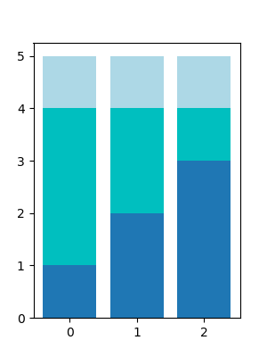
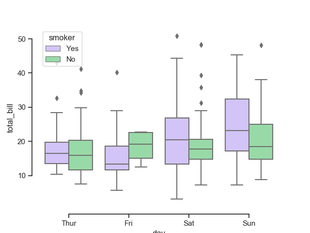
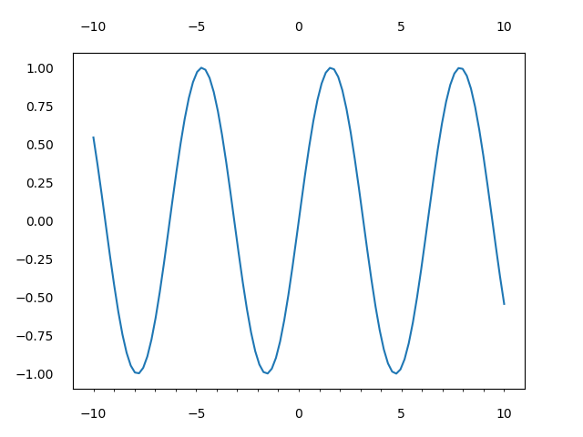
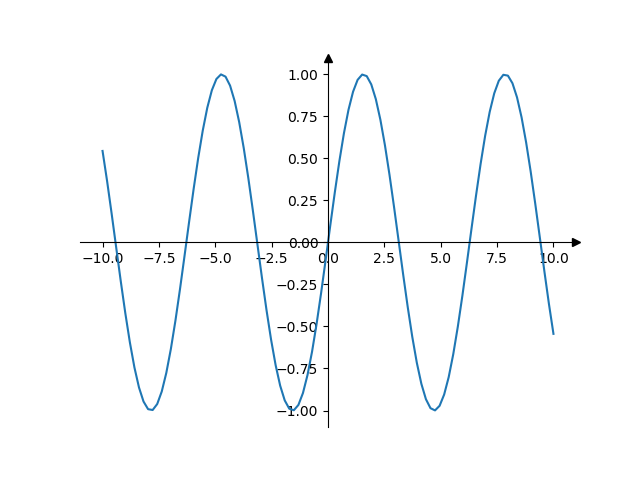

## 柱状图

### 堆积柱状图

```python
import matplotlib.pyplot as plt
import numpy as np

plt.figure(figsize=(3, 4))
x = np.array([0, 1, 2])
y1 = np.array([1, 2, 3])
y2 = np.array([3, 2, 1])
y3 = np.array([1, 1, 1])
plt.bar(x, y1)
plt.bar(x, y2, bottom=y1, color='c')
plt.bar(x, y3, bottom=y1+y2, color='lightblue')
plt.savefig('堆积柱状图.png')
plt.show()
```



## 箱线图

### 最简单箱线图

下四分位：q1

上四分位：q3

四分位距：IQR = q3 - q1

上限 top = q3 + 1.5 × IQR

下限bottom = q1 - 1.5 × IQR

但是上下限不能超过数据本身的维度

`bottom = max(bottom, data.min())`

`top= min(top, data.max())`

```python
import matplotlib.pyplot as plt
import numpy as np

x = np.random.normal(size=100)

plt.boxplot(x)
plt.show()
```


### 同时绘制多个箱线图

具体参考文档

http://seaborn.pydata.org/generated/seaborn.boxplot.html?highlight=boxplot#seaborn.boxplot

```python
import seaborn as sns
sns.set_theme(style="ticks", palette="pastel")
# Load the example tips dataset
tips = sns.load_dataset("tips")

# Draw a nested boxplot to show bills by day and time
sns.boxplot(x="day", y="total_bill", hue="smoker", palette=["m", "g"],
            data=tips)
sns.despine(offset=10, trim=True)
```



## 小技巧速查

### 双y轴

```python
ax2 = ax.twinx()
```

### x轴标签倾斜

```python
labels = ax.get_xticklabels()
plt.setp(labels, rotation=45, horizontalalignment='center')
```

### 文本属性的设置

https://matplotlib.org/api/text_api.html#matplotlib.text.Text

常用：`fontfamliy` / `fontsize` / `fontproperties`

```python
ax.set_xlabels('年份', fontfamily='STSong')
```

对于legend，要使用prop设置字体比如

```python
plt.legend(prop={'family': 'SimHei'})
```


### 使图片显示完整

```python
plt.tight_layout()
```

### 共享y轴

```python
plt.subplots(..., sharey=True)
```


## 主副刻度值的设置

[`ax.tick_params()`](https://matplotlib.org/api/_as_gen/matplotlib.axes.Axes.tick_params.html?highlight=ax%20tick_params#matplotlib.axes.Axes.tick_params)

- **axis**{'x', 'y', 'both'}, default: 'both'

  调整哪个坐标轴

- **which**{'major', 'minor', 'both'}, default: 'major'

  调整主刻度还是副刻度

- **direction**{'in', 'out', 'inout'}

  Puts ticks inside the axes, outside the axes, or both.

- **length**

  Tick length in points.

- **width**

  Tick width in points.
  
- **pad**

  刻度与标签之间的距离

- **top/bottom/left/right**

  是否在上框下框左框右框显示刻度值

- **labeltop/labelbottom/labelleft/labelright**

  是否显示标签

```python
import matplotlib.pyplot as plt
import numpy as np
fig, ax = plt.subplots()

x = np.linspace(-10, 10, 100)
y = np.sin(x)

ax.plot(x, y)

ax.set_xticks(np.arange(-10, 11, 5))
ax.set_xticks(np.arange(-10, 11, 1), minor=True)


ax.tick_params(axis='both', which='major', direction='inout', length=10,
               width=2, pad=10, bottom=False, left=False, labeltop=True)

plt.savefig("../img/主副刻度值的设置.png")
plt.show()
```



### 隐藏刻度线

```python
import matplotlib.pyplot as plt
import numpy as np
fig, ax = plt.subplots()

x = np.linspace(-10, 10, 100)
y = np.sin(x)

ax.plot(x, y)

ax.tick_params(bottom=False, left=False)

plt.show()
```

### 隐藏标签

```python
import matplotlib.pyplot as plt
import numpy as np
fig, ax = plt.subplots()

x = np.linspace(-10, 10, 100)
y = np.sin(x)

ax.plot(x, y)
ax.tick_params(labelbottom=False, labelleft=False)
plt.show()
```

## 坐标轴的设置

### 设置坐标轴不可见

但是还是会显示刻度

```python
ax.spines['top'].set_visible(False)
```

或

```python
plt.axis("off")
```

### 设置坐标轴位置

```python
ax.spines["left"].set_position(("data", 0))
ax.spines["bottom"].set_position(("data", 0))
```

### 设置带箭头的坐标轴

```python
import matplotlib.pyplot as plt
import numpy as np


fig, ax = plt.subplots()
# Move the left and bottom spines to x = 0 and y = 0, respectively.
ax.spines["left"].set_position(("data", 0))
ax.spines["bottom"].set_position(("data", 0))
# Hide the top and right spines.
ax.spines["top"].set_visible(False)
ax.spines["right"].set_visible(False)

# Draw arrows (as black triangles: ">k"/"^k") at the end of the axes.  In each
# case, one of the coordinates (0) is a data coordinate (i.e., y = 0 or x = 0,
# respectively) and the other one (1) is an axes coordinate (i.e., at the very
# right/top of the axes).  Also, disable clipping (clip_on=False) as the marker
# actually spills out of the axes.
ax.plot(1, 0, ">k", transform=ax.get_yaxis_transform(), clip_on=False)
ax.plot(0, 1, "^k", transform=ax.get_xaxis_transform(), clip_on=False)

# Some sample data.
x = np.linspace(-10, 10., 100)
ax.plot(x, np.sin(x))

plt.show()
```



## 文本框

### 设置文本

```python
ax.text(x, y, s, ha='center', va='center')
```

### 文本框对齐举例

```python
import matplotlib.pyplot as plt

fig, axes = plt.subplots(3, 3, figsize=(9, 9))

ha = ['left', 'center', 'right']  # 横向对齐
va = ['top', 'center', 'bottom']  # 纵向对齐

for col in range(3):
    for row in range(3):
        ax = axes[col][row]
        ax.text(0.5,
                0.5,
                va[col] + "+" + ha[row],
                ha=ha[row],
                va=va[col],
                bbox=dict(pad=4, facecolor='none'))
        ax.scatter(0.5, 0.5, c='r', s=5)
        # 隐藏刻度值
        ax.tick_params(labelbottom=False, labelleft=False)
        # 隐藏刻度线
        ax.tick_params(bottom=False, left=False)
        plt.axis("off")
plt.savefig('文本框对齐.png')
plt.show()
```


### 公式字体

中文宋体，英文times new roman的解决方案

核心思想是把英文放到公式里`r'$\mathrm{hello \; good \;}$'`

`\;`表示空格

https://www.mobar.cn/ziliao/a2ac9f2e6e33e4c6bf74dea1.html

```python
import matplotlib.pyplot as plt
from matplotlib import rcParams

config = {
    "font.family": 'serif',
    "font.size": 20,
    "mathtext.fontset": 'stix',
    "font.serif": ['SimSun'],
}

rcParams.update(config)
plt.figure(figsize=(5, 0.5))
plt.text(0, 0, r'宋体 $\mathrm{Times \; New \; Roman}\/\/ \alpha_i > \beta_i$')
plt.axis('off')
plt.savefig('公式字体.png')
plt.show()
```

