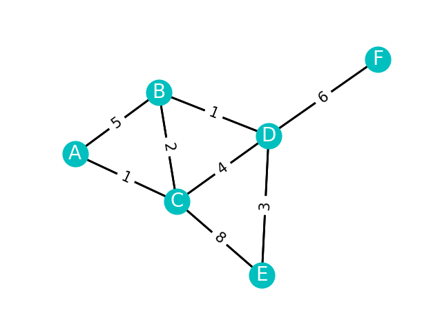

https://networkx.org/documentation/stable/


```python
import matplotlib.pyplot as plt
import networkx as nx

graph = {
    "A": {"B": 5, "C": 1},
    "B": {"A": 5, "C": 2, "D": 1},
    "C": {"A": 1, "B": 2, "D": 4, "E": 8},
    "D": {"B": 1, "C": 4, "E": 3, "F": 6},
    "E": {"C": 8, "D": 3},
    "F": {"D": 6},
}

G = nx.Graph()  # 创建一个无向图对象

edge = []
edge_labels = dict()

# 获得边和边标签
for start in graph:
    for end in graph[start]:
        G.add_edge(start, end)
        
        edge.append((start, end))
        edge_labels[(start, end)] = graph[start][end]

pos = nx.spring_layout(G, seed=1)  # 常用的布局

# 绘制结点
nx.draw_networkx_nodes(G, pos, node_size=700,node_color="c")
# 绘制结点标签
nx.draw_networkx_labels(G, pos, font_size=20, font_color="w")

# 绘制边
nx.draw_networkx_edges(G, pos, edgelist=edge, width=2)

# 绘制边标签
nx.draw_networkx_edge_labels(G, pos, edge_labels=edge_labels,
                             font_size=15, rotate=None)

plt.axis("off")
plt.show()
```



