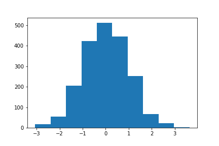
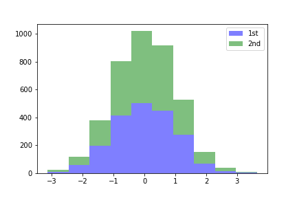

# 直方图

[matplotlib.axes.Axes.hist](https://matplotlib.org/stable/api/_as_gen/matplotlib.axes.Axes.hist.html?highlight=hist#matplotlib.axes.Axes.hist)


## 一维数据绘图

```python
import matplotlib.pyplot as plt
import numpy as np

np.random.seed(2021)
x = np.random.normal(size=(2000))

fig, ax = plt.subplots()

ax.hist(x)  # 绘制直方图

plt.savefig("直方图1.png")
plt.show()
```



## 二维数据绘图

- 1.改成了两列数据
- 2.增加了图例

```python
import matplotlib.pyplot as plt
import numpy as np

np.random.seed(2021)
# 1. 改成两列数据
x = np.random.normal(size=(2000, 2))

fig, ax = plt.subplots()

# 2. 增加图例
ax.hist(x, label=["1st", "2nd"])  # 绘制直方图
ax.legend()

plt.savefig("直方图2.png")
plt.show()
```


## 堆叠的直方图

```python
import matplotlib.pyplot as plt
import numpy as np

np.random.seed(2021)
x = np.random.normal(size=(2000, 2))

fig, ax = plt.subplots()

# 堆叠的直方图
ax.hist(x, label=["1st", "2nd"], 
        stacked=True,  # 堆叠
        color=["b", "g"],  # 设置颜色
        alpha=0.5)  # 设置透明度
ax.legend()

plt.savefig("直方图3.png")
plt.show()
```



## 直方图的参数

| 参数            | 说明                                                         |
| --------------- | ------------------------------------------------------------ |
| x               | 列表对象，ndarray对象，输入数据                              |
| **bins**        | 默认为10，箱子数量，也可以传入列表。                         |
| range           | 数据组的上下界                                               |
| **density**     | 直方图下面积变为1                                            |
| weights         | 与x形状相同的权重数组                                        |
| **cumulative**  | bool 或 -1，默认为False。每个柱子往后累加，会使得直方图的最后一个柱子高度为1。 |
| **bottom**      | array-like，scarlar，None。默认无，可以给每个柱子添加一个偏移量。（堆叠hist可以用） |
| histtype        | 直方图类型，不关键                                           |
| align           | 对齐方式：left mid right。默认为mid                          |
| **orientation** | 直方图的方向：vertical, horizontal，默认为垂直的vertical。   |
| rwidth          | 柱子的相对宽度，会自动计算，不用管                           |
| log             | bool，默认False，如果为True直方图轴将设置为对数刻度。        |
| **label**       | string or list，给数据柱子打上标签                           |
| **color**       | Color or 颜色序列                                            |
| stacked         | bool，默认False。如果为True，则多个数据堆叠在一起。如果为False，则多个数据并排排列（如果histtype为“bar”），如果histtype为“step”，则多个数据堆叠在一起 |

详细解释：

**bins**

如果传入列表，表示人为划分好的箱子，比如`bins=[1, 2, 3, 4]`就把数据划分为[1, 2)、[2, 3)、[3, 4]

**density**

直方图的纵轴变成概率密度分布？将直方图的柱状面积变成1，假设各个箱子中包含的数据由 counts 给出，直方图的范围由bins给出。

假设：

```python
import numpy as np
counts = np.array([20, 15, 30])
bins = np.array([1, 2, 3, 4])
density = counts / (sum(counts) * np.diff(bins))
# array([0.30769231, 0.23076923, 0.46153846])
```

**histype**

要绘制的直方图的类型，一般不用管，默认为bar。随便测试了下，好像就step起作用。

- “bar”是一种传统的条形直方图。如果给出了多个数据，则条并排排列。
- “barstacked”是一种条形直方图，其中多个数据相互叠加。
- “step”生成默认未填充的线形图。
- “stepfilled”生成一个默认填充的线型图。

## 直方图的返回值

- counts：各个箱子的统计值，以array的方式存储
- bins：分出来的箱子的范围，len(bins) = len(counts) + 1
- 直方图对象？`<BarContainer object of 10 artists>`

