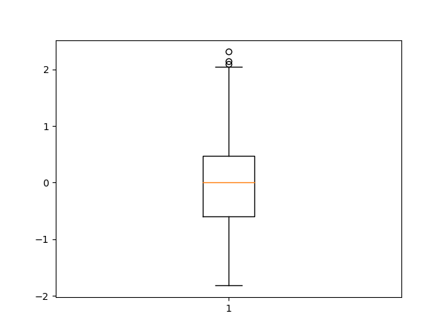

## 箱线图

### 最简单箱线图

下四分位：q1

上四分位：q3

四分位距：IQR = q3 - q1

上限 top = q3 + 1.5 × IQR

下限bottom = q1 - 1.5 × IQR

但是上下限不能超过数据本身的维度

`bottom = max(bottom, data.min())`

`top= min(top, data.max())`

```python
import matplotlib.pyplot as plt
import numpy as np

x = np.random.normal(size=100)

plt.boxplot(x)
plt.show()
```



### 同时绘制多个箱线图

具体参考文档

http://seaborn.pydata.org/generated/seaborn.boxplot.html?highlight=boxplot#seaborn.boxplot

```python
import seaborn as sns
sns.set_theme(style="ticks", palette="pastel")
# Load the example tips dataset
tips = sns.load_dataset("tips")

# Draw a nested boxplot to show bills by day and time
sns.boxplot(x="day", y="total_bill", hue="smoker", palette=["m", "g"],
            data=tips)
sns.despine(offset=10, trim=True)
```

