# Unity初级

Unity官方文档：https://docs.unity.cn

https://learn.u3d.cn/tutorial/MagicCollege

## 命名空间与生命周期

### 命名空间

为什么要用命名空间：词汇是有限的，不同的类、枚举很可能出现重名的现象。

命名空间的好处：通过namespace关键词，将代码进行分区，可以有效避免重名情况，即便跨脚本的代码也可以属于同一个命名空间


当用到同名不同空间的类、枚举等时,可以通过加上命名空间进行区分

例如C#和Unity各自的随机数类Random 

```c#
using System.Random;
using UnityEngine.Random;
```

之前遇到的这些东西也是命名空间

```c#
using System.Collections;
using System.Collections.Generic;
using UnityEngine;
```

泛型List就属于`System.Collections.Generic`

自建namespace

```c#
namespace MySpace
{
    public class MyClass
    {
        ...
    }
}
```

使用自建的namespace

```c#
using MySpace;
```


### 引擎和框架

对开发中的通用功能和结构进行组织、封装,构建起的开发工具

从定义上有微妙差异，但成熟的商业引擎和商业框架比较趋同，两者都是高度抽象汇总后的产物

包含各种模块供开发者快速实现常见功能、也提供了各种接口等规范标准

在游戏引擎的基础上，开发者还可以开发自己的框架进一步提高效率

Unity也兼容了C#的.Net框架，System系列的命名空间即属于.Net类库

### Unity的生命周期

执行顺序

- Awake() 在脚本最开始时执行一次。
- Start() 在Update开始前执行一次。
- Update() 在游戏的每一帧都会执行。
- FixedUpdate() 按固定时间间隔，而非按帧执行。
- LateUpdate() ：在Update之后执行。

Update的间隔取决于设备帧率，FixedUpdate的默认间隔为0.02秒。


### 小任务

1、创建一个脚本,挂载在相机上,其中的脚本放入自定的命名空间下;

2、引用命名空间System，创建`Action<string>`类型变量，该类型是委托，且支持以泛型形式设置参数;

3、在Awake中为委托绑定一个输出字符串的函数，在Start中发布委托，运行查看结果;

4、尝试颠倒顺序，在Awake中发布，在Start中绑定，并进一步尝试其他生命周期;

5、熟悉各生命周期以及Action类型及相应泛型的使用。

## Transform组件


将游戏比作美术馆

场景就是一面面展示墙

游戏对象是墙上的挂钩

组件才是挂钩上的画作


Transform组件用于控制场景中各个对象的姿态，比如位置、旋转角度、缩放。


场景以二进制文件.unity的形式存在于Project中

默认场景SampleScene.unity放置在Assets/Scenes目录下.unity文件中保存着场景中的游戏对象、挂载组件、组件参数等信息

在Project中右键，选择CreatelScene即可创建新场景文件（快捷键CtrllCommand + N)

场景文件只记录信息不保存资源，将场景直接拷贝到别的工程中，其中的美术、代码资产可能会丢失


在unity主界面中

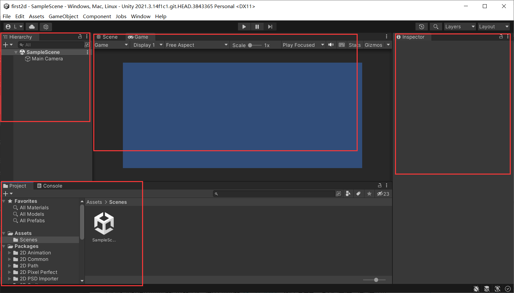

project窗口下的Scenes文件夹，存放的就是游戏默认场景

Hierarchy显示当前打开的场景名

挂载在游戏对象上的组件，是由unity创建的C#脚本。

该脚本只能有1个类，继承自`MonoBehaviour`或其子类。且该类类名要与脚本名称保持一致。

该类的变量可以在Inspector面板中看到。

例如有一个脚本，代码如下：

```c#
public class firstspell : MonoBehaviour
{
    public string playerName;
    // Start is called before the first frame update
    void Start()
    {

    }

    // Update is called once per frame
    void Update()
    {

    }

}
```

在Inspector界面中

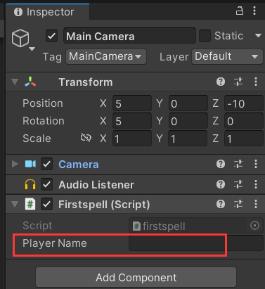

支持在该变量中直接填入参数。

###  Transform组件

每个游戏对象都具备的组件

当存在父子关系时，子对象的实际姿态，是面板数值和父对象面板数值的叠加虽然面板上的旋转值是rotation，但类中对应的变量为(local)EulerAngles，即欧拉角

类中的rotation变量是以四元数描述角度的，并提供了欧拉角的转换方法，可以避免“欧拉死锁”

`lossyScale`不同于其他变量,是只读的

场景中的每个对象都有Transform组件

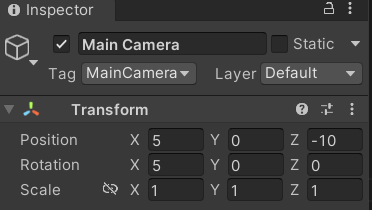

该对象定义了游戏对象的postition位置，rotation旋转和scale缩放信息。是对象存在的基础。

如果一个对象被绑定到另一个对象（鼠标拖拽），那子对象会以父对象作为世界的原点。该对象Transform的旋转为两者面板**数值之和**，缩放为两者面板**数值之积**。

> 可以想想为什么

在Hierachy页面内右键选择3D project，选择cube，就能创建一个3D对象

###  Transform函数使用

首先创建一个方块，并为其添加`CubeController`组件

MonoBehaviour类提供了一个`transform`变量，表示`Transform`类的实例。

```c#
public class CubeController : MonoBehaviour
{
    // Start is called before the first frame update
    void Start()
    {
        print("实际位置")
        print("位置:" + transform.position);
        print("旋转:" + transform.eulerAngles);
        print("缩放:" + transform.lossyScale);

        print("相对父对象姿态")
        print("位置:" + transform.localPosition);
        print("旋转:" + transform.localEulerAngles);
        print("缩放:" + transform.localLossyScale);

        Vector3 v3 = new Vector3(1, 2, 3);
        print(v3.x);
        print(v3.y);
        print(v3.z);
    }

    // Update is called once per frame
    void Update()
    {
        // 实现方块的连续移动
        transform.postion += new Vector3(0.01f, 0, 0);

    }
}
```

```
实际位置
位置:(-2.54, 0.80, 1.40)
旋转:(0.00, 0.00, 0.00)
缩放:(1.00, 1.00, 1.00)
相对父对象姿态
位置:(-2.87, 0.00, 3.23)
旋转:(0.00, 0.00, 0.00)
缩放:(1.00, 1.00, 1.00)
```

RotateAround 定点/轴旋转

### Vector3常用的静态变量和函数

```c#
Vector3 v1 = Vector3.forward;  // 常用的单位方向
Vector3 v2 = Vector3.back;
Vector3 v3 = Vector3.right;
Vector3.Distance(v1, v2); // 计算两点距离

// 旋转和移动代码可以改为
transform.Translate(Vector3.right * 0.01f);
transform.Rotate(Vector3.right);
```

### Scene页面操作技巧

快速定位：双击Hierachy中的对象可以

快捷键QWERTY可以切换选中物体的变换工具（移动、旋转、缩放）

旋转视野：Alt + 鼠标左键

缩放视野：Alt + 鼠标右键

将旋转中心定位到鼠标所指物体：鼠标滚轮键

自由移动：按住鼠标右键，并使用WASDQE。

### 疑问

旋转的单位是什么?

## 渲染与相机

游戏场景中的物体由两个基本元素组成：

- 构成形状的网格线Mesh
- 附着在网格表面的材质Material，材质又包含
  - Texture贴图
  - 告知GPU用何种方式展现材质的Shader脚本

> 对于2维游戏，仅需要材质及其上的贴图和Shader

将这些物体放入Unity内，并拖放到场景时，Unity会自动为它们添加与显形相关的Renderer系列组件。

组件MeshFilter和MeshRenderer就是这样的组件。


对于绑定了骨骼（蒙过皮）的组件。


还会有Skinned Mesh Renderer

二维物体就是 `SpriteRenderer`

### 如何创建材质

在Project Assets界面，右键-Create-Material

把材质拖到物体上，或拖到Renderer 组件的Materials内就可以更改物体的材质

> 如何通过代码更改物体材质？

### Shader

着色器,常用于特殊画面风格及特效制作

是运行在GPU上的一段指令,告知GPU使用何种方式来渲染图像

由于不同平台拥有不同的图像处理API,Shader也有不同种类的语言

Unity中采用CG/HLSL作为Shader开发语言

效果制作往往需要美术功底配合，因此Shader的编写通常由技术美术(TA)这一职位负责

### 相机

选中相机后，可以在Scene中看到相机的视锥

视锥外的物体不会展现。

> 通过鼠标滚轮向下滑动缩小视图，然后用alt+左键调整一下就能看到视图。

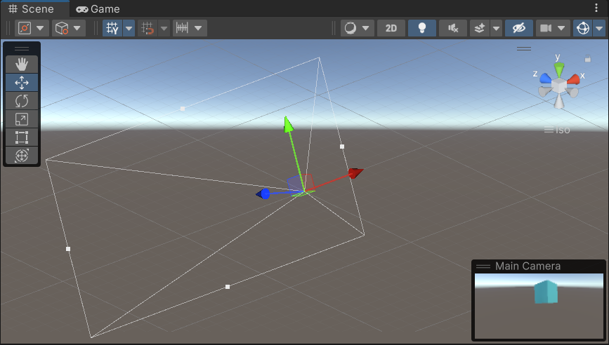

可以在Camera组件的Cliipping Planes区域设置视锥的近面和远面位置。

 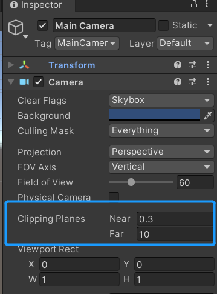

在Projection中，可以将Camera从Perspective三维透视模式，切换为Orthographic正交投影。

Orthographic模式下，视锥变成矩形，视野内的物体不再具备近大远小的透视特性。

配合`SpriteRenderer`，就可以创造二维游戏。

此外，相机还支持分层剔除，将不同层的对象分开渲染。

不在相机视锥内的模型，就不会渲染到屏幕上。

### 游玩者视角

通常情况下，相机会跟随玩家的视角而移动（把相机置为玩家对象的子物体）

通常，携带camera的游戏组件，其运动需要放在`LateUpdate()`函数中处理。

### 键盘检测

Input类

Input类以静态成员的方式，提供了与输入相关的所有功能。

键盘监听的三个常用函数：

- 监听按键按下：`Input.GetKeyDown(KeyCode.W)`
- 监听按键按起：`Input.GetKeyUp(KeyCode.W)`
- 监听按键按住的过程：`Input.GetKey(KeyCode.W)`

参数均为`KeyCode`枚举，该枚举包含了键盘上的所有按键。

返回值为bool类型，表示是否发生了该事件。

写法举例

```c#
void Update()
{
    if(Input.GetKey(KeyCode.W))
    {
        transform.Translate(vector3.forward) * Time.deltaTime;
    }
}
```

由于帧数不固定，需要乘以`Time.deltaTime`即两帧间隔时间，以此保证匀速运动。

### 任务

1、创建一个物体

2、（可选）尝试创建材质，并改变颜色

3、将Main Camera作为角色的子物体，并摆放到合适的位置上，作为跟拍相机；

4、为角色编写移动控制脚本，WASD控制其移动，QE转弯。


> 看不出效果啊，因为相机是跟拍的，就相对静止了。

```c#
using System.Collections;
using System.Collections.Generic;
using UnityEngine;

public class CubeController : MonoBehaviour
{
    // Start is called before the first frame update
    void Start()
    {

    }

    // Update is called once per frame
    void Update()
    {
        // 实现方块的连续移动
        // transform.position += new Vector3(0.01f, 0, 0);
        // 使用Transform类提供的方法，效果同上
        // transform.Translate(0.01f, 0, 0);

        // 旋转
        if(Input.GetKey(KeyCode.W))
        {
            transform.Translate(Vector3.forward * Time.deltaTime);
            // transform.Rotate(Vector3.forward * Time.deltaTime);
        }

        if(Input.GetKey(KeyCode.S))
        {
            transform.Translate(Vector3.back * Time.deltaTime);
        }

        if(Input.GetKey(KeyCode.A))
        {
            transform.Translate(Vector3.left * Time.deltaTime);
        }

        if(Input.GetKey(KeyCode.D))
        {
            transform.Translate(Vector3.right * Time.deltaTime);
        }

        if(Input.GetKey(KeyCode.Q))
        {
            transform.Rotate(Vector3.left * Time.deltaTime);
        }

        if(Input.GetKey(KeyCode.E))
        {
            transform.Rotate(Vector3.right * Time.deltaTime);
        }
    }
}

```

## 光照

默认场景中的另一个物体就是平行光Directional Light

也可以在Hierarchy中右键，选择Light创建不同类型的光纤

光照物体挂载了Light组件

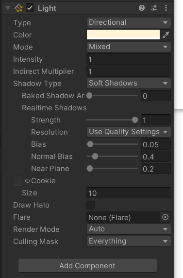


Type可以更改光源类型

- Spot 聚光灯
- Directional平行光
- Point点光
- Area 场光

Intensity 强度

Shadow Type 影子类型

不同类型的光源也有不同的配置项

如聚光灯的 Range范围 和Spot Angle 椎体角度

> 为了提升观感，场景中往往会放置多种光源。
>
> 但光线的计算会给CPU带来巨大的压力
>
> 一种优化的方式就是对于不会移动的物体，直接将光照的效果绘制成图像，贴在物体原本的材质上。
>
> 这种方式就叫做**烘焙**

在Light组件的Mode区域可以选择光源的模式是

- Realtime：实时
- Baked：烘焙
- Mixed：混合

### 测试

在场地中创建一个平面Plane和方块Cube，选中它们并勾选Static（最右上角） 标记为静态物体。

将光源模式设置为Baked。

选择Rendering-Lighting即可打开光照配置相关页面，选择Generate Lighting就会开始烘焙。


如果一个场景存在光源和会动的物体，可以把光源设置为Mixed混合模式。

将静态物体标记为Static

在烘焙窗口点击New Lighting Settings生成光照配置

在Mixed Lighting 的 Lighting Mode中选择Subtractive点击烘焙

动静物体就可以共存。

> Light Mode
>
> - Baked Indirect 只烘焙间接光照
> - Shadow Mask还会烘焙直接光产生的阴影
> - Subtractive会烘焙直接、间接光照和阴影，适合低端设备。
>
> 烘焙会占用一定的内存开销，且复杂环境烘焙用时较长。

### 烘焙反射

在Hierachy 右键Light，还可以创建用于烘焙反射的Reflection Probe反射探针，运动物体光影的Light Probe Group光照探针组。

这些都暂时不用了解

### 任务

使用3D形状搭建一个简单的场地

使用各种灯光进行简单的打光布景

将场地光照烘焙为混合光

将上节课任务中的可操纵角色放入场地,进行自由游览

### 小结

Type可以切换聚光灯、平行光、点光源、场光源(仅烘焙可用)

Mode可以切换实时、烘焙和混合光照模式

Window -> Rendering -> Lighting中进行光照烘焙及混合模式设置

## 碰撞与触发

碰撞主要由Collider组件实现

选中物体后，关闭Mesh Renderer，就能看到碰撞体积

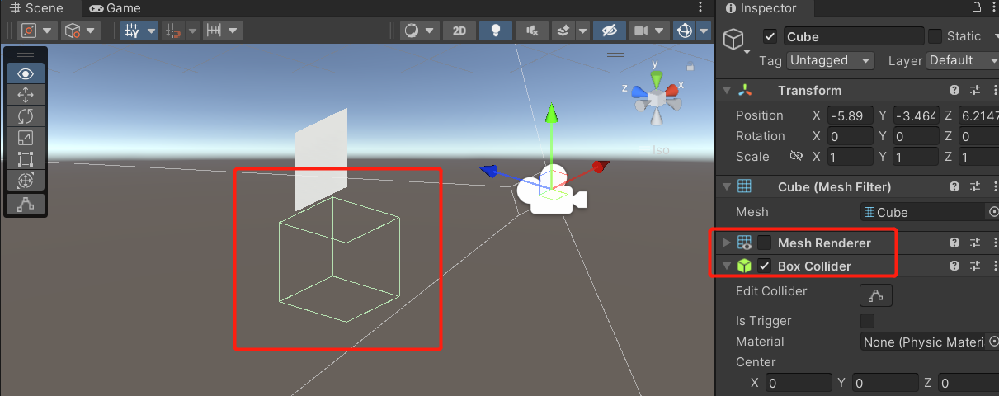

为了让物体有真实的碰撞效果，需要添加Rigidbody 刚体组件

具备刚体的一方会受到碰撞的影响，发生位置和角度的变化。

不具备刚体的一方则只作为可碰撞物体，本身不发生运动

刚体组件还可以设置重力、摩擦力、角阻力等等。

> 不要忘了为地面添加碰撞体

### 碰撞检测函数

```c#
// 碰撞发生瞬间调用一次
private void OnCollisionEnter(Collision other) {
    // other.gameObject - 碰撞到的物体
    // other.rigidbody - 碰到的物体身上挂载的刚体组件（如果有）
    // other.collider - 碰到的物体身上挂载的碰撞体组件
    // other.transform - 碰到的物体身上挂载的Transform组件
    
    // 例
    if (other.gameObject.name == "障碍")
        socre--;
}

// 碰撞结束瞬间调用一次
private void OnCollisionExit(Collision other) {}

// 碰撞接触中持续调用
private void OnCollisionStay(Collision other) {}

// 2D版本
private void OnCollisionEnter2D(Collision2D other) {}
private void OnCollisionExit2D(Collision2D other) {}
private void OnCollisionStay2D(Collision2D other) {}
```


如果勾选Collider中的Is Trigger选框，碰撞体将不再阻碍其他刚体的运动。 而是仅作为碰撞检测器，通过另一组OnTrigger系列的函数，即可监听碰撞体进入、停留和离开。

```c#
// 将上面的代码改成 OnTrigger，例如
private void OnTriggerStay(Collision other) {}
```


OnTrigger会提供发生接触的碰撞体组件，将这样的碰撞器放在传送阵、城镇门口、或是恶龙喷出的火焰中，可以用于各种各样的触发任务。（持续掉血）

此外还可以使用`Physics.Raycast`方法，以射线检测碰撞体。

### 鼠标监测

```c#
// 鼠标指针移到碰撞体瞬间调用
private void OnMouseEnter() {}
// 鼠标指针离开碰撞体瞬间调用
private void OnMouseExist() {}
// 鼠标指针停留在碰撞体上时调用
private void OnMouseOver() {}
// 鼠标指针在碰撞体上时，按下鼠标调用一次
private void OnMouseDown() {}
// 鼠标指针在碰撞体上时，抬起鼠标调用一次
private void OnMouseUp() {}
// 鼠标指针在碰撞体按下时，抬起鼠标调用一次
private void OnMouseUpAsButton() {}
// 鼠标在碰撞体上拖拽时持续调用
private void OnMouseDrag() {}
```


### 任务

在之前的场景中放置一个略高于地面的方块,并将碰撞体设置为触发器;

为你的角色和场景配置碰撞体和刚体;

当角色触碰方块,让方块下移一点(模拟角色踩下方块的效果);

当角色离开方块,恢复方块位置。

### 小结

碰撞/触发条件:双方都具备Collider(2D)碰撞体组件且至少一方具备Rigidbody(2D)刚体组件,碰撞体勾选lsTrigger即作为触发器

碰撞监测方法:OnCollisionXX(2D)系列,Enter进入、Exit离开、Stay停留

触发监测方法:OnTriggerXX(2D)系列,Enter进入、Exit离开、Stay停留

鼠标监测方法:OnMouseXX系列

## 刚体与关节

刚体Rigidbody的属性：

- `Mass`：物体的质量
- `Drag`：运动时受到的阻力
- `Angular Drag`：角阻力
- `UseGravity`：是否使用重力
- `IsKinematic`：是否免疫一切物理法则
- `Interpolate`：插帧平滑。
  - 为什么要用插帧平滑？答：通常，GPU的频率与CPU的频率是不一致的，这就会导致刚体发生颤动
  - 模式：Interpolate根据上一帧插帧，Extrapolate根据下一帧插帧,可分别尝试
- `Collision Detection`：碰撞检测（避免物体高速运动时出现的穿墙现象）
  - Discrete：离散（默认）
  - Continuous：连续
  - Continuous Dynamic：动态连续
  - Continuous Speculative：推测连续
- `Constraints`：限制位移和转向。
- `Info`：不可编辑，实时显示速度、重心等信息

> 碰撞监测模式通常设置为Discrete离散即可，高速运动时可使用连续监测，但性能消耗较大
>
> Continuous用于会撞上纯碰撞体的高速刚体
>
> Continuous Dynamic用于会撞上其他刚体的高速刚体
>
> Continuous Speculativet比Dynamic节约性能，对高速旋转扫掠的监测效果更好，但移动类监测更差


刚体对象也有很多实用的属性和函数

```c#
public Rigidbody body;

body.velocity; // 速度
body.centerOfMass; // 重心
body.AddForce(Vector3.forward); // 增加力 
```

修改重心，制作不倒翁

```c#
public class Test : MonoBehaviour
{
    public Rigidbody body;
    public Transform centerOfMass;
    private void Update()
    {
        body.centerOfMass = centerOfMass.localPosition;
    }
```

锐角拐弯

```c#
public class Test : MonoBehaviour
{
    public Rigidbody body;
    private void Update()
    {
        if (Input.GetKeyDown(KeyCode.A))
            body.AddForce(Vector3.forward * 70, ForceMode.VelocityChange);
        if (Input.GetKeyDown(KeyCode.B))
        {
            body.AddForce(Vector3.back * 70, ForceMode.VelocityChange);
            body.AddForce((Vector3.back + Vector3.up)*50, ForceMode.VelocityChange);
        }
    }
```

### 关节

刚体还可以组成关节结构，用于模拟更加复杂的物理效果

关节是以刚体链接而成的物理结构模拟

关节所在物体必须挂载刚体，关节连接的刚体仍可以是关节，因此可以模拟一些复杂机械结构

通过调节参数，可以实现很多常见的物理效果，比如降低弹簧关节的弹性即可模拟吊灯

除了常规关节，ConfigurableJoint可配置关节，可以进行非常详细的定制
CharacterJoint角色关节可用来制作“布娃娃"系统，在很多游戏中用来模拟死亡的角色身体


方式：

使用**Joint**关节组件来组合刚体。

以三维弹簧为例，在Cube上添加刚体并设置为IsKinematic不受外力

然后添加Spring Joint 弹簧关节组件作为弹簧的顶端牵引点

再创建一个方块放在旁边，添加刚体并保持默认设置。

将第二个方块拖拽到关节的Conected Body连接点处

### 任务

1、在场地中放置一个长条形滑轨,并在滑轨上放置一个方块;

2、方块仅可在滑轨方向上被角色推动;

3、分别使用饺链关节和弹簧关节，制作一道门和一盏吊灯。【关于锐角转弯演示中的尾迹】

使用TrailRenderer拖尾渲染器组件并添加材质，此外还有LineRenderer线渲染器组件，可用于绘制各种自定义线条

### 小结

   【刚体】
UseGravity可选择是否接受重力;

lsKinematic可选择是否接受物理模拟;


AddForce方法是Translate之外的另一种移动方式,根据需要使用吧

【关节】
关节所在物体需为刚体,关节连接的其他刚体也可以是关节

## 射线、标签与层

有时候需要检测特定方向上的碰撞体

比如从枪管延伸出的弹道是否瞄准敌人

比如怪物正面的视野是否发现目标。

这时候就可以使用**Physics**

```c#
//
bool Physics.Raycast();
RaycastHit[] Physics.RaycastAll();
```

这两个函数都会发射一条看不见的探测射线，并返回探测结果

`Raycast()`会返回碰到的第一个目标

`RaycastAll()`返回沿线上的所有目标

这两个函数重载很多，核心参数如下

- `Vector3 origin`：射线原点
- `Vector3 direction`：射线方向
- `out RaycastHit hitInfo`：检测结果

`Raycast()`的返回值为bool类型

`RaycastAll()`直接返回`RaycastHit`数组


> 射线是Unity物理系统提供的一种检测方式
>
> 规定射线的原点、方向、距离等，即可沿线检测是否有碰撞体存在，检测信息hitlnfo以out参数形式带出
>
> 一些不追求真实弹道模拟的射击游戏，经常使用射线检测来代替高速子弹判定，以节省性能开销
>
> 将鼠标的屏幕位置换算成摄像机视口位置，就可以利用射线制作MOBA游戏的点击移动效果
>
> —些角色脚部贴合地面的的功能,也用到了射线检测（测量脚下地面法线)

### 小测试

创建一个方块放在`(0, 0, 1)`处，挂载测试脚本

```c#
public class Test : MonoBehaviour
{
    private void Start()
    {
        if (Physics.Raycast(Vector3.zero, Vector3.forward, out hitInfo))
        {
            hitInfo.collider; // 击中的碰撞体
            hitInfo.collider.name; // 游戏对象名字
            hitInfo.collider.gameObject; // 游戏对象
            
            hitInfo.point; // 击中点位置
            hitInfo.normal; // 击中面法线
                
            // 让方块旋转
            if (hitInfo.collider.name == "cube")
                hitInfo.collider.transform.Rotate(Vector3.up * 45, Space.Self);
        }
    }
}
```

通常不用游戏对象的名字来区分

可以为游戏对象设置tag标签（在Inspector页面的上方）

```c#
if (hitInfo.collider.tag == "Player")
{
    // ...
}
```

### 游戏对象的层

与Tag标签类似,Layer层也是一种为游戏对象归类的方式

和标签一样，除了预制的可选项，还可以点击底部的Add进入配置页面，自定义更多层

除了射线检测的层遮罩LayerMask外，还可以用在相机渲染的CullingMask剔除遮罩中通过多个相机分别渲染不同层的物体，并设置相机深度Depth，可以实现各种自定义渲染顺序

如将模型渲染到UI层之上实现角色信息栏，或将敌人轮廓渲染到建筑之上实现红外透视效果


也可以为游戏对象设置Layer(层)，然后利用Raycast的重载，分别设置maxDistance(最大射线距离)和layerMask(层遮罩)来仅对出于某些层的物体进行检测。

```c#
if (Physics.Raycat(Vector3.zero, Vector3.forward, out hitInfo, 100, 1))
{
    print("检测到目标层对象");
}
```

层遮罩是一个整数变量

```c#
int layerMask
```

但并不意味着写上几，就检测或剔除第几层。

写在这里会按照它的二进制形式使用

```
层数: 7654 3210
数字: 0000 0000

layerMask = 11
二进制就为
0000 1011

表示检测或剔除第 3、2、0层
```

> 数字前加个0就表示是二进制数字。

可以以下面这种更直观的形式来填写layerMask

```c#
Physics.Raycast(Vector3.zero, Vector3.forward, out hitInfo, 100, 011)
```

### 任务

1、放置敌人,并设置为自定义层Enemy;

2、按下J键,从主角位置向主角前方发射一条射线;

3、检测前方所有Eney层的目标,检测到则销毁目标;

【获得某游戏对象的前方】该对象transform.forward

【销毁游戏对象】Destroy(要销毁的gameObject)

【利用辅助线查看射线姿态】在生命周期OnDrawGizmos中，使用Debug.DrawRay，填入与射线相同的原点和方向，其中方向为矢量,矢量长度即为辅助线长度，点击Game页右上角的Gizmos，即可在Game中看到辅助线

### 小结

【射线检测】
Physics.Raycast、Physics.RaycastAll,核心参数origin原点,direction方向,hitlnfo击中点信息

可以通过Tag标签或Layer层对游戏对象分类,以实现按类别统一处理

Raycast的layerMask层遮罩以二进制位形式对不同Layer进行遮蔽

## 综合练习

在project的Assets下创建文件夹Scripts

并在其中创建4个脚本

```
|- Scripts
  |- TempleEvents.cs
  |- TempleStates.cs
  |- GameManager.cs
  |- Player.cs
  |- Triggers
    |- GroundTrigger.cs 传送点触发器
    |- MachineTrigger.cs 机关触发器
    |- OperationTrigger.cs 操作台触发器
```

### Player.cs

为什么要用`FixedUpdate()`？

将移动功能写在`FixedUpdate()`中可以有效避免刚体持续碰撞时的颤动

```csharp
public class Player : MonoBehaviour
{
    // Start is called before the first frame update
    public float speed = 10;
    private void FixedUpdate()
    {
        if (Input.GetKey(KeyCode.W)) transform.Translate(Vector3.forward * Time.fixedDeltaTime * speed);
        if (Input.GetKey(KeyCode.S)) transform.Translate(Vector3.back * Time.fixedDeltaTime * speed);
        if (Input.GetKey(KeyCode.A)) transform.Translate(Vector3.left * Time.fixedDeltaTime * speed);
        if (Input.GetKey(KeyCode.D)) transform.Translate(Vector3.right * Time.fixedDeltaTime * speed);
        if (Input.GetKey(KeyCode.Q)) transform.Rotate(Vector3.down);
        if (Input.GetKey(KeyCode.E)) transform.Rotate(Vector3.up);
    }

}
```

### TempleEvents.cs

引入system可以使用Action以简化委托编写

位移委托携带一个transform位置

```csharp
```


模板

```c#
public class Test : MonoBehaviour
{
    private void Start()
    {

    }
}
```

## 游戏界面搭建

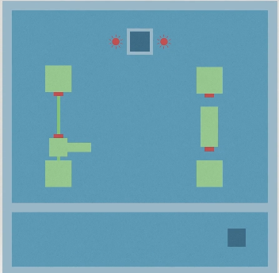

搭建步骤如下

### 创建红绿蓝三色材质球

在Assets界面右键Create->Material

### 创建角色物体

在Hierachy界面右键Create Empty，并将该物体名字修改为Player

在其右侧的Inspector界面增加Player脚本组件。

添加刚体组件Rigidbody

添加胶囊碰撞体组件 Capsule Collider

将角色的tag设置为Player

### 创建角色形状

右键Hierachy创建三个物体

```
Player
Cube
Capsule
Cube (1)
```

注意此时这三个物体和Player同级

然后把形状编辑成这样

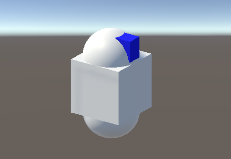

需要移除子物体Capsule的碰撞体组件（在Inspector界面右键移除）

调整父物体的碰撞体形状，在**Capsule Collider**中点击**Edit Collider**

锁定刚体的旋转和y轴竖直位移

```
Rigidbody
Freeze Position □ x √ y □ z 
Freeze Rotation √ x √ y √ z
```

然后把三个物体放到Player下，作为Player的子物体

```
▽Player
  Cube
  Capsule
  Cube (1)
```


完成后可以暂时关闭Player对象：在Tag上方可以切换是否关闭该对象

### 搭建地面和围墙

新建物体Plane，Scale全部设置为5

新建一个物体Cube

设置如下

```
Position x 0  y 1.5 z -25
Rotation x 0  y 0   z 0
Scale    x 50 y 3   z 1
```

这个就是围栏的其中一条边。按照类似的方式再设置其他3个围栏

其中一个围栏是在方块内部的

```
Position x 0  y 1.5 z -15
Rotation x 0  y 0   z 0
Scale    x 50 y 3   z 1
```

搭建好的围栏如下图

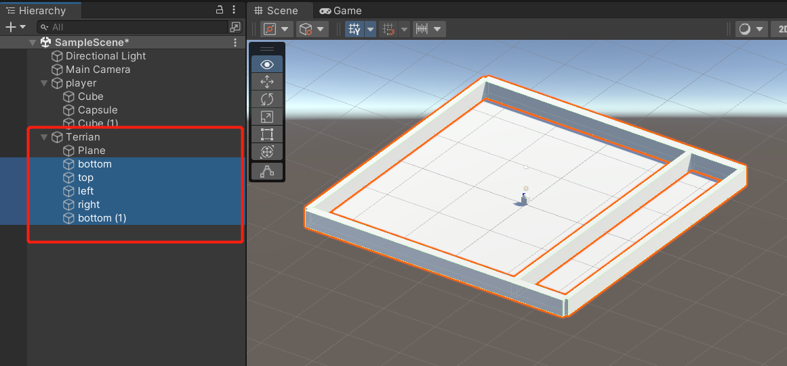

### 搭建传送点

创建一个cube

transform配置如下

```
Position x 20 y 0   z -20
Rotation x 0  y 0   z 0
Scale    x 1  y 1   z 1
```

使用蓝色材质

添加GroundTrigger脚本组件

碰撞体设置为触发器：勾选 Is Trigger选项 

创建第二个传送点

位置改为

```
Position x 0 y 0   z 20
```

再创建2个传送目标点

位置分别为

```
Position x -20 y 0   z -20
Position x 0   y 0   z -10
```

2个传送门和2个传送点命名为

```
t1
t2
p1
p2
```

创建统一的父物体Transmitters：把传送门和传送点都放到它下面


### 创建传送点围栏

创建8个柱子和1个盖板

其中一个柱子的Transform为

```
Position x 0   y 1   z 19
Rotation x 0   y 0   z 0
Scale    x 0.2 y 2   z 0.2
```

移除8个柱子的Collider组件

以盖板为父物体，调整它的碰撞体

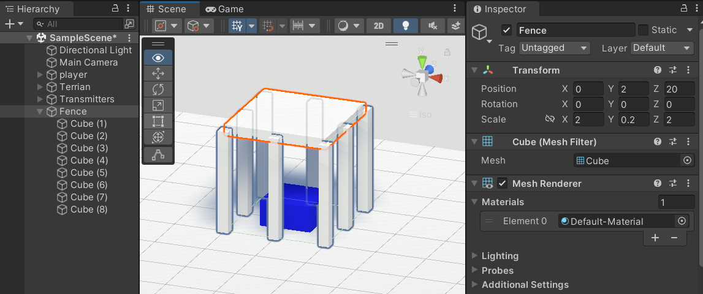

### 创建红灯

先创建一个红色方块，名为Light1，在Light1上右键Light->Point Light创建一个点光源子物体

先暂时关闭平行光 Directional Light

将该点光源的范围设置为3，勾选DrawHalo绘制光晕，颜色绘制为红色

复制出第二个红灯

位置为

```
Position -5 0 20
```

打开平行光，并将intensity 设置为0.5以方便观看

### 搭建机关触发器

创建一个Cube，命名为MachineTrigger0，Transform为

```
-15 1.5 15
0 0 0 
3 3 3
```

创建一个Cube，命名为Trigger，并将该物体添加为MachineTrigger0的子物体。Transform为

```
0 0 -0.5
0 0 0
0.3333 0.3333 0.3333
```

为这个物体添加Machine Trigger脚本组件

并勾选Is Trigger

复制MachineTrigger0，重命名为RailCube，修改Transform

```
Position -15 1.5 0
```

将RailCube的子物体Trigger移到外层

### 创建滑轨

再复制一下RailCube，重命名为Rail，修改其transform

```
-15 1.5 7.5
0 0 0
0.2 0.2 15
```

将Rail 添加为RailCube的子组件

### 创建滑动部分

再创建一个Cube，命名为HandleCube，先调整其Transform

```
Scale 2 2 2
```

然后将其添加为RailCube的子组件

再调整一次Transform

```
Position 0 0 1
Rotation 0 0 0 
```

再把HandleCube移动出来

> 这一系列的移进移出目的应该是为了定位

### 调整刚刚移动到的外层Trigger

标记点Trigger移除MachineTrigger组件

新增一个machineTrigger标签

为这个标记点添加machineTrigger标签

将该标记点添加为HandleCube的子组件

调整transform

```
0 0 0.5
0 0 0
0.5 0.5 0.5
```

### 调整HandleCube

在HandleCube内创建一个子组件Cube，命名为Handle，调整其Transform

```
1 0 0.35
0 0 0
3 0.3 0.3
```

为HandleCube增加Rigidbody组件

取消 Use Gravity

调整Constraints

```
√ √ □
√ √ √
```

### 创建RailMachine

调整为

```
▽RailMachine
  MachineTrigger0
  HandleCube
  RailCube
```

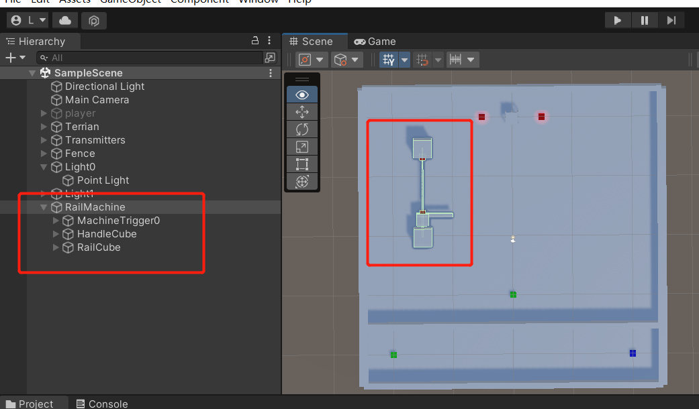

### 创建新的机关触发器

复制MachineTrigger0重命名为MachineTrigger1

调整Transform

```
Position 15 1.5 15
```

### 搭建转轴机关操作区

新建一个Cube，调整Transform

```
15 0 0
0 0 0
3 1 3
```

添加OperationTrigger脚本

Box Collider中，勾选Is Trigger

### 创建转轴父物体

Create Empty，命名为RotatCube

添加Rigidbody刚体，不要重力，勾选IsKinematic

复制MachineTrigger1，重命名为RotateSubCube

把RotateCube加为RotateSubCube的子物体

调整RotateCube的Transform

```
Poistion 0 0 0
```

将RotateCube移出RotateSubCube的子物体

将RotateSubCube移为RotateCube的子物体

将RotateSubCube的子物体Trigger移为RotateCube的子物体

RotateCube.Trigger移出MachineTrigger脚本

RotateCube.Trigger标签设置为machineTag

调整RotateSubCube的形状，确保旋转时能接触到机关触发器

其中RotateCube为

```
15 1.5 8
0 0 0
1 1 1
```

RotateSubCube

```
0 0 2.5
0 0 0
3 3 5
```

调整机关触发器编号

将MachineTrigger1.Trigger的编号index设置为1(在挂载的MachineTrigger组件中设置)

### 整理转轴机关

创建空物体，命名为RotateMachine，调整为

```
▽RotateMachine
  MachineTrigger1
  RotateCube
  OperationTrigger
```

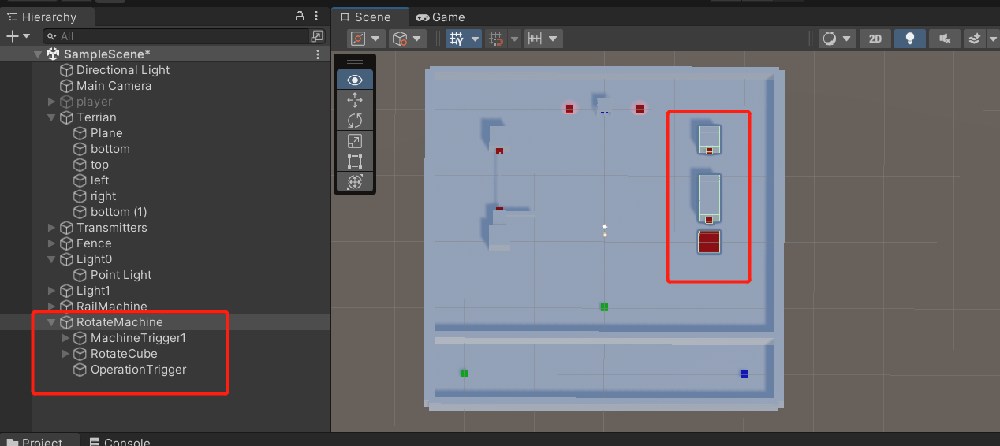

### 挂载GameManager

创建一个空物体命名为GameManager，添加GameManager脚本

配置其变量

将Player物体拖拽到GameManager组件的Player

将RotateMachine.RotateCube拖拽到GameManager组件的RotateCube

Lights设置为2，展开Lights，分别吧Light0，Light1拖到Element0、Element1

Fence拖到Fence

### 调整相机

将相机作为Player的子物体

Transform为

```
0 2.5 -3
15 0 0
1 1 1
```

将Player放到初始位置

```
-20 0 -20
0 90 0
1 1 1
```

## Bug修复

### 移动到传送点不传送

第一个Bug，移动到传送点不动了

脚本GroundTrigger.cs中

```c#
if (other.tag == "player")
```

这里的player应该首字母大写

### 推滑轨推不动

需要锁定刚体旋转轴，以及移动的X Y轴

此外，需要把滑轨设置为无碰撞体积：删除RailCube.Rail的Collider组件

### 按J转轴不会旋转

OperationTrigger.cs脚本中

```c#
if (other.tag == "player") inArea = true;
```

player首字母应该是大写
