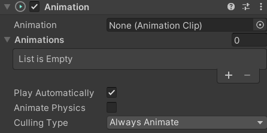
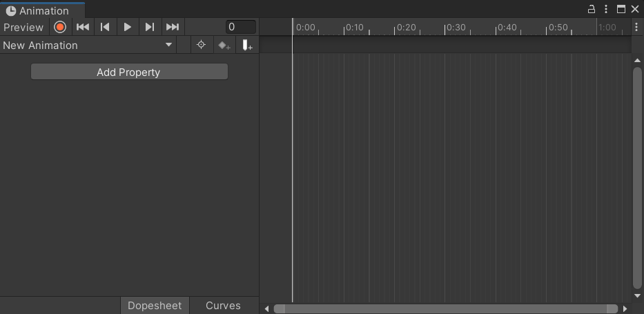
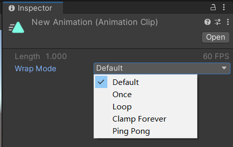
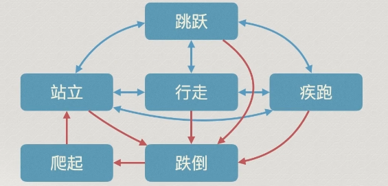
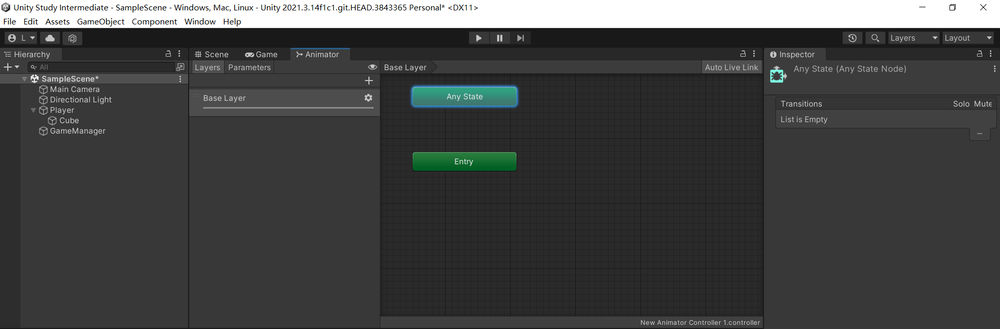

# Unity中级

Unity官方文档：https://docs.unity.cn

https://learn.u3d.cn/tutorial/MagicCollege

## Action与Unity Event

```c#
// 声明委托
public delegate void Action();

// 创建委托变量
public Action action;

// 发布委托
action?.Invoke();

// 绑定委托
action += DoSomething;
```

之前使用的Action()类型，就是预定义好的委托

```c#
namespace System
{
    public delegate void Aciton();
}
```

使用Action，无需声明，直接创建委托变量即可使用

可以通过泛型来规定委托的参数

```c#
public Action<stirng> action;
```

当在一个复杂的函数中，中间某个地方插入一段能由调用者自定义的操作时。可以像这样定义函数。

```c#
void DoSomething(Action action)
{
    // ...
    
    // 自定义操作
    action?.Invoke();
    
    // ...
}
```

在调用函数时传入自定义函数即可。

```c#
DoSomething(() => print("do something!"))
```


还可以随时知晓一个函数的运行情况

```c#
void DoSomething(Action action)
{
    // ...
    
    // 自定义操作
    int i = 1;
    i++;
    action?.Invoke(i);
    
    // ...
}

DoSomething(() => print("i:" + i))
```

比如倒计时10秒后执行某个操作

```c#
StartCoroutine(DoSomething(() => print("10s")));

IEnumerator DoSomething(Action callback)
{
    yield return new WaitForSeconds(10);
    callback?.Invoke();
}
```

每秒结束时执行固定操作

```c#
StartCoroutine(DoSomething(() => print("1s")));

IEnumerator DoSomething(Action callback)
{
    for(int i=0; i<10; i++)
    {
        yield return new WaitForSeconds(1);
        callback?.Invoke();
    }
    
}
```

### 回调Callback

用于独立于当前流程执行的异步(即不同步)流程中，如加载场景资源、请求网络数据等

这些需要时间的操作若与主流程同步处理，则程序在获得结果前会处于卡死状态

异步流程执行过程中或完毕后，需要通过委托绑定的方法通知主流程，这种方法就叫回调方法

回调在前端编程中很常见，Unity异步代码中也会频繁使用

### UnityEvent

Unity也定义了自己的委托

```c#
using UnityEngine.Events;

// 直接定义UnityEvent变量即可
public UnityEvent action;

// 绑定操作
action.AddListener(DoSth);
action.RemoveListener(DoSth);
action.RemoveAllListener(DoSth);

// 发布委托
action?.Invoke();
```

其特殊之处在于

如果将UnityEvent变量定义为公开，则在Inspector界面中可以看到绑定了哪些操作，可以加减操作。

UnityEvent也可以通过泛型来规定参数类型

```c#
public UnityEvent<int> action;
```

动态，接收脚本中传入的参数

静态，直接接收填写在Inspector面板中的参数。静态区只会显示0个或1个参数的函数，如果有多个参数，只能以动态的方式绑定。

### 任务

1、制作一个遍历1~10的函数，并利用`Acion<int>`，在每次遍历中执行一个自定义操作，在Start中调用时分别绑定输出数字、输出数字加一、输出"Hello”的操作;

2、将之前课外实战中的Action换成UnityEvent，并分别尝试在符咒中使用AddListener绑定、以及在Unity中点选拖拽绑定。

### 小结

|          | Action             | UnityEvent                                        |
| -------- | ------------------ | ------------------------------------------------- |
| 定义变量 | `Action action`    | `UnityEvent action;`                              |
| 发布     | `action?.Invoke()` | 同左                                              |
| 绑定     | `action += DoSth;` | `action.AddListener(DoSth);`<br>或在Unity面板绑定 |
| 解绑     | `action -= DoSth;` | `action.RemoveListener(DoSth);`                   |
| 清空     | `action = null;`   | `action.RemoveAllListeners();`                    |

## UI系统

User Interface

右键Hierachy面板，选择UI，就可以创建不同类型的UI。

创建一个text UI，第一次创建时，还会额外创建两个对象Canvas画布和EventSystem事件系统。


```
Canvas
 text
EventSystem
```

UI对象只有作为画布的子物体时才能被玩家看到。

EventSystem则让UI对象可以被触发，比如按钮点击、进度条拖动等。

Canvas可以有多个，EventSystem一般只有1个

Canvas可以设置UI的渲染模式Render Mode

- Screen Space - Overlay 渲染到屏幕上
- Screen Space - Camera 渲染到相机前
- World Space 渲染到世界（比如角色姓名和头上的血条）

UI Scale Mode可以修改缩放尺寸，分为像素、屏幕尺寸、物理尺寸。

可以在Game页面上修改不同的屏幕尺寸以测试画布的适配效果


对于Canvas下的UI，姿态使用RectTransform组件描述，是Transform的子类，使用另一套坐标系。

### uGUI

uGUI
Unity支持三种UI系统:UI Toolkit、Unity UI (uGUI)、IMGUI

目前应用最广泛的是基于游戏对象和组件的uGUI，但仅能用于游戏内UI

UI Toolkit未来将作为主流UI系统，以类似前端代码的方式构建Ul，可同时用于游戏和引擎扩展

IMGUI(有时也简称为GUI)通过C#在脚本中快速构建,因此常用于开发者调试

同一个Canvas下的UI,Hierarchy中越靠下，则Game中显示在越上层

### 常用的UI组件

**视觉类View Components**

- Text
- Image
- Rawlmage
- Mask
- Effects

**交互类Interaction Components**

- Button
- Toggle：单选框
- ToggleGroup：多选框
- Slider
- Scrollbar
- Dropdown
- InputField
- ScrollView


交互类组件可以为其事件绑定操作。

> 用于二维游戏的SpriteRenderer组件，或Image组件的图片
>
> 要在Project中选中后，将Texture Type纹理类型设置为Sprite

后缀为TextMeshPro的UI针对文本进行了扩展，拥有更完善的文本编辑能力，但需要额外导入安装脚本包

### lEventSystemHandler

lPointer系列与IDrag系列接口均实现自该接口

需要引入命名空间UnityEngine.EventSystemslPointer包括光标进入、移出、按下、抬起、点击

lIDrag系列包括潜在拖动行为(鼠标按下)、开始拖动、拖动中、拖动结束

结合UnityEvent，将上述所有接口实现，即可制作全行为检测的UI交互组件


```c#
public void OnPointerClick();
public void OnPointerDown();
public void OnPointerUp();

public void OnPointerEnter();
public void OnPointerExit();
public void OnInitializePotentialDrag(); // 光标有拖拽UI的趋势时(按下)
public void OnBeginDrag(); // 光标开始拖拽UI
public void OnDrag();  // 拖拽UI中（持续调用）
public void OnEndDrag();
```

## Input系统

### Axis

Unity为常用方向封装了一些虚拟轴，供开发者直接取用。


用于适配各种各样的设备，比如角色移动，可以用WASD也可以用手柄。

移动可以分为Horizontal水平轴和Vertical垂直轴

无论是WASD、上下左右还是手柄摇杆

都会改变对应轴的数值（-1~1）

前是垂直轴的正方向，右是水平轴的正方向

使用`Input.GetAxis("")`就能获得对应轴的数值

因此可以用这两个轴替代之前的逻辑 

两个轴数值变化是连续的

输入方向后逐渐归一（或负一）

停止输入后又逐渐归零

> 不需要绑定WASD或者上下左右了，Unity帮你弄好了。 

```c#
using System.Collections;
using System.Collections.Generic;
using UnityEngine;

public class Player : MonoBehaviour
{
    // Start is called before the first frame update
    public float speed = 1 0;
    private void FixedUpdate()
    {
        float horizontal = Input.GetAxis("Horizontal");
        float vertical = Input.GetAxis("Vertical");
        transform.Translate(new Vector3(horizontal * Time.deltaTime * speed, 0, vertical * Time.deltaTime * speed));

        if (Input.GetKey(KeyCode.Q)) transform.Rotate(Vector3.down);
        if (Input.GetKey(KeyCode.E)) transform.Rotate(Vector3.up);
        
        // 利用轴值实现20度平滑倾斜（倾斜空父物体下的子物体，即模型）
        transform.GetChild(0).localEulerAngles = new Vector3(vertical * 20, 0, -horizontal * 20);

    }
}
```

除了描述移动的水平和垂直轴，鼠标在屏幕上的运动也可以用两个轴来描述

横向的Mouse X和纵向的Mouse Y

与移动轴的数值变化稍有不同

鼠标的轴值运动时是逐渐累加的（可超过1或-1）

下面是一个用鼠标取代QE旋转效果的例子

还需要更改Cursor光标类的lockState锁定状态，将光标锁定在屏幕中央并隐藏

监听鼠标的点击行为

```c#
using System.Collections;
using System.Collections.Generic;
using UnityEngine;

public class Player : MonoBehaviour
{
    // 另一种实现方式
    public float speed = 10;
    private void Start()
    {
        Cursor.lockState = CursorLockMode.Locked; // 将光标锁定在Game中央
        Cursor.visible = false; // 隐藏光标
    }
    void Update()
    {
        float horizontal = Input.GetAxis("Horizontal");
        float vertical = Input.GetAxis("Vertical");
        transform.Translate(new Vector3(horizontal * Time.deltaTime * speed, 0, vertical * Time.deltaTime * speed));

        transform.Rotate(Vector3.up * Input.GetAxis("Mouse X")); // 使用Mouse X驱动旋转

        // 利用轴值实现20度平滑倾斜（倾斜空父物体下的子物体，即模型）
        // 注意，只会倾斜父物体下的第一个子物体
        transform.GetChild(0).localEulerAngles = new Vector3(vertical * 20, 0, -horizontal * 20);

        // 按下退格键时显示光标并解除锁定
        if (Input.GetKeyDown(KeyCode.Escape))
        {
            Cursor.lockState = CursorLockMode.None;
            Cursor.visible = true;
        }

        // 按下鼠标左键
        if (Input.GetMouseButtonDown(0))
        {
            Cursor.lockState = CursorLockMode.Locked;
            Cursor.visible = false;
        }
    }
}

```


停止后也逐渐归零

> Edit->Project Settings->lnput Manager->Axes中可以查看所有轴

可以自定义各个轴的触发按钮、衰变速度等等

还可以自定义新的轴

除了移动与鼠标的纵横轴,鼠标滚轮也以Mouse ScrollWheel轴描述

### mousePosition

获取鼠标位置

点击地面让角色移动到点击处  

使用`Input.mouserPosition`获得光标在屏幕上的坐标

之后通过相机提供的ScreenPointToRay获得一条光标对应相机位置、射向前方的射线

可以直接放入Physics.Raycast中，进行射线碰撞点检测

获得鼠标点击的世界中的位置

> 不知道为什么不起作用啊
>
> 知道了，因为这个脚本我绑定到Player对象了
>
> 需要绑定到相机对象
>
> 错！并不是上面的原因
>
> 看了下，函数名称是 `OnDrawGizoms`
>
> 正确的函数名是：`OnDrawGizmos`
>
> 后来了解了一下，OnDrawGizmos是不停在绘制的。

```c#
using System.Collections;
using System.Collections.Generic;
using UnityEngine;

//public class Player : MonoBehaviour
public class CameraRayTest : MonoBehaviour
{
    // 鼠标点击，角色移动到鼠标点击的位置
    void Start()
    {

    }
    RaycastHit hitInfo;

    void Update()
    {
        if (Input.GetMouseButtonDown(0))
        {
            print("asdf");
            mouseRay = Camera.main.ScreenPointToRay(Input.mousePosition);
            if (Physics.Raycast(mouseRay, out hitInfo))
                print("鼠标点击了" + hitInfo.point);
        }
    }
    Ray mouseRay; // 存储转化后的射线
    // private void OnDrawGizoms()
    private void OnDrawGizmos()
    {
        // 利用Debug绘制射线
        Debug.DrawRay(mouseRay.origin, mouseRay.direction * 100, Color.cyan);
    }
}

```

将代码修改一下，绘制一条随着鼠标移动的射线

注意这里的起始不能还是`mouseRay.origin`，这样是看不到射线的

```c#
using System.Collections;
using System.Collections.Generic;
using UnityEngine;

//public class Player : MonoBehaviour
public class CameraRayTest : MonoBehaviour
{
    // 鼠标点击，角色移动到鼠标点击的位置
    void Start()
    {

    }
    RaycastHit hitInfo;

    void Update()
    {
        mouseRay = Camera.main.ScreenPointToRay(Input.mousePosition);
        Debug.DrawRay(Vector3.zero, mouseRay.direction * 100, Color.cyan);
    }
    Ray mouseRay; // 存储转化后的射线
}

```


>鼠标光标在屏幕上的位置坐标,其数值与屏幕尺寸有关
>
>虽然类型为Vector3，但屏幕是二维的,因此z点始终为0
>
>和游戏世界位置并不在同一坐标系内,因此需要转换才能映射到世界上
>
>相机提供了多种转换方法，通常直接转化为射线，利用射线检测即可获得世界坐标
>
>除了World世界坐标系和Screen屏幕坐标系，还有Viewport视口坐标系，以0~1描述整个窗口

### 任务

1、利用OnMouse系列的术和UnityEvent,制作应用于碰撞体的交互监听器

2、完善之前的角色控制符咒，改用轴值驱动并增加倾斜功能和光标隐藏/显示功能【提示】

在测试中若光标锁定导致无法移动光标停止运行，可以使用快捷键Ctrl / Command + P停止运行

### 小结

## 动画系统

主要用到Animation组件




打开动画制作窗口：选择挂载Animation的物体，点击上方菜单栏的window->Animation->Animation

点击窗口中的“create”即可开始制作动画



添加属性：Add Property，可以看到该物体上挂载的所有组件。

比如想让一个物体变形，可以添加Transform的Scale属性。

然后拖动时间轴，回到inspector面板中修改物体的scale属性。


在脚本中获取动画组件，通过对应API就可以控制动画播放

```c#
public class AnimationController: MonoBehaviour
{
    Animation anim;
    
    void Start()
    {
        anim = GetComponent<Animation>();
        
        anim.Play();  // 播放默认动画
        anim.Play("animName"); // 播放指定动画
        anim.Stop();
        anim["AnimName"].time; // 某动画的当前时间
        anim["AnimName"].length; // 指定动画的总时长
        anim["AnimName"].speed; // 某动画的播放速度，为负数时反向播放
        anim["AnimName"].normalizedTime; // 某动画的当前播放进度(0~1)
        // ...
    }
}
```

点击project中的动画文件，可以在inspector中设置播放模式




角色行为是复杂的，动画不仅要播放可控，还存在可逆或不可逆的状态流动。这种流向关系叫做 StateMachine 状态机



Unity提供了构建状态机的工具，在Project中右键选择Create -> Animator Controller.

然后将新建的controller拖拽到Animator组件上

> 注意：是Anitmator组件，而不是Animation组件

选择Window -> Animation -> Animator

然后就可以看到下面的界面



entry是状态机的入口，连接一个默认状态

添加状态转移线：右键状态，选择Make Transition

Parameters可以添加参数，可以配置参数与条件，来决定状态之间的流向条件。

点击流向线条中的Conditions可以添加条件


配合脚本设置参数的值

```c#
public class AnimationController: MonoBehaviour
{
    Animation anim;
    
    void Start()
    {
        anim = GetComponent<Animation>();
        
        anim.SetInteger("ScaleInt", 1); // 设置整形参数
        anim.SetFloat("", 1.5);
        anim.SetBool("", true);
        anim.SetTrigger("");  // 触发一个触发器（可以用于跳跃这类瞬间切换的动作）
    }
}
```


unity支持的常用3D模型格式为fbx和obj，其中fbx可以携带动画信息。

对于2D序列帧动画，将Project的图片拖入Animation窗口的时间轴下会自动添加关键帧。 


如果角色行为非常复杂，可以创建子状态机。

BlendTree是动画混合，可以配置混合模式与待混合动画。

具体用到再学！主要是平滑过渡的效果。

### 任务

1、制作一个方块旋转并缩小直到消失的动画(基于Animation组件);
2、制作按下鼠标左键方块消失，按下鼠标右键方块出现（动画倒放)的功能;
3、尝试为你之前的角色制作前后左右移动与跳跃的动画(基于Animator),并使用状态机参数来控制
【动画文件设置】制作好的移动动画，需要选中后在Inspector中勾选LoopTime循环，状态连线还需要取消勾选HasExitTime，以在参数满足时立刻切换,而不是播放完后再切换
【进阶】使用BlendTree实现移动动画平滑过渡

## 特效系统

粒子系统广泛运用在游戏、影视等行业的视觉特效中

通过一个个小型的贴图或模型(即粒子)运动，模拟诸如火焰、液体等混沌系统

Unity目前有两套可用的粒子特效系统，Built-in Particle System与Visual Effect GraphBuilt-in Particle System即内置粒子系统，可通过组件直接使用，支持千量级的粒子模拟

Visual Effect Graph仅适用于URP通用渲染管线和HDRP高清渲染管线，支持百万量级的粒子模拟


Hierachy界面中右键，Effects->ParticleSystem

有大量的自定义内容。

可以查阅官方文档熟悉使用。一般情况下粒子特效是会有专门的人进行制作的。

我们一般通过c#脚本来调用

```c#
public class ParticleController : MonoBehaviour
{
    ParticleSystem particle;
    
    void Start()
    {
        p = particle.GetComponent<ParticleSystem>();
        p.Play();
        p.Pause();
        p.Stop();
    }
}
```

### 其他渲染器

TrailRenderer、LineRenderer

利用这两个组件，可以制作漂亮的线条效果。

> 比如鼠标滑动的时候有小尾巴？

滞留时间如果是无限，则可以制作画笔。


线渲染器通过设置一组位置Positions，来形成一条连接每个位置的线条，可以使用脚本来动态控制每个位置

```c#
public class LineRendererController : MonoBehaviour
{
    LineRenderer line;
    
    void Start()
    {
        line = GetComponent<LineRenderer>();
        line.positionCount = 2;
        
        line.SetPosition(0, Vector3.zero);
        line.SetPosition(1, Vector3.forward);
    	
        Vector3[] positions = new Vector3[2];
        positions[0] = Vector3.zero;
        positions[1] = Vector3.forward;
        
        line.SetPostions(positions);
    }
}
```

> 比如会用在一下工业仿真软件和理工科教学软件。

### 任务

1、尝试使用Particle System制作下雪效果
2、尝试使用TrailRenderer制作两端细中间粗的画笔3、尝试使用LineRenderer绘制参数可调的正弦曲线

## 导航系统

Unity会将要导航的地形,依据其模型网格和烘焙设置,生成导航网格

导航网格文件会和当前场景文件存储在同一个目录下

依据不同区域Area设置的代价(cost)和目的地距离,导航时会自动选择最优路径

DropHeight落下距离和JumpDistance跳跃距离允许角色跨越不同导航网格（跳下、跳过)

导航系统利用AStar (A*)算法进行寻路导航


主要是为怪物和NPC提供智能移动服务技术

用的是Navigation System

Window -> AI -> Navigation 打开导航系统页面

选择顶部的Object标签，然后在Hierarchy中逐个选中地形中的物体

在Navigation Area中可以设置可行走或不可行走区域。

通过Areas标签增加不同区域

Bake是角色代理人，可以设定跨越的高度、爬上的坡度等。


为角色增加**Nav Mesh Agent**组件，角色就拥有了自动寻路能力。

在脚本中

```c#
public class Player : MonoBehaviour
{
    NavMeshAgent agent;
    
    void Start()
    {
        agent = GetComponent<NavMeshAgent>();
        agent.SetDestination(Vector3.zero);
        
        // 当前Agent是否正在寻路
        agent.hasPath;
        // 当前Agent速度
        agent.velocity;
    }
    
    // 鼠标点击 角色移动
    void Update()
    {
        if (Input.GetMouseButtonDown(0) && Physics.Raycast(Camera.main.ScreenPointToRay(Input.mousePosition), out hitInfo))
        {
            agent.SetDestination(hitInfo.point);
        }
    }
}
```

如果有物体是本身就不能移动的，可以给这些物体添加Nav Mesh Obstacle 组件


### OffMeshLink

角色跳跃

当导航网格不连续时，可以使用OffMeshLink进行跨网格运动

Bake页面中的DropHeight、JumpDistance也属于一种OffMeshLink

通过Cost Override可以为这段路径设置代价，Bidirectional不勾选则只能从Start单向运动到End

不同于传送点踩上一端就会传送到另一端，OffMeshLink只作为一种路径考量

只有当目的地处于另一端时，才会从一端跳跃到另一端，单纯站立在端点上不会跳跃

## 多媒体

为物体添加AudioSource组件，然后将Project中的音频拖拽到上面即可。

可以用API来控制声音的播放

```c#
public class MusicPlayer : MonoBehaviour
{
    AudioSource source;
    
    void Start()
    {
        source = GetComponent<AudioSource>();
        source.Play();
        source.Pause();
        source.Stop();
    }
}
```

声音的接收者是Camera上的AudioListener组件。

不同场景的挂载方式：

RPG游戏中主角听到的声音：主角AudioListener，环境AudioSource

背景音乐：AudioSource与AudioListener挂载在一起。


还可以播放视频，但是哥们不想做了。

# 实战

下载模型:https://assetstore.unity.com

搜索unitychan 添加到我的资源

然后在unity 中的window -> package manager中使用
