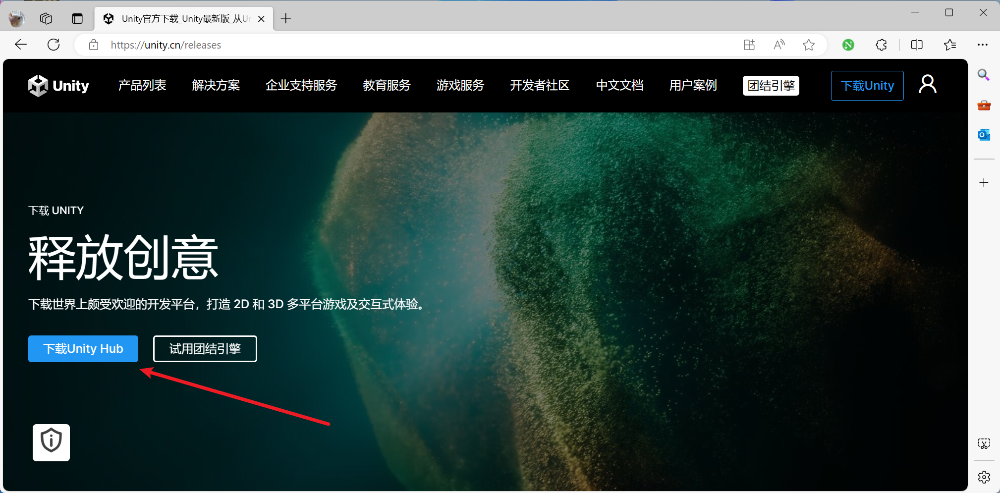

# 基础设置

## 安装Unity引擎和代码编辑器

在这一步需要完成

- 账号注册
- 下载Unity Hub
- 下载Unity 2022.2 版本
- 激活Unity的免费个人证书
- 将语言修改为中文简体：Preferences → Appearance → Language → 简体中文

建议初学者不要使用Plastic SCM 网盘，这是一个版本管理工具。但是不建议新手使用，因为该工具会受限于网络情况，如果网络不畅通，会出现各种各样的问题。

安装Unity时建议勾选安装Microsooft Visual Studio Community 2022

Unity下载：https://unity.cn/releases

在该页面选择**下载Unity Hub**

使用VS或者使用VSCODE开发，官方均有详细的教程引导，这里不多花时间了。

**Visual Studio for Unity:**

https://learn.microsoft.com/zh-cn/visualstudio/gamedev/unity/get-started/getting-started-with-visual-studio-tools-for-unity?pivots=windows

**Visual Studio Code for Unity:**

https://code.visualstudio.com/docs/other/unity

## 素材导入和整理

## 场景绘制和叠层设置

## 有规则和动态瓦片

