> 解决了没有快速修复的问题
>
> 点击 `Edit=>Preferences => External Tools =>Regenerate project files `重新生成 [cs](https://www.zhihu.com/search?q=cs&search_source=Entity&hybrid_search_source=Entity&hybrid_search_extra={"sourceType"%3A"answer"%2C"sourceId"%3A2178162186})工程文件夹.

# 敌人的制作

[《勇士传说》横版卷轴动作类游戏开发教程 | Unity 中文课堂 (u3d.cn)](https://learn.u3d.cn/tutorial/2DAdventure?chapterId=64095814700410001fd87304#)

> 不写public、private修饰符的话默认是private变量。

## 1.野猪 - 基本的移动逻辑和动画

### 提纲

初始化敌人相关的代码，创建`Scripts/Enemy`文件夹，用于保存所有关于敌人的代码，文件夹下有2个文件。

```
└── Enemy
    ├── Boar.cs
    └── Enemy.cs
```

- 修改`Enemy.cs`，定义以下基本参数
  - `normalSpeed` ：float 正常移动时的速度（面板中设为100）
  - `chaseSpeed` ：float 追击敌人时的速度（面板中设为260）
  - `currentSpeed` ：float 当前速度（在`Awake()`中初始化为`normalSpeed`）
  - `faceDir`：Vector3 面朝的方向
- 获取刚体组件命名为`rb`、动画组件命名为`anim`。
  - `anim`的权限设置为`protected`
  - 在`Awake()`函数中获取这些组件的使用权。
- 修改`Boar.cs`野猪类，继承`Enemy`类

实现野猪朝固定方向移动，继续修改`Enemy.cs`

- 在`Update()`方法中判断面朝方向，实时更新
- 定义一个`Move()`方法，实现敌人移动
  - 该Move方法是一个虚（virtual）方法，表示可以被子类覆写。
  - 修改刚体的速度
- 将`Move()`方法放到`FixedUpdate()`中去执行。

创建野猪动画

首先创建动画文件结构

```
Assets/Animations
└── Enemies
    ├── Boar.cs
    └── Enemy.cs
```

- 右键 Boar 文件夹创建 Animator Controller 命名为 Boar
- 为Boar对象挂载组件Animator，并修改Controller为刚刚创建的Boar
- 为野猪对象创建动画
  - BoarIdle
  - BoarWalk
  - BoarRun
- 通过Bool参数更改野猪的动画状态
  - 创建bool参数 walk
  - 创建bool参数 run
- 联机状态转移线（Idle，wark，run）共6条线
- 修改`Boar.cs`，重写（override）Move方法。添加一个播放动画的代码。默认播放行走动画。


### 提示

protected的作用：使子类可以调用父类方法，其他类不能调用。

动画创建仍然需要设置图片参数并切分，图片参数的设置：

- **Sprite Mode**： Multiple
- **Pixels Per Unit**：16
- **Filter Mode**：Point (no filter)
- **Compressing**：None

状态转移线的设置：

- Has Exit Time :x:
- Fixed Duration :x:
- Transition Duration (%)：0

面朝方向怎么判断

> 观察Transform可以发现，当前野猪朝左，而Scale 中的 X是正数1，说明正1对应左侧，负1对应右侧。
>
> 而左侧的方向是负一，因此朝左的方向应该是 `-transform.localScale.x`。

### 完整代码

`Enemy.cs`

```c#
using System.Collections;
using System.Collections.Generic;
using UnityEngine;

public class Enemy : MonoBehaviour
{
    [Header("基本参数")]
    public float normalSpeed;
    public float chaseSpeed;
    public float currentSpeed;
    public Vector3 faceDir;

    Rigidbody2D rb;
    protected Animator anim;

    private void Awake() {
        rb = GetComponent<Rigidbody2D>();
        anim = GetComponent<Animator>();
        currentSpeed = normalSpeed;
    }

    private void Update() {
        // 实时更新面朝方向
        faceDir = new Vector3(-transform.localScale.x, 0, 0);
    }
    private void FixedUpdate() {
        Move();
    }
    public virtual void Move() {
        rb.velocity = new Vector2(currentSpeed * faceDir.x * Time.deltaTime ,rb.velocity.y);
    }
}
```

`Boar.cs`

```c#
using System.Collections;
using System.Collections.Generic;
using UnityEngine;

public class Boar : Enemy
{
    public override void Move()
    {
        base.Move();
        anim.SetBool("walk", true);
    }
}

```

## 2.野猪 - 撞墙判定和等候计时

### 提纲

**实现碰撞检测**：修改`PhysicsCheck.cs`组件

- 添加检测参数
  - leftOffset：Vector2 向左偏移量
  - rightOffset：Vector2 向右偏移量
- 添加状态参数
  - touchLeftWall：bool
  - touchRightWall：bool
- 在 Check() 内添加检测碰撞代码
- 在`OnDrawGizmosSelected()` 添加Gizmo可视化代码

**调整碰撞检测**：给Boar野猪对象挂载**PhysicsCheck**组件，并设置参数

- CheckRadius ：调整到合适大小
- GroundLayer：Ground
- 调整Bottom Offset，检测野猪**前下方**有没有地面。
- 调整Left Offset，检测野猪**前方**有没有撞墙。
- 调整Right Offset，检测野猪**后方**有没有撞墙。

调整人物的PhysicsCheck组件，使得能够检测前后的碰撞

可以发现，手动确实可以调整，但是对象变多怎么办？？要是可以自动根据碰撞体形状判断岂不是更好？

**自动设置碰撞检测位置**：继续修改**PhysicsCheck**组件

- 添加检测参数
  - manual：bool
- 获取胶囊碰撞体组件
- 碰撞体组件通过Awake赋值
- 在`Awake()`方法中添加自动寻找位置的代码
- 修改Grid > Platform对象的Geometry Type为 Polygons（之前是Outlines，只有边缘线会检测）

**实现野猪撞墙掉头**，修改`Enemy.cs`

- 添加变量
  - 胶囊碰撞体
  - 在Update中判断是否撞墙，撞墙就让野猪转身。
- 修改 `Update()` 方法，使其能掉头
  - 使用physicsCheck组件看看是否撞墙。

**撞墙等待后再掉头**：修改`Enemy.cs`

- 添加新的参数列表**“计时器”**
  - waitTime：float
  - waitTimeCounter：float
  - wait：bool
- 创建计时器相关的函数`TimeCounter()`：写一个定时器
  - 判断是否是wait状态
  - 若是，开始减waitTimeCounter，直到其归零。将wait设为false
  - 修改撞墙条件判断，要面朝方向的检测点撞墙才行
  - 撞墙后设置wait变量为true
  - 撞墙后设置动画走路的参数`walk`为false。
  - 给waitTimeCounter赋初始值


### 实现碰撞检测

修改`PhysicsCheck.cs`组件

- 添加检测参数
  - leftOffset：Vector2 向左偏移量
  - rightOffset：Vector2 向右偏移量
- 添加状态参数
  - touchLeftWall：bool
  - touchRightWall：bool
- 在 Check() 内添加检测碰撞代码
- 在`OnDrawGizmosSelected()` 添加Gizmo可视化代码

```c#
public class PhysicsCheck : MonoBehaviour
{
    
    [Header("检测参数")]
    public bool manual;
    public Vector2 leftOffset;
    public Vector2 rightOffset;
    
    [Header("状态")]
    public bool touchLeftWall;
    public bool touchRightWall;
    
    public void Check()
    {
        // 墙体判断
        touchLeftWall = Physics2D.OverlapCircle((Vector2)transform.position + leftOffset, checkRadius, groundLayer);
        touchRightWall = Physics2D.OverlapCircle((Vector2)transform.position + rightOffset, checkRadius, groundLayer);
    }
    private void OnDrawGizmosSelected() {
        Gizmos.DrawWireSphere((Vector2)transform.position + leftOffset, checkRadius);
        Gizmos.DrawWireSphere((Vector2)transform.position + rightOffset, checkRadius);
    }
}
```

### 调整碰撞检测位置

给Boar野猪对象挂载**PhysicsCheck**组件，并设置参数

- CheckRadius ：调整到合适大小
- GroundLayer：Ground
- 调整Bottom Offset，检测野猪**前下方**有没有地面。
- 调整Left Offset，检测野猪**前方**有没有撞墙。
- 调整Right Offset，检测野猪**后方**有没有撞墙。

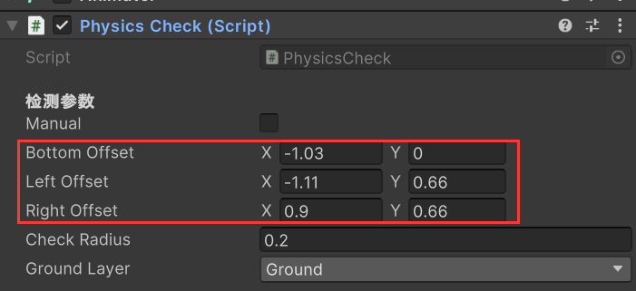

调整人物的PhysicsCheck组件，使得能够检测前后的碰撞

可以发现，手动确实可以调整，但是对象变多怎么办？？要是可以自动根据碰撞体形状判断岂不是更好？


### 自动设置碰撞检测位置

继续修改**PhysicsCheck**组件

- 添加检测参数
  - manual：bool
- 获取胶囊碰撞体组件
- 碰撞体组件通过Awake赋值
- 在`Awake()`方法中添加自动寻找位置的代码
- 修改Grid > Platform对象`Composite Collider 2D`组件的`Geometry Type为 Polygons`（之前是Outlines，只有边缘线会检测）

```c#
public class PhysicsCheck : MonoBehaviour
{
    CapsuleCollider2D coll;
    [Header("检测参数")]
    // 是否手动设置检测范围
    public bool manual;
    
    private void Awake() {
        coll = GetComponent<CapsuleCollider2D>();
        if (!manual)
        {
			// 这部分的代码有待优化
            rightOffset = new Vector2(coll.bounds.size.x / 2 + coll.offset.x , coll.bounds.size.y / 2);
            leftOffset = new Vector2(-rightOffset.x - checkRadius, rightOffset.y);
        }
    }
}
```


### 实现野猪撞墙掉头

修改`Enemy.cs`

- 添加变量
  - 获取PhysicsCheck组件
  - 在Update中判断是否撞墙，撞墙就让野猪转身。
- 修改 `Update()` 方法，使其能掉头
  - 使用physicsCheck组件看看是否撞墙。

```c#
public class Enemy : MonoBehaviour
{
    PhysicsCheck physicsCheck;
    private void Update() {
        faceDir = new Vector3(-transform.localScale.x, 0, 0);
        // Vector3 scale = transform.localScale;

        // 老师写的
        if (physicsCheck.touchLeftWall || physicsCheck.touchRightWall)) {
            // 这种感觉有问题，撞墙是一个连续的状态，会不断更改猪的方向
            transform.localScale = new Vector3(faceDir.x, 1, 1);
        }

        // 自己写的改版
        // if (physicsCheck.touchLeftWall) {
        //     transform.localScale = new Vector3(-1, 1, 1);
        // }
        // else if (physicsCheck.touchRightWall) {
        //     transform.localScale = new Vector3(1, 1, 1);
        // }
    }
}
```

### 撞墙等待后再掉头

倒计时结束后再翻转，修改`Enemy.cs`

- 添加新的参数列表**“计时器”**
  - waitTime：float
  - waitTimeCounter：float
  - wait：bool
- 创建计时器相关的函数`TimeCounter()`：写一个定时器
  - 判断是否是wait状态
  - 若是，开始减waitTimeCounter，直到其归零。将wait设为false，初始化waitTimeCounter
  - 在Awake()中给waitTimeCounter赋初始值
- 修改update()中撞墙条件的判断
  - 修改撞墙条件判断，要面朝方向的检测点撞墙才行
  - 撞墙后设置wait变量为true
  - 撞墙后设置动画走路的参数`walk`为false。

```c#
public class Enemy : MonoBehaviour
{
    [Header("计时器")]
    public float waitTime;
    public float waitTimeCounter;
    public bool wait;

    public void TimeCounter()
    {
        if (wait)
        {
            waitTimeCounter -= Time.deltaTime;
            if (waitTimeCounter <= 0)
            {
                wait = false;
                waitTimeCounter = waitTime;
                transform.localScale = new Vector3(faceDir.x, 1, 1);
            }
        }
    }
}
```

> 注意这里要修改isGround 的判断方法

```c#
    public void Check()
    {
        // 地面判断
        // isGround = Physics2D.OverlapCircle((Vector2)transform.position + bottomOffset, checkRadius, groundLayer);
        isGround = Physics2D.OverlapCircle((Vector2)transform.position + new Vector2(bottomOffset.x * transform.localScale.x, bottomOffset.y), checkRadius, groundLayer);
    }
```


### 完整代码

- [3_2_Boar.cs](src/3_2_Boar.cs)
- [3_2_Enemy.cs](src/3_2_Enemy.cs)
- [3_2_PhysicsCheck.cs](src/3_2_PhysicsCheck.cs)
- [3_2_PlayerController.cs](src/3_2_PlayerController.cs)

## 3.野猪 - 受伤及死亡的逻辑和动画

### 提纲

**跳跃时不能攻击**（可选）

**受伤和死亡动画**

- 创建野猪的受伤动画
- 创建野猪的死亡动画，由于素材中没有野猪死亡的动画，可以用受伤的动画修改一下代替死亡动画。具体实现可以让野猪的透明度降为0。
- 动画转移设置
  - Any State -> BoarHurt：播放完动画后退出
  - Any State -> BoarDead：记得取消循环播放
  - BoarHurt -> Exit
- 动画参数设置
  - dead：bool 是否死亡
  - hurt：bool 是否受伤

**受伤的代码逻辑**：修改`Enemy.cs`

- 新增基本参数
  - `public Transformer attacker`：攻击野猪的对象的Transformer（玩家的Transformer）
- 新增方法`OnTakeDamage()`
  - 参数为玩家的Transformer
  - 实现野猪转身，如果野猪背对玩家，被攻击后要面朝玩家。
- 在Boar对象的Character组件中，设置On Take Damage。

### 跳跃时不能攻击

可以设置，也可以不设置，讲道理跳跃时也能攻击

```c#
private void PlayerAttack(InputAction.CallbackContext obj)
{
    if (!physicsCheck.isGround)
        return;
    playerAnimation.PlayAttack();
    isAttack = true;
}
```

### 受伤和死亡动画

- 创建野猪的受伤动画
- 创建野猪的死亡动画
- 动画转移设置
  - Any State -> BoarHurt：播放完动画后退出
  - Any State -> BoarDead：记得取消循环播放
  - BoarHurt -> Exit
- 动画参数设置
  - dead：bool 是否死亡
  - hurt：trigger 是否受伤

野猪受伤动画用`Assets/Art Assets/Legacy-Fantasy-High Forest/Enemies/Boar/Hit-Vanish/Hit-Sheet.png`

由于素材中没有野猪死亡的动画，可以用受伤的动画修改一下代替死亡动画。具体实现可以让野猪的透明度在最后一帧降为0。

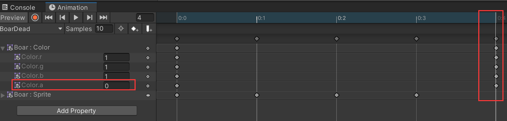

动画转移设置和动画参数设置

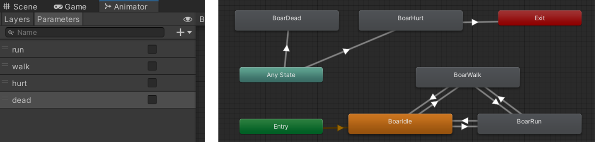

### 受伤的代码逻辑

修改`Enemy.cs`

- 新增基本参数
  - `public Transformer attacker`：攻击野猪的对象的Transformer（玩家的Transformer）
  - `public float hurtForce`：野猪受到伤害时，被击退的力。可以设为4.5
- 新增状态
  - `public bool isHurt`
- 修改FixedUpdate中的移动相关代码，改为非受伤状态下才能移动
- 新增方法`OnTakeDamage()`
  - 参数为玩家的Transformer
  - 实现野猪转身，如果野猪背对玩家，被攻击后要面朝玩家。
  - 实现受伤被击退的效果
- 在Boar对象的Character组件中，设置On Take Damage。

```c#
public class Enemy : MonoBehaviour
{
    [Header("基本参数")]
    public Transform attacker;
    // 受到伤害时，野猪被击退的力
    public float hurtForce;
    [Header("状态")]
    public bool isHurt;
    
    private void FixedUpdate() {
        if (!isHurt)
            Move();
    }
    public void OnTakeDamage(Transform attackTrans)
    {
        attacker = attackTrans;
        // 受到攻击转身
        if (attackTrans.position.x - transform.position.x > 0)
            transform.localScale = new Vector3(-1, 1, 1);
        if (attackTrans.position.x - transform.position.x < 0)
            transform.localScale = new Vector3(1, 1, 1);
        // 受伤被击退
        isHurt = true;
        anim.SetTrigger("hurt");
        Vector2 dir = new Vector2(transform.position.x - attackTrans.position.x, 0).normalized;

        rb.AddForce(dir * hurtForce, ForceMode2D.Impulse);
    }
}
```

设置好On Take Damage的关联方法。

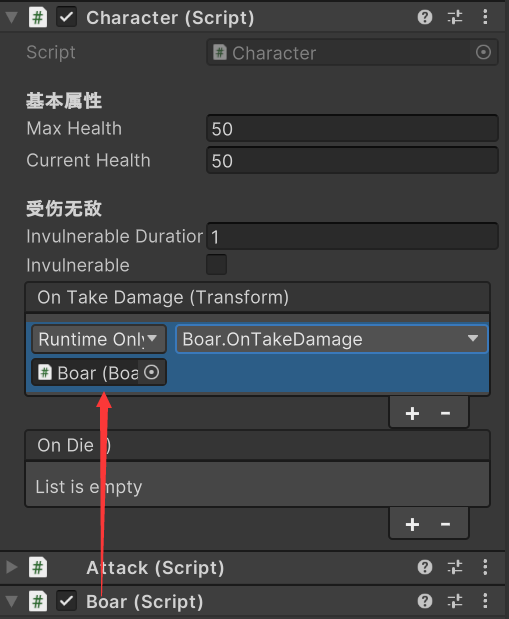

### 协程实现受伤停止

- 创建一个协程方法`OnHurt()`
  - 在协程内给对象施加一个力
  - 协程返回的写法，等待一定时间
  - 将isHurt设置为false

此时当野猪受攻击以后，就停止不动了。我们需要用一种方式，让野猪受到攻击以后停顿一段时间再移动。

IEumerator 就是携程返回的一个迭代器对象，使用协程的方式可以帮助我们按照一定的顺序执行代码。

```c#
public class Enemy : MonoBehaviour
{
    public void OnTakeDamage(Transform attackTrans)
    {
        // 受伤被击退
        isHurt = true;
        anim.SetTrigger("hurt");
        Vector2 dir = new Vector2(transform.position.x - attackTrans.position.x, 0).normalized;
        // 开启协程
        StartCoroutine(OnHurt(dir));
    }
    private IEnumerator OnHurt(Vector2 dir)
    {
        rb.AddForce(dir * hurtForce, ForceMode2D.Impulse);
        yield return new WaitForSeconds(0.45f);
        isHurt = false;
    }
}
```


### 实现野猪死亡

修改`Enemy.cs`

- 新增状态
  - `public bool isHurt`
- 更改敌人移动条件，死亡时不能移动
- 创建销毁对象方法`DestroyAfterAnimation()`
- :star:在BoarDead动画里的最后添加一个函数事件，调用`DestroyAfterAnimation()`
- 野猪死亡时关闭野猪碰撞体

```c#
public class Enemy : MonoBehaviour
{
    [Header("状态")]
    public bool isDead;
    private void FixedUpdate() {
        if (!isHurt & !isDead)
            Move();
    }
    public void OnDie()
    {
        anim.SetBool("dead", true);
        isDead = true;
    }
    
    public void DestroyAfterAnimation()
    {
        Destroy(this.gameObject);
    }
}
```

在动画的最后一帧插入事件

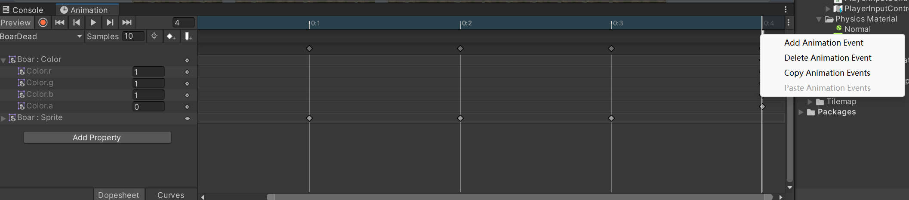

野猪死亡时关闭野猪碰撞体

通过调整碰撞图层的方式 Edit -> Project Settings 查看Physics2D的Layer Collision Matrix。取消勾选ignore Raycast和Player的碰撞关系。

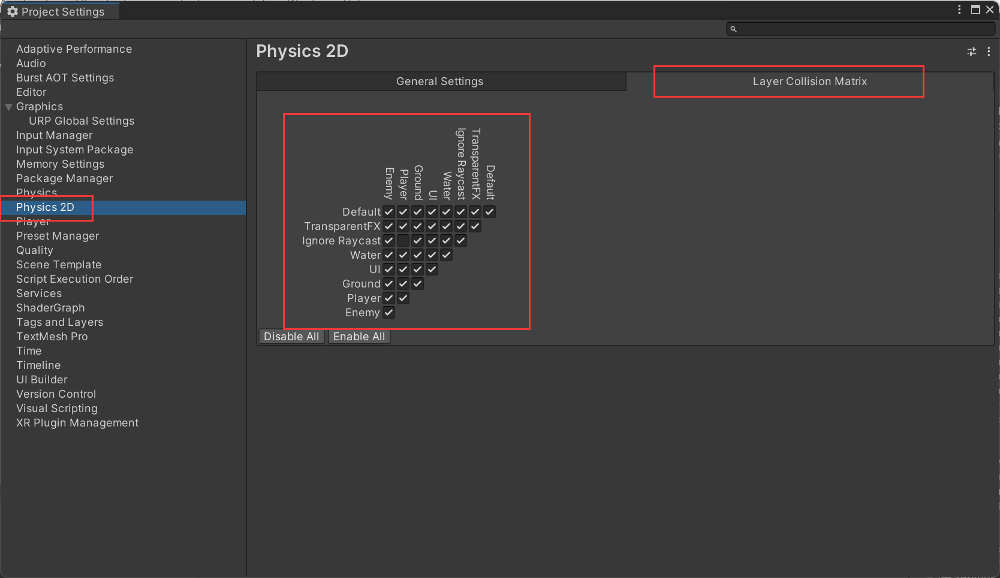

当野猪死亡时，把野猪的Layer改成 Ignore Raycast即可

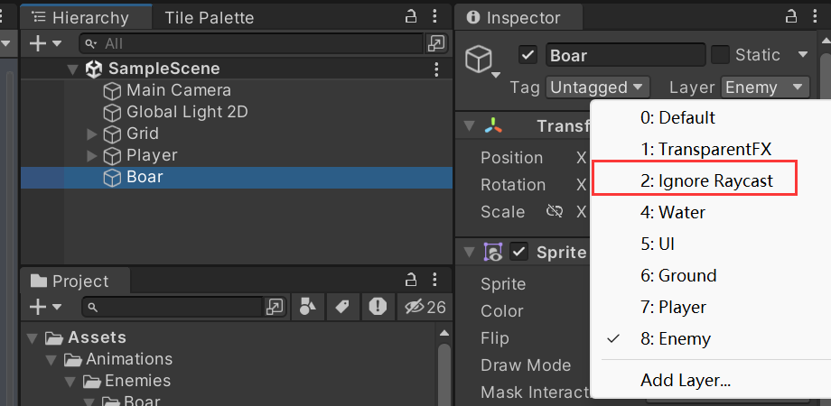

修改代码`Enemy.cs`

```c#
    public void OnDie()
    {
        gameObject.layer = 2;
        anim.SetBool("dead", true);
        isDead = true;
    }
```

## 4.有限状态机&抽象类多态

之前写的`AttackFinish.cs`就是一个状态机

状态机需要控制状态进入、退出、更新时要执行什么函数

### 创建抽象类

创建`Scirpts/Enemy/BaseState.cs`

```c#
// 注意这个脚本头部不需要引入其他库
public abstract class BaseState
{
    protected Enemy currentEnemy;
    public abstract void OnEnter(Enemy enemy);
    
    // 撞墙等逻辑判断，在update中执行
    public abstract void LogicUpdate();
    public abstract void PhysicsUpdate();
    public abstract void OnExit();
}
```

注意到`AttackFinish.cs`中，定义的方法是用`virtural`，这是因为它继承了`ScriptableObject`。这个类里面进行了一些操作。所以可以用`virtural`，而我们还是用

```c#
// StateMachineBehaviour对象
    public abstract class StateMachineBehaviour : ScriptableObject
    {
        protected StateMachineBehaviour();
        public virtual void OnStateEnter(...);
        public virtual void OnStateExit(...)
    }
```

我们没有进行额外的操作，因此定义方法时需要用`abstract`关键字。

### 创建野猪巡逻状态类

`Scirpts/Enemy/BoarPatrolState.cs`

```c#

public class BoarPatrolState : BaseState
{

    public override void OnEnter(Enemy enemy)
    {
        // 发现Player 切换到 chase
        throw new System.NotImplementedException();
    }
    public override void LogicUpdate()
    {
        throw new System.NotImplementedException();
    }
    public override void OnExit()
    {
        throw new System.NotImplementedException();
    }
    public override void PhysicsUpdate()
    {
        throw new System.NotImplementedException();
    }

}
```

### 使用状态机

修改`Enemy.cs`

```c#
public class Enemy : MonoBehaviour
{
    [Header("状态")]
    
    protected BaseState currentState;
    protected BaseState patrolState;
    protected BaseState chaseState;
    
    private void OnEnable()
    {
        currentState = patrolState;
        currentState.OnEnter(this);
    }
    // 对象被关闭，消失前执行
    private void OnDisable()
    {
        currentState.OnExit();
    }
    private void Update()
    {
        // ...
        currentState.LogicUpdate();
        // old
        TimeCounter(); 
    }
    private void FixedUpdate()
    {
        // ...
        currentState.PhysicsUpdate();
    }
    

}
```

### 编写Boar对象的状态

继续完善`BoarPatrolState.cs`

```c#

public class BoarPatrolState : BaseState
{

    public override void OnEnter(Enemy enemy)
    {
        // 发现Player 切换到 chase
        currentEnemy = enemy;
    }
    public override void LogicUpdate()
    {
        if (!currentEnemy.physicsCheck.isGround || (currentEnemy.physicsCheck.touchLeftWall && currentEnemy.faceDir.x < 0) || (currentEnemy.physicsCheck.touchRightWall && currentEnemy.faceDir.x > 0)) {
            currentEnemy.wait = true;
            currentEnemy.anim.SetBool("walk", false);
        }
        else
        {
            currentEnemy.anim.SetBool("walk", true);
        }
    }
    public override void OnExit()
    {
        currentEnemy.lostTimeCounter = currentEnemy.lostTime;
        currentEnemy.anim.SetBool("walk", false);
    }
}
```

完善`Enemy.cs`

在unity编辑器中隐藏变量的写法：在变量前面加上`[HideInInspector]`

```c#
public class Enemy : MonoBehaviour
{
    // 改成公有变量 并在unity界面中隐藏
    [HideInInspector]public Animator anim;
    [HideInInspector]public PhysicsCheck physicsCheck;  
    // 改成virtual 方便 Boar对象重写
    protected virtual void Awake()
    { ... }

    private void Update()
    {
        // 注释掉之前写的判断野猪撞墙的代码
        // if ((physicsCheck.touchLeftWall && faceDir.x < 0) || (physicsCheck.touchRightWall && faceDir.x > 0)) {
        //     wait = true;
        //     anim.SetBool("walk", false);
        // }
        
        currentState.LogicUpdate();
        TimeCounter();  // old
    }
    private void FixedUpdate()
    {
        // wait时也不能移动
        if (!isHurt && !isDead && !wait)
        {
            Move();
        }
    }
}
```

先注释掉之前写的修改`Boar.cs`

```c#
public class Boar : Enemy
{
    protected override void Awake()
    {
        base.Awake();
        patrolState = new BoarPatrolState();
    }
    //public override void Move()
    //{
    //    base.Move();
    //    anim.SetBool("walk", true);
    //}
}
```

### 完整代码

- [BaseState.cs](./src/3_4_BaseState.cs)
- [BoarPatrolState.cs](./src/3_4_BoarPatrolState.cs)
- [Enemy.cs](./src/3_4_Enemy.cs)
- [Boar.cs](./src/3_4_Boar.cs)

## 5.追击状态的转换

给Boar类添加一个新的状态`BoarChaseState`

### 完善Boar类

修改`Boar.cs`

```c#
public class Boar : Enemy
{
    protected override void Awake()
    {
        base.Awake();
        patrolState = new BoarPatrolState();
        // 添加Chase状态
        chaseState = new BoarChaseState();
    }
}
```

### 完善巡逻状态

完善`BoarPatrolState.cs`

- 在进入该状态时设置速度
- 当发现Player时，切换到追击状态

```c#
public class BoarPatrolState : BaseState
{
    public override void OnEnter(Enemy enemy)
    {
        currentEnemy = enemy;
        // 设置速度
        currentEnemy.currentSpeed = currentEnemy.normalSpeed;
    }
    public override void LogicUpdate()
    {
        // 发现player 切换的chaseState
        if (currentEnemy.FoundPlayer())
        {
            currentEnemy.SwitchState(NPCState.Chase);
        }
    }
}

```

### 枚举类的实现

创建`Scripts/Utilities/Enums.cs`，首先清空整个代码

编写

```c#
public enum NPCState
{
    Patrol, Chase, Skill
}
```

枚举类将在`FoundPlayer()`中使用

### 完善Enemy类

修改`Enemy.cs`

实现`FoundPlayer()`

- 添加“检测”参数（BoxCast相关）
  - `public Vector2 centerOffset`
  - `public Vector2 checkSize`
  - `public float checkDistance`
  - `public LayerMask attackLayer`

```c#
public class Enemy : MonoBehaviour
{
    // 新增检测参数
    [Header("检测")]
    public Vector2 centerOffset;
    public Vector2 checkSize;
    public float checkDistance;
    public LayerMask attackLayer;
    
    // public void TimeCounter() ... 
    public bool FoundPlayer()
    {
        return Physics2D.BoxCast(
            transform.position+(Vector3)centerOffset, 
            checkSize, 
            0, // angle
            faceDir, 
            checkDistance, 
            attackLayer
        );
    }
    // 可视化BoxCast 绘制Gizmo
    private void OnDrawGizmosSelected()
    {
        Gizmos.DrawWireSphere(
            transform.position + (Vector3)centerOffset + new Vector3(checkDistance* -transform.localScale.x,0), 
            0.2f
        );
    }
}
```

实现状态切换

```c#
public class Enemy : MonoBehaviour
{
    // 状态切换方法
    public void SwitchState(NPCState state)
    {
        var newState = state switch
        {
            NPCState.Patrol => patrolState,
            NPCState.Chase => chaseState,
            _ => null
        };
        
        currentState.OnExit();
        currentState = newState;
        currentState.OnEnter(this);
    }
}
```

实现目标丢失的计时器

```c#
public class Enemy : MonoBehaviour
{
    [Header("计时器")]
    public float lostTime;
    public float lostTimeCounter;
    
    // 增加丢失目标的计时器
    public void TimeCounter()
    {
        // 最下方
        if (!FoundPlayer())
        {
            if (lostTimeCounter > 0)
                lostTimeCounter -= Time.deltaTime;
        }
        else
        {
            lostTimeCounter = lostTime;
        }
    }
}
```

enemy被攻击时，速度设为0，避免野猪在冲撞情况下，攻击不会被击退

```c#
public class Enemy : MonoBehaviour
{
    // 修改OnTakeDamge，避免野猪冲刺时攻击无法击退
    public void OnTakeDamage(Transform attackTrans)
    {
        rb.velocity = new Vector2(0, rb.velocity.y);
        // ↑↑↑
        // StartCoroutine(OnHurt(dir));
    }
}
```


### 编写追击状态

创建`Scripts/Enemy/BoarChaseState.cs`

- 进入该状态时
  - 初始化currentEnemy
  - 设置速度
  - 播放动画
- LogicUpdate
  - 判断是否目标是否丢失，是则退出追击
  - 判断是否撞墙，如果撞墙，直接掉头，不等待了。
- 退出状态OnExit
  - 关闭动画

```c#

public class BoarChaseState : BaseState

{
    public override void OnEnter(Enemy enemy)
    {
        currentEnemy = enemy;
        Debug.Log("Chase");
        currentEnemy.currentSpeed = currentEnemy.chaseSpeed;
        currentEnemy.anim.SetBool("run", true);
    }
    public override void LogicUpdate()
    {
        // 退出追击
        if(currentEnemy.lostTimeCounter <= 0)
        {
            currentEnemy.SwitchState(NPCState.Patrol);
        }
        // 可以复制PatrolState的代码
        if (!currentEnemy.physicsCheck.isGround || (currentEnemy.physicsCheck.touchLeftWall && currentEnemy.faceDir.x < 0) || (currentEnemy.physicsCheck.touchRightWall && currentEnemy.faceDir.x > 0)) {
            
            currentEnemy.transform.localScale = new Vector3(currentEnemy.faceDir.x, 1, 1);
        }

    }
    public override void PhysicsUpdate()
    {

    }
    public override void OnExit()
    {
        // currentEnemy.lostTimeCounter = currentEnemy.lostTime;
        currentEnemy.anim.SetBool("run", false);
    }
}
```

## 6.蜗牛 - 基本的移动逻辑和动画

直接把蜗牛walk的第一帧拖到Hierarchy

- 修改Layer为Enemy
- 修改Sorting Layer为Middle
- 修改Order in Layer为1

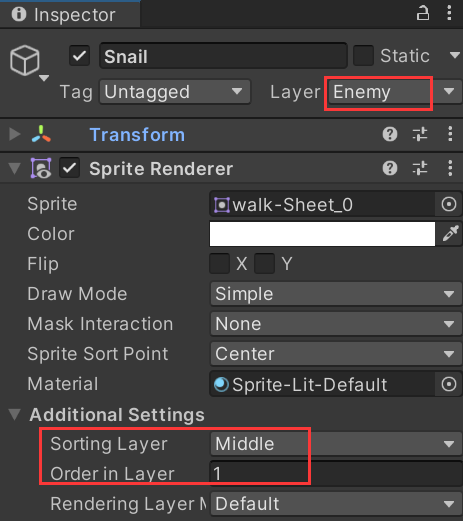

可以发现Enemy中主要需要以下组件：

- 碰撞体：Rigidbody2D
- 动画：Animator
- 物理检测：PhysicsCheck

在`Enemy.cs`中，可以通过`[RequireComponent()]`添加必选组件

```c#
[RequireComponent(typeof(Rigidbody2D), typeof(Animator), typeof(PhysicsCheck))]
public class Enemy : MonoBehaviour
{
    // ...
}
```

创建`Scripts/Enemy/Snail.cs`

```cs
// 继承Enemy
public class Snail : Enemy
{
    
}
```

此时直接给蜗牛挂载Snail组件，会发现自动挂载上了上面3个组件。	

### 添加蜗牛的碰撞体

- 添加Box Collider 2D，放在蜗牛脚底，作为蜗牛与地面接触的部分。
  - 编辑碰撞框大小，调整到只有脚底那部分
  - 设置Layer Overrides 的 Exclude Layers为 `Player, Enemy`
- 添加Capsule Collider 2D
  - 设置Layer Overrides 的 Exclude Layers为 ` Enemy`
  - Is Trigger: ✅

设置完毕后

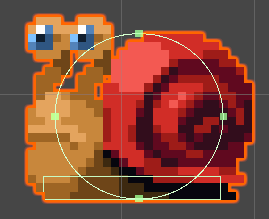

然后设置Physics Check组件的参数

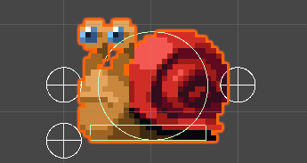

> 注意默认要勾选 is Ground 选项，不然游戏一开始会触发蜗牛不在地面，然后蜗牛就暂停了，会有一点小BUG

### 手动挂载其他组件

- Attack.cs
- Character.cs

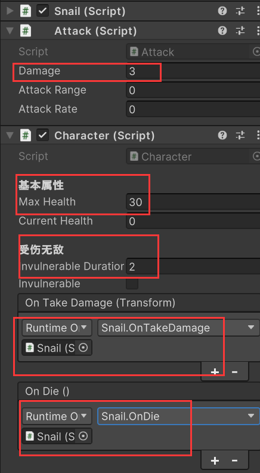

检测参数

- Center Offset : 0, 0.5
- Check Size : 1, 1
- Check Distance : 4
- Attack Layer : Player

计时器参数

- Wait Time : 2
- Lost Time : 4

基本参数

- Normal Speed : 60
- Hurt Force : 3

### 创建动画

创建`Animations/Enemies/Snail`文件夹

右键`Create` > `Animator Controller`。名称也修改为Snail

创建完毕后，在Animator组件中设置Controller

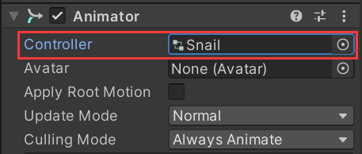

创建动画`SnailIdle.anim`

- 就采用walk的第一帧作为它的动画
- 采样率设为1

创建动画`SnailPreMove.anim`

- 使用walk-Sheet的0到3帧
- 采样率设为6

创建动画`SnailMove.anim`

- 使用walk-Sheet的4到7帧
- 采样率设为6

> 希望实现的效果是，当蜗牛执行完SnailPreMove动画后，在播放SnailMove动画并移动

### 编辑动画

创建三个参数

- walk：bool
- dead：bool
- hurt：trigger

动画连接

- `SnailIdle` -> `SnailPreMove`：walk 为 true时
- `SnailPreMove` -> `SnailIdle`：walk 为 false时
- `SnailPreMove` -> `SnailMove`：完整播放动画后
- `SnailMove` -> `SnailPreMove`：完整播放动画后
- `SnailMove` -> `SnailIdle`：walk 为 false时

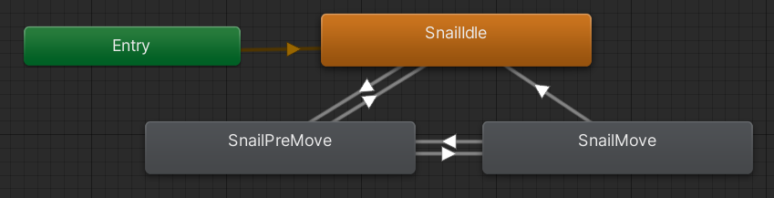

### 编写状态机

创建`SnailPatrolState.cs`

```cs

public class SnailPatrolState : BaseState
{
    public override void OnEnter(Enemy enemy)
    {
        // 发现Player 切换到 chase
        currentEnemy = enemy;
        currentEnemy.currentSpeed = currentEnemy.normalSpeed;
    
    }
    
    public override void LogicUpdate()
    {
        // 与 BoarPatrolState 的 LogicUpdate类似
        if (currentEnemy.FoundPlayer())
        {
            currentEnemy.SwitchState(NPCState.Skill);
        }
        
        if (!currentEnemy.physicsCheck.isGround || (currentEnemy.physicsCheck.touchLeftWall && currentEnemy.faceDir.x < 0) || (currentEnemy.physicsCheck.touchRightWall && currentEnemy.faceDir.x > 0)) {
            currentEnemy.wait = true;
            currentEnemy.anim.SetBool("walk", false);
        }
        else
        {
            currentEnemy.anim.SetBool("walk", true);
        }
    }

    public override void PhysicsUpdate()
    {

    }

    public override void OnExit()
    {
        
    }
}

```

### 编写Snail.cs

```c#
using System.Collections;
using System.Collections.Generic;
using UnityEngine;

public class Snail : Enemy
{
    protected override void Awake()
    {
        base.Awake();
        patrolState = new SnailPatrolState();
    }
}

```

修改`Enemy.cs`

思路时检测SnailPreMove动画有没有在播放，如果有，就不能移动。

```c#
public class Enemy : MonoBehaviour
{
    public virtual void Move() {
        // 如果当前的enemy对象的第一个animator图层没有在播放动画SnailPreMove, 那就不能移动
        if (!anim.GetCurrentAnimatorStateInfo(0).IsName("SnailPreMove"))
            rb.velocity = new Vector2(currentSpeed * faceDir.x * Time.deltaTime ,rb.velocity.y);
        
    }
}

```

## 7.蜗牛 - 特殊技能状态的实现

### 动画设置

- 创建动画`SnailHide.anim`，蜗牛躲藏的动画，采样率8，取消循环
- 创建动画`SnailHideIdle.anim`，蜗牛持续躲藏的动画，采样率1
- 创建动画`SnailRecover.anim`，蜗牛出来的动画，采样率8，取消循环
- 创建动画`SnailHurt.anim`，蜗牛受伤动画，采样率1（all图集的最后一张图片），取消循环
- 创建动画`SnailDead.anim`，蜗牛死亡动画，自己diy一下，取消循环

设置动画参数

- `skill`：trigger，使用技能
- `hide`：bool，是否正在躲藏

连接动画转移

- `Any State` → `SnailHide`，**瞬间转移**
  - 条件 skill
  - 条件 hide = true
- `SnailHide` → `SnailHideIdle`，**播放后转移**
  - 条件 hide = true
- `SnailHideIdle` → `SnailRecover`，**瞬间转移**
  - 条件 hide = false
- `SnailRecover` → `Exit`，**播放后转移**
- `Any State` → `SnailHurt`，**瞬间转移**
  - 条件：hurt
- `SnailHurt` → `SnailHide`，**播放后转移**

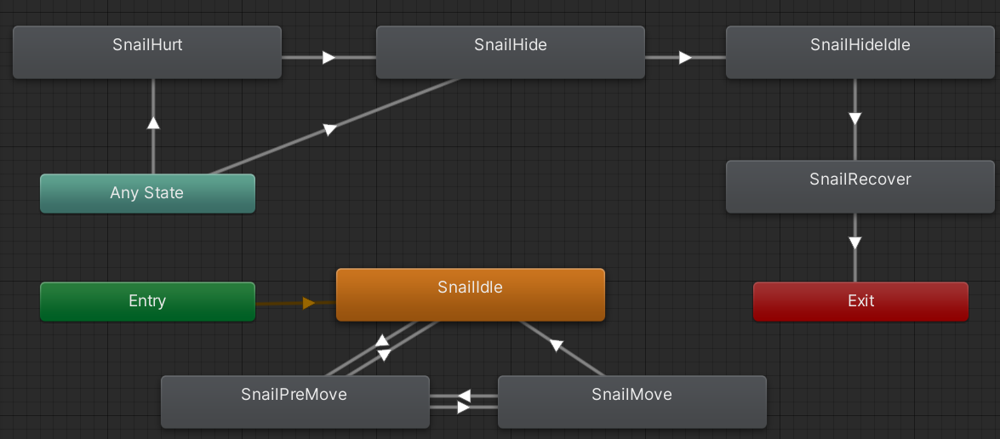

### 蜗牛的状态切换脚本

创建`Scripts/Enemy/SnailSkillState.cs`

```c#
using UnityEngine;

public class SnailSkillState : BaseState
{
    public override void OnEnter(Enemy enemy)
    {
        currentEnemy = enemy;
        currentEnemy.currentSpeed = currentEnemy.chaseSpeed;
        currentEnemy.anim.SetBool("walk", false);
        currentEnemy.anim.SetBool("hide", true);
        currentEnemy.anim.SetTrigger("skill");
        
        // 不加这行会让动画一直切换
        currentEnemy.lostTimeCounter = currentEnemy.lostTime;
        // 在蜷缩状态下无敌
        currentEnemy.GetComponent<Character>().invulnerable = true;
        currentEnemy.GetComponent<Character>().invulnerableCounter = currentEnemy.lostTimeCounter;
    }

    public override void LogicUpdate()
    {
        if (currentEnemy.lostTimeCounter <= 0)
            currentEnemy.SwitchState(NPCState.Patrol);
        
        // 无敌时间等于丢失对象的时间
        currentEnemy.GetComponent<Character>().invulnerableCounter = currentEnemy.lostTimeCounter;
    }

    public override void PhysicsUpdate()
    {

    }

    public override void OnExit()
    {
        currentEnemy.anim.SetBool("hide", false);
        currentEnemy.GetComponent<Character>().invulnerable = false;
    }
}
```

修改`Character.cs`

```c#
public class Character : MonoBehaviour
{
    [Header("受伤无敌")]
    // 改为public
    public float invulnerableCounter；
}
```


修改`Snail.cs`

```c#
public class Snail : Enemy
{
    protected override void Awake()
    {
        //添加新的状态
        skillState = new SnailSkillState();
    }
}
```

修改`Enemy.cs`

```c#
public class Enemy : MonoBehaviour
{
    // protected BaseState chaseState;
    // 添加一个新的状态
    protected BaseState skillState;
    
    // 新的状态切换
    public void SwitchState(NPCState state)
    {
        var newState = state switch
        {
            // NPCState.Chase => chaseState,
            // 添加新的状态切换方法
            NPCState.Skill => skillState,
        }
    }
    
    // 修改移动设置
    public virtual void Move()
    {
        if (!anim.GetCurrentAnimatorStateInfo(0).IsName("SnailPreMove") && !anim.GetCurrentAnimatorStateInfo(0).IsName("SnailRecover"))
            rb.velocity = new Vector2(currentSpeed * faceDir.x * Time.deltaTime ,rb.velocity.y);
    }
}
```


> 修复攻击瞬间蜗牛就进入无敌状态的bug
>
> 将Attack Area的图层改为Default

### 蜗牛死亡

添加死亡动画

设置最后一帧DestroyAfterAnimation ()动画连线如下

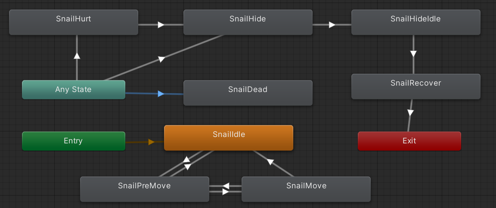

## 8.蜜蜂 - 基本的移动逻辑和动画

### 创建蜜蜂对象

将`Enemies/Small Bee` 中的动画文件进行切分。

将Fly-Sheet中的第一帧拖到Hierarchy中，重命名为Bee

设置Bee的参数

- Layer : Enemy
- Additional Settings
  - Sorting Layer : Middle
  - Order in Layer : 1

### 组件挂载

创建`Scripts/Enemy/Bee.cs`，继承`Enemy`。挂载到Bee对象上

除了自身外，还会自动添加3个组件，配置参数：

- `Bee (Script)`
  - Normal Speed : 60
  - Chase Speed : 120
  - Hurt Force : 3
  - Check Distance : 4 （检测半径）
  - Attack Layer : Player（之前就是忘记设置了，导致蜜蜂无法检测到玩家）
  - 计时器
    - Wait Time : 2
    - Lost Time : 3

- `Rigidbody 2D`
  - Gravity Scale : 0 （蜜蜂是飞行单位）
  - Collision Detection : Continuous

- `Animator`
  - 创建`Animations/Enemies/Bee/Bee.controller` （右击文件夹 create > Animator Controller）
  - Controller设置为刚刚创建的

- `Physics Check (Script)`

手动添加组件并配置参数

- `Capsule Collider 2D`
  - 调整大小
  - `Is Trigger` : ✅
  - `Layer Overrides` > `Exclude Layers` : Enemy
- `Attack (Script)`
  - Damage : 5
  - Attack Range : 1.2（攻击距离，蜜蜂独有）
  - Attack Rate : 1 （攻击频率，蜜蜂独有）

- `Character (Script)`
  - Max Health : 
  - Invulnerable Duration : 0.2
  - On Take Damge(Transform)
  - On Die()


蜜蜂不需要添加像蜗牛、野猪那样的地面碰撞体

### 蜜蜂动画

- 创建`BeeFly.anim`，采样率6
- 创建`BeeChase.anim`，采样率12
- 创建`BeeHurt.anim`，采样率6，取消勾选Loop Time
- 创建`BeeAttack.anim`，采样率4，取消勾选Loop Time
- 创建`BeeDead.anim`，采样率12

### 蜜蜂巡逻逻辑

给蜜蜂设置一个初始点位，然后每次随机在蜜蜂初始点附近范围随机选一个点，蜜蜂向这个点飞过去，飞到以后，再随机选一个点。

创建`Scripts/Enemy/BeePatrolState.cs`

```c#
using System.Collections;
using System.Collections.Generic;
using UnityEngine;

public class BeePatrolState : BaseState
{
    private Vector3 target; // 蜜蜂的目标移动位置
    private Vector3 moveDir; // 蜜蜂的移动方向

    public override void OnEnter(Enemy enemy)
    {
        currentEnemy = enemy;
        currentEnemy.currentSpeed = currentEnemy.normalSpeed;
        // 进入巡逻状态时，立刻获取目标位置
        target = enemy.GetNewPoint();

    }

    public override void LogicUpdate()
    {
        if (currentEnemy.FoundPlayer())
        {
            currentEnemy.SwitchState(NPCState.Chase);
        }
        
        // 如果抵达目标位置
        if (Mathf.Abs(target.x - currentEnemy.transform.position.x) < 0.1f && Mathf.Abs(target.y - currentEnemy.transform.position.y) < 0.1f)
        {
            currentEnemy.wait = true;
            target = currentEnemy.GetNewPoint();
        }
        // 移动方向
        moveDir = (target - currentEnemy.transform.position).normalized;
        
        if (moveDir.x > 0)
            currentEnemy.transform.localScale = new Vector3(-1, 1, 1);
        if (moveDir.x < 0)
            currentEnemy.transform.localScale = new Vector3(1, 1, 1);
    }

    public override void PhysicsUpdate()
    {
        if (!currentEnemy.wait && !currentEnemy.isHurt && !currentEnemy.isDead)
        {
            currentEnemy.rb.velocity = moveDir * currentEnemy.normalSpeed * Time.deltaTime;
        }
        else
        {
            currentEnemy.rb.velocity = Vector2.zero;
        }
    }
    public override void OnExit()
    {

    }
    

}

```


修改`Enemy.cs`

```c#

public class Enemy : MonoBehaviour
{
    // 添加蜜蜂的出生点
    [Header("基本参数")]
    public Vector3 spwanPoint;
    
    protected virtual void Awake()
    {
        // waitTimeCounter = waitTime
        spwanPoint = transform.position;
    }
    // 改为虚函数（蜜蜂的机制需要重写）
    public virtual bool FoundPlayer() {}
    public virtual void OnDrawGizmosSelected() {}
    
    // 只有蜜蜂能用到这个函数，因为该函数要访问父类的方法，所以定义在Enemy
    public virtual Vector3 GetNewPoint()
    {
        return transform.position;
    }
}
```


修改`Bee.cs`

```c#
using System.Collections;
using System.Collections.Generic;
using UnityEngine;

public class Bee : Enemy
{
    [Header("移动范围")]
    public float patrolRadius;
    
    protected override void Awake()
    {
        base.Awake();
        patrolState = new BeePatrolState();
    }
    
    public override bool FoundPlayer()
    {
        var obj = Physics2D.OverlapCircle(transform.position, checkDistance, attackLayer);
        if (obj)
        {
            // attacker 是攻击者的transform
            attacker = obj.transform;
        }
        return obj;
    }
    
    public override void OnDrawGizmosSelected()
    {
        // 绘制检测范围
        Gizmos.DrawWireSphere(transform.position, checkDistance);
        // 绘制移动范围
        Gizmos.color = Color.green;
        Gizmos.DrawWireSphere(transform.position, patrolRadius);
    }
    
    // 随机点位
    public override Vector3 GetNewPoint()
    {
        var targetX = Random.Range(-patrolRadius, patrolRadius);
        var targetY = Random.Range(-patrolRadius, patrolRadius);
        return spwanPoint + new Vector3(targetX, targetY);
    }
    
    // 覆盖移动方法
    public override void Move()
    {
        
    }
}

```

## 9.蜜蜂 - 追击和攻击的实现


### 动画制作

添加参数：

- chase：bool
- hurt : trigger
- attack : trigger
- dead : bool

连接动画转移

- `AnyState` → `BeeHurt`，**瞬间转移**
  - 条件 hurt
- `BeeHurt` → `Exit`，**播放后转移**
- `AnyState` → `BeeDead`，**瞬间转移**
  - 条件 dead = true
- `AnyState` → `BeeAttack`，**瞬间转移**
  - 条件 attack
- `BeeAttack` → `Exit`，**播放后转移**
- `beeFly` → `beeChase`，**瞬间转移**
  - 条件 chase = true
- `beeChase` → `beeFly`，**瞬间转移**
  - 条件 chase = false

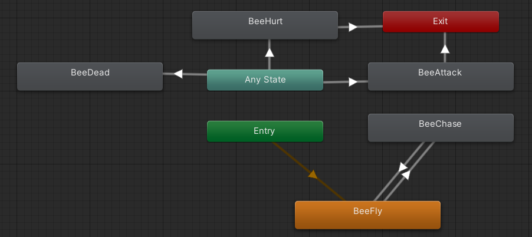

### 蜜蜂攻击实现

在Hierarchy窗口中，给Bee对象创建一个子对象`Attack Point`，默认取消勾选。

挂载组件`Capsule Collider 2D`

- 勾选Is Trigger。
- 把这个碰撞体移动到蜜蜂针尖，并调整到合适的大小

挂载组件`Attack (Script)`

- Damage ：10

修改BeeAttack动画，将攻击那几帧才勾选对象`Attack Point`。

### 蜜蜂死亡

在死亡动画的最后一帧，添加DestroyAfterAnimation


### 代码修改

创建`Scripts/Enemy/BeeChaseState.cs`

```c#
using System.Collections;
using System.Collections.Generic;
using UnityEngine;

public class BeeChaseState : BaseState
{
    private Attack attack;
    private Vector3 target; // 目标位置
    private Vector3 moveDir; // 移动方向

    private bool isAttack; // 是否在攻击
    private float attackRateCounter = 0; // 攻击间隔计数器
    public override void OnEnter(Enemy enemy)
    {
        currentEnemy = enemy;
        currentEnemy.currentSpeed = currentEnemy.chaseSpeed;
        attack = enemy.GetComponent<Attack>();

        currentEnemy.lostTimeCounter = currentEnemy.lostTime;
        currentEnemy.anim.SetBool("chase", true);

    }

    public override void LogicUpdate()
    {
        // 丢失玩家目标，回到巡逻状态
        if (currentEnemy.lostTimeCounter <= 0)
            currentEnemy.SwitchState(NPCState.Patrol);
        // 计时器
        attackRateCounter -= Time.deltaTime;

        // 目标为玩家所在的位置
        // 为什么要+1.5，因为玩家位置是在脚上，向上移动一段距离就才是玩家的中心位置
        target = new Vector3(currentEnemy.attacker.position.x, currentEnemy.attacker.position.y + 1.5f, 0);
        
        // 判断攻击距离
        if (Mathf.Abs(target.x - currentEnemy.transform.position.x) <= attack.attackRange && Mathf.Abs(target.x - currentEnemy.transform.position.y) <= attack.attackRange)
        {
            // 攻击
            // 蜜蜂停止移动
            isAttack = true;
            // 修复蜜蜂被玩家攻击不击退的bug
            if (!currentEnemy.isHurt)
                currentEnemy.rb.velocity = Vector2.zero;

            if (attackRateCounter <= 0)
            {
                currentEnemy.anim.SetTrigger("attack");
                attackRateCounter = attack.attackRange;
            }
        }
        else  // 超出攻击范围
        {
            isAttack = false;
        }
        moveDir = (target - currentEnemy.transform.position).normalized;
        
        if (moveDir.x > 0)
            currentEnemy.transform.localScale = new Vector3(-1, 1, 1);
        if (moveDir.x < 0)
            currentEnemy.transform.localScale = new Vector3(1, 1, 1);
    }

    public override void PhysicsUpdate()
    {
        if (!currentEnemy.isHurt && !currentEnemy.isDead && !isAttack)
        {
            currentEnemy.rb.velocity = moveDir * currentEnemy.normalSpeed * Time.deltaTime;
        }
    }
    public override void OnExit()
    {
        currentEnemy.anim.SetBool("chase", false);
    }
    

}

```


修改`Bee.cs`

```c#
public class Bee : Enemy
{
    protected override void Awake()
    {
        base.Awake();
        patrolState = new BeePatrolState();
        // 添加新的状态
        chaseState = new BeeChaseState();
    }
}
```

