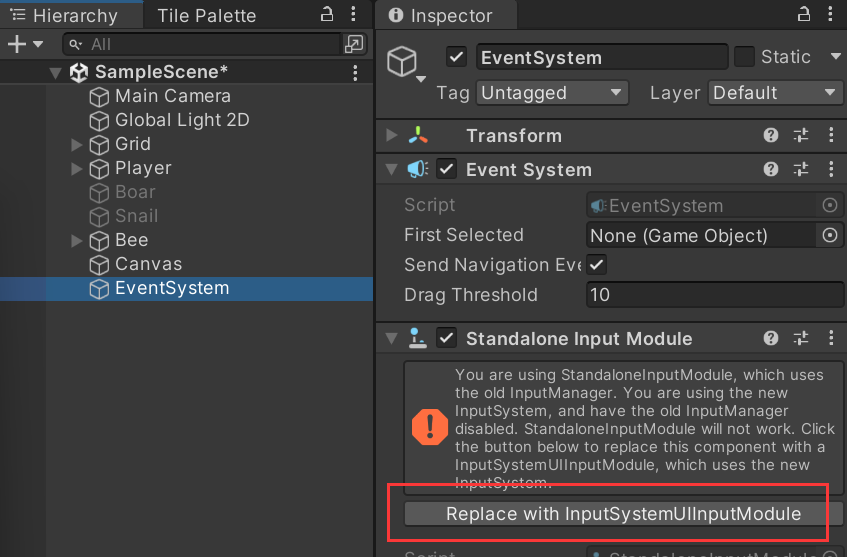
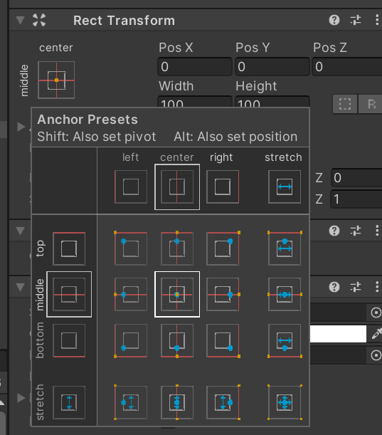
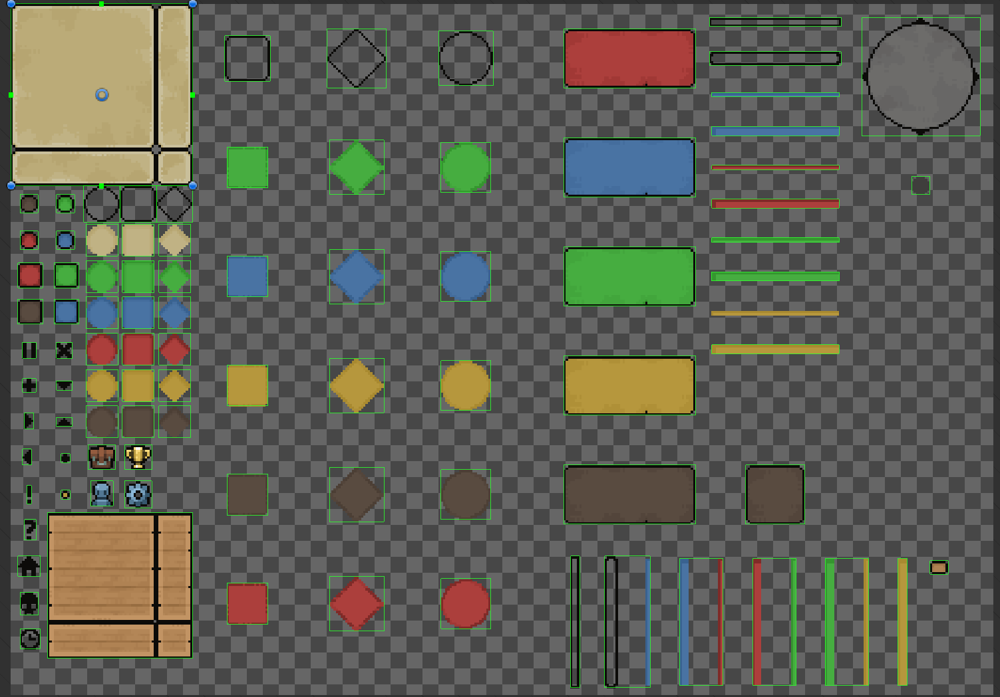
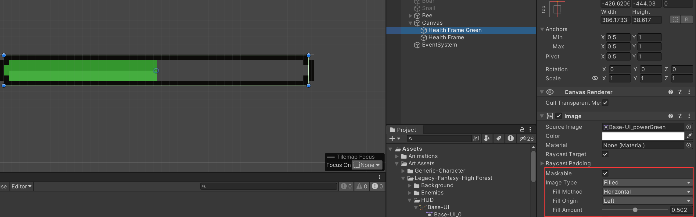
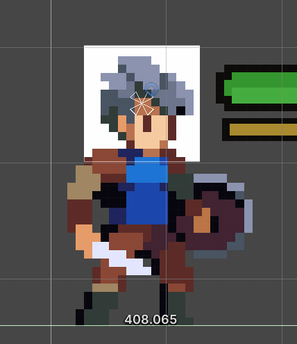
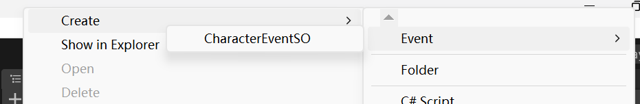
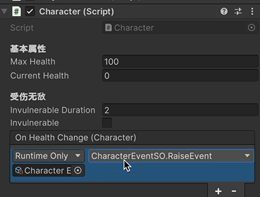
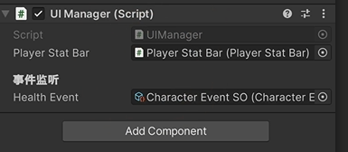

# 人物状态栏

## 1.创建人物状态栏

插件安装(可选)[Colourful Hierarchy Category GameObject | 实用工具 工具 | Unity Asset Store](https://assetstore.unity.com/packages/tools/utilities/colourful-hierarchy-category-gameobject-205934)

可以让hierarchy窗口更好看，安装后在`Assets/M Studio/Color Palette`中配置

### 添加canvas

右键Hierarchy，UI > Canvas，同时会帮你自动创建一个EventSystem

需要点击Replace with InputSystemUIInputModule



Actions Asset选择之前我们自己创建的PlayerInputControl

在Canvas的设置中，UI Scale Mode 选择 Scale With Screen Size，设置为1920 1080

在Game窗口中选择窗口大小为 Full HD (1920 x 1080)，这样比较方便开发

Match调整为0.5，有的屏幕宽度会十分宽，优先考虑高度还是宽度

Reference Pixels Per Unit修改为16


右键Canvas创建一个Image

可以给这个Image设置锚点位置，（以哪个点为 坐标 （0，0））



在这个窗口中，按住Alt + Shift点击可以把物体设置到锚点上。

### 切割素材

切割素材

素材在`Assets/Art Assets/Legacy-Fantasy-High Forest/HUD/Base-UI.png`

先自动切割，然后手动调整。



### 添加素材

然后再Image对象中选择Source Image，点击Set Native Size

这时候看到的这个框会很小，适当调大一些：参考宽X高为（400 x 40）

把这个对象更名为Health Frame

再创建一个类似的对象 Health Frame Green，用绿色的框

调整一下Hierarchy的顺序，不要让血条覆盖了边框。

实现血条增减的效果：

设置Health Frame Green

- Image Type ：Filled
- Fill Method ： Horizontal

可以拖动Fill Amount看看效果



创建对象 Health Frame Red类似Green

效果是人物受伤时，绿色瞬间减少，红色渐变减少

组织一下结构

```
Health Bar
 - Health Frame Red
 - Health Frame Green
 - Health Frame
```

制作能量条

复制一下Health Bar 粘贴为 Power Bar

```
Power Bar
 - Power Frame Yellow
 - Power Frame
```

制作头像框

创建

```
- Face Frame
  - Cut 
    - Face
```

Face随便选一张人物的代码

然后调整大小



选择Cut，添加组件Mask，取消勾选show mask graphic

再次调整结构

```
Player Stat Bar
 - Health Bar
 - Power Bar
 - Face Frame
```

最终效果


## 2.血量更新逻辑的实现

如果不熟悉如何调用组件中的参数，可以点击组件框右上角的`?`

### 血条变化相关的代码

创建脚本`Scripts/UI/PlayerStatBar`，挂载到物体 Player Stat Bar上

- 创建变量：
  - `public Image healthImage;` 绿色的血条
  - `public Image healthDelayImage;` 红色的血条, 渐变效果
  - `public Image powerImage;` 耐力条
- 在Update()中实现血条渐变的效果


```c#
// PlayerStatBar.cs
using System.Collections;
using System.Collections.Generic;
using UnityEngine;
using UnityEngine.UI;

public class PlayerStatBar : MonoBehaviour
{
    
    public Image healthImage;  // 绿色的血条
    public Image healthDelayImage;  // 红色的血条, 渐变效果
    public Image powerImage;  // 耐力条
    // 实现血条渐变
    private void Update()
    {
        if (healthDelayImage.fillAmount > healthImage.fillAmount)
        {
            healthDelayImage.fillAmount -= Time.deltaTime;
        }
    }
    /// <summary>
    /// 接收Health的变更百分比
    /// </summary>
    /// <param name="persentage">百分比: Current/Max</param>
    public void OnHealthChange(float persentage)
    {
        healthImage.fillAmount = persentage;
    }
}
```

要调用UI的相关组件，需要加载命名空间

```c#
using UnityEngine.UI;
```


分别给`Plyaer State Bar(Script)`定义的变量绑定上Hierarchy对应的组件。


### 数据传输中间件

现在要解决的问题是，当玩家掉血时，怎么把血量数值传给PlayerStatBar

血量在player 的 `Character (Script)`中

使用`Script Object`来控制数据的传送。

以`.asset`结尾的就是资产文件

创建

```
Scripts
  - ScriptableObject
    - CharacterEventSO.cs
```

> CharacterEventSO
>
> 传递Character 参数的事件：ScriptableObject
>
> 命名逻辑 Character (要传递的参数) + Event + SO (Scriptable Object)

使用的也是订阅者模式。只不过订阅的方式完全采用代码的方式

```c#
// CharacterEventSO.cs
using System.Collections;
using System.Collections.Generic;
using UnityEngine;
using UnityEngine.Events;

// 继承ScriptableObject的话，脚本就不能挂载为组件了，但是会生成资产文件
[CreateAssetMenu(menuName = "Event/CharacterEventSO")]
public class CharacterEventSO : ScriptableObject
{
    // 当事件被调用时
    public UnityAction<Character> OnEventRaised;
    
    // 通过这个函数方法启动
    public void RaiseEvent(Character character)
    {
        OnEventRaised?.Invoke(character);
    }
}

```

添加菜单选项

```c#
[CreateAssetMenu(menuName = "Event/CharacterEventSO")]
```

在Project窗口中右键就能看到了。




### 使用事件机制

创建

```
Assets
  - Events
    - Character Event SO.asset  # 我们刚刚创建的CharacterEventSO资产
```

希望当character脚本中，player血量发生变化时，就调用CharacterEventSO把血量变化的数据传送到UI中。

修改`Scripts/General/Character.cs`

```c#
public class Character : MonoBehaviour
{
    // 初始化事件
    public UnityEvent<Character> OnHealthChange;
    // public UnityEvent<Transform> OnTakeDamage;
    // 初始血量，通知一下
    private void Start()
    {
        currentHealth = maxHealth;
        OnHealthChange?.Invoke(this);
    }
    // 血量变化时，通知一下
    public void TakeDamge(Attack attacker)
    {
        // ...
        // 血量变化后，发送通知
        OnHealthChange?.Invoke(this);
    }
}
```

然后在Character中就可以绑定对应的事件了



绑定的就是`CharacterEventSO`

在Hierarchy中创建总管UI的 UI Manager对象

创建

```
Scripts/
  - UI/
    - UIManager.cs
```

将脚本挂载到UI Manager组件上

```c#
// UIManager.cs
using System.Collections;
using System.Collections.Generic;
using UnityEngine;

public class UIManager : MonoBehaviour
{
    public PlayerStatBar playerStatBar;
    [Header("事件监听")]
    public CharacterEventSO healthEvent;
    
    private void OnEnable()
    {
        // 注册
        healthEvent.OnEventRaised += OnHealthEvent;
    }
    
    private void OnDisable()
    {
        // 注销
        healthEvent.OnEventRaised -= OnHealthEvent;
    }
    
    private void OnHealthEvent(Character character)
    {
        // 血条百分比
        var percentage = character.currentHealth / character.maxHealth;
        // 传递给UI中的血条
        playerStatBar.OnHealthChange(percentage);
    }
}

```

> UIManager就相当于一个中间件，控制数据的流动
>
> Character 中将数据传到 UIManger，UIManager再传给UI

配置好`UI Manager (Script)`的参数

