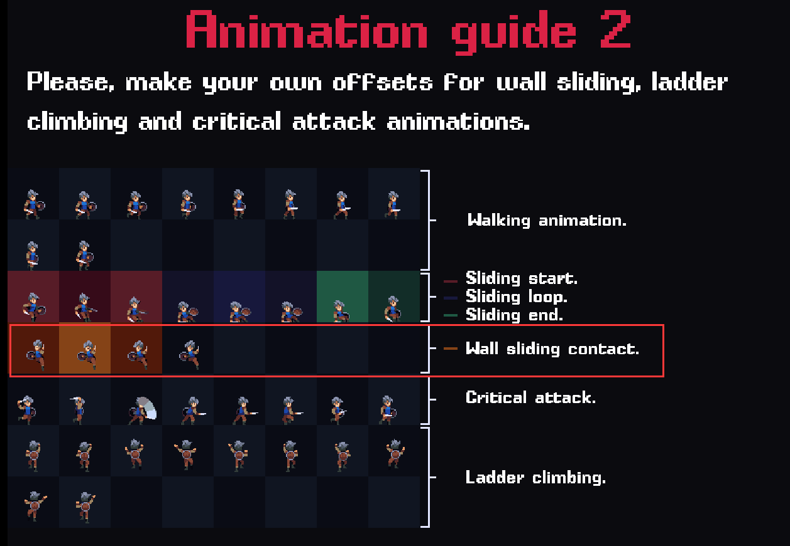
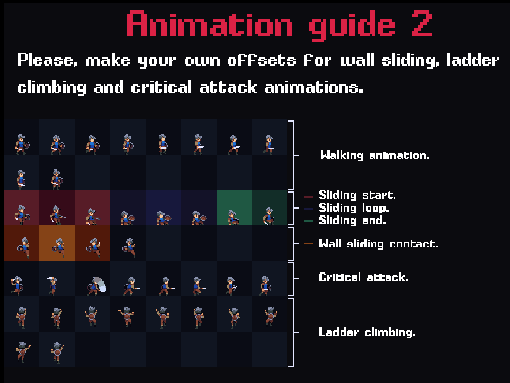

# Player 人物特殊动作

## 滑墙及蹬墙跳

### 动画制作



#### 创建动画

创建`Assets\Animations\Player\BlueWallSlide.anim`，设置

- Samples：7

> 当人物向下滑动时，可以只要一帧动画。不要循环播放

#### 动画参数

- onWall: bool

#### 动画连接

`Jump` → `BlueWallSlide`，**瞬间转移**

- 条件 onWall = true

`BlueWallSlide` → `BlueLand`，**瞬间转移**

- 条件 onWall = false
- 条件 isGround = true

注意：这里需要修改Jump动画进入的条件，否则动画会一直在跳跃和爬墙之间来回切换

`AnyState` → `Jump`

- 添加条件 onWall = false


### 修改代码


修改`General/PhysicsCheck.cs`

回忆之前写的代码，人物有一个是否撞墙的碰撞检测属性

`PhysicsCheck.touchRightWall`

```csharp
public class PhysicsCheck : MonoBehaviour
{
    // 添加代码
    private PlayerController playerController;
    private Rigidbody2D rb;
    [Header("检测参数")]
    // 放在 manual 下方
    public bool isPlayer;
    
    [Header("状态")]
    // 最下方添加新属性
    public bool onWall;
    
    private void Awake()
    {
        // 在coll下方
        rb = GetComponent<Rigidbody2D>();
        
        // 最下方添加   
        if (isPlayer)
            playerController = GetComponent<PlayerController>();
    }
    
    public void Check()
    {
        // 修改地面检测的代码，当在墙上时，碰撞检测要往上一点
        if (onWall)
            isGround = Physics2D.OverlapCircle((Vector2)transform.position + new Vector2(bottomOffset.x * transform.localScale.x, bottomOffset.y), checkRadius, groundLayer);
        else
            isGround = Physics2D.OverlapCircle((Vector2)transform.position + new Vector2(bottomOffset.x * transform.localScale.x, 0), checkRadius, groundLayer);
        // 判断是否悬停在墙上
        if (isPlayer)
            onWall = (touchLeftWall && playerController.inputDirection.x < 0f || touchRightWall && playerController.inputDirection.x > 0f) && rb.velocity.y < 0f;
    }
}
```

注意，如果只这么做，如果人物面对着墙，但是没贴墙，只按了跳跃按钮。这时候人物会被判定为在墙上。

```csharp
onWall = (touchLeftWall || touchRightWall) && !isGround;
```

因此需要加一个判断，人物面向墙，且按钮按得与墙的方向一致，才算贴墙。

```csharp
onWall = (touchLeftWall && playerController.inputDirection.x < 0f || touchRightWall && playerController.inputDirection.x > 0f) && !isGround;
```

但这时还有一个BUG，同时按着方向键跳跃，人物的动画会卡住。

因为在上述条件中，由于按住了方向键起跳，导致onWall为true，无法进入Jump动画了。

因此可以修改条件，当人物跳跃到最高点，开始下落后，再进入贴墙状态。

最终，改为

```csharp
(...) && rb.velocity.y < 0f;
```

记得修改人物面板的Bottom Offset，的Y，之前是0，现在改成0.1

目的是为了让人物在贴墙时，检测点往上一点。

调整人物向下滑的速度

修改`Player/PlayerController.cs`

```csharp
public class PlayerController : MonoBehaviour
{
    [Header("基本参数")]
    // 放在 jumpForce下面
    public float wallJumpForce;
    
    [Header("状态")]
    public bool wallJump;

    private void CheckState()
    {
        // 实现贴墙滑落时，下降速度变慢。在末尾添加
        if(PhysicsCheck.onWall)
            rb.velocity = new Vector2(rb.velocity.x, rb.velocity.y / 2f);
        else
            rb.velocity = new Vector2(rb.velocity.x, rb.velocity.y);
        
        if (wallJump && rb.velocity.y < 0f)
            wallJump = false;
    }
    
    private void Jump(InputAction.CallbackContext obj) 
    {
        // 整体修改
        if (physicsCheck.isGround) 
        {
            rb.AddForce(transform.up * jumpForce, ForceMode2D.Impulse);
        }
        else if (physicsCheck.onWall)
        {
            rb.AddForce(new Vector2(-inputDirection.x, 2f) * wallJumpForce, ForceMode2D.Impulse);
            wallJump = true;
        }
    }
    public void Move() 
    {
        // 修改人物移动的条件 使得人物在蹬墙跳的时候，键盘输入无法让人物移动
        if (!isCrouch && !wallJump){
            rb.velocity
        }
    }
}
```


修改`Player/PlayerAnimation.cs`内

```c#
public class PlayerAnimation : MonoBehaviour
{
    
    public void SetAnimation() 
    {
        // 在最下方添加
        anim.SetBool("onWall", physicsCheck.onWall);
    }
}
        
```


## 滑铲的逻辑和动画的实现



观察sliding那一行。

### 制作动画

#### 创建动画

创建动画，采样率均设置为14,10

- 创建 `Assets\Animations\Player\BlueSlideStart.anim`

- 创建 `Assets\Animations\Player\BlueSlideLoop.anim` 

创建`Slide Layer` ，权重调整为1，在新的Layer中制作这个动画。

然后将BlueSlideStart和BlueSlideLoop拖拽进去

#### 动画参数

创建动画参数：

- `isSlide` bool

#### 动画连接

`New State` → `BlueSlideStart`，**瞬间转移**

- 条件`isSlide=true`

`BlueSlideStart` → `BlueSlideLoop`，**播放后转移**

- 条件`isSlide=true`

`BlueSlideLoop` → `Exit`，**瞬间转移**

- 条件 `isSlide=false`

### 设置按键

`Settings/Input System/PlayerInputControl`

添加新Action Slide，绑定按键

- 键鼠的 K 键
- 手柄的 Left Shoulder 键

### 修改代码

修改 `Player/PlayerController.cs`

一些要注意的点：

- 跳跃时要禁止滑铲
- 滑铲时可以跳跃打断，在跳跃的过程中，强制打断协程
- 贴墙判断，贴左墙，面朝右，要能滑铲。不注意很容易有BUG


```cs
public class PlayerController : MonoBehaviour
{
    private Character character;
    [Header("基本参数")]
    
    // 放在 hurtForce下面
    public float slideDistance;  // 推荐默认4.5
    public float slideSpeed;  // 推荐默认0.3
    public int slidePowerCost;  // 滑铲能量消耗，推荐5
    [Header("状态")]
    
    // 放在最下方
    public bool isSlide;
    
    private void Awake()
    {
        // 在GetComponent 的下方
        character = GetComponent<Character>();
        // 在Jump下方
        inputControl.Gameplay.Slide.started += Slide;
    }
    
    // 放到函数PlayerAttack()的下方
    private void Slide(InputAction.CallbackContext context)
    {
        if (!isSlide  && physicsCheck.isGround && character.currentPower>=slidePowerCost)
        {
            isSlide = true;
            var targetPos = new Vector3(transform.position.x + slideDistance * transform.localScale.x, transform.position.y);
            // 将Player的层修改跟敌人一样，这样就没有碰撞体积了。
            gameObject.layer = LayerMask.NameToLayer("Enemy");
            // 开启协程
            StartCoroutine(TriggerSlide(targetPos));
            
            character.OnSlide(slidePowerCost);
        }
    }
    
    // 在协程实现人物滑动
    private IEnumerator TriggerSlide(Vector3 target)
    {

        do
        {
            yield return null;
            // 滑动到悬崖外面就停止
            if (!physicsCheck.isGround)
                break;
            // 滑动到左墙或者右墙就停止
            if (physicsCheck.touchLeftWall && transform.localScale.x < 0f || physicsCheck.touchRightWall && transform.localScale.x > 0f )
            {
                break;
            }
            
            // 朝着目标点移动
            // 使用自带的移动函数，告诉body持续不断地移动到哪里
            rb.MovePosition(new Vector2(transform.position.x + transform.localScale.x * slideSpeed, transform.position.y));
        } while (MathF.Abs(target.x - transform.position.x) > 0.1f);
        isSlide = false;
        gameObject.layer = LayerMask.NameToLayer("Player");
    }

    private void Jump(InputAction.CallbackContext obj) 
    {
        if (physicsCheck.isGround) 
        {
            // 在最下方添加
            // 停止所有协程
            isSlide = false;
            StopAllCoroutines();
        }
    }
    private void CheckState()
    {
        if (isDead || isSlide)
            gameObject.layer = LayerMask.NameToLayer("Enemy");
        else
            gameObject.layer = LayerMask.NameToLayer("Player");
    }
}
```


>  `yield break`与`break`有什么区别？
>
> yield break是退出一整个协程，while后面的代码都不执行了。

修改 `Player/PlayerAnimation.cs`

```csharp
public class PlayerAnimation : MonoBehaviour
{
    public void SetAnimation() 
    {
        anim.SetBool("isSlide", playerController.isSlide);
    }
}
```


修改`Character.cs`

主要实现能量条的变化

```csharp

public class Character : MonoBehaviour
{
    [Header("基本属性")]
    public float maxPower;  // 15
    public float currentPower;
    public float powerRecoverSpeed;  // 1.2
    
    private void Start()
    {
        currentPower = maxPower;
    }
    private void Update()
    {
        // 最下方添加
        // 实现不断回复能量
        if (currentPower < maxPower)
        {
            currentPower += Time.deltaTime * powerRecoverSpeed;
        }
    }
    // 创建新的函数，实现滑铲时消耗能量
    public void OnSlide(int cost)
    {
        currentPower -= cost;
        OnHealthChange?.Invoke(this);  // 把能量条变化的数值传递出去
    }
}
```

修改`UI/PlayerStatBar.cs`

```c#
public class PlayerStatBar : MonoBehaviour
{
    // 在参数列表的最上方
    private Character currentCharacter;
    // 在参数列表的最下方
    private bool isRecovering;
    
    private void Update()
    {
        
        if (isRecovering)
        {
            float persentage = currentCharacter.currentPower / currentCharacter.maxPower;
            powerImage.fillAmount = persentage;
            
            if (persentage >= 1)
            {
                isRecovering = false;
                return;
            }
        }
    }

    // 新增函数
    public void OnPowerChange(Character character)
    {
        isRecovering = true;
        currentCharacter = character;
    }
    
}
```

修改`UI/UIManager.cs`

```cs
// UIManager.cs
public class UIManager : MonoBehaviour
{
    private void OnHealthEvent(Character character)
    {
        // 最下方
        playerStatBar.OnPowerChange(character);
    }
}

```

