# 1.摄像机跟随及攻击抖动实现

在Window > Package Manager中安装Cinemachine插件

​	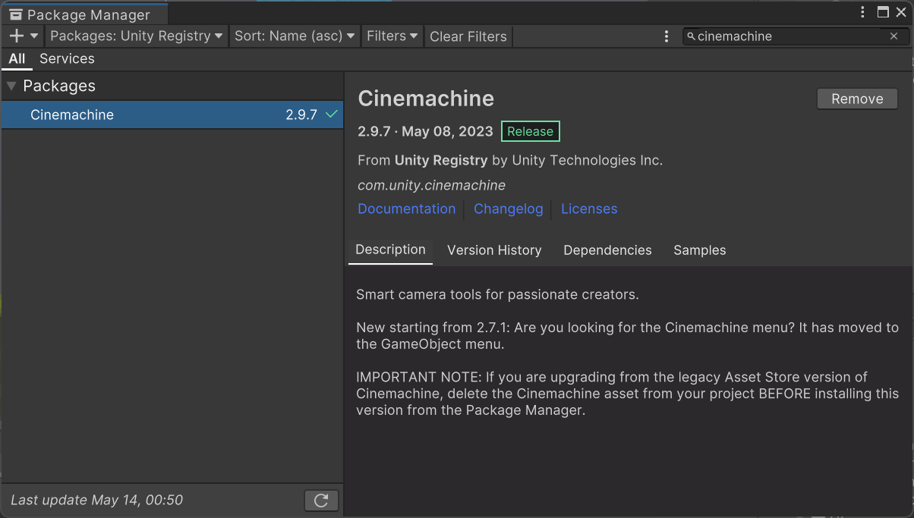

安装好后，在Hierarchy窗口中的加号中可以选择2D Camera


把Player对象拖拽到Virtual Camera中的Follow 和Look At，就成功创建了一个最简单的摄像机跟随玩家的效果。

可以调整Body下的Tracked Object Offset 更改位置

可以调整 Deed Zone，Dead Zone的效果是，当人物在小范围内移动时，摄像机不跟随。超出移动范围后摄像机才跟随。

可以在Add Extension中添加额外的摄像机扩展，示例的拓展如下：

- Cinemachine Pixel Perfect：像素旋转时不会扭曲，保持单位像素
- CinemachineConfiner2D：设置摄像机的边界
  - 创建一个新的Object 命名为Bounds，并为其添加Polygon Collider2D组件。勾选Is Trigger
  - 将Bounds拖拽到该扩展的 Bounding Shape 2d

## 通过代码获取场景边界

先为Bounds对象添加一个Tag，命名为Bounds

创建代码文件 `Utilities/CameraControl.cs`

将该代码挂载到Virtual Cinema上

```cs
using System.Collections;
using System.Collections.Generic;
using Cinemachine;
using UnityEngine;

public class CameraControl : MonoBehaviour
{
    private CinemachineConfiner2D confiner2D;

    private void Awake()
    {
        confiner2D = GetComponent<CinemachineConfiner2D>();
    }

    private void GetNewCameraBounds()
    {
        var obj = GameObject.FindGameObjectWithTag("Bounds");
        if (obj == null)
            return;
        confiner2D.m_BoundingShape2D = obj.GetComponent<Collider2D>();
    }
}

```

注意这里还需要点击一个Invalidate Cache按钮

>强制清除缓存，作用是从一个场景切换到另一个场景时，需要清除一下缓存，这样才能让该扩展使用新的形状

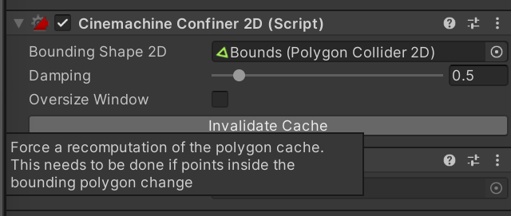

现在，删除插件中的Bounding Shape 2D，运行游戏，查看是否能自动找到Bounds

## 摄像机震动反馈

添加新插件Cinemachine Impulse Listener，勾选Use 2D Distance

需要一个振动源，监听事件

创建新Object ：Camera Shake，为该对象添加插件Cinemachine Impulse Source。

可以在Game模式下测试震动，个人测试，选Impulse Shape Explosion，X 0.2，Y -0.2比较合理。

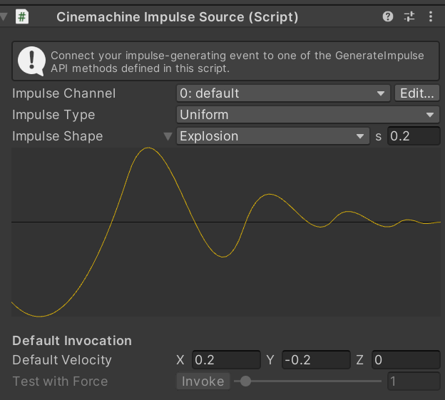

通过代码设置攻击时震动

使用GenerateImpulse方法调用震动。

修改`Utilities/CameraControl.cs`

```cs
public class CameraControl : MonoBehaviour
{
    // 获取插件Cinemachine Impulse Source
    public CinemachineImpulseSource impulseSource;
}
```

拖拽Camera Shake到 Virtual Camera的Camera Control组件上。

创建脚本 `ScriptableObject/VoidEventSO`

```cs
using UnityEngine;
using UnityEngine.Events;

[CreateAssetMenu(menuName = "Event/VoidEventSO")]
public class VoidEventSO : ScriptableObject
{
    public UnityAction OnEventRaised;

    public void RaiseEvent()
    {
        OnEventRaised?.Invoke();
    }
}
```

在Project中的Events，右键创建一个新的EventSO，命名为CameraShake Event

在Player对象上的On Take Damage上，添加新的监听事件，把CameraShake Event SO拖过去。

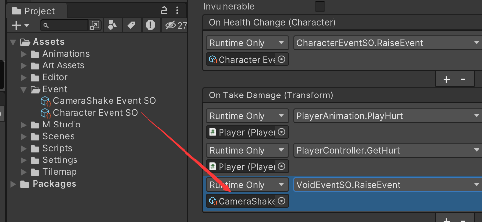

给敌人添加的方式一样。这样敌人掉血也会震动。我这里只给野猪添加了。

上面完成了广播，下面实现监听。在`CameraControl.cs`中

```cs
public class CameraControl : MonoBehaviour
{

    // 添加事件
    public VoidEventSO cameraShakeEvent;
    
    private void OnEnable()
    {
        cameraShakeEvent.OnEventRaised += OnCameraShakeEvent;
	}
    private void OnDisable()
    {
        cameraShakeEvent.OnEventRaised -= OnCameraShakeEvent;
	}
    
    private OnCameraShakeEvent()
    {
        impulseSource.GenerateImpulse();
    }
}
```

把CameraShake Event拖拽到CameraControl组件上。

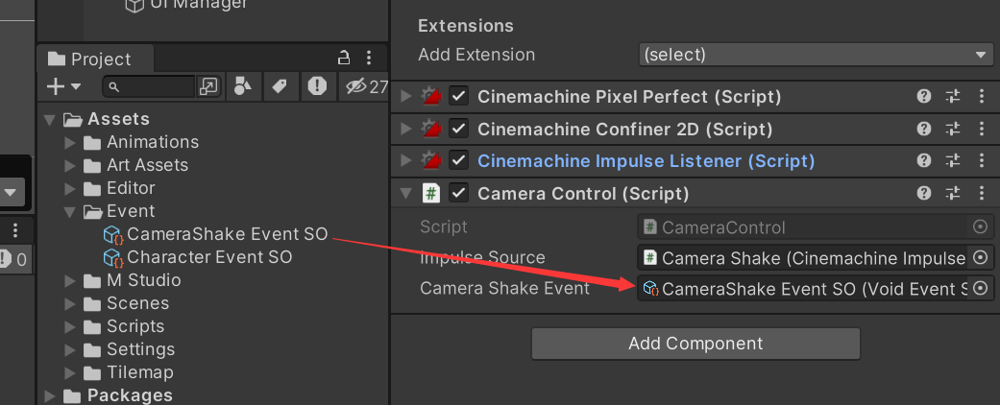

# 2.音源设置和音效播放

### 免费音乐音效下载

[FREE Casual Game SFX Pack | 音频 音效 | Unity Asset Store](https://assetstore.unity.com/packages/audio/sound-fx/free-casual-game-sfx-pack-54116)  攻击音效

[Free Casual Music Pack | 音频 音乐 | Unity Asset Store](https://assetstore.unity.com/packages/audio/music/free-casual-music-pack-242591) 背景音乐

在Windows > Package Manager中import到项目

创建`Assets/Audio`文件夹，把这两个音乐资源文件夹拖进去。最后就是

```
├── Audio
   ├── CasualGameSounds
   │   ├── DM-CGS-07  # 跳跃音效
   │   ├── DM-CGS-46  # 攻击音效
   │   └── DM-CGS-47  # 暴击音效
   └── FREE CASUAL MUSIC PACK
       └── BONUS 1 - EXTRA FULL TRACK
          └── TROPICAL GAME  # 背景音乐
```


### 创建音源

在Main Camera组件中，默认就有Audio Listener组件，这个组件可以理解为玩家的耳朵在游戏里的化身，表示摄像头走到哪里，就能听到哪。就比如说CS游戏里，你能听得见脚步一定是因为你的附近有人。

在我们这个游戏里，==我们需要创建Audio Source（音源）来播放音效==，这样耳朵 Audio Listener就能听见

首先，在Hierarchy中创建空物体 Audio Manager

在添加组件的地方搜索 Audio，可以看到很多和音频相关的组件，选择Audio Source 挂载到 Audio Manager上。一共挂载两个Audio Source，分别用于播放背景音乐和攻击等音效

- BGM的设置
  - Play On Awake ✅
  - Loop ✅
  - Volume ： 0.2
- FX的设置
  - Play On Awake ❌
  - Loop ❌


### 创建音频管理代码

创建`Scripts/Audio/AudioManager.cs`

并把这个代码挂载到Audio Manager上

```cs
using System.Collections;
using System.Collections.Generic;
using UnityEngine;
using UnityEngine.Audio;  // 导入Audio

public class AudioManager : MonoBehaviour
{
    [Header("事件监听")]
    public PlayAudioEventSO FXEvent;
    public PlayAudioEventSO BGMEvent;
    [Header("组件")]
    public AudioSource BGMSource;
    public AudioSource FXSource;
    
    private void OnEnable()
    {
        FXEvent.OnEventRaised += OnFXEvent;
        BGMEvent.OnEventRaised += OnBGMEvent;
    }
    private void OnDisable()
    {
        FXEvent.OnEventRaised -= OnFXEvent;
        BGMEvent.OnEventRaised -= OnBGMEvent;
    }
    
    private void OnFXEvent(AudioClip clip)
    {
        FXSource.clip = clip;
        FXSource.Play();
    }
    private void OnBGMEvent(AudioClip clip)
    {
        BGMSource.clip = clip;
        BGMSource.Play();
    }
}
```

手动为BGMSource和FXSource赋值，等创建下面的EventSO以后，为FX Event，BGM Event赋值

> 老师：实现游戏音乐音效的方式有很多，这里只是简单介绍了一下（说明老师教的方式可能只是基础入门，还远远不够）

### 实现攻击音效

对于跨物体传递变量的行为，需要使用ScriptableObject

比如说这个案例中，当玩家进行攻击时，Attack对象要告诉SO，发生了攻击事件！SO去通知音效管理器，该执行这个事件的响应了，音效管理器就去播放音效。


创建`Scripts/ScriptableObject/PlayAudioEventSO`

```cs
using System.Collections;
using System.Collections.Generic;
using UnityEngine;
using UnityEngine.Events;

[CreateAssetMenu(menuName = "Event/PlayAudioEventSO")]
public class PlayAudioEventSO : ScriptableObject
{
    public UnityAction<AudioClip> OnEventRaised;

    public void RaiseEvent(AudioClip audioClip)
    {
        OnEventRaised?.Invoke(audioClip);
    }
}

```

在Event下创建FX Audio Event SO和BGM Audio Event SO

在`Scripts/Audio/AudioDefination.cs` 用于标记播放哪个片段

```cs
using System.Collections;
using System.Collections.Generic;
using UnityEngine;

public class AudioDefination : MonoBehaviour
{
    public PlayAudioEventSO playAudioEvent;
    public AudioClip audioClip;  // 音频片段

    public bool playOnEnable;  // 是否是一开始就播放

    private void OnEnable() {
        if (playOnEnable)
            PlayAudioClip();
    }

    public void PlayAudioClip()
    {
        playAudioEvent.RaiseEvent(audioClip);
    }

}

```

分别把这个AudioDefination代码挂载到Attack Area的Attack1、Attack2、Attack3

把Event里的FX Audio Event SO拖到这个代码组件的Play Audio Event上

对Audio Clip设置音效。

都勾选Play On Enable，当这个物体一出现，就播放音效。（攻击动作一做出就播放）

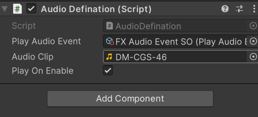

### 实现BGM

对于场景的背景音乐，创建一个BGM空对象

挂载Audio Defination，并为变量赋值

- Play Audio Event：BGM Audio Event SO
- Audio Clip：TROPICAL GAME
- Play On Enable：✅


### 学习Audio Mixer


如何打开：Window > Audio > AudioMixer，拖拽到Animation同级

创建`Assets/Settings/Audio Mixer/MainMixer`

点击MainMixer就可以看到音轨


在Groups右侧的加号添加新的子轨道，添加一个BGM、一个FX轨道

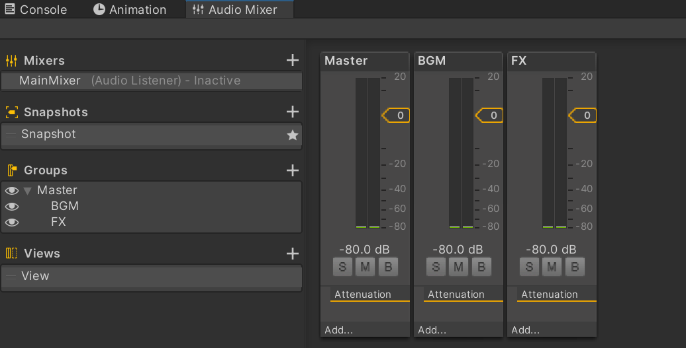

在AudioManager对象、Audio Source组件的Output变量中，选择对应的轨道。

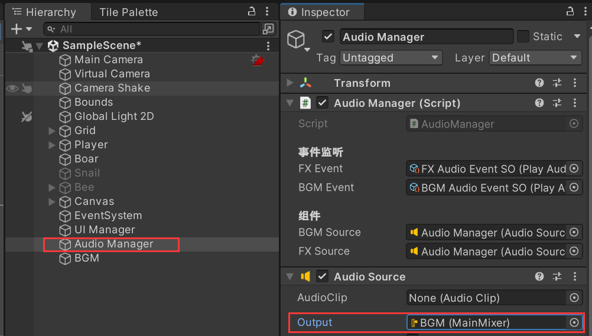

# 3.水和荆棘的逻辑实现

在Hierarchy中创建两个新的Tilemap，分别为Water（水）和Spike（荆棘）

都要挂载Tilemap Collider 2D组件，并且勾选 is Trigger

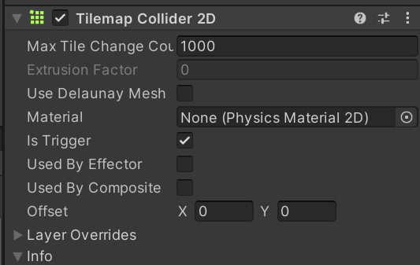

为了变成整体，需要添加 **Composite Collider 2D**组件

然后在**Timemap Collider 2D**组件中勾选 Used By Composite

并且添加新的标签，水的标签就是 Water

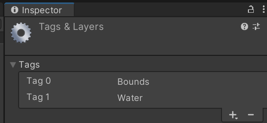

在Character.cs中编写人物碰到水就死的代码

```cs
    // 放到 TakeDamage前面
    private void OnTriggerStay2D(Collider2D other)
    {
        if (other.CompareTag("Water"))
        {
            // 死亡 更新血量
            currentHealth = 0;
            OnHealthChange?.Invoke(this);
            OnDie?.Invoke();
        }
    }
```


对于荆棘

直接在Spike上添加Attack 脚本，并设置伤害即可。

如何创建新的场景：在Project面板，`Assets/Scene`中右键，create scene即可。

记得设置Spike的TilemapCollider 2D组件的 Excule Layers 排除Enemy

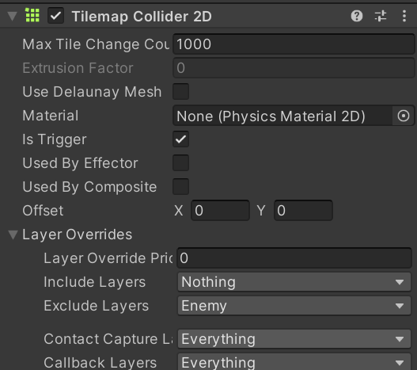
