# 1. 存储点及画面效果

## 存储点的素材

在`Art Assets/Legacy-Fantasy-High Forest/Map Assets/Prop-Rocks`

选择自动切分，然后调整一下切分细节

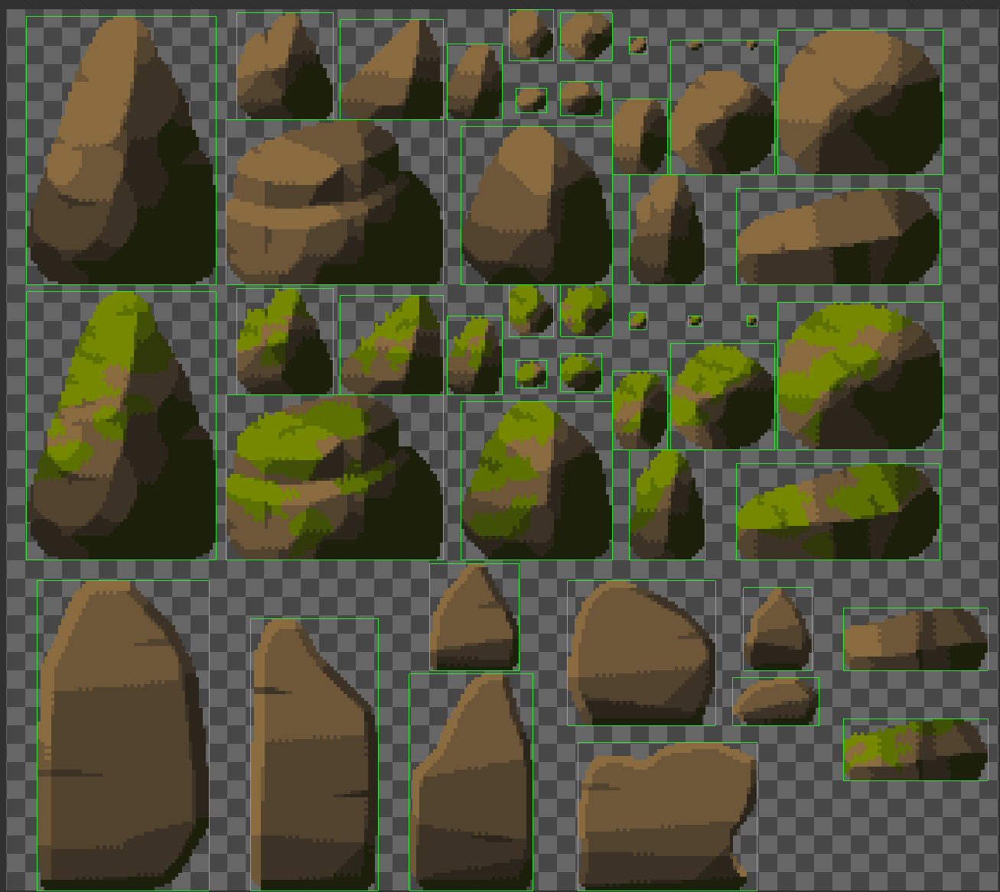

> 锚点位置选择在Bottom上

在`Assets/Art Assets/Legacy-Fantasy-High Forest/HUD`文件夹中有字符的文字`SignCharacters`

使用M作为存储点的文字，默认是黑色的，互动保存后，文字变亮。

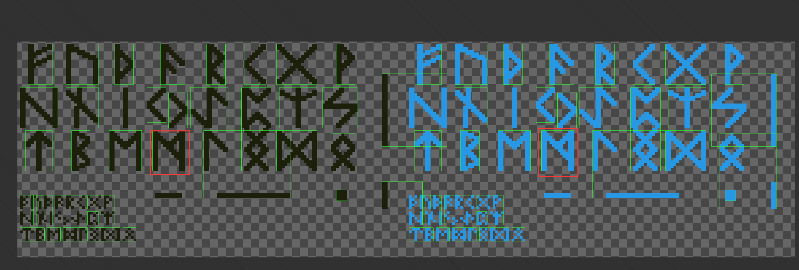


## 设置存储点石头

下面通过石头和文字的组合，构建一个保存点。

首先将石头素材直接拖拽到Hierachy，命名为Save Point Rock

- 将图层设置为 middle。
- 添加一个Box Collider并调整大小。记得勾选is Trigger
- 将字符素材添加为Save Point Rock的子物体。

> 这里只需要添加一个字符素材，当互动完成后，把黑色字符替换为亮的字符即可。

创建文件夹`Scripts/Save Load`

创建代码`Scripts/Save Load/SavePoint.cs`

```cs
// SavePoint.cs
using System.Collections;
using System.Collections.Generic;
using UnityEngine;

public class SavePoint : MonoBehaviour, IInteractable
{
    public SpriteRenderer spriteRenderer;
    public Sprite darkSprite;
    public Sprite lightSprite;

    public bool isDone;

    private void OnEnable() 
    {
        spriteRenderer.sprite = isDone ? lightSprite : darkSprite;
    }

    public void TriggerAction()
    {
        if (!isDone)
        {
            isDone = true;
            spriteRenderer.sprite = lightSprite;

            // TODO: 保存数据
            
            this.gameObject.tag = "Untagged";
        }
    }
}

```

记得配置该脚本的参数

## 灯光的设置

可以自己调整Global Light 2D看看效果（如果没有，可以自己添加）

可以单独增加灯光，点亮存储点的字体。

将Save Point Rock的子物体改名为Sign

在Sign下创建一个 Spot Light 2D子对象

可以自由玩一下这个东西

添加后处理效果

创建volume，BoxVolumn的作用是，当摄像机进入这个区域才起效果。

先在场景中创建一个Global Volumn

点击Profile的New创建一个新的Profile

点击Add Override可以添加特效。先添加一个Bloom特效，光晕效果

点击All启动它。

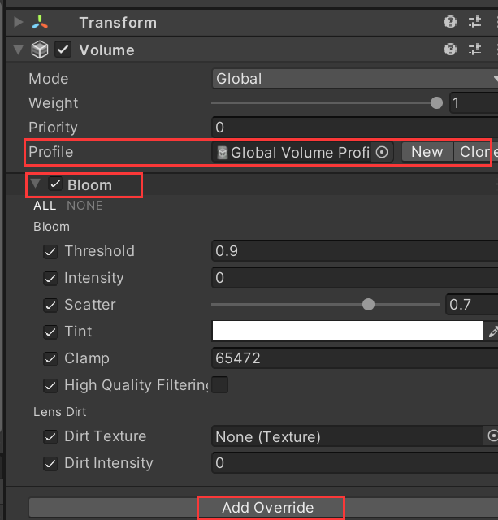

设置启动后处理效果

在Main Camera对象的Camera组件上的Rendering，勾选Post Processing

调整Global Volumn对象Bloom组件的Intensity参数，就可以看到泛光效果。

还可以添加Color Adjustments组件，里面可以调整各种曝光度、对比度等效果。

### 设置只有当激活保存点时才有光

修改`SavePoint.cs`

```cs
// SavePoint.cs
public class SavePoint : MonoBehaviour, IInteractable
{
    public GameObject lightObj;
    // public Sprite darkSprite;
    private void OnEnable() 
    {
        // spriteRenderer.sprite = isDone ? lightSprite : darkSprite;
        lightObj.SetActive(isDone);
    }
    public void TriggerAction()
    {
        if (!isDone)
        {
			// spriteRenderer.sprite = lightSprite;
            lightObj.SetActive(isDone);
            
        }
    }
}
```

### 添加Box Volumn

注意要想观察volumn有没有生效，要在Scene场景上面的工具栏中配置好Post Processing

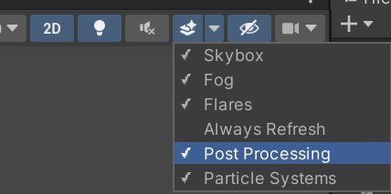

进入某个区域时更改效果。

比如进入一个区域后，整体画面变化。

Blend Distance: 表示的是3D场景中的距离，而Camera有-10的距离，所以至少要把Blend Distance设置为10。

然后在Scene窗口中，通过滑动鼠标中键，可以拉进拉远摄像头。这样就可以看到效果，镜头越近，Box Volumn的效果越明显。可以拉近一点镜头方便测试效果。


先点击Profile右侧的New，然后点击Add Override添加Color Adjustments的修改

- 设置亮度：Post Exposure

添加特效：Chromatic Aberration，设置畸变。等等

## 游戏保存的逻辑

修改`SavePoint.cs`

```cs
// SavePoint.cs
public class SavePoint : MonoBehaviour, IInteractable
{
    [Header("广播")]
    public VoidEventSO saveDataEvent;
    
    [Header("变量参数")]

    public void TriggerAction()
    {
        if (!isDone)
        {
            // TODO: 保存数据
            saveDataEvent.RaiseEvent();
        }
    }
}
```

在`Data SO/Event`中创建一个无参数的Event，命名为`LoadGameData Event`

在`Save Point Rock`中设置这个广播的SO

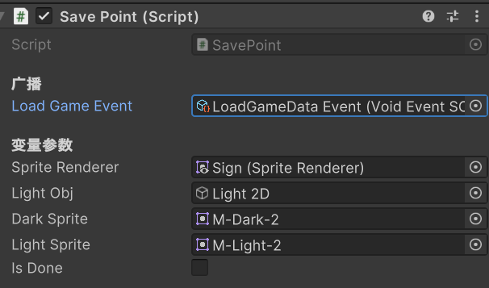

# 2. 数据结构及坐标保存加载

创建一个用于保存数据类型的类

创建脚本`Scripts/Save Load/Data.cs`

作为存储的数据类型

```cs
// Data.cs
using System.Collections;
using System.Collections.Generic;
using UnityEngine;

public class Data
{
    public Dictionary<string, Vector3> characterPosDict = new Dictionary<string, Vector3>();
}

```


用一个接口的方式标记所有需要存储的物体

创建接口脚本`Scripts/Save Load/ISaveable.cs`

在更新的Unity中使用了CSharp的新版（8.0），现在可以在接口中实现函数了（旧版不行）。

```cs
// ISaveable.cs
using System.Collections.Generic;
using UnityEngine;

// ISaveable.cs
public interface ISaveable
{
    // 当注册对象时，调用DataManager的方法把物体自己加入到DataManager内
    void RegisterSaveData()
    {
       DataManager.instance.RegisterSaveData(this);
    }
    // 如果只有一行可以这么写
    void UnRegisterSaveData() => DataManager.instance.UnRegisterSaveData(this);

    void GetSaveData();
    void LoadData();
}
```

在Persistent中创建一个名为Data Manager的物体，同时创建脚本`Scripts/Save Load/DataManager.cs`并挂载在该物体上。

这里DataManager的实现使用的单例设计模式，以及static语法。

其中，static声明了一个静态的对象，一个静态的对象会被一直存储在内存中。

```cs
// DataManager.cs
using System.Collections;
using System.Collections.Generic;
using UnityEngine;

public class DataManager : MonoBehaviour
{
    public static DataManager instance;
    private List<ISaveable> saveableList = new List<ISaveable>();
    
    private void Awake()
    {
        if (instance == null)
            instance = this;
        else
            Destroy(this.gameObject);
    }

    public void RegisterSaveData(ISaveable saveable)
    {
        if (!saveableList.Contains(saveable))
        {
            saveableList.Add(saveable);
        }
    }

    public void UnRegisterSaveData(ISaveable saveable)
    {
        saveableList.Remove(saveable);
    }
}

```

### 保证对象唯一性

使用GUID（Globally Unique Identifier）全局唯一标识符

创建脚本`Scripts/SaveLoad/DataDefination.cs`

```cs
using System.Collections;
using System.Collections.Generic;
using UnityEngine;

public class DataDefination : MonoBehaviour
{
    public PersistentType persistentType;
    public string ID;

    // 使用Unity内置的函数
    private void OnValidate() 
    {
        if (persistentType == PersistentType.ReadWrite)
        {
            if (ID == string.Empty)
                ID = System.Guid.NewGuid().ToString();
        }
        else
        {
            ID = string.Empty;
        }
    }
}

```

为了固定这个ID，在`Scripts\Utilities\Enums.cs`中新增新的枚举对象

```cs
// Enums.cs
// 添加
public enum PersistentType
{
    ReadWrite, DoNotPersist
}
```

但是我不理解为什么多家一层判断之后，就不会重新生成新的ID了。

### OnValidate的原理

`OnValidate`是Unity引擎提供的一种特殊的生命周期方法。这个方法仅在Editor模式下运行，即在你的Unity编辑器中，不在运行的游戏内。

`OnValidate`方法会在以下情况下被调用：

1. 在Inspector窗口中更改了脚本的公共变量。
2. 通过重置命令重置了脚本（选择 "Component" -> "Reset"）。
3. 在第一次加载脚本或创建脚本的实例时。

这意味着`OnValidate`方法主要用于校验和响应在编辑器中对脚本变量的更改。

### 保存坐标

修改代码

```cs
// ISaveable.cs
// ISaveable.cs
public interface ISaveable
{
    // 一定要获取一下ID
    DataDefination GetDataID();
    
}
```

修改代码

```cs
// Character.cs
// 继承可保存对象
public class Character : MonoBehaviour, ISaveable
{
    // 执行注册函数
    private void OnEnable()
    {
        // newGameEvent.OnEventRaised += NewGame;
        ISaveable saveable = this;
        saveable.RegisterSaveData();
    }

    private void DisEnable()
    {
        // newGameEvent.OnEventRaised -= NewGame;
        ISaveable saveable = this;
        saveable.UnRegisterSaveData();
    }

    public DataDefination GetDataID()
    {
        return GetComponent<DataDefination>();
    }
    
    public void GetSaveData(Data data)
    {
        // 如果已经有了这个ID
        if (data.characterPosDict.ContainsKey(GetDataID().ID))
        {
            data.characterPosDict[GetDataID().ID] = transform.position;
        }
        else
        {
            data.characterPosDict.Add(GetDataID().ID, transform.postition);
        }
    } 
    public void LoadData(Data data)
    {
        if (data.characterPosDict.ContainsKey(GetDataID().ID))
        {
            transform.position = data.characterPosDict[GetDataID().ID];
        }
    }
}

```

修改DataManager

```cs
// DataManager.cs
public class DataManager : MonoBehaviour
{
    // public static DataManager instance;
    [Header("事件监听")]
    public VoidEventSO saveDataEvent;
    
    private Data saveData;  // 保存临时数据，默认数据
    private void Awake()
    {
        // 放在最后
        saveData = new Data();
    }
    private void OnEnable() 
    {
        saveDataEvent.OnEventRaised += Save;
    }
    private void OnDisable() 
    {
        saveDataEvent.OnEventRaised -= Save;
    }
    public void Save()
    {
        foreach (var saveable in saveableList)
        {
            saveable.GetSaveData(saveData);
        }

        foreach (var item in saveData .characterPosDict)
        {
            Debug.Log(item.Key + "   " + item.Value);
        }
    }

    public void Load()
    {
        foreach (var saveable in saveableList)
        {
            saveable.LoadData(saveData);
        }
    }
}
```


修改

之前写错了，这里的事件应该是saveDataEvent

```cs
public class SavePoint : MonoBehaviour, IInteractable
{
    [Header("广播")]
    // public VoidEventSO LoadGameEvent;
    public VoidEventSO saveDataEvent;
}
```

在`./Data SO/Events`中创建一个无返回值的事件`SaveData Event`

> 确保Save Point Rock 和 DataManager都分别设置了 Save Data Event  

在所有的敌人预制体上都要挂载DataDefination脚本

注意如果一个场景有多个敌人，那么需要重新生成一个ID，否则ID都是一样的。


创建一个按键来读取游戏

```cs
using UnityEngine.InputSystem;

// DataManager.cs
public class DataManager : MonoBehaviour
{
    private void Update()
    {
        if (Keyboard.current.lKey.wasPressedThisFrame)
        {
            Load();
        }
    }
}
```

目前还有BUG，保存以后加载时血量没有加载

# 3. 人物数值及场景的保存加载

## 人物数值保存

希望存储更多，比如人物的血量、人物的power

修改代码

```cs
// Data.cs
public class Data
{
    // 新增
    public Dictionary<string, float> floatSavedData = new Dictionary<string, float>();
}

```

修改代码

```cs
// Character.cs
public class Character : MonoBehaviour, ISaveable
{
    public void GetSaveData(Data data)
    {
        // 如果已经有了这个ID
        if (data.characterPosDict.ContainsKey(GetDataID().ID))
        {
            data.characterPosDict[GetDataID().ID] = transform.position;
            data.floatSavedData[GetDataID().ID + "health"] = this.currentHealth;
            data.floatSavedData[GetDataID().ID + "power"] = this.currentPower;
        }
        else
        {
            data.characterPosDict.Add(GetDataID().ID, transform.position);
            data.floatSavedData.Add(GetDataID().ID + "health", this.currentHealth);
            data.floatSavedData.Add(GetDataID().ID + "power", this.currentPower);
        }
    } 
    public void LoadData(Data data)
    {
        if (data.characterPosDict.ContainsKey(GetDataID().ID))
        {
            transform.position = data.characterPosDict[GetDataID().ID];
            this.currentHealth = data.floatSavedData[GetDataID().ID + "health"];
            this.currentPower = data.floatSavedData[GetDataID().ID + "power"];
            // 通知UI更新
            OnHealthChange?.Invoke(this);
        }
    }
}
```

## 场景保存

修改代码

```cs
// Data.cs
public class Data
{
    // 新增
    public string sceneToSave;
    
    public void SaveGameScene(GameSceneSO savedScene)
    {
        sceneToSave = JsonUtility.ToJson(savedScene);
        Debug.Log(sceneToSave);
    }
    
    public GameSceneSO GetSavedScene()
    {
        var newScene = ScriptableObject.CreateInstance<GameSceneSO>();
        JsonUtility.FromJsonOverwrite(sceneToSave, newScene);
        
        return newScene;
        
    }
}

```


修改代码

```cs
// SceneLoader.cs
// 添加一个接口
public class SceneLoader : MonoBehaviour, ISaveable
{
    private void OnEnable()
    {
        // 末尾添加
        ISaveable saveable = this;
        saveable.RegisterSaveData();
    }
    
    private void OnDisable()
    {
        // 末尾添加
        ISaveable saveable = this;
        saveable.UnRegisterSaveData();
    }
    public DataDefination GetDataID()
    {
        return GetComponent<DataDefination>();
    }
    
    public void GetSaveData(Data data)
    {
        // 调用data执行保存场景的函数
        data.SaveGameScene(currentLoadedScene);
    }
    public void LoadData(Data data)
    {
        // 由于scene本身并不能获取自己的ID? 为什么这里要取player的ID？？
        var playerID = playerTrans.GetComponent<DataDefination>().ID;
        if (data.characterPosDict.ContainsKey(playerID))
        {
            positionToGo = data.characterPosDict[playerID];
            sceneToLoad = data.GetSavedScene();
            
            OnLoadRequestEvent(sceneToLoad, positionToGo, true);
        }
    }
}
```

记得挂载DataDefination组件并添加ID

在进行LoadData时，首先要判断一下要保存的数据是否已经存在，可以通过判断是否有Player来判断

# 4.制作游戏结束面板

在Main Canvas中创建一个Panel命名为`GameOver Panel`

> 注：Hierarchy中Persistent场景中的Canvas被重命名为Main Canvas了。

注意要删除Source Image，不然会有一个圆角矩形的图片，不能完整覆盖屏幕。

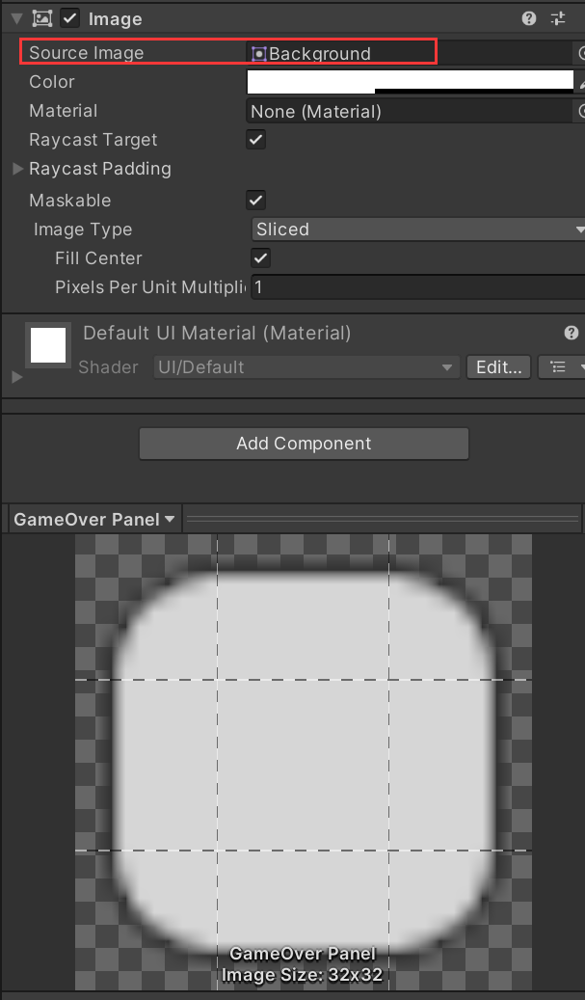

把Color调整为黑色，透明度适当调整，可以看到画面会变暗一些

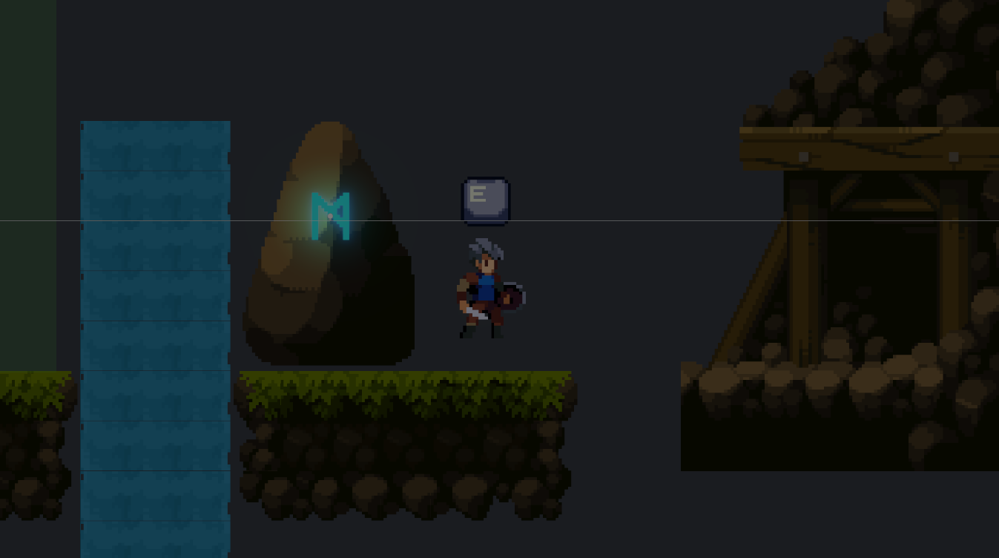

## 创建标题

在这个面板内创建Text - TextMeshPro，命名为`Title`

- 命名为GameOver
- 放在屏幕正中间
- 调整字体居中
- 设置字体大小（推荐120）
- 使用得意黑字体

> 点击放大放小的锚点以后，按住Alt键可以中心对称放大。

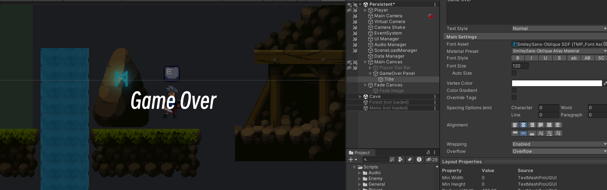

## 创建按钮

复制二个刚刚创建的Title，分别重命名为`Restart`和`Back to Menu`

字体大小修改为60，分别修改内容为“重新开始”，“离开”

为这两个Text分别添加Button组件

修改高亮、选中、按下的颜色。老师这里选了绿色和蓝色。

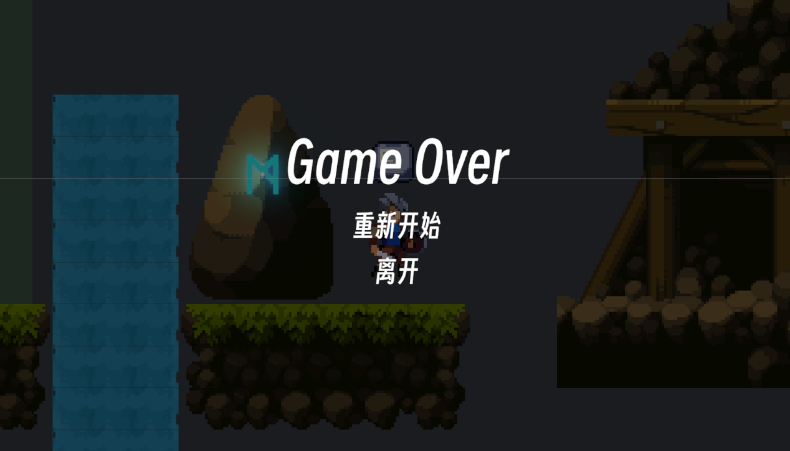

## 事件添加

将On Click()参数绑定 LoadData Event，执行RaiseEvent方法

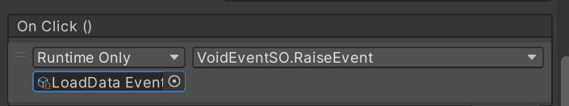

在DataManager中响应事件。

修改代码，监听LoadData事件

```cs
// DataManager.cs
public class DataManager : MonoBehaviour
{
    [Header("事件监听")]
    // public VoidEventSO saveDataEvent;
    public VoidEventSO loadDataEvent;

    private void OnEnable() 
    {
        // saveDataEvent.OnEventRaised += Save;
        loadDataEvent.OnEventRaised += Load;
    }
    private void OnDisable() 
    {
        // saveDataEvent.OnEventRaised -= Save;
        loadDataEvent.OnEventRaised -= Load;
    }
}
```

记得监听事件

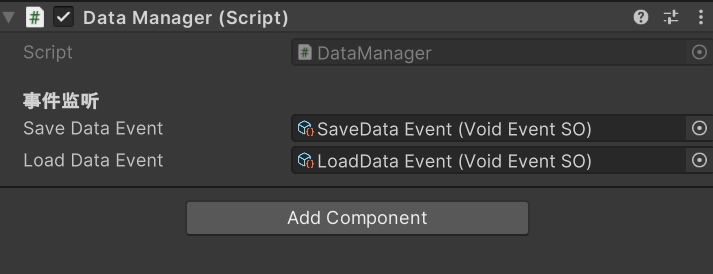

默认状态下，这个游戏结束面板是关闭的。

因此在事件OnDie发生后才启动这个面板。

在Player挂载的Character脚本的On Die()事件上添加

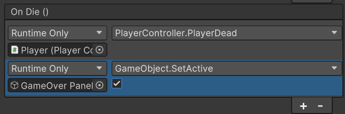

当点击面板中的按钮后，需要关闭面板。

首先在`Data SO/Events/`中创建新的无返回值事件，命名为`GameOver Event`

需要有个默认选中的按钮。

修改`UIManager.cs`

```cs
using UnityEngine.EventSystems;
// UIManager.cs
public class UIManager : MonoBehaviour
{
    // 修改变量名称
    // public SceneLoadEventSO loadEvent;
    public SceneLoadEventSO unloadedSceneEvent;
    // 创建新的事件监听方法
    public VoidEventSO loadDataEvent;
    public VoidEventSO gameOverEvent;
    
    [Header("组件")]
    public GameObject gameOverPanel;
    public GameObject restartBtn;
    
    private void OnEnable()
    {
        // 添加
        loadDataEvent.OnEventRaised += OnLoadDataEvent;
        gameOverEvent.OnEventRaised += OnGameOverEvent;
    }
    
    private void OnDisable()
    {
        // 添加
        loadDataEvent.OnEventRaised -= OnLoadDataEvent;
        gameOverEvent.OnEventRaised -= OnGameOverEvent;
    }

    private void OnGameOverEvent()
    {
        gameOverPanel.SetActive(true);
        // 设置默认激活的按钮
        EventSystem.current.SetSelectedGameObject(restartBtn);
    }

    private void OnLoadDataEvent()
    {
        gameOverPanel.SetActive(false);
    }
}
```

这样修改后，就不需要在character脚本里设置On Die的响应了。而是把函数调用改为触发游戏结束事件


> 在windows下按住F2即可全局修改名字

重新配置参数

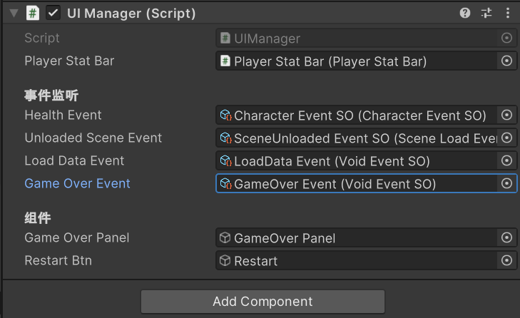

## 重新开始游戏

现在到这里有个BUG，点击重启游戏以后，人物还是躺着的状态。

修改

```cs
// PlayerController.cs

public class PlayerController : MonoBehaviour
{
    [Header("监听事件")]
    // 修改变量名
    public SceneLoadEventSO sceneLoadEvent;
    public VoidEventSO loadDataEvent;
    
    private void OnEnable()
    {
        // 最后添加
        loadDataEvent.OnEventRaised += OnLoadDataEvent;
    }
    private void OnDisable()
    {
        // 最后添加
        loadDataEvent.OnEventRaised -= OnLoadDataEvent;
    }
    
    // 放到OnLoadEvent下方 OnLoadEvent 也改为 OnSceneLoadEvent
    private void OnLoadDataEvent()
    {
        idDead = false;
    }
}
```

重新配置player物体上Player Controller脚本的Scene load Event和Load Data Event

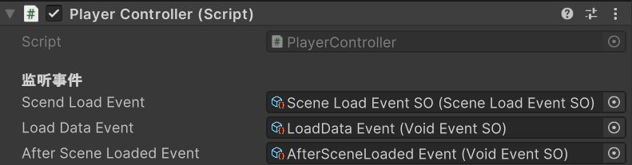

## 返回菜单

在`Data SO/Event/`创建一个无返回值事件，命名为`BackToMenu Event`，用于通知该返回菜单了。

添加到Back to Menu按钮的On Click事件上。

修改代码

```cs
// SceneLoader.cs
public class SceneLoader : MonoBehaviour, ISaveable
{
    [Header("事件监听")]
    // 添加
    public VoidEventSO backToMenuEvent;
    private void OnEnable()
    {
		// 添加
        backToMenuEvent.OnEventRaised += OnBackToMenuEvent;
    }
    
    private void OnDisable()
    {
        // 添加
        backToMenuEvent.OnEventRaised -= OnBackToMenuEvent;
    }
    private void OnBackToMenuEvent()
    {
        sceneToLoad = menuScene;
        loadEventSO.RaiseLoadRequestEvent(sceneToLoad, menuPosition, true);
    }
}
```

为SceneLoader进行变量赋值


> 到这里还有两个BUG：
>
> - 人物还是死亡状态
> - Game Over页面没有关闭

修改代码

```cs
// UIManager.cs
public class UIManager : MonoBehaviour
{
    [Header("事件监听")]
    public VoidEventSO backToMenuEvent;
    private void OnEnable()
    {
        // 注意这里添加的是 OnLoadDataEvent
        // 注册
        backToMenuEvent.OnEventRaised += OnLoadDataEvent;
    }
    
    private void OnDisable()
    {
        // 注销
        backToMenuEvent.OnEventRaised -= OnLoadDataEvent;
    }
}
```

之前在这个脚本下写的方法

```cs
    private void OnLoadDataEvent()
    {
        gameOverPanel.SetActive(false);
    }
```

意思是当回到菜单时，也把game over面板关闭。

同样修改代码

```cs
// PlayerController.cs
public class PlayerController : MonoBehaviour
{
    [Header("监听事件")]
    public VoidEventSO backToMenuEvent;
    private void OnEnable()
    {
        // 注意这里添加的是 OnLoadDataEvent
        // 注册
        backToMenuEvent.OnEventRaised += OnLoadDataEvent;
    }
    
    private void OnDisable()
    {
        // 注销
        backToMenuEvent.OnEventRaised -= OnLoadDataEvent;
    }
}
```

记得配置变量：

- UIManager 
- Player → Player Controller

然后还是存在两个BUG：

- OnDie被反复多次执行，无法关闭Game Over面板
- 解决上面的BUG回到初始界面后，人物又能移动了。

修改代码

```cs
// Character.cs
public class Character : MonoBehaviour, ISaveable
{
    private void OnTriggerStay2D(Collider2D coll)
    {
        if (coll.CompareTag("Water"))
        {
            // 修复BUG1
            if (currentHealth > 0)
            {
                // 死亡 更新血量
                currentHealth = 0;
                OnHealthChange?.Invoke(this);
                OnDie?.Invoke();
            }

        }
    }
}
```

修改

```cs
// PlayerController.cs
public class PlayerController : MonoBehaviour
{
    private void Awake()
    {
        
        // 将OnEnable()中的代码删除，加在Awake()最后
        inputControl.Enable();
    }
}
```


## 完善continue

给Continue按钮绑定 Load Data Event

## BUG修复

突然Unity抽风报错

```
NullReferenceException: Object reference not set to an instance of an object
ISaveable.RegisterSaveData () (at Assets/Scripts/Save Load/ISaveable.cs:11)
Character.OnEnable () (at Assets/Scripts/General/Character.cs:45)
```

经过代码诊断，发现

```cs
    void RegisterSaveData()
    {
        if (DataManager.instance == null) {
            Debug.LogError("DataManager.instance is null!");
            return;
        }
        DataManager.instance.RegisterSaveData(this);
    }
```

会报错

```
DataManager.instance is null!
```

解决方案，把DataManager挂载的脚本卸下来又重新装上去了

# 5.序列化保存数据文件

## 安装插件

首先在Package Manager中安装插件，选择Add package from git URL

```
com.unity.nuget.newtonsoft-json
```

## 实现序列化

修改代码，`DataManger.cs`知识点：

- 最优先执行这个脚本
- Unity自带的文件路径确定方法

```cs
// DataManger.cs
using System.IO;
using Newtonsoft.Json;

[DefaultExecutionOrder(-100)]
public class DataManager : MonoBehaviour
{
    // private Data saveData;
    private string jsonFolder;
    
    private void Awake()
    {
        // 放在最后
        jsonFolder = Application.persistentDataPath + "/SAVE DATA/";
        ReadSavedData();
    }
    // 修改函数
    public void Save()
    {
        foreach (var saveable in saveableList)
        {
            saveable.GetSaveData(saveData);
        }

        var resultPath = jsonFolder + "data.sav";
        var jsonData = JsonConvert.SerializeObject(saveData);
        
        if (!File.Exists(resultPath))
        {
            Directory.CreateDirectory(jsonFolder);
        }
        File.WriteAllText(resultPath, jsonData);
        // foreach (var item in saveData .characterPosDict)
        // {
        //     Debug.Log(item.Key + "   " + item.Value);
        // }
    }
    // 添加函数
    private void ReadSavedData()
    {
        var resultPath = jsonFolder + "data.sav";
        if (File.Exists(resultPath))
        {
            var stringData = FileSecurity.ReadAllText(resultPath);

            var jsonData = JsonConvert.DeserializeObject<Data>(stringData);

            saveData = jsonData;
        }
    }
}
```

在Edit → Project Setting → Script Execution Order中也可以设置

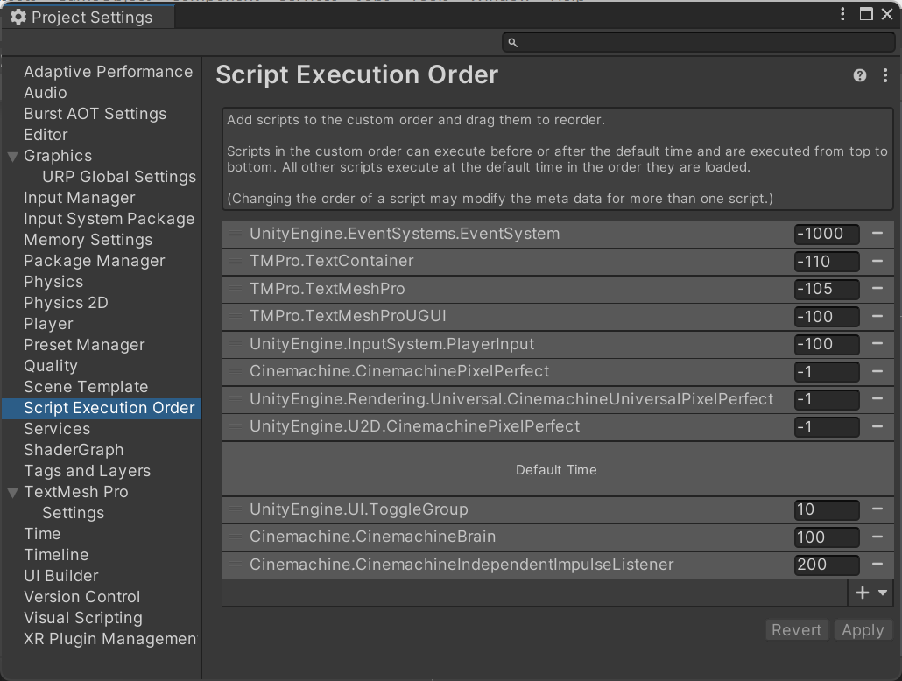

 项目名字的设定

Edit → Project Setting → Player

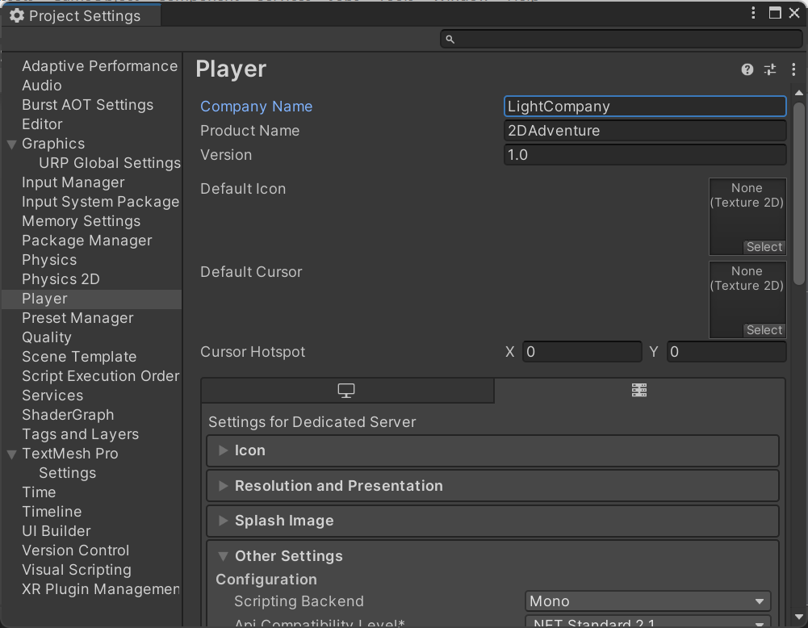

修改代码

```cs
// Data.cs
public class Data
{
    // 修改代码
    public Dictionary<string, SerializeVector3> characterPosDict = new Dictionary<string, SerializeVector3>();
}

// 创建一个新类
public class SerializeVector3
{
    public float x, y, z;
    // 输入 new SerialzeVector3(pos) 时会调用下面的函数
    public SerializeVector3(Vector3 pos)
    {
        this.x = pos.x;
        this.y = pos.y;
        this.z = pos.z;
    }
    
    public Vector3 ToVector3()
    {
        return new Vector3(x, y, z);
    }
}
```

对应地，修改代码

```cs
// Character.cs
public class Character : MonoBehaviour, ISaveable
{
    public void GetSaveData(Data data)
    {
        if (data.characterPosDict.ContainsKey(GetDataID().ID))
        {
            data.characterPosDict[GetDataID().ID] = new SerializeVector3(transform.position);
        }
        else
        {
            data.characterPosDict.Add(GetDataID().ID, new SerializeVector3(transform.position));
        }
    }
    public void LoadData(Data data)
    {
        if (data.characterPosDict.ContainsKey(GetDataID().ID))
        {
            transform.position = data.characterPosDict[GetDataID().ID].ToVector3();

        }
    }
}
```

修改代码

```cs
// SceneLoader.cs
public class SceneLoader : MonoBehaviour, ISaveable
{
    public void LoadData(Data data)
    {
        if (data.characterPosDict.ContainsKey(playerID))
        {
			// 修改代码
            var pos = data.characterPosDict[playerID].ToVector3();
        }
    }
}
```

