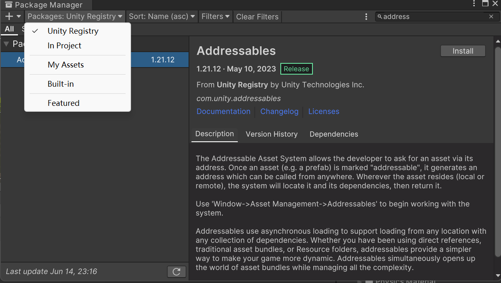
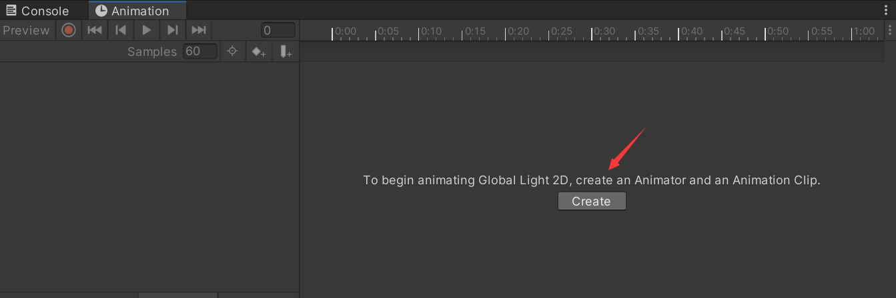
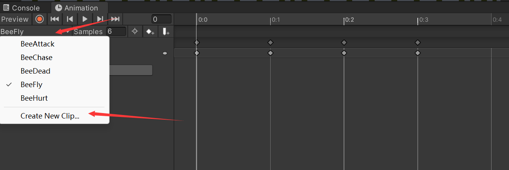
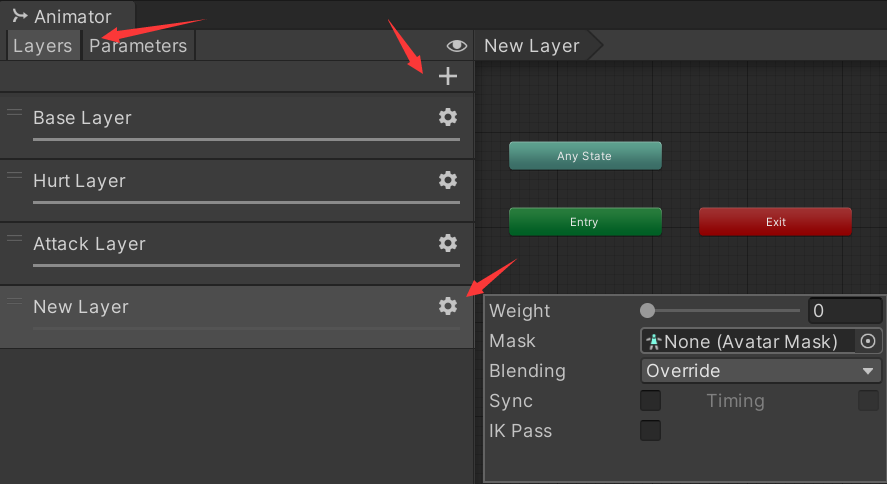
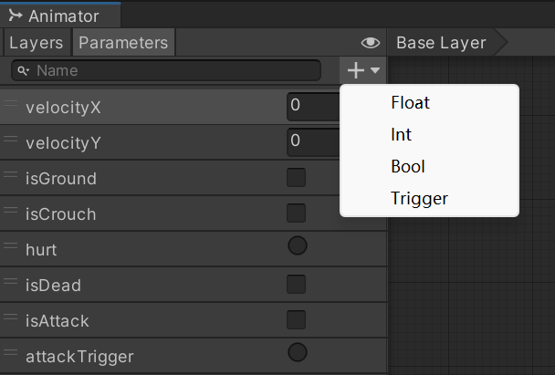

发现有很多常用的操作，直接在这里记录一下

# 常规

## 安装插件

Unity界面顶部菜单栏：Window → Package Manager

如果搜不到你要的插件，可以调整下这里




# 动画

## 动画创建

在Hierarchy窗口里选中某一个物体，可以给它创建动画。

在Animation窗格中，如果是空的状态，则点击Create创建动画



如果已经有动画了，则先点击Preview下方的下拉菜单，再点击`Create New Clip`，创建动画。



## 创建动画Layer

在Animator窗口中点击Layers，然后点击加号创建新的Layer

点击新的Layer标签的右上角齿轮可以设置Layer的参数



## 动画参数设置

在Animator窗口中的Parameters选项卡内。

共有4中参数类型



## 动画连接设置

### 瞬间转移

参数设置：

- `Has Exit Time` : ❌
- `Fixed Duration` : ❌
- `Transition Duration` : 0

这个是实验性质的json参数，因为我觉得像动画窗格里的参数，是可以通过代码设置的。

```json
{
    name = "瞬间转移",
    params = {
        "hasExitTime" = false,
        "fixedDuration" = false,
        "transitionDuration" = 0
    }
}
```

### 播放后转移

参数设置：

- `Has Exit Time`：✅
- `Exit Time`：1
- `Fixed Duration` : ❌
- `Transition Duration` : 0

# 按键

## 新增按键

双击Project窗口中的`Settings/Input System/PlayerInputControl`

在Actions栏的右上角点击加号创建新的Action

然后点击 No Binding 设置按键绑定


看情况是否勾选`Keyboard&Mouse`

