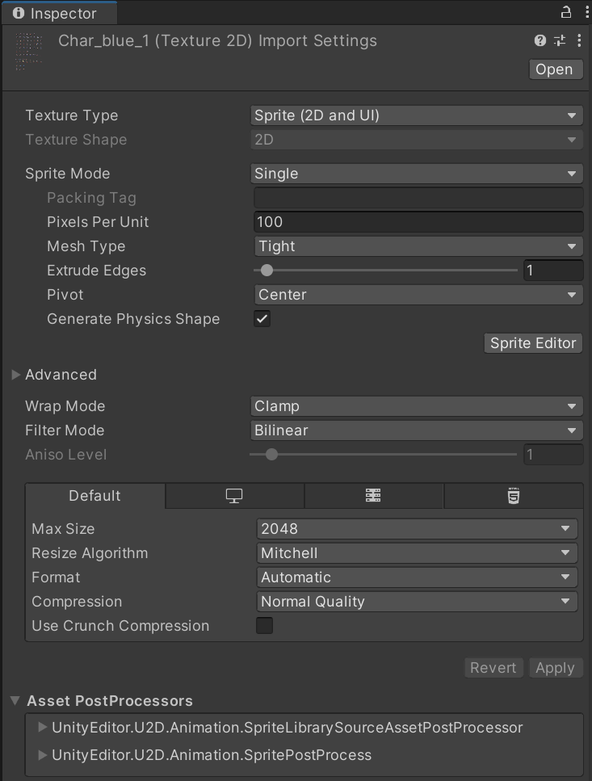

发现有很多常用的操作，直接在这里记录一下

# 常规

## 安装插件

Unity界面顶部菜单栏：Window → Package Manager

如果搜不到你要的插件，可以调整下这里


# 动画

## 动画创建

在Hierarchy窗口里选中某一个物体，可以给它创建动画。

在Animation窗格中，如果是空的状态，则点击Create创建动画


如果已经有动画了，则先点击Preview下方的下拉菜单，再点击`Create New Clip`，创建动画。


## 创建动画Layer

在Animator窗口中点击Layers，然后点击加号创建新的Layer

点击新的Layer标签的右上角齿轮可以设置Layer的参数


## 动画参数设置

在Animator窗口中的Parameters选项卡内。

共有4中参数类型


## 动画连接设置

### 瞬间转移

参数设置：

- `Has Exit Time` : ❌
- `Fixed Duration` : ❌
- `Transition Duration` : 0

这个是实验性质的json参数，因为我觉得像动画窗格里的参数，是可以通过代码设置的。

```json
{
    name = "瞬间转移",
    params = {
        "hasExitTime" = false,
        "fixedDuration" = false,
        "transitionDuration" = 0
    }
}
```

### 播放后转移

参数设置：

- `Has Exit Time`：✅
- `Exit Time`：1
- `Fixed Duration` : ❌
- `Transition Duration` : 0

# 按键

## 新增按键

双击Project窗口中的`Settings/Input System/PlayerInputControl`

在Actions栏的右上角点击加号创建新的Action

然后点击 No Binding 设置按键绑定


看情况是否勾选`Keyboard&Mouse`

# 快捷键

Ctrl + D 在Hierachy窗口中复制一个object

拖动对象时，按住ctrl可以按照一定的格子拖动对象

更改碰撞体大小时：按住`ALT`键可以固定中心轴更改碰撞体大小。先点击碰撞体调整的锚点，然后再按Alt

# 理解

图片素材Inspector窗口的理解



**Texture Type**：可以根据需求设置图片的类型。如果你正在制作一个2D游戏，那么可以选择"Sprite (2D and UI)"。这个选项可以让你的图片用作2D游戏元素或用户界面元素。

这个参数用于确定Unity如何处理和渲染纹理。例如：

- “Default”类型通常用于3D模型，
- “Sprite (2D and UI)”类型用于2D游戏和UI元素
- "Normal Map"类型用于创建法线贴图以增强3D模型的表面细节。

选择哪个纹理类型取决于你打算如何使用这个纹理。

**Sprite Mode**：对于2D游戏，这个选项通常设置为"Single"或"Multiple"。"Single"是指这个图片只有一个Sprite，而"Multiple"是指这个图片包含多个Sprite。

**Pixels Per Unit**：这个参数决定了图片的大小。比如，如果你设置Pixels Per Unit为100，那么在Unity世界中，100像素的图片宽度或高度就等于1个Unity世界单位。如果你正在制作一个像素风格的游戏，你可能需要调整这个参数以适应你的像素艺术风格。

**Mesh Type**：此参数只在Texture Type设置为“Sprite (2D and UI)”时出现。它决定了Unity如何生成Sprite的网格（Mesh）。有两个选项，“Tight”和“Full Rect”。“Tight”会在Sprite的可见部分周围生成一个最小的网格，这可以节省内存和提高性能，但可能会导致Sprite边缘出现锯齿。“Full Rect”会生成一个矩形网格，覆盖整个Sprite，这可以保持Sprite边缘的平滑，但可能会占用更多的内存和性能。

**Extrude Edges**：这个参数决定了Sprite的边缘应该被扩展多少像素。这可以防止在渲染时出现脱离边缘的问题，特别是在使用"Point (no filter)"滤波模式时。

**Pivot**：这个参数决定了Sprite的**旋转**和**缩放**的中心点在哪里。你可以选择预设的点（如"Center", "Top Left"等），也可以自定义点的位置。

**Generate Physics Shape**：勾选这个选项会让Unity自动生成Sprite的物理形状，这个物理形状将被用于物理碰撞检测。如果你打算使用Unity的物理系统（如刚体或碰撞器）来处理Sprite的物理交互，那么你应该勾选这个选项。

Advanced

**Wrap Mode**：这个参数决定了当纹理坐标超出[0,1]范围时，纹理如何被映射到物体上。

- "Repeat"选项会重复纹理
- "Clamp"选项会延续纹理的边缘像素。

对于大多数Sprite，你应该选择"Clamp"选项，除非你想要Sprite的纹理在某个方向上重复。

**Filter Mode**：这个参数决定了当图片被缩放时，如何处理图片的像素。对于像素风格的游戏，你通常会选择"Point (no filter)"，这样图片缩放时，像素边缘保持锐利，不会被平滑处理。

**Compression**：这个参数决定了图片如何被压缩以减少内存占用。对于像素风格的游戏，你可能需要选择较低的压缩等级，以保持像素艺术的清晰度。

