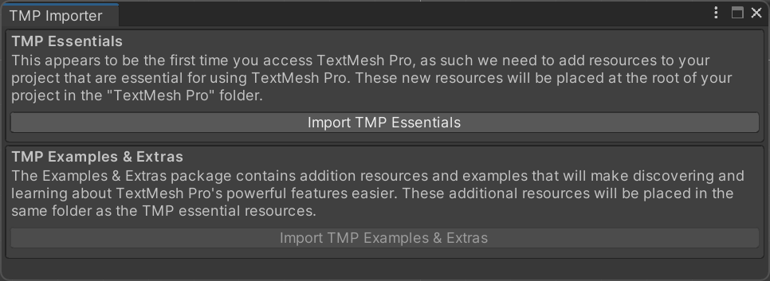
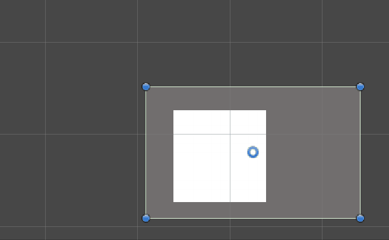

[4-锚点的拉伸功能_哔哩哔哩_bilibili](https://www.bilibili.com/video/BV1Y24y167P8?p=6&vd_source=749681a84bf35b829e9cf9decdaf2f2b)

### 新建GUI物体

右键在Hierarchy新建一个UGUI的物体，会自动创建一个Canvas附带你选的物体


在新项目第一次创建UGUI物体时，会弹出下面的提示框



>This appears to be the first time you access TextMesh Pro, as such we need to add resources to your project that are essential for using TextMesh Pro. These new resources will be placed at the root of your project in the "TextMesh Pro" folder.
>
>这似乎是您首次使用TextMesh Pro，因此我们需要向您的项目添加一些使用TextMesh Pro所必需的资源。这些新资源将被放置在项目的根目录下的"TextMesh Pro"文件夹中。

点击 **Import TMP Essentials** 即可

导入后，可以选择是否导入示例

> The Examples & Extras package contains addition resources and examples that will make discovering and learning about TextMesh Pro's powerful features easier. These additional resources will be placed in the same folder as the TMP essential resources.
>
> 除了基本的TextMesh Pro资源外，Unity还提供了一个额外的资源和示例包。这个包含了一些展示TextMesh Pro功能的示例场景、项目或其他资源。通过这些示例，您可以更快速地了解和掌握TMP的各种特性和用法。

为了学习，可以导入。

### 设置字体

这里选择[得意黑 Smiley Sans](https://atelier-anchor.com/typefaces/smiley-sans)

下载下来是一个压缩包 `smiley-sans-v1.1.1.zip`

解压后

```
|- smiley-sans-v1.1.1/
  |- SmileySans-Oblique.otf
  |- SmileySans-Oblique.otf.woff2
  |- SmileySans-Oblique.ttf
  |- SmileySans-Oblique.ttf.woff2
```

> 💡提示
>
> 下载的字体文件中包含了几种不同的文件格式，每种格式都有其特定的用途和特点：
>
> 1. **.otf (OpenType Font)**
>    - **用途**：OpenType 是一种开放的字体格式，支持很多先进的排版功能，如连字、替代字符等。
>    - **特点**：它基于 PostScript 的字符描述，常用于专业的图形设计和排版工作。
>
> 2. **.ttf (TrueType Font)**
>    - **用途**：TrueType 是另一种常见的字体格式。
>    - **特点**：它基于曲线技术来描述字符形状，且兼容性很好，是Windows和Mac操作系统中常见的字体格式。
>
> 3. **.woff2 (Web Open Font Format 2)**
>    - **用途**：WOFF2 是一种专为网页设计的字体格式。它是 WOFF 的继任者，用于在网页上嵌入字体。
>    - **特点**：WOFF2 提供了更高的压缩效率，从而更快地加载页面。
>
> 您下载的目录中包含了两种基本的字体格式（OTF和TTF）以及它们对应的Web字体格式（WOFF2）。如果您要在桌面应用程序或图形设计软件中使用此字体，那么您可能需要使用 `.otf` 或 `.ttf` 文件。如果您计划在网页中使用此字体，则可能需要使用 `.woff2` 文件。

可以在项目目录创建一个 `Asset/Fonts`文件夹，专门用于存放字体文件。

将**后缀为 ttf 的文件**放到该文件夹下。

右键该文件，create → TextMeshPro → FontAsset

## Canvas

在Unity中，`Canvas`组件是用于渲染UI元素的组件。它有许多属性和参数，其中一些关键的参数的作用如下：

1. **Render Mode**：这决定了Canvas是如何被放置和渲染的。
    - **Screen Space - Overlay**：Canvas会覆盖在所有的场景对象之上，与摄像机位置或旋转无关。
    - **Screen Space - Camera**：Canvas被放置在摄像机前面的特定距离处。这允许有一个3D效果，当摄像机移动或旋转时，UI会随之改变。这个模式需要指定一个摄像机作为`Render Camera`。
    - **World Space**：Canvas会被视为场景中的一个普通3D对象。这允许你在3D世界中放置UI元素，如3D文本或标签。

2. **Pixel Perfect**：当这个选项被勾选时，Canvas将会尝试确保UI元素在渲染时保持像素完美，不会出现模糊。这特别适用于像素艺术风格的游戏。

3. **Sort Order**：这决定了当有多个Canvas时，哪个Canvas首先被渲染。一个较低的排序值意味着该Canvas会被先渲染，而一个较高的值意味着它会被渲染在其他Canvas之上。这在处理UI层级时非常有用。

4. **Target Display**：当你有多个显示器或屏幕时，这个选项允许你选择Canvas应该显示在哪个屏幕上。

`Additional Shader Channels` 是在 Unity 的 `Canvas` 组件中的一个设置，它允许你定义额外的信息通道，这些通道会被送入 UI 的顶点数据中。这对于那些需要额外顶点信息来实现特殊效果的自定义着色器特别有用。

以下是可用的额外着色器通道选项：

1. **TexCoord1**：为顶点数据添加第二组UV坐标。
2. **TexCoord2**：为顶点数据添加第三组UV坐标。
3. **TexCoord3**：为顶点数据添加第四组UV坐标。
4. **Normal**：为顶点数据添加法线信息。这对某些光照或反射效果可能是必需的。
5. **Tangent**：为顶点数据添加切线信息。这在实现某些效果，如法线贴图，时可能是必要的。

通常，在标准的UI渲染中不需要这些额外的通道。但是，当你使用特定的自定义着色器来增强或改变UI的外观时，它们可能会非常有用。这些通道使得着色器可以接收更多的信息来执行复杂的操作或效果。如果你不使用这些额外的通道，那么不必担心这些设置；只有当你确实需要它们时才去使用。

## 锚点和中心点

在Unity的UGUI系统中，当你在场景视图中选择一个`Raw Image`或其他UI元素时，你会看到一些可视化的标记和工具，帮助你编辑和定位该元素。以下是你描述的元素的解释：

1. **四个白色小三角箭头**：
    - 这些是用于调整UI元素的矩形变换（`RectTransform`）的“锚点”（Anchors）。锚点定义了UI元素如何相对于它的父容器进行定位和缩放。例如，如果锚点被设置在父容器的右上角，那么无论父容器的大小如何变化，UI元素都会保持在那个位置。

2. **四个顶点上的实心小蓝点**：
    - 这些代表`RectTransform`的四个角。你可以通过拖动这些小蓝点来调整UI元素的大小。

3. **中间的空心蓝圈**：
    - 这是`RectTransform`的“中心点”或“轴心点”。当你旋转UI元素时，它会围绕这个点进行旋转。你也可以拖动这个点来移动整个UI元素。

调整Pivot可以更改中心点的位置

这些工具提供了一个直观的方式来在场景视图中调整UI元素的位置、大小和旋转。当你习惯了它们，你会发现它们在快速布局和调整UI时非常有用。

每个使用`RectTransform`的UI元素都有锚点（Anchors）。锚点决定了UI元素如何响应其父容器的大小和位置的变化。理解和正确设置锚点是UGUI布局中非常关键的一步，特别是当你希望UI在不同的屏幕尺寸和分辨率上都能良好地显示时。

锚点的主要用途：
1. **定位**：锚点定义了UI元素与父容器之间的相对位置关系。
2. **自适应**：当父容器的大小改变时，锚点决定了UI元素如何调整其大小和位置。

> **以父元素左上角为锚点的案例**：当父元素变化时，子UI元素按照锚点来跟随变化。白色背景的子元素的锚点在父元素的左上角，当父元素更改时，子元素永远相对于父元素的右上角移动。



锚点的性质：

- 锚点有4个
- 4个锚点与节点的4个顶点的距离保持不变
- 锚点聚合可以固定当前节点在父节点中的位置
- 锚点分离可以使节点适配屏幕的大小

**锚点预设中的几个基础设置及其含义：**

1. **Stretch**：UI元素会拉伸以适应父容器的整个宽度和高度。这意味着如果父容器的尺寸发生变化，UI元素也会随之改变其尺寸。
2. **Left**：UI元素的左边缘与父容器的左边缘对齐。
3. **Center**：UI元素会相对于父容器居中。
4. **Right**：UI元素的右边缘与父容器的右边缘对齐。

除了这些基础设置，你还会发现组合设置，如“Top Left”或“Bottom Right”，它们分别将UI元素定位在父容器的左上角和右下角。

- 按住shift，会同时将物体的中心点按照预设修改
- 按住alt，会同时将物体移动

**为什么要设置不同的锚点位置？**

1. **布局的灵活性**：根据你的设计需要，你可能希望某些UI元素始终位于屏幕的某个特定位置，例如顶部、底部、左侧或右侧。
2. **自适应设计**：在多种屏幕尺寸和分辨率上，你可能希望UI元素的大小和位置能够自适应地进行调整。通过正确设置锚点，你可以确保UI元素在不同的环境中都能正确地显示。
3. **界面动态调整**：在某些情况下，你可能希望根据玩家的选择或游戏的状态动态地改变UI的布局。设置了正确的锚点后，你只需调整父容器的大小或位置，子元素就会自动进行适当的调整。

总之，锚点为Unity的UI系统提供了强大的布局和自适应工具。正确地使用锚点可以确保你的UI在所有情况下都能提供一致且高质量的体验。

在Unity的Scene窗口中，你所看到的正方形小格子构成了一个叫做“网格”（Grid）的可视化辅助工具。这个网格帮助开发者在场景中更准确地定位和排列对象。

1. **网格是什么？**
   - 网格是Scene窗口的一个可视化辅助工具，用于帮助开发者在场景中对齐和定位对象。它为开发者提供了一个参考，使得对象的放置更加直观和准确。
2. **如何调整这些小格子的大小？**
   - 默认情况下，网格的大小是固定的，主要用于3D空间的参考。在2D模式（如UI设计）中，你可能更关心“Snap”功能而非直接调整网格大小。
3. **如何让我的UI元素按照这些格子进行调整大小？**
   - Unity提供了一个叫做“Snap”的功能，允许你按照特定的间距移动、旋转或缩放对象。
   - 要使用Snap功能，首先确保你的对象已被选中，然后按住`Ctrl`（在Mac上是`Cmd`）键并拖动该对象。此时，对象的移动、旋转或缩放会按照Snap的设置进行。

注意：对于UI设计，由于其通常在2D空间中，所以Snap功能的使用可能不像在3D空间中那样直观。但是，这个功能仍然可以帮助你精确地定位和缩放UI元素。

[Unity - Manual: Grid snapping (unity3d.com)](https://docs.unity3d.com/Manual/GridSnapping.html)

在新版的Unity中，snap在scene窗口中设置


### RawImage组件

[7-RawImage组件_哔哩哔哩_bilibili](https://www.bilibili.com/video/BV1Y24y167P8?p=9&spm_id_from=pageDriver&vd_source=749681a84bf35b829e9cf9decdaf2f2b)

Raycast Target：是否会挡住鼠标点击（如果图片后面有个按钮，点击按钮就无法触发效果）

Raycast Padding：可以点击的区域，数值越大，可点击范围越小。

UV Rect ：相当于图片裁剪，X=0.2，就相当于往外边裁了20%

Warp Mode可以调整图片采集的规则。调成Repeat就会重复采集

