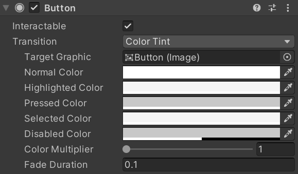

[101-什么是UGUI_哔哩哔哩_bilibili](https://www.bilibili.com/video/BV1ta411Q7Zu?p=2&vd_source=749681a84bf35b829e9cf9decdaf2f2b)

在这里下载课程资料：[UGUI学习](https://www.sikiedu.com/course/965/task/79246/show)

在这里下载b站视频：[B站视频下载工具 | 极简纯净 (zhouql.vip)](https://zhouql.vip/bilibili/)

在这里把视频音频转换为字幕：[YaoFANGUK/video-subtitle-generator: 视频音频生成字幕](https://github.com/YaoFANGUK/video-subtitle-generator)

基本控件

文本

图片

Raycast Target：是否监听鼠标点击事件。

Raycast Padding: 监听的范围是否要扩展（我猜的）

按钮

按钮的状态的颜色配置：按压、选择、禁用等等