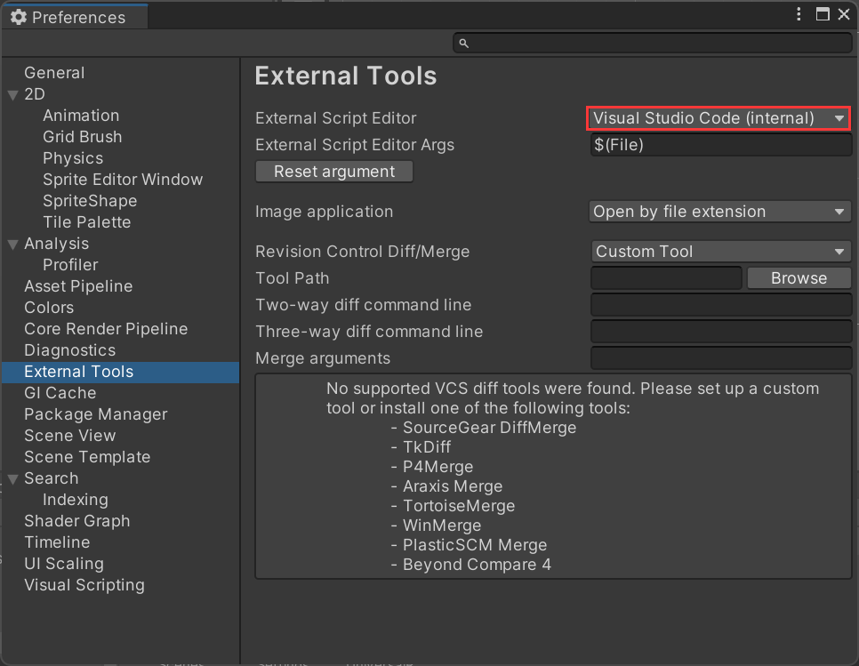

安装配置 vscode

完整教程：https://learn.u3d.cn/tutorial/2DAdventure 

预告片：[BV1zY411B7KH](https://www.bilibili.com/video/BV1zY411B7KH/?spm_id_from=333.788.video.desc.click) 

入门到入职教程合集包：https://learn.u3d.cn/bundle/M-Bundle 

横版动作教程合集：https://learn.u3d.cn/bundle/2DPlatform 

微软官方的代码编辑器配置指南： Visual Studio for Unity: https://learn.microsoft.com/zh-cn/visualstudio/gamedev/unity/get-started/getting-started-with-visual-studio-tools-for-unity?pivots=windows

### 配置vscode

跟着这个博客配置

https://blog.csdn.net/weixin_61508423/article/details/125992225

 Visual Studio Code for Unity: https://code.visualstudio.com/docs/other/unity

Edit -> Preferences

查看External Tools

### 检验是否配置成功

在project窗口空白的位置按鼠标右键`Create` -> `C #script`