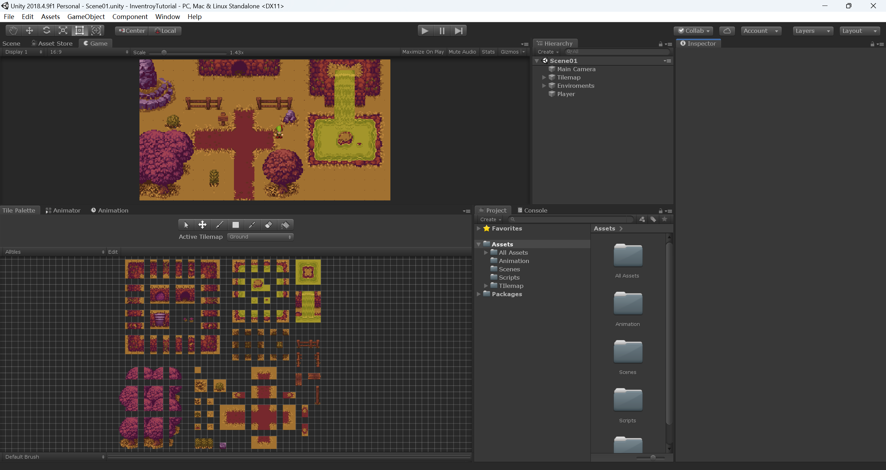
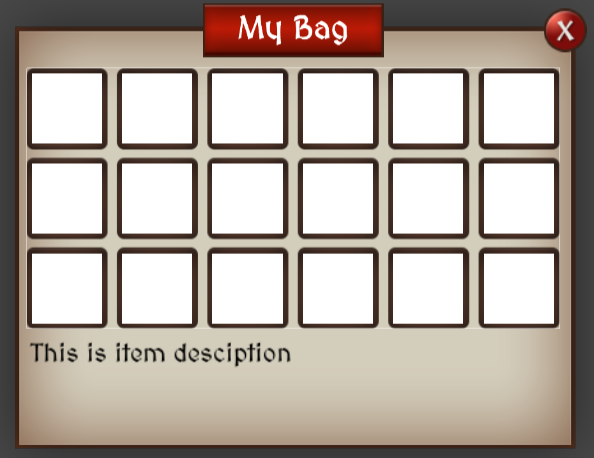
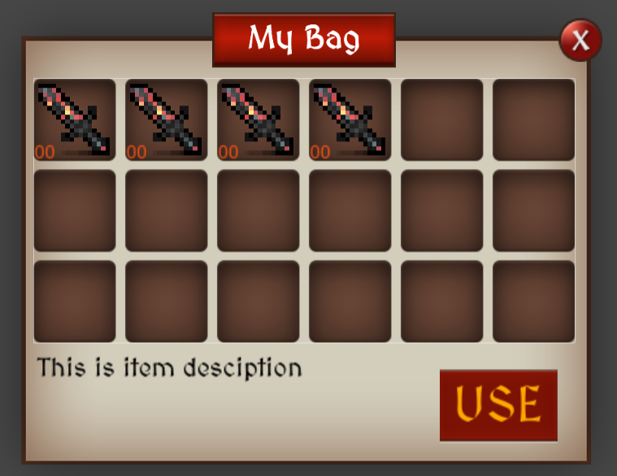

# 背包系统

## 01.前期准备

背包系统教程地址：

- [01:概览简介](https://www.bilibili.com/video/BV1YJ41197SU/)
- [02:GUI 图形界面设置](https://www.bilibili.com/video/BV1mJ41197EV/)
- [03:数据库存储方法ScriptableObject](https://www.bilibili.com/video/BV1LJ411X78s/)
- [04:显示在背包里(C# code) InventoryManager](https://www.bilibili.com/video/BV1cJ411X7hN/)
- [05:实现拖拽效果(DragHandler接口)](https://www.bilibili.com/video/BV1AJ411i7gY/)
- [06.数据转换](https://www.bilibili.com/video/BV1WJ411v7xD/)
- [07:优化代码&解决bugs(也有小技巧哦)](https://www.bilibili.com/video/BV19J411h7bo/)

> 2019年的教程，下载项目使用，项目已经实现了人物基本移动等功能。
>
> 我们只需要专心实现背包系统即可。

素材下载地址：

- 场景RPG：[Tiny RPG - Forest | 2D 角色 | Unity Asset Store](https://assetstore.unity.com/packages/2d/characters/tiny-rpg-forest-114685)
- 背包图片素材：[SIMPLE FANTASY GUI | 2D GUI | Unity Asset Store](https://assetstore.unity.com/packages/2d/gui/simple-fantasy-gui-99451)
- 装备图片：[Free Pixel Gear | 2D 环境 | Unity Asset Store](https://assetstore.unity.com/packages/2d/environments/free-pixel-gear-113561)

示例项目下载：链接: https://pan.baidu.com/s/1o7_RW_QQ1rrAbDzT69ApRw 提取码: 8s95

> 示例项目实现了场景的搭建和人物的移动，免去一些开发成本

前期准备

- [x] 下载示例项目
- [x] 下载项目对应的unity版本2018.4.9f1
- [x] 进入项目



## 02.GUI图形界面设置

[🌏视频地址](https://www.bilibili.com/video/BV1mJ41197EV/)

**1. 图片素材**

所有所需的图片素材都存放在下面的文件夹

`Assets/All Assets/Simple Fantasy GUI/PNG`


**2. 创建背包面板**

- **创建面板**：在Hierarchy窗口中，通过右键`Create` > `UI` > `Panel`来创建一个新的面板（Panel），并将其命名为`Bag`。
- **调整面板样式**：使用Anchor调整面板，使其居中显示，设置尺寸为宽515，高415。
- **设置背包背景**：将`inventory`文件夹中的`box`图片拖拽到Panel上，用作背包的背景。
- **调整图片不透明度**：调整图片的不透明度（Opacity）至255，使图片完全不透明。

**3. 创建背包标题**

- **按钮素材**：`Login Panel/LoginButton`
- **创建image**：命名为`Title`，同时应该属于之前创建的`Bag`的子集，使用按钮素材作为Source Image，点击Set Native Size可以还原图片大小。
- **创建文本**：使用`Image`和`Text`（或`TextMeshPro`）UI元素来创建背包的标题。字体使用素材自带的MedievalSharp。

> 如果字体模糊：可以修改Scale 为0.5 然后放大字体

**4. 创建关闭背包按钮**

- **创建按钮**：在`Bag`对象下创建一个`Button`命名为 `CloseBtn`。
- **按钮素材**：`Inventory/Close_Icon`
- **实现点击按钮关闭背包**：在CloseBtn中，添加On Click事件，将Bag对象设置为触发的对象，选择`GameObject` > `SetActive`

**5. 创建背包物品栏**

- **创建物品栏**：新建Panel，命名为`Grid`，用于存放物品格子（Slots）。
- **物品栏素材**：`Inventory/Inventory_Slots`
- **调整样式**：调整不透明度，设置居中对齐，然后调整到合适的尺寸即可。
- **物品描述文本**：创建一个Text，命名为`Item Desciption`，放到物品栏下方。
- **设置物品栏布局**：为`Grid`物品栏添加组件`Grid Layout Group`
  - 在Grid下创建多个空白的Image，尺寸设置为55x55(参考)
  - 调整Grid Layout Group组件的参数，使得每个Image都能居中。



**6. 制作物品格**

- **创建物品**：在`Grid`下创建一个Image，命名为`Slot`
- **物品素材**：`Assets/All Assets/FreePixelGear`，随意选。
- **显示物品数量**：为物品添加Text，命名为`Number`用于显示物品数量，默认数量为00
- **添加Button组件**：给物品添加Button组件，希望当鼠标点击装备时，物品栏下方能够显示这个物品对应的信息。
- **制作Prefab**：
  - 在Assets文件夹下新建 **Inventory** 文件夹。在下面再创建个 **Prefab** 文件夹。
  - 将Hierachy中的`slot`直接拖拽到Prefab文件夹下。
- **创建物品使用按钮**：在背包的右下角创建一个物品使用按钮。



**7. 按键实现背包的打开/关闭**：

打开`PlayerMovement`脚本

- 方式1：在Hierarchy中的Player对象的组件中打开。
- 方式2：在`Assets/Scripts/PlayerMovement.cs`中打开。

修改脚本`PlayerMovement.cs`

```cs
public class PlayerMovement : MonoBehaviour
{
    // Animator anim;
    public GameObject myBag;
    bool isOpen;  // 判断背包是否打开。
    
    private void Update()
    {
        // SwitchAnim();
        OpenMyBag();
    }
    
    // void SwitchAnim()
    void OpenMyBag()
    {
        if (Input.GetKeyDown(KeyCode.O))
        {
            isOpen = !isOpen;
            myBag.SetActive(isOpen);
        }
    }
}
```

> 记得在Inspector窗格中，给刚刚新建的`myBag`赋值。

## 03.数据库存储方法ScriptableObject

[🌏视频地址](https://www.bilibili.com/video/BV1LJ411X78s/)

### Scriptable Objects 简介
Scriptable Objects是Unity中用于存储数据的特殊类，与MonoBehaviour不同，它不需要挂载在GameObject上即可存在。

可以在Unity的Project窗口中直接创建，并用于存储如物品名称、图像、数量等数据。

同时在停止游戏以后，SO中还会保存响应的数据。

### 创建物品SO

- **创建文件夹**：新建`Inventory/InventoryScripts`
- **创建脚本**：新建`Item.cs`脚本，用于存储物品的所有属性信息，比如名字、数量、描述、图片等等。

```cs
// Item.cs
[CreateAssetMenu(fileName = "New Item", menuName = "Inventroy/New Item")]
public class Item : ScriptableObject 
{
    public string itemName;
    public Sprite itemImage;
    public int itemHeld;
    [TextArea]  // 多行文本
    public string itetmInfo;
    
    public bool equip; // 装备或者药水
}
```

创建文件夹`Inventory/Items`专门用于存放SO文件

在这个文件夹下创建 Sword, Shoe 两个SO文件。并赋予它们图片和基础信息。

### 创建背包SO

创建`InventoryScripts/Inventory.cs`

```cs
// Item.cs
[CreateAssetMenu(fileName = "New Inventory", menuName = "Inventroy/New Inventory")]
public class Inventory : ScriptableObject 
{
    public List<Item> itemList = new List<Item>();
}
```

创建文件夹`Inventory/New Inventory`，在里面创建新的背包，命名为`myBag`

通过编写脚本来管理物品的添加和移除逻辑，例如当玩家拾取游戏世界中的物品时，相应的物品数据会被添加到背包列表中。

### 实现捡取物品

- **创建物品**：首先要在世界上添加一个物品，直接将物品拖拽到场景即可。此时在Hierarchy窗口也会多出一个Object，将其命名为Sword
- **添加碰撞体**：然后给它添加组件 **Box Collider 2D** ，勾选 Is trigger
- **创建物品碰撞拾取脚本**：`InventoryScripts/itemOnWorld.cs`

```cs
public class itemOnWorld : MonoBehaviour
{
    public Item thisItem;
    public Inventory playerInventory;
    
    private void OnTriggerEnter2D(Collider2D other)
    {
        if(other.gameObject.CompareTag("Player"))
        {
            AddNewItem();
            Destory(gameObject);
        }
    }
    
    public void AddNewItem()
    {
        if (!playerInventory.itemList.Contains(thisItem))
        {
            playerInventory.itemList.Add(thisItem);
        }
        else
        {
            thisItem.itemHeld += 1;
        }
        
    }
}
```

> 注意要给thisItem、playerInventory赋值

## 04.显示在背包里Inventory Manager

[🌏视频地址](https://www.bilibili.com/video/BV1cJ411X7hN/)

介绍了如何在Unity中利用Scriptable Objects将物品数据库与背包系统的UI组件相结合，展示如何动态地在背包界面上显示物品及其信息。

重点是搞清楚Slot与Item的关系

### 物品展示脚本

**目标**：能够在捡到物品以后，背包中的物品栏也跟着一起更新。

**创建脚本**：`Inventory/InventoryScripts/Slot.cs`

这里创建了个Slot类，负责承载Item。Item是之前创建的SO

```cs
using UnityEngine.UI  // 使用Image对象需要导入
public class Slot : MonoBehaviour
{
    public Item slotItem;  // Item SO
    public Image slotImage; // 物品图像
    public Text slotNum;  // 物品数量文本
    // 点击物品时调用背包管理器更新物品信息
    public void ItemOnClicked()
    {
        InventoryManager.UpdateItemInfo(slotItem.itemInfo);
    }
}
```

将这个脚本挂载在slot Prefab上。

脚本参数配置：

- 将 **slot Prefab** 的 **Image 组件**挂载到 **Slot** 脚本的 **Slot Image** 参数上
- 将 **slot Prefab** 的 **number** 组件挂载到 **Slot** 脚本的 **Slot Num** 参数上

### 动态生成物品到背包界面

**InventoryManager脚本**：需要实现一个管理背包内容显示的`InventoryManager`脚本，作为控制背包UI的中心点，包括物品的添加、物品信息的显示等功能。需要实现单例模式。

- **创建脚本**：`InventoryScripts/InventoryManager.cs`
- **挂载脚本**：挂载在 Hierarchy 窗口的 Canvas 上。
- **编写脚本**：脚本代码编写如下。

```cs
using UnityEngine.UI;

public class InventoryManager : MonoBehaviour
{
    static InventoryManager instance;
    
    public Inventory myBag;
    public GameObject slotGrid;  // 在这里生成prefab
    public Slot slotPrefab;
    public Text itemInformation; // 物品详情文本展示
    
    // 单例模式的写法
    void Awake()
    {
        if (instance != null)
        {
            Destroy(this);
        }
        instance = this;
    }
    private void OnEnable()
    {
        RefreshItem();
        instance.itemInformation.text = "";
    }
    
    public static void UpdateItemInfo(string itemDescription)
    {
        instance.itemInformation.text = itemDescription;
    }
    
    public static void CreateNewItem(Item item)
    {
        Slot newItem = Instantiate(instance.slotPrefab, instance.slotGrid.transform.position, Quaternion.identity);
        newItem.gameObject.transform.SetParent(instance.slotGrid.transform);
        newItem.slotItem = item;
        newItem.slotImage.sprite = item.itemImage;
        newItem.slotNum.text = item.itemHeld.ToString();
    }
    
    public static void RefreshItem()
    {
        // 循环所有的子集
        for (int i = 0; i < instance.slotGrid.transform.childCount; i++)
        {
            if(instance.slotGrid.transform.childCount==0)
                break;
            Destroy(instance.slotGrid.transform.GetChild(i).gameObject);
        }
        for (int i = 0; i < instance.myBag.itemList.Count; i++)
        {
            CreateNewItem(instance.myBag.itemList[i]);
        }
    }
}
```

脚本公开变量赋值

修改脚本`itemOnWorld.cs`

```cs
public class itemOnWorld : MonoBehaviour
{
    public void AddNewItem()
    {
        if (!playerInventory.itemList.Contains(thisItem))
        {
            // playerInventory.itemList.Add(thisItem);
            // 碰撞物体后，创建物体
            InventoryManager.CreateNewItem(thisItem);
        }
        
        InventoryManager.RefreshItem();
    }
}
```

测试效果：

- 背包为空的情况
- 背包不为空的情况

### 疑问

**为什么使用SetParent(instance.slotGrid.transform)？**

在Unity中，`SetParent()`方法用于设置一个GameObject的父对象。这个方法要求传入的参数是一个`Transform`类型，而不是一个`GameObject`类型。每个`GameObject`在Unity中都有一个`Transform`组件，这个组件负责管理对象的位置（position）、旋转（rotation）和缩放（scale）。因此，当你想要将一个GameObject设置为另一个GameObject的子对象时，你需要通过指定父对象的`Transform`组件来实现这一点，这就是为什么要使用`.transform`。

### Instantiate函数详解

`Instantiate`方法在Unity中用于动态创建（实例化）新的对象。这个方法非常强大，可以用于创建游戏对象（如角色、道具）、UI元素等。`Instantiate`有几种不同的重载版本，但最常用的可能是这个：

```cs
public static Object Instantiate(Object original, Vector3 position, Quaternion rotation, Transform parent);
```


## 05.实现拖拽效果(DragHandler接口)

[🌏视频地址](https://www.bilibili.com/video/BV1AJ411i7gY/)

**目标**：

- 背包物品可以背拖拽到空格子上。
- 背包物品可以交换位置。

### 界面调整

之前的做法是在Grid对象中，拾取几个物品就生成几个Slot对象，现在要一次性生成18个Slot对象。

现在要让一个Slot代表一个格子，而不用Grid的背景来做格子了。

- **调整Grid**：
  - 背景设置为透明
  - 调整每个cell的尺寸，保证物品栏还是3行6列。
- **调整`Slot` Prefab**：
  - Source Image设置为`PNG/Inventory/Inventory_Slot`
  - 显示物品数量的Number设置为空字符串
- **创建 `Slot` 的子物体 `Item`**：
  - 为Slot创建一个子物体Button，命名为`Item`。
  - 删掉`Item`下的`Text`子物体。
  - 调整尺寸：60x60
  - 移除Image组件，将Button组件的Transition参数改为None，表示不需要按钮的互动时的变化。
  - 为`Item`添加一个子物体Image，命名为`Item Image`
- 调整myBag SO，将其默认状态设置为18。element元素为空。

这一通操作的目的就是当拖拽物品到其他格子时，只需要改变 `Slot` 下的 `Item` 对象就行了。

### 代码调整

属性修改：

- 新增`slots`属性，用于存储所有物品槽位
- 新增`emptySlot`属性，装载slot预制体，用于初始化slot。
- 注释属性`slotPrefab`。（其实我个人感觉好像不用这么修改也是ok的）


修改`InventoryManager.cs`

在生成的过程中，也要把之前myBag SO存储的数据给添加上去。

物品碰撞拾取相关代码也要修改

```cs
// InventoryManager.cs
public class InventoryManager : MonoBehaviour
{
    // 注释 public Slot slotPrefab;
    public GameObject emptySlot;
    // public Text itemInformation;
    public List<GameObject> slots = new List<GameObject>();
    // 注释整个CreateNewItem() 方法
    public static void RefreshItem()
    {
        for (int i = 0; i < instance.slotGrid.transform.childCount; i++)
        {
            // 末尾添加
            instance.slots.Clear();
        }
        
        for (int i = 0; i < instance.myBag.itemList.Count; i++)
        {
            // 注释 CreateNewItem(instance.myBag.itemList[i]);
            instance.slots.Add(Instantiate(instance.emptySlot));
            instance.slots[i].transform.SetParent(instance.slotGrid.transform);
            instance.slots[i].GetComponent<Slot>().SetupSlot(instance.myBag.itemList[i]);
        }
    }
}
```

将InventoryManager组件从原本的Canvas移动挂载到`bag`对象上。

重新赋值：

- slot prefab赋值到 emptySlot上

修改`Slot.cs`

```cs
public class Slot : MonoBehaviour
{
    public GameObject itemInSlot;
    
    // 新建变量
    public string slotInfo;
    // 修改代码
    public void ItemOnClicked()
    {
        // 修改代码
        InventoryManager.UpdateItemInfo(slotInfo);
    }
    // 新建函数
    public void SetupSlot(Item item)
    {
        if (item == null)
        {
            itemInSlot.SetActive(false);
            return;
        }
        
        slotImage.sprite = item.itemImage;
        slotNum.text = item.itemHeld.ToString();
        slotInfo = item.itemInfo;
    }
}

```

> 给itemInSlot赋值
>
> itemInSlot 是什么？
>
> 是`Slot` Prefab下挂载的子物体 `Item`，用于在背包没有物体时，可以控制它不显示图片。

物品碰撞拾取代码修改，修改`ItemOnWorld.cs`

```cs

public class itemOnWorld : MonoBehaviour
{

    public void AddNewItem()
    {
        if (!playerInventory.itemList.Contains(thisItem))
        {
            // 修改添加新物品的逻辑
            // 注释 playerInventory.itemList.Add(thisItem);
            for (int i = 0; i < playerInventory.itemList.Count; i++)
            {
                if (playerInventory.itemList[i] == null)
                {
                    playerInventory.itemList[i] = thisItem;
                    break;
                }
            }
        }
    }
}

```

### 实现拖拽

现在Slot预制体的层级关系是

```
Slot
 - Item
   - Item Image
   - Number
```

我们要拖拽的是Item。因此要给Item对象编写一个脚本

拖拽过程中，需要把物品的渲染顺序调整到上层。

- 与父物体脱离关系
- 并调整在grid对象上级

拖拽后需要定位到具体的格子

在Slot Prefab上添加组件：Canvas Group

- 勾选Blocks Raycasts：鼠标当前的点对屏幕发射射线，碰撞到的物体返回一些信息。
- 拖拽时需要关掉Item 的 Blocks Raycasts

新建脚本`InventoryScripts/ItemOnDrag.cs`

```cs
using UnityEngine.EventSystems;

public class ItemOnDrag : MonoBehaviour, IBeginDragHandler, IDragHandler, IEndDragHandler
{
    public Transform originalParent;  // 初始的父物体
    
    public void OnBeginDrag(PointerEventData eventData)
    {
        originalParent = transform.parent;
        
        transform.SetParent(transform.parent.parent);
        // 物品与鼠标位置一致
        transform.position = eventData.position;
        GetComponent<CanvasGroup>().blocksRaycasts = false;
    }
    
    public void OnDrag(PointerEventData eventData)
    {
        transform.position = eventData.position;
        Debug.Log(eventData.pointerCurrentRaycast.gameObject.name);
    }
    
    public void OnEndDrag(PointerEventData eventData)
    {
        if (eventData.pointerCurrentRaycast.gameObject.name == "Item Image")
        {
            transform.SetParent(eventData.pointerCurrentRaycast.gameObject.transform.parent.parent);
            transform.position = eventData.pointerCurrentRaycast.gameObject.transform.parent.parent.position;
            eventData.pointerCurrentRaycast.gameObject.transform.parent.position = originalParent.position;
            eventData.pointerCurrentRaycast.gameObject.transform.SetParent(originalParent);
            GetComponent<CanvasGroup>().blocksRaycasts = true;
            return;
        }
        transform.SetParent(eventData.pointerCurrentRaycast.gameObject.transform);
        transform.position = eventData.pointerCurrentRaycast.gameObject.transform.position; 
        GetComponent<CanvasGroup>().blocksRaycasts = true;
    }
}
```

问题，第一个格子里的东西没有加回去

### 实现拖拽背包

创建脚本`Scripts/MoveBag.cs`

```cs
using UnityEngine.EventSystems;

public class MoveBag : MonoBehaviour, IDragHandler
{
    public Canvas canvas;
    RectTransform currentRect;
    
    void Awake()
    {
        currentRect = GetComponent<RectTransform>();
    }
    public void OnDrag(PointerEventData eventData)
    {
        currentRect.anchoredPosition += eventData.delta;
    }
}
```


## 06.数据转换

[🌏视频地址](https://www.bilibili.com/video/BV1WJ411v7xD/)

现在有个BUG，myBag SO的物品顺序不会跟着物品的真实位置变化。

在Slot 对象上记录物品的编号。

修改`Slot.cs`

```cs
public class Slot : MonoBehaviour
{
    public int slotID; // 格子的ID 等于物品ID
    
}
```

修改`InventoryManager.cs`

```cs
public static void RefreshItem()
{
    // 重新生成对应myBag里面的物品的slot
    for (int i == 0, i < instance.myBag.itemList.Count, i++)
    {
        // 
        instance.slots[i].GetComponent<Slot>().slotID = i;
    }
}
```

修改`ItemOnDrag.cs`

```cs
public class ItemOnDrag : MonoBehaviour, IBeginDragHandler, IDragHandler, IEndDragHandler
{
    public Inventory myBag;  // 获取背包
    private int currentItemID; // 当前物品ID
    public void OnBeginDrag(PointerEventData eventData)
    {
        // originalParent = transform.parent;
        currentItemID = originalParent.GetComponent<Slot>().slotID;
    }
    
    public void OnEndDrag(...)
    {
        if (...)
        {

            // itemList的物品存储位置改变。
            var temp = myBag.itemList[currentItemID];
            myBag.itemList[currentItemID] = myBag.itemList[eventData.pointerCurrentRaycast.gameObject.GetComponentInParent<Slot>().slotID]; 
            myBag.itemList[eventData.pointerCurrentRaycast.gameObject.GetComponentInParent<Slot>().slotID] = temp;
            
        }
        
        // itemList的物品存储位置改变
        myBag.itemList[eventData.pointerCurrentRaycast.gameObject.GetComponentInParent<Slot>().slotID] = myBag.itemList[currentItemID];
        myBag.itemList[currentItemID] = null;
    }
}
```


## 07.优化代码&解决bugs

[🌏视频地址](https://www.bilibili.com/video/BV19J411h7bo/)

代码优化

1.Inventory Manager挂载在canvas下。

2.移动图标的时候会闪动一下。

为slot 的item添加Layout Element组件

勾选Ignore Layout。

3.原地拖拽物品消失

修改代码`ItemOnDrag.cs`

```cs
public void OnEndDrag(...)
{
    if (eventData.pointerCurrentRaycast.gameObject.GetComponentInParent<Slot>().slotID != currentItemID)
        myBag.itemList[currentItemID] = null;
    // myBag.itemList[currentItemID] = null;
}
```

4.拖拽到别的地方，就挂在原地了。

修改代码`ItemOnDrag.cs`

注意这里的名字可是 Slot(Clone)

```cs
public void OnEndDrag(...)
{
    // 加入判断语句
    if (eventData.pointerCurrentRaycast.gameObject.name == "Slot(Clone)")
    {
        ...
    }
    // 其他任何位置都归位
    transform.SetParent(originalParent);
    transform.position = originalParent.position;
    GetComponent<CanvasGroup>().blocksRaycasts = true;
}
```

5.拖拽到背包以外，还是会报错

```cs
public void OnEndDrag(...)
{
    if (eventData.pointerCurrentRaycast.gameObject != null)
    {
        // 包含一堆前面的东西
    }
    // 其他任何情况都归位
}
```


## 其他

项目总结

项目库框架

```
|- Assets
  |- Inventory  # 实现背包系统的文件夹
    |- InventoryScripts  # 代码
    |- Items  # 物品SO
    |- Inventory  # 背包SO
    |- Prefab  # 预制体
  |- Scripts
    |- MoveBag # 实现拖拽背包改变位置
```
