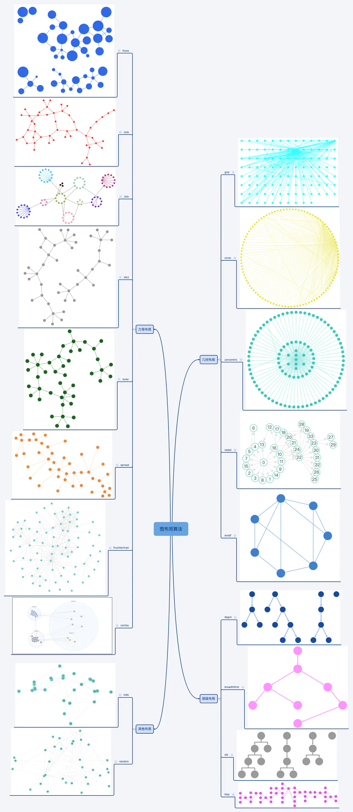

https://www.jianshu.com/p/bcd93b1f4b00

## 前言

图算法在前端领域考察的较少，一般除非是要写框架或者打包工具对依赖关系处理（DAG）会用到，前端对图算法的考察一般是比较少的，而对于可视化领域而言，图又是必不可少的一种展示方式，其中对于边和节点的展示布局方案结合美学效果会有不同的算法实现，本文旨在介绍一些常见的通用布局算法，其中的每个小的布局方案也会有不同的分支实现

## 分类

图片

| 简写         |                           算法名称                           |     分类     |                                                         备注 |
| :----------- | :----------------------------------------------------------: | :----------: | -----------------------------------------------------------: |
| grid         |                         网格布局算法                         |   几何布局   |  图片 |
| circle       |                         环形布局算法                         |   几何布局   |  图片 |
| concentric   |                        同心圆布局算法                        |   几何布局   |  图片 |
| radial       |                        辐射状布局算法                        |   几何布局   |  图片 |
| avsdf        | 邻接点最小度优先算法（Adjacent Vertex with Smallest Degree First） |   几何布局   |  图片 |
| dagre        |   有向无环图树布局算法（Directed Acyclic Graph and Trees）   |   层级布局   |  图片 |
| breadthfirst |                       广度优先布局算法                       |   层级布局   |  图片 |
| elk          |           Eclipse布局算法（Eclipse Layout Kernel）           |   层级布局   |  图片 |
| klay         |                     K层布局算法（K Lay）                     |   层级布局   |  图片 |
| fcose        |  最快复合弹簧内置布局算法（Fast Compound Spring Embedder）   |   力导布局   |  图片 |
| cola         |             约束布局（Constraint-based Layout）              |   力导布局   |  图片 |
| cise         |       环形弹簧内置布局算法（Circular Spring Embedder）       |   力导布局   |  图片 |
| elk2         |           Eclipse布局算法（Eclipse Layout Kernel）           |   力导布局   |  图片 |
| euler        |                         欧拉布局算法                         |   力导布局   |  图片 |
| spread       |                         扩展布局算法                         |   力导布局   |  图片 |
| fruchterman  |                 Fruchterman-Reingold布局算法                 |   力导布局   |  图片 |
| combo        |                         混合布局算法                         |   力导布局   |  图片 |
| mds          |      高维数据降维布局算法（Multi Dimensional Scaling）       | 其他布局算法 |  图片 |
| random       |                         随机布局算法                         |   其他布局   |  图片 |

## 常见算法

### Fruchterman-Reingold布局算法

图片

图片

Fruchterman-Reingold算法属于力导布局的一种，其本质是将之前Eades的布点算法中的基于胡克定律模型进行了改进，使用了库伦斥力并且聚焦在最近相邻节点之间的能量模型，利用模拟退火等优化策略，结合美学标准对整体进行减少线交叉及整体均匀布局，其伪码描述如下图：

图片

对于更加细节的关于FR算法的推到，可以参看这篇论文[Graph Drawing by Force-directed Placement](https://links.jianshu.com/go?to=http%3A%2F%2Fwww.mathe2.uni-bayreuth.de%2Faxel%2Fpapers%2Freingold%3Agraph_drawing_by_force_directed_placement.pdf)；接下来，我们来看一下前端可视化领域的一些具体实现，我们结合Antv G6中的源码看一下实现思路：

作者：维李设论
链接：https://www.jianshu.com/p/bcd93b1f4b00
来源：简书
著作权归作者所有。商业转载请联系作者获得授权，非商业转载请注明出处。