## 吃子

双吃：双吃指落子后对对方两块棋子同时进行叫吃,使对方左支右绌，无法兼顾。

选择对方两块棋子中间的断点落子后，两边都只剩下一口气，便能同时叫吃两块棋子。

实战中情况往往复杂得多，要仔细选择断点才能形成双吃。

抱吃：包住

门吃：门的形状

征子：逼到角落

枷吃：提前吃

> 虎口：品字棋
>
> 倒扑：倒扑指扑人敌方虎口内送吃后,又可立郎反吃对方若干个棋子的战术，最少能回提对方三个棋子，多则可以吃十几个。
> 倒扑与打劫不同，并不会造成同形重复，因此在对方吃子后,可马上回提对方棋子，不用在别处下一着后再落子。

接不归：接不归是一种利用对方气紧叫吃其棋子，使之无论如何都无法回接的棋形。
若强行接上,则所有棋都会被吃。

扑吃：故意往对方虎口内落子闻为扑吃，也可简称为扑。

扑的核心在于弃子，通过牺牲少量棋子以造成对方气紧的局面。如果策略得当,往往有置之死地而后生的奇效，但需仔细计算方能险中求胜。

## 死活

### 假眼

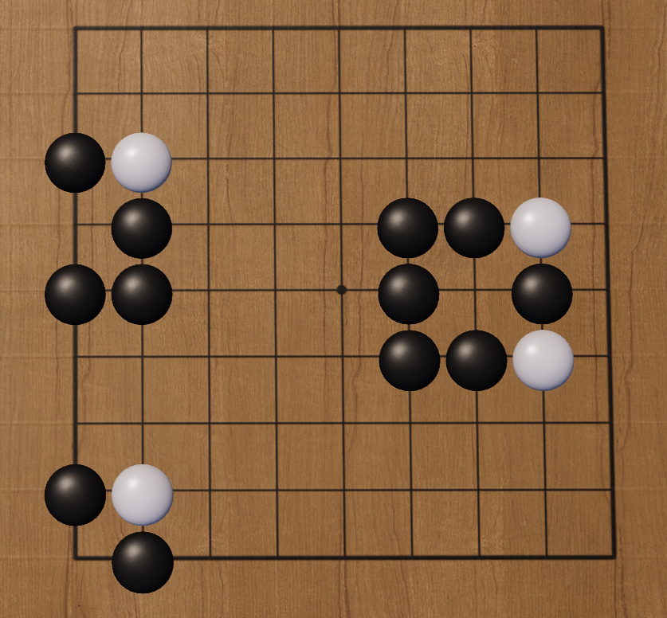

眼有真眼和假眼之分。棋形不完备、有被人内提吃可能的眼，聊为假眼。

右边的这些就都是假眼。假眼由几个连接不完整的棋子围成，形状似眼,但无法起到眼的作用，在四周被围的情况下可被分别紧气提吃。

### 真眼

相比假眼，真眼眼形完备、连成一体，在被围时只能整体紧气、一起提吃,不能被对方分割而提走。右边黑棋围出的交叉点，就是黑棋的真眼。

我们可以通过眼形初步判断真眼和假眼︰如果一个眼眼形四角中有两个及以上为对方所占，那它就只能是假眼;若四角齐全或仅有一角不完整，则应是真眼。

### 基本死活棋形

直三、曲三、丁四、梅花五：先手活后手死，都是点中间的要点

直四、曲四（手枪、阶梯Z）：活棋

方四：死棋

刀把五：稍微复杂点

葡萄六（双箭头》）：

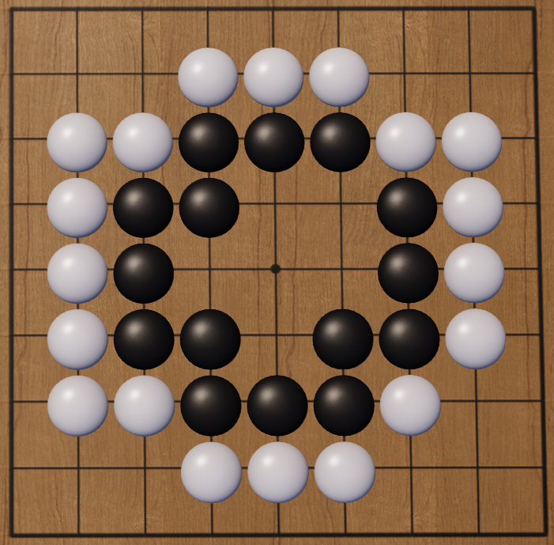

板六：活期

角上板六：板六如果放到角上,则情况较为复杂，由其外气情况来决定是死棋、劫活或活棋。
若外围无气又是白方先手，白方可通过在中轴线上靠近黑棋的那一点落子来杀死黑棋,使黑方随后因气紧无法做成两眼，只能坐等被吃。

## 棋

### 愚形

棋形臃肿、构形效率低下且子力发挥不充分的棋形，统称为坏形。坏形主要有愚形、裂形、重复形和薄形四种。形呆意愚、挤成一团的棋形是愚形，又称凝形。

右边的白棋就是典型的愚形。数一数围出这块地盘用到自子的数量。每颗白子之间是否都配合合理，发挥了最大效盒呢?

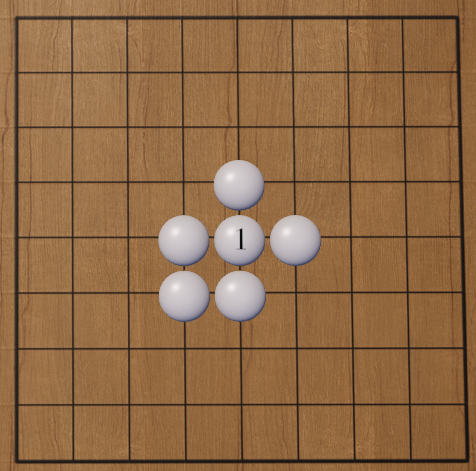

通过观察不难发现，有些自子几乎毫无作用，甚至破坏了棋形本身的流畅性。比如白1，拿走后余下棋子依然连接紧密，但在结构上却更为舒展有弹性，为做眼留出了空间。

由此可见，愚形往往存在子力的浪费，有气少、效率低、易受攻击、出头困难等缺点，在实战中应尽量避免。

### 愚形三角

右边三颗棋子构成的棋形叫愚形三角，因在拐弯1位处空出，又称空三角或松气三角，是一种典型的愚形。

愚形三角常被认为棋形笨重、效率低下，在高手对决中很少出现。

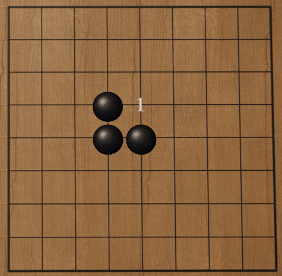

为什么说愚形三角是坏形呢?

让我们来观察棋盘上的三个棋形。同样数目的棋子，左边直线形的三子共有8口气。若是下成愚形三角，不仅气在无形中少了一口，子与子之间也团成一团，相互撞气，效率较低。

右下角的三颗棋子则配合更加灵活,子力发挥充分,无论对逃跑还是围空都更为有利。

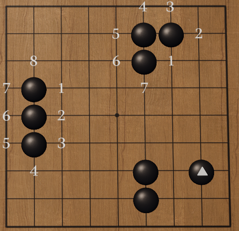

### 双关

通过之前的观察，我们可以总结出好形的一些特征,郎联结紧密、少破绽和高效率。右边白棋形成的双关郎是这些特征的集大成者。

双关由两对隔一路的棋子相贴形成，简称为双。双关的优势在于连接牢靠，常被用于补断。如右边所示，如果黑棋想从1位断，白棋能在2位接，反之亦然,这样白棋就有效地阻止了对方分断，是好棋。

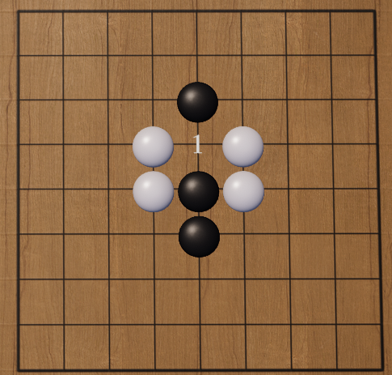

### 开花

开花是一方在棋盘中央区域提去对手一子后形成的棋形,因形似花架而得名，在布局及中盘阶段有不俗的威力。

棋谚有云∶中央开花三十目。这种说法郎体现了开花的价值。开花的棋形可攻可守，既减少了对手在盘面上的子数,又具有向各个方向上发展的势力，故通常被认为是一种效率极高的好形。

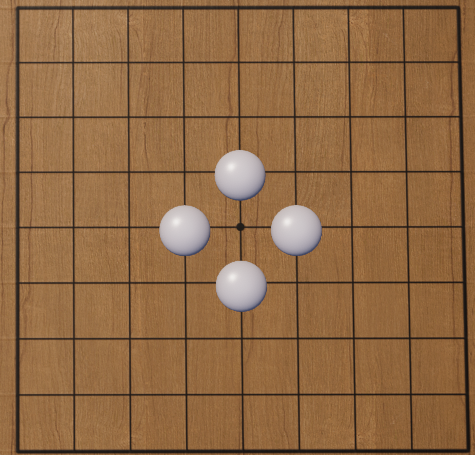

### 扳

在行棋中，除了自己走出好形,也可通过破坏对方棋形建立优势。扳闻为在局部接触战中攻逼、威胁对方的强力手段。

扳是指在双方棋子相互紧贴时，一方从斜角在另一方棋子头上着子的下法。扳的用途广泛，可用于阻截、连接、分断、占地等目的。值得强调的是，扳通常需要在己方棋形完整或我强敌弱的情形下使用。如果不分场合地使用,反而会导致自己被切断,甚至局部被击溃。

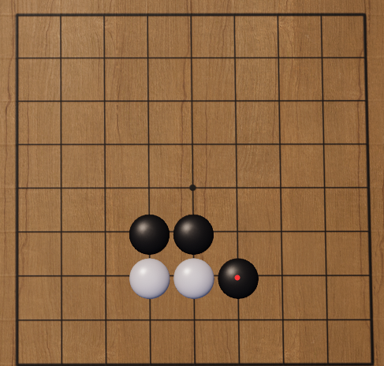

那么，扳在什么时候能够发挥最大的作用呢?俗话说，二子头必扳，三子头必扳。右边所展示的棋形，即属于必扳之例。

黑棋在此时可以选择在1位长一手，但若使用扳的下法,则既能紧对方气,又能加强对对方棋子的压迫和控制。这时白方就很难再切断黑方棋子，通常只能选择在2位应。

### 选取最优解

除双关外，围棋中还有许多简单常用的好形。它们有些坚实稳重，有些轻灵飘逸，但都各有利弊。扩张迅速时可能被对方乘虚分断，稳扎稳打也可能意味着错失先机。

如何根据实际情况选取各种着法中的最优解，是每位棋手棋力进阶中的必修课，极度考验棋手对棋形的理解和平衡。下面将会提供几种较为常见的好形下法，以供对照参考。

### 单关

单关也称小跳或一间跳,在原有棋子同一直线上隔开一路落子，形成关院。这种下法攻守兼备，被分断的危险不大，一般在逃离对方阵营或追杀对方薄弱棋子时使用。

右边标记为1处是这种棋形的薄弱点，需根据实际情况思考如何应对。这里提供了一种下法,仅供参考。

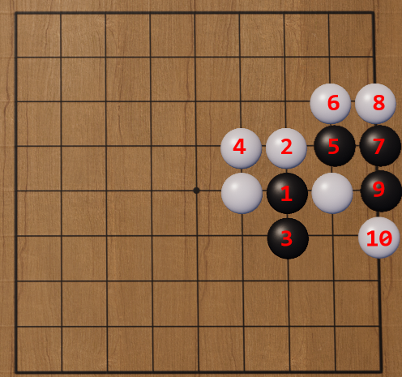

### 尖

尖是另一种常见的好形，取原有棋子斜上或斜下一路落子。

常言道,棋逢难处小尖尖。如右边所示，白棋即朵用了尖的下法,如果黑棋在1位落子，白棋立即就能在2位接上，可谓下法坚实，难于攻破。

尖的棋形紧凑扎实,可起到防断和阻渡的作用，但因速度较慢，不太适合作为出逃手段。在实战中，可考虑与跳或飞等偏重速度的着法搭配使用，常能实现组合拳的效果。

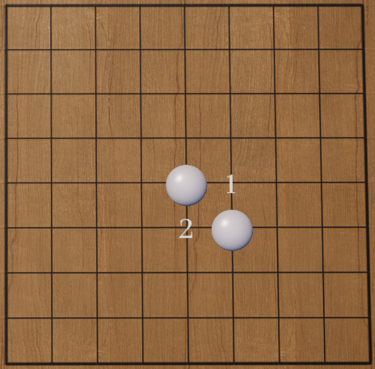

从前面尖的例子可以看出，棋子的分断和连接是棋局中接触战攻防的重点。初学者往往会陷人误区，因害怕被断而一味求稳,忽略了对棋子效盒的追求和对全局的把握,从而陷人被动，步步落后。

这种打法在力求高效的围棋游戏中显然是行不通的。在下棋中,初学者还是应该有意识地培养勇于冒险的精神以及得失计算的能力,主动多尝试更飘逸、更快速的打法,逐渐在速度和坚实间找到平衡点。

### 小飞

下面再介绍几种偏重速度的行棋方法。右边这种棋形叫小飞，在己方原有棋子日字形的对角上落子，常与单关或小尖搭配使用。

下出小飞时是否会被分断，取决于征吃的必经之路上是否先有己方棋子。若征子路线上有己方棋子接应，则很难被断。但若是先遇到对方棋子，则很有可能被双吃。

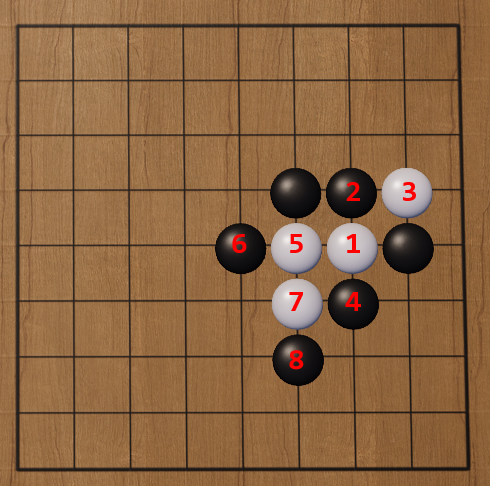

### 大跳

大跳又名二间跳，比小跳多走一格,从原有棋子出发隔两路落子。大跳的棋型轻灵,效奉较高但也更易被断。

大跳的步幅较大,适合在布局建立大模样时使用，为防止阵地不稳，往往会沿边下于三路或四路，这样既能方便向中央或宽阔地带扩张，又更易做活。

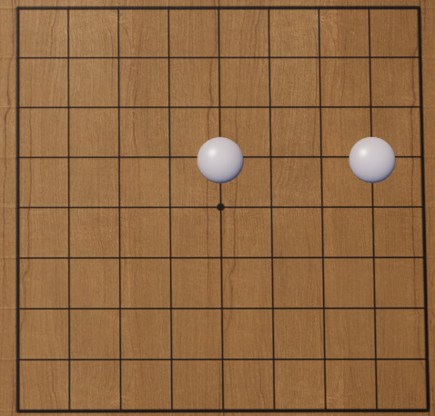

### 大飞

大飞则与小飞相对应,比小飞多走一格，在己方棋子目字形对角交叉点落子。

大飞的下法主要求取外势，棋风大开大合，适合在布局阶段用于进攻，之后再逐步将地域转化为实空。

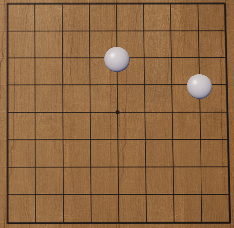

## 布局

布局是一局棋的开始阶段。双方棋手通过占角、守角、挂角、拆边、分投等手段争夺盘上空点，确立大致轮廓和势力范围，为中盘接触战奠定基础。

出于围空难度和效率的考虑，布局中往往遵循先占角、后占边的基本原则,最后再考虑向中腹扩展。但是角上的位置很多，下在哪里最好呢?

让我们观察棋盘的右上角。标准的围棋棋盘共有19路，若是布局时下在边沿的一或二路，能够围到的地盘太小，也很难做活，显然不是占角时的首选。

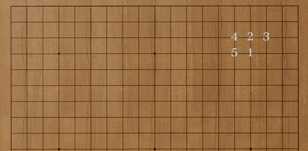

常见的占角点如棋盘上1至5点所示，依次为星位、小目、三三、目外和高目，均分布在棋盘的三、四路，其中三路更利于取实地，四路更利于取外势，各有侧重又各具特色，在实战中应灵活搭配使用。

布局阶段角部博弈中，经过长期研究总结形成、公认近似最佳着手的配合打法，被称为定式。在围棋数千年的发展历程中，出现过的定式浩如烟海,仅常用的也有数百种。初学者应做到尽量掌握，培养基础棋感,最终自然能水到渠成,形成自己的布局风格。

### 守角

在四个空角都被占完后，棋手可选择主动进攻，去挂对方的角，也可选择加固阵地，补一手棋守角。

棋盘右下角展示了走小目占角后的几种常见的守角位置。

下在1位被称为小飞角，也叫无忧角，布局扎实稳健。

2位为单关角，主要侧重对边路的影响，棋子配置更灵活，但也留给了对方攻人的机会。

3位、4位依次为大飞角和大跳角，棋风更为潇洒激进，对角部控制力则进一步减弱。

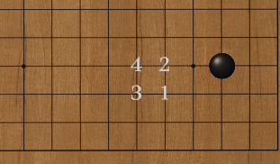

这些守角位对星位也同样适用，又以星位与小飞角的组合最为常见,相较与小目配合守角，更侧重于取势。

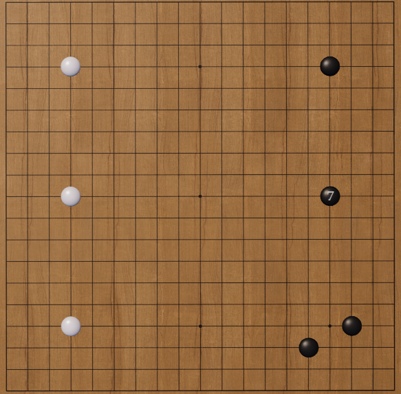

棋盘上的黑棋采取了典型的守角打法。前三手黑棋以星小目布局开局，随后在右下方用小飞守角。此时白棋若还不在右侧作出回应，黑7即可与原有黑棋配合，做成大模样,在右侧占据优势。

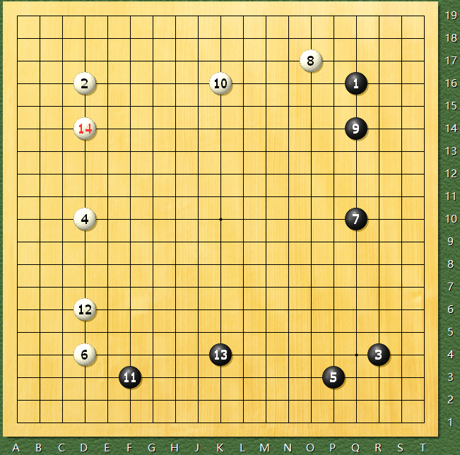

这种星配无忧角的布局方式趋向于获取边角实地，其中黑7的处置相对灵活,只要在三、四路靠近棋盘中间的一点落子，都能形成相对厚实的好形。随后黑棋可选择继续在下方拓展，即可做成无忧角向两翼张开的理想布局。

1993年,中国棋手徐莹在第五届棋王赛执黑对战聂卫平时，郎选择以稳健的星无忧角开局，谋取右侧实地。白方则应以三连星。随后双方皆迅速往边上及中腹发展,压缩侵消对方外势。

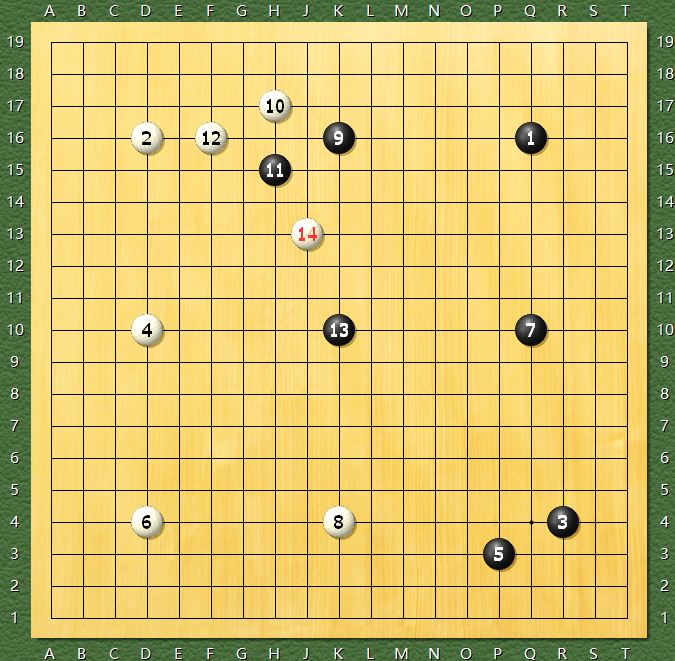

守角型开局讲究稳扎稳打、行棋坚实,也鲁流行一时。但自吴清源新布局革命以来，棋手在布局时更重速度和效率，追求取势，这种偏重实地的下法不免显得过于消极，因此使用也渐趋减少，但其基本理论仍延续至今，具有举足轻重的地位。

### 迷你中国流

这里的四颗黑子同样以星和小目的配合为基础,但相比追求安定的小飞守角，直接以黑5、黑7一挂一拆，向边上扩张,兼顾实地与外势。这种布局方法被称作迷你中国流。

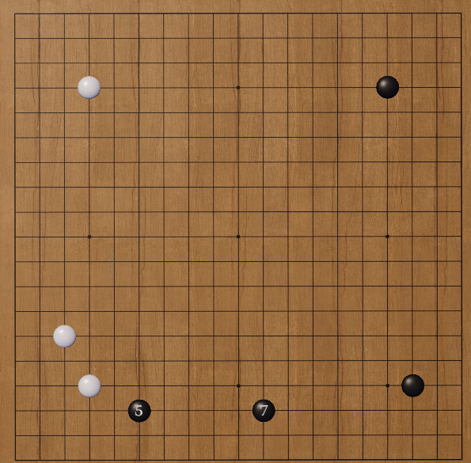

从守地的角度来说，迷你中国流省去了一步在小目处的守角,不如无忧角坚实，但却大大提高了布局速度，棋子间的配合也能更加灵活。

右边是迷你中国流在实战中三种典型的变体。黑方形成迷你中国流布局后，白方既可选择分投阻止黑棋连片,也可高挂黑棋小目攻人右侧，尝试破坏黑棋模样。而黑方则可用紧逼、大飞、小飞、尖冲等方法应对。

整体而言,迷你中国流的优势主要体现在两点:其一是速度较快,易于构筑大模样。此外在对方攻人时,亦可借下方外势牵制对方，局部较为坚实。

变体1

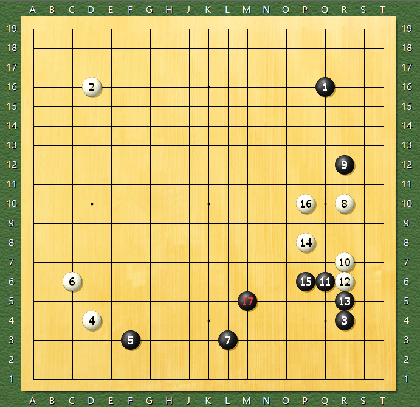

变体2

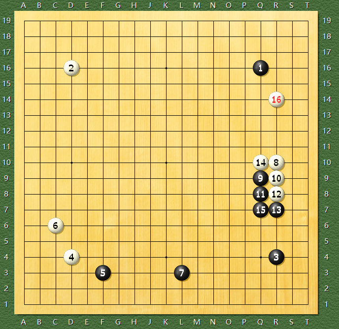

变体3

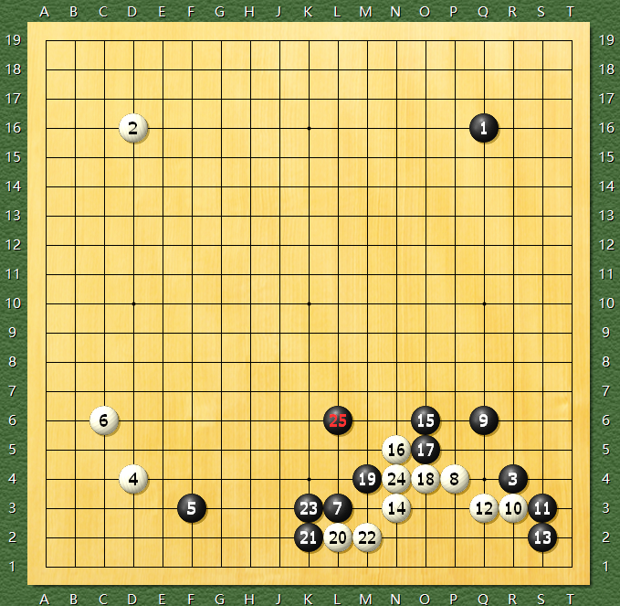

### 小林流

接下来的这种布局方式由日本棋手小林光一九段于20世纪80年代首创，同样以星和小目开局,随后会在挂角后拆回,体现其对实地的重视，有一整套定式化的下法。

与迷你中国流类似,小林流在小目一侧并未拘泥守角,而是积极通过黑5小飞挂、黑7斜拆三做出大模样，以攻代守,，借外势有效地对下方及右下角的实地形成保护

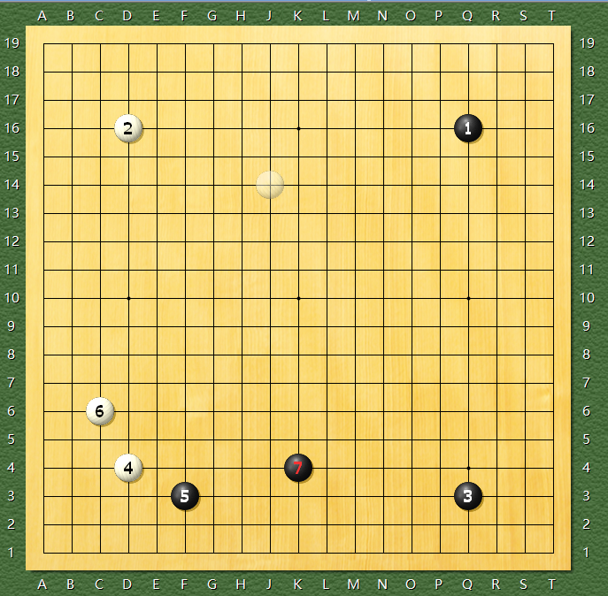

右边的情况展示了小林流布局卓越的边角配合。

其中自1以一间高挂试图挑战黑方小目，黑2便以一间高夹应，与边星位置先前回拆的黑子互相策应，打出绝妙的配合，限制白方攻击方向，并在黑6刺的一手获得主动。随后白7不得不接，黑8郎可进一步拆二，完善阵势，合白方大亏。

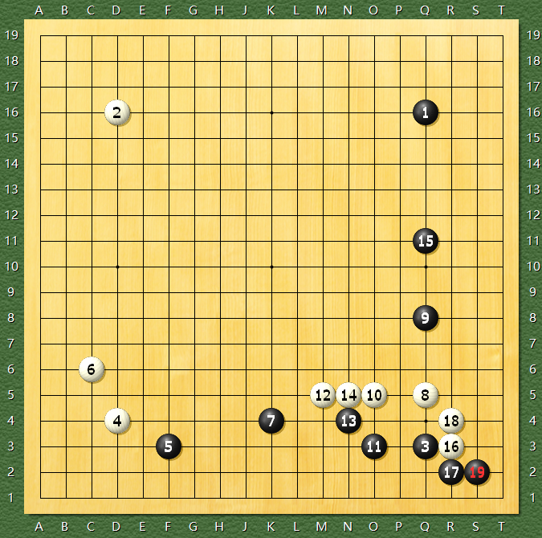

针对小林流布局,白棋走在1位形成大飞挂则是公认较好的挂角方式,这样落子点离小目稍远,可以起到缓冲的效果。这种下法也是小林流布局的标准定式。

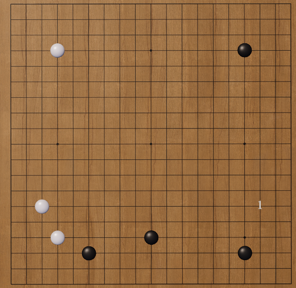

此外，白棋也可选择走二间高挂的下法，也可有效避开下方三颗黑子夹攻。

### 中国流

中国流布局最早可追溯到三百年前的日本四世本因坊道策，之后由以陈祖德代表的中国棋手于1960年代发扬光大，根据棋手走完星、小目后，拆边时选择下在四路(1位)还是三路(2位)，分为高中国流和低中国流。

这种布局手段兼顾实利和外势，可迅速在边路筑成阵势，为力战型棋手所推崇。

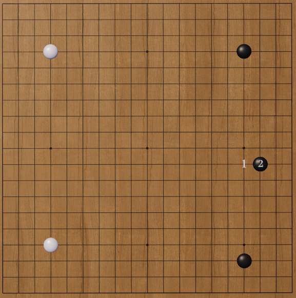

中国流布局延续了大模样作战的思路，借助攻击占据主动,兼顾实地和外势的平衡，为力战型棋手所推崇。

譬如右边黑5的这一手镇,迅速在边路筑成低中国流布局的棋形,在棋盘右上方和右下角形成高低配合的大模样，从而对白棋产生压迫,占据优势。

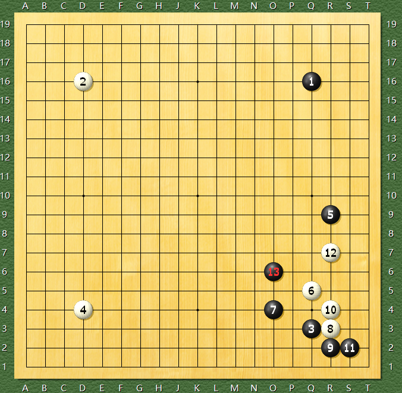

### 三连星

三连星布局是旭手时下在棋盘同侧相连三个星位的布局方式,由吴清源和木谷实最先研究、采用,重视速度布局及对中腹的影响。您可以通过旁边的几个例子感受三连星大模样作战的风格。

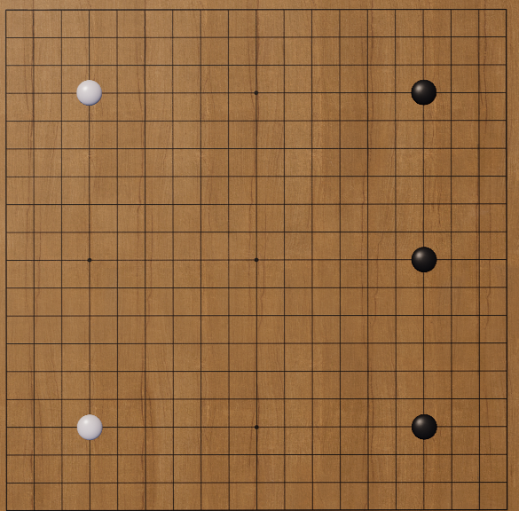

日本棋手武宫正树独创的宇宙流就以三连星为基础,不惜舍弃边角，谋求更为广袤的中腹大空,下法大开大合、气势磅礴,为众多棋迷所推崇。

## 对杀

对杀时先下外气，再下公气

有眼的对杀更有优势，但是有眼无公气，优势就没有了。

案例

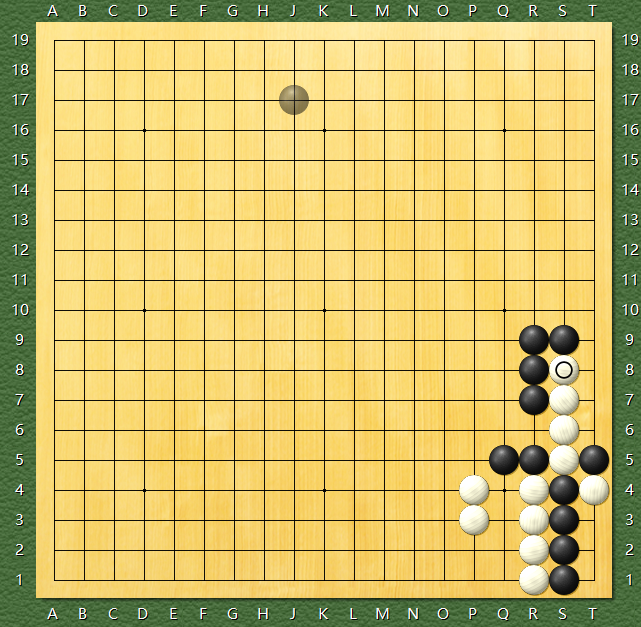

黑先，黑子只有3气，

白子4气
