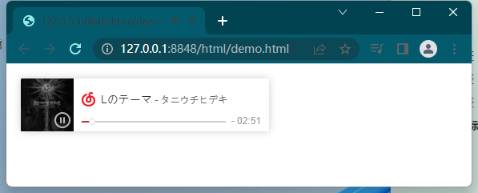

# 音视频标签

## 音频标签

```html
<audio src="./audios/小鸟.mp3" controls="controls" muted="muted"></audio>
```

常用属性：

- `controls="controls"`，向用户展示播放按钮，进度条等控制功能
- `autoplay="autoplay"`，自动播放
- `loop="loop"`，循环播放
- `muted="muted"`，默认静音。
- `preload="preload"`，
- 如果出现该属性，则音频在页面加载时进行加载，并预备播放。如果使用 `autoplay`，则忽略该属性。

也可以选择多个源

浏览器会自上而下自动选取播放的源。

```html
<audio controls="controls">
    <source  src="./audios/小鸟.ogg">
	<source  src="./audios/小鸟.mp3">
</audio>


```

## 视频标签

与音频标签十分类似

```html
<video width="800" height="" controls="controls">
    <source src="myvideo.mp4" type="video/mp4"></source>
	<source src="myvideo.ogv" type="video/ogg"></source>
	<source src="myvideo.webm" type="video/webm"></source>
	当前浏览器不支持 video直接播放，点击这里下载视频: <a href="myvideo.webm">下载视频</a>
</video>
```

## iframe标签

把别人的网址嵌入进行

```html
<iframe src="https://www.bilibili.com" width="100%" height="800px"></iframe>
```

也可以嵌入内部的其他页面

```html
<iframe src="my.html" width="100%" height="800px"></iframe>
```

常用属性：

- `frameborder="0"`，不显示边框
- `scrolling="no"`不显示滚动条

### 嵌入网页云音乐

在网易云搜索任意音乐，均可以生成外部链接

```html
<iframe frameborder="no" border="0" marginwidth="0" marginheight="0" width=330 height=86 src="//music.163.com/outchain/player?type=2&id=22793199&auto=1&height=66"></iframe>
```



### 嵌入bilibili视频

同理b站的所有视频也可以

```html
<iframe src="//player.bilibili.com/player.html?aid=552477845&bvid=BV1Li4y1k7tb&cid=556006937&page=1" scrolling="no" border="0" frameborder="no" framespacing="0" allowfullscreen="true"> </iframe>
```

