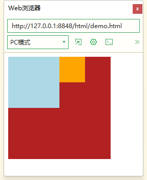
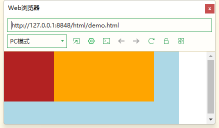
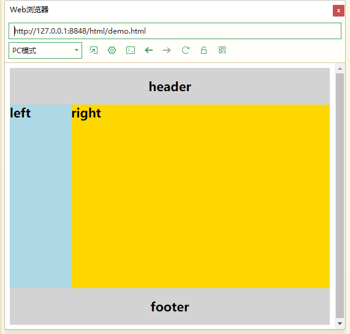
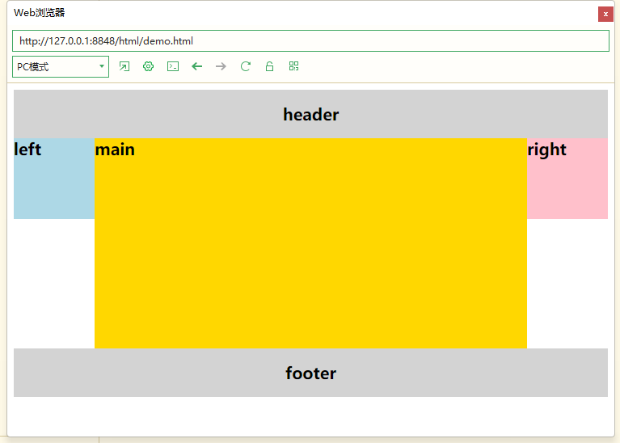
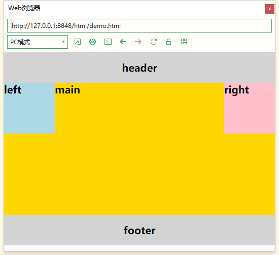
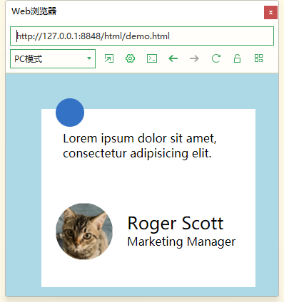

# 浮动

浮动最早是用来控制图片，以便达到其他元素（特别是文字）实现“环绕”图片的效果。

元素的浮动是指设置了浮动属性的元素会脱离文档流的控制，移动到其父元素中指定位置的过程。

在CSS中，通过float属性来定义浮动，其基本语法格式如下：

```css
div {
    /* 元素向左浮动 */
    float: left;
    /* 元素向右浮动 */
    float: right;
    /* 元素不浮动（默认值） */
    float: none;
}
```

## 设置浮动

```html
<div></div>
<div></div>
<div></div>
```

```css
div:nth-child(1) {
    width: 100px;
	height: 100px;
	background-color: lightblue;
	float: left;
}

div:nth-child(2) {
    width: 50px;
	height: 50px;
	background-color: orange;
	float: left;
}

div:nth-child(3) {
    width: 200px;
	height: 200px;
	background-color: firebrick;
}

```




- 浮动元素会脱离文档流（红色方块会占用蓝、橙方块的位置）。
- 浮动元素相互紧靠，浏览器宽度减少，方框会移动到下边。
- 浮动元素具有行内块的特点。

浮动首先创建包含块的概念（包裹）。就是说， 浮动的元素总是找理它最近的父级元素对齐。但是不会超出内边距的范围。

浮动的元素排列位置，跟上一个元素（块级）有关系。如果上一个元素有浮动，则A元素顶部会和上一个元素的顶部对齐；如果上一个元素是文档流，则A元素的顶部会和上一个元素的底部对齐。

一个父盒子里面的子盒子，如果其中一个子级有浮动的，则其他子级都需要浮动。这样才能一行对齐显示。

浮动脱离文档流，不占位置，会影响标准流。浮动只有左右浮动。

元素添加浮动后，元素会具有行内块元素的特性。元素的大小完全取决于定义的大小或者默认的内容多少

浮动根据元素书写的位置来显示相应的浮动。

## 清除浮动

其实本质叫做闭合浮动更恰当, 清除浮动就是把浮动的盒子圈到里面，让父盒子闭合出口和入口不让他们出来影响其他元素。

由于浮动元素不再占用原文档流的位置，所以它会对后面的元素排版产生影响，为了解决这些问题，此时就需要在该元素中清除浮动。

目的：清除浮动主要为了解决父级元素因为子级浮动引起内部高度为0 的问题。

```html
<div class='box1'>
    <div class="son1"></div>
    <div class="son2"></div>
</div>
<div class='box2'>

</div>
```

```css
* {
	margin: 0;
}

.box1 {
    width: 650px;
/* 	height: 150px; */
	background-color: lightgrey;
}

.box2 {
    width: 350px;
	height: 150px;
	background-color: lightblue;
}

.son1 {
    width: 100px;
	height: 100px;
	background-color: firebrick;
	float: left;
}

.son2 {
    width: 200px;
	height: 100px;
	background-color: orange;
	float: left;
}

```

如果所有子元素都是浮动类型，且父元素没设置高度，就会导致父元素内部高度为0。

被蓝色格子占了空间，如下图




### 额外标签法

方法：在要清除浮动的父元素加入一个子标签，子标签使用`clear`属性，或其他标签br等亦可。

```html
<div class='box1'>
    <div class="son1"></div>
    <div class="son2"></div>
    <div class="clearfix"></div>
</div>
<div class='box2'>
</div>
```


```css
.clearfix {
    /* 不允许左侧有浮动元素（清除左侧浮动的影响）*/
    clear: left;
    
    /* 不允许右侧有浮动元素（清除右侧浮动的影响）*/
    clear: right;
    
    /* 同时清除左右两侧浮动的影响 */
    clear: both;
}
```


优点： 通俗易懂，书写方便

缺点： 添加许多无意义的标签，结构化较差。 我只能说，w3c你推荐的方法我不接受，你不值得拥有。。。

### 父级添加overflow属性方法

可以通过触发BFC的方式，可以实现清除浮动效果。（BFC后面讲解）

可以给父级添加： `overflow`为 `hidden | auto | scroll` 都可以实现。 

优点： 代码简洁

缺点： 内容增多时候容易造成不会自动换行导致内容被隐藏掉，无法显示需要溢出的元素。

```css
.box1 {
    width: 650px;
/* 	height: 150px; */
	background-color: lightgrey;
    overflow: hidden;
}
```


### 使用after伪元素清除浮动

给父级元素添加一个类`clearfix`然后用after清除浮动

```html
<div class='box1 clearfix'>
    <div class="son1"></div>
    <div class="son2"></div>
</div>
<div class='box2'>
</div>
```

```css
.clearfix:after { 
    content: "."; 
    display: block; 
    height: 0; 
    clear: both; 
    visibility: hidden; 
} 
.clearfix {
    *zoom: 1;
} /* IE6、7 专有 */
```

优点： 符合闭合浮动思想 结构语义化正确

缺点： 由于IE6-7不支持:after，使用 zoom:1触发 hasLayout。

注意： content:"." 里面尽量跟一个小点，或者其他，尽量不要为空，否则再firefox 7.0前的版本会有生成空格。

### 使用before和after双伪元素清除浮动

```css
.clearfix:before,
.clearfix:after { 
    content:"."; 
    display:table; 
}

.clearfix:after { 
    clear:both; 
}

.clearfix { 
    *zoom:1; 
}
```

优点： 代码更简洁

缺点： 由于IE6-7不支持:after，使用 zoom:1触发 hasLayout。 

## BFC

(Block Formatting Context),直译为"块级格式化上下文"。它是一个独立的渲染区域，只有块级盒子参与其中,它规定了内部的块级盒子如何布局，并且与这个区域外部毫不相干。

- 内部的盒子会在垂直方向，一个接一个地放置。
- 盒子垂直方向的距离由外边距决定。属于同一个BFC的两个相邻盒子的外边距会发生重叠。
- 每个盒子(块盒与行盒）的左外边缘，与包含块的左边相接触(对于从左往右的格式化，否则相反)即使存在浮动也是如此。
- BFC的区域不会与浮动的盒子重叠。
- BFC就是页面上的一个隔离的独立容器，容器里面的子元素不会影响到外面的元素。反之也如此。
- 计算BFC的高度时，浮动元素也参与计算。

创建BFC的方式

- float属性除了none以外的值:left、right
- overflow属性除了visible以外的值:hidden、auto、scroll
- display属性值为: table-cell、table-caption、inline-block、flex、inline-flex
- position属性值为absolute或者fixed


## 浮动在布局场景中的应用

### 两栏布局

右边栏会随着窗口大小的变化而变化。




```html
<div id="header">header</div>
<div id="container">
    <div id="left">left</div>
    <div id="right">right</div>
</div>
<div id="footer">footer</div>
```

```css
body {
	font-weight: bold;
	font-size: 20px;
}

#left {
	width: 100px;
	height: 300px;
	background-color: lightblue;
	float: left;
}

#right {
	height: 300px;
	background-color: gold;
	overflow: hidden;
}

#header,
#footer {
	width: 100%;
	height: 60px;
	background-color: lightgray;
	text-align: center;
	line-height: 60px;
}
```

### 三栏布局

- 页首页脚占领屏幕所有宽度，高度固定
- 中间的容器是一个三栏布局
- 三栏布局两侧宽度固定，中间部分自动填充整个区域



```html
<div id="header">header</div>
<div id="container">
    <div id="main">main</div>
    <div id="left">left</div>
    <div id="right">right</div>
</div>
<div id="footer">footer</div>
```

```css
* {
	margin: 0;
	padding: 0;
}

body {
	font-weight: bold;
	font-size: 20px;
	min-width: 500px;
	/* 设置浏览器的最小显示宽度 */
}

#header,
#footer {
	width: 100%;
	height: 60px;
	background-color: lightgray;
	text-align: center;
	line-height: 60px;
}

#main {
	height: 260px;
	width: 100%;
	background-color: gold;
	/* overflow: hidden; */
}

#left,
#right {
	height: 100px;
}

#left {
	width: 100px;
	height: 100px;
	background: lightblue;
}

#right {
	width: 100px;
	height: 100px;
	background: pink;
}

#left,
#main,
#right {
	float: left;
}

#container {
	overflow: hidden;
	padding: 0px 100px 0px 100px;
	position: relative;
}

#left {
	margin-left: -100%;
	position: relative;
	left: -100px;
}

#right {
	margin-left: -100px;
	position: relative;
	right: -100px;
}
```

### 双飞翼布局



```html
<div id="header">header</div>
<div id="container">
    <div id="main">main</div>
    <div id="left">left</div>
    <div id="right">right</div>
</div>
<div id="footer">footer</div>
```

css在上面的基础上，更改了后面几个样式的设置，简化了代码的编写。

```css
#container {
	overflow: hidden;
	
}
#content {
	padding: 0px 100px 0px 100px;
}
#left {
	margin-left: -100%;
}

#right {
	margin-left: -100px;
}
```

## 案例：评价卡片



```html
<!-- .evaluation>.circle+.content+.client>.intro>span.name+.position -->
<div class="evaluation">
    <div class="circle"></div>
    <div class="content">Lorem ipsum dolor sit amet, consectetur adipisicing elit. </div>
    <div class="client">
        
        <div class="intro">
            <span class="name">Roger Scott</span>
            <div class="position">Marketing Manager</div>
        </div>
    </div>
</div>
```

```css
* {
	margin: 0;
	padding: 0;
	box-sizing: border-box;
}

body {
	background-color: lightblue;
}
	
.evaluation {
	width: 300px;
	height: 250px;
	background-color: white;
	left: 50px;
	top: 50px;
	position: relative;
}	

.circle {
	width: 40px;
	height: 40px;
	background-color: #3472C5;
	border-radius: 50%;
	left: 20px;
	top: -15px;
	position: absolute;
}

.profile {
	width: 80px;
	height: 80px;
	background-color: lightblue;
	border-radius: 50%;
	
	background-image: no-repeat center;
	background-size: cover;
}

.content {
	width: 100%;
	padding: 30px;
}

.name {
	font-size: 24px;
}

.client {
	width: 260px;
	height: 80px;
	margin: 30px 20px;
}

.intro {
	height: 80px;
	width: 160px;
	float: right;
	padding-top: 12px;
}

```

