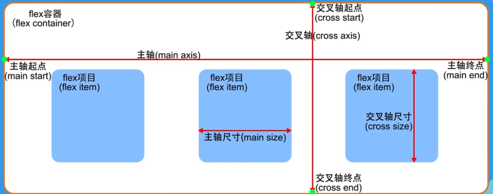
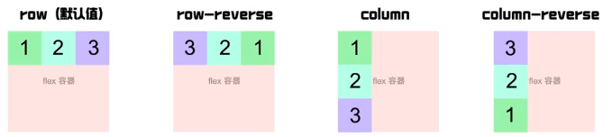
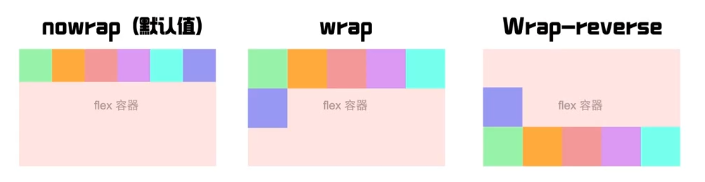
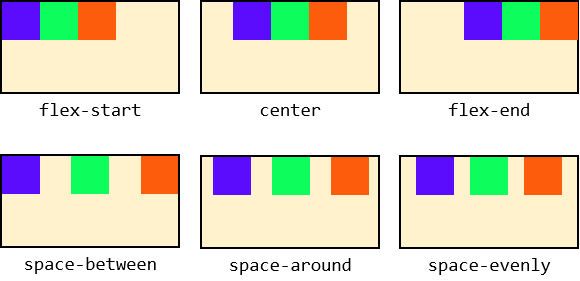
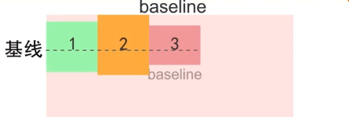
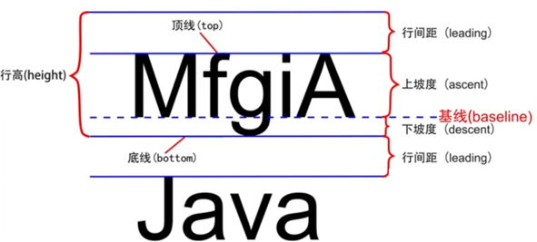
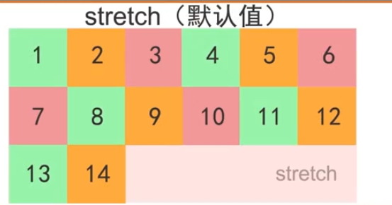
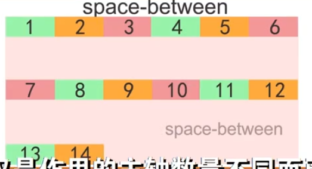

# flex布局

## 概念

采用**flex布局的元素**，称为**flex容器**（flex container），简称“容器”。它的所有**子元素**自动成为容器成员，称为**flex项目**（flex item），简称“项目”。



学习flex布局，就是学习应用flex容器属性和flex项目属性

| flex容器属性    | flex项目属性 |
| --------------- | ------------ |
| flex-direction  | order        |
| flex-wrap       | flex-grow    |
| flex-flow       | flex-shrink  |
| justify-content | flex-basis   |
| align-items     | flex         |
| align-content   | align-self   |

将元素设为flex布局

```css
.container {
    display: flex;
}
```


## flex容器属性

### flex-direction

决定主轴方向（即flex项目的排列方向）。

```css
/* 主轴为水平方向，起点在左端(默认值) */
flex-direction: row;

/* 主轴为水平方向，起点在右端 */
flex-direction: row_reverse;

/* 主轴为垂直方向，起点在上沿 */
flex-direction: column;

/* 主轴为垂直方向，起点在下沿 */
flex-direction: column_reverse;
```




### flex-wrap

```css
/* 不换行(默认) */
flex-wrap: nowrap;

/* 换行，第一行在上方 */
flex-wrap: wrap;

/* 换行，第一行在下方 */
flex-wrap: wrap-reverse;
```



### flex-flow

**推荐使用**

flex-flow属性是flex-direction属性和flex-wrap属性的简写形式，默认值为row nowrap,

### justify-content

控制项目在主轴上的对齐方式

```css
/* 主轴起点对齐，默认为水平方向的左对齐 */
justify-content: flex-start;

/* 主轴中心对齐，默认为水平方向的居中对齐 */
justify-content: center;

/* 主轴终点对齐，默认为水平方向的右对齐 */
justify-content: flex-end;

/* 左右两端对齐，左右两端项目紧贴容器，且间距相等 */
justify-content: space-between;

/* 项目之间间距为左右两侧项目到容器间距的两倍 */
justify-content: space-around;

/* 项目之间间距与项目与容器间距相等 */
justify-content: space-evenly;
```



### align-items

用于控制项目在纵轴的排列方式

```css
/* 如果项目未设置高度或auto，项目将占满整个容器的高度 */
align-items: stretch;

/* 交叉轴的起点对齐 */
align-items: flex-start;

/* 交叉轴的终点对齐 */
align-items: flex-end;

/* 交叉轴的中点对齐 */
align-items: center;

/* 项目的第一行文字的基线对齐 */
align-items: baseline;
```

前四个很好理解，主要看baseline方式






### align-content

定义了多根轴线的对齐方式，只有一根轴线则不起作用。

```css
/* 轴线占满整个交叉轴 */
align-content: stretch;

/* 交叉轴的起点对齐 */
align-content: flex-start;

/* 交叉轴的终点对齐 */
align-content: flex-end;

/* 交叉轴的中点对齐 */
align-content: center;

/* 与交叉轴两端对齐，轴线之间间隔平均分布 */
align-items: space-between;

/* 每根轴线两侧间隔相等，所以，轴线间隔比轴线与边框的间隔大一倍 */
align-items: space-around;
```





## flex项目属性

### order

是一个数字属性，可以定义项目的排列顺序，越小排列越靠前，默认为0，可以为负

### flex-grow

定义项目的放大比例，默认为0，存在剩余空间也不放大。

如果全设为1，则等分剩余空间

如果三个项目的`flex-grow`是1,1,2，则就按这个比例分配剩余空间。

### flex-shink

定义项目的缩小比例，默认为1，项目等比例缩小。

如果为0，则其他项目缩小，而为0的项目不缩小。

### flex-basis属性

flex-basis属性定义了在分配多余空间之前，项目占据的主轴空间(main size）。它的默认值为auto,即项目的本来大小。
浏览器根据这个属性,计算主轴是否有多余空间。通常它被设为跟width或height属性一样的值。

有多余空间的话，也不过多放大，设置为固定尺寸

### flex

使用该属性简写上述3个属性。

默认

```css
div {
    /* 后两个属性可选 */
    flex: 0 1 auto;
    
    /* 不放大不缩小 */
    flex: none; /* 相当于 0 0 auto */
    
    flex: auto; /* 相当于 1 1 auto */
}
```

### align-self

align-self属性允许单个项目有与其他项目不一样的对齐方式,可覆盖align-items属性。
默认值为auto，表示继承父元素的align-items属性，如果没有父元素，则等同于stretch。

## 案例