# grid布局

与flex布局的区别

flex布局是轴线布局，只能指定"项目"针对轴线的位置，可以看作是一维布局。grid布局则是将容器划分成"行"和"列"，产生单元格来设定"项目"所占空间，可以看作是二维布局。flex布局和grid布局能协同工作。

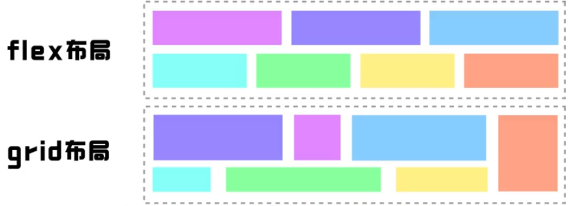

通过display属性设置为`grid`或者`inline-grid`,将元素定义为grid布局。
注意:设为网格布局以后，容器子元素（(项目）的`float`、`display: inline-block`、`display: table-cell`、 `vertical-align`和`column-*`等设置都将失效。

```css
.container{
    display:inline-grid;
    grid-template-columns: repeat(3,1fr);
    grid-template-rows: repeat(3,1fr);
}

```

## grid布局的基本概念

容器内部采用网格定位的直接子元素称为项目

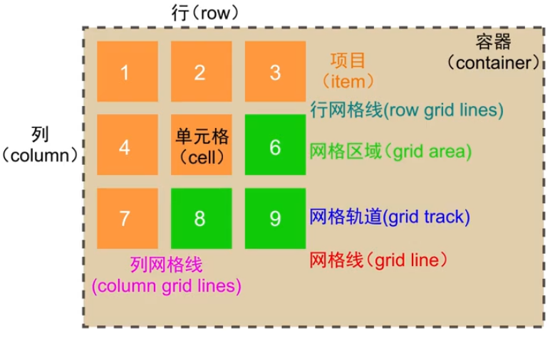

主要学习grid容器属性和grid项目属性

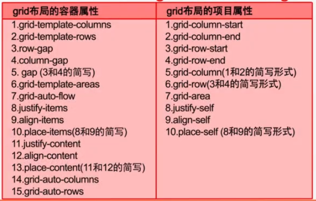

## grid容器属性

### 行高和列宽

```css
.container {
    display: grid;
    grid-template-columns: 100px 200px 300px;
    grid-template-rows: 100px 100px 100px;
}
```

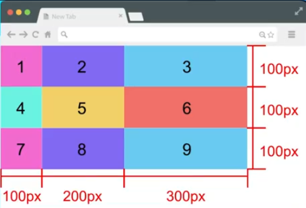

如果grid项目不设置宽高，那就会默认填充到分配好的宽高

如果项目数量不足9个，空间也会被保留。

也可以用百分比或者`auto`来指定单元格的宽高

```css
.container {
    display: grid;
    grid-template-columns: 20% 100px auto;
    grid-template-rows: 60px auto;
}
```

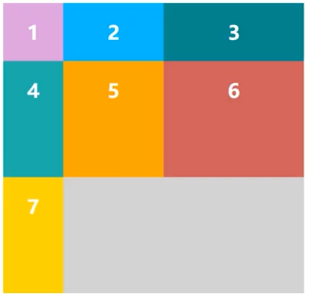

fr单位，fr是fraction的缩写，意思是份数，1fr表示一份。

```css
.container {
    display: grid;
    grid-template-columns: 1fr 2fr 3fr;
    grid-template-rows: 1fr 1fr 1fr;
}
```

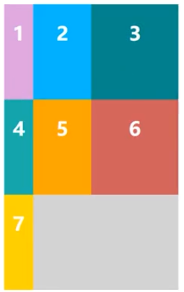

如果有多列都是1fr，可以用repeat函数来实现

```css
.container {
    display: grid;
    grid-template-columns: repeat(3,1fr);
    grid-template-rows: 60px repeat(2,1fr);
}
```

### 行列间距

```css
.container {
    display: grid;
    row-gap: 20px;
    column-gap: 20px;
    /* 或 */
    gap: 20px 20px;
}
```

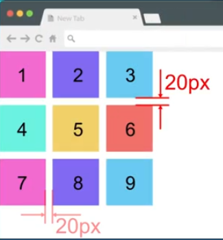

### 网格区域

网格区域由单个或多个单元格组成。grid-template-areas属性用于定义区域。

```css
.container {
    grid-template-columns: repeat(3,1fr);
    grid-template-rows: repeat(3,1fr);
    grid-template-areas: 
        "a1 a1 a1"
        "a2 a2 a3"
        "a2 a2 a3";
}

/* 子项目这么定义 */
.item:nth-child(1) {
    grid-area: a1;
}
.item:nth-child(2) {
    grid-area: a2;
}
.item:nth-child(3) {
    grid-area: a3;
}
```

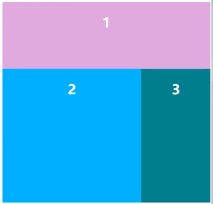

复合写法

```css
.container {
    grid-template: 
        "a1 a1 a1" 1fr
        "a2 a2 a3" 1fr
        "a2 a2 a3" 1fr
       /1fr 1fr 1fr;
}
```

使用.表示这个单元格不属于任何区域

```css
.container {
    grid-template: 
        "a1 a1 a1" 1fr
        "a2 a2 ." 1fr
        "a2 a2 a3" 1fr
       /1fr 1fr 1fr;
}
```

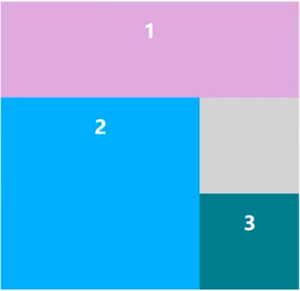

### 项目排列顺序

先行后列或先列后行

```css
.container {
   grid-auto-flow: row; //先行后列
   grid-auto-flow: column; //先列后行
}
```

横向排列，项目按序填满

```css
.container {
   grid-auto-flow: row dense;
   grid-auto-flow: column dense;
}
```

### 单元格内容对齐

start:对齐单元格的起始边缘。

end:对齐单元格的结束边缘。

center:单元格内部居中。

stretch:拉伸，占满单元格的整个宽度（默认值）。

```css
.container {
   /* start end center stretch*/
   /* 水平对齐方式 */
   justify-items: start;
   /* 垂直对齐方式 */
   align-items: center;
    
   /* 相当于 */
   place-items: start center;
}
```

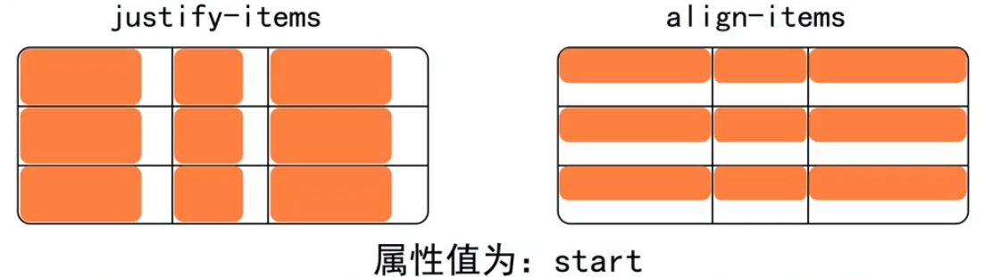

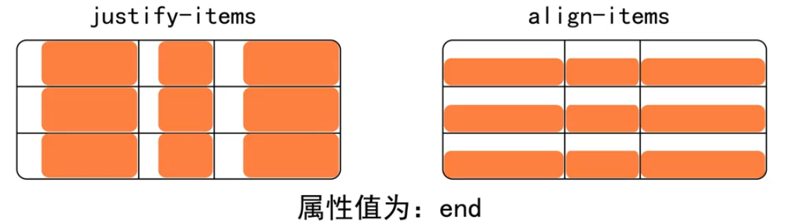

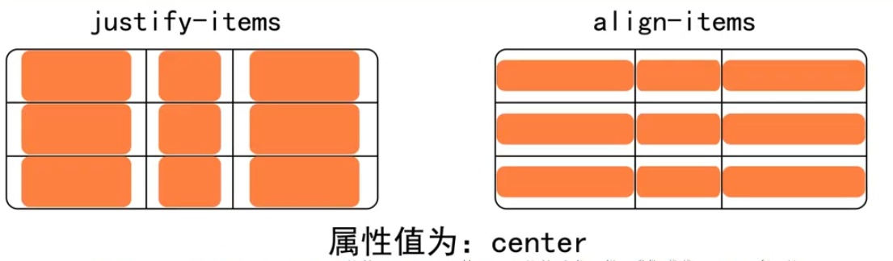

### 单元格在容器中的对齐方式

justify-content属性是整个内容区域在容器里面的水平位置（左中右)，

align-content属性是整个内容区域的垂直位置（上中下）。

place-content属性上述的简写


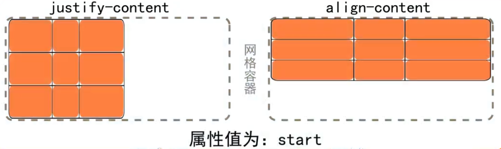

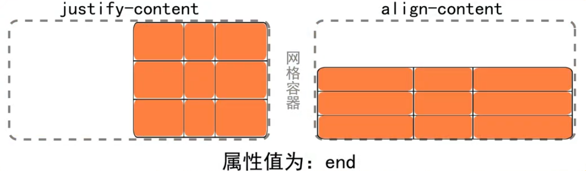


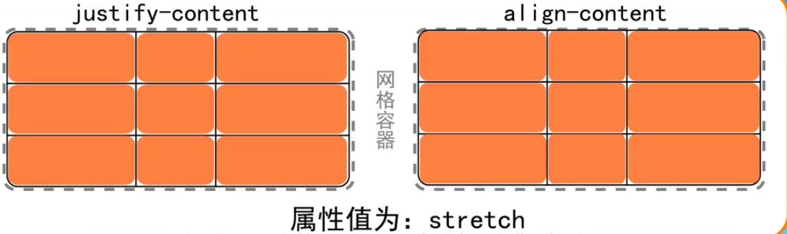

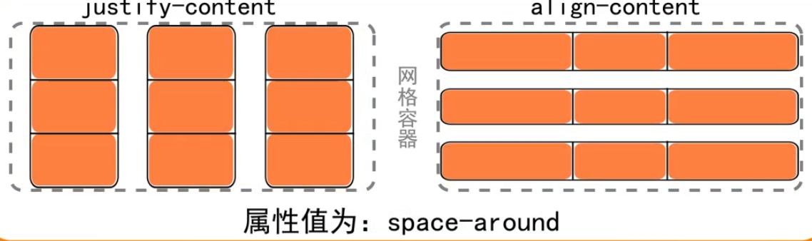

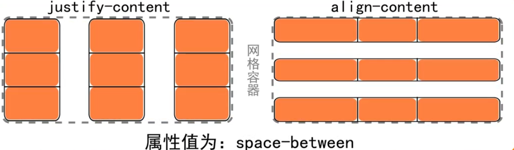

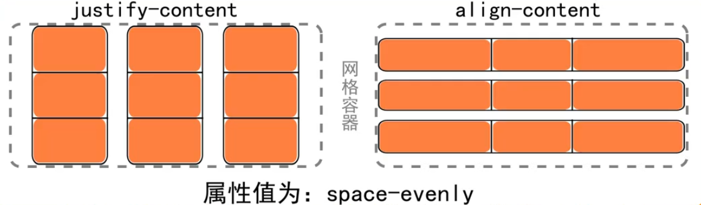

## grid项目属性

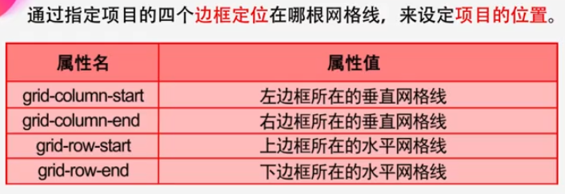

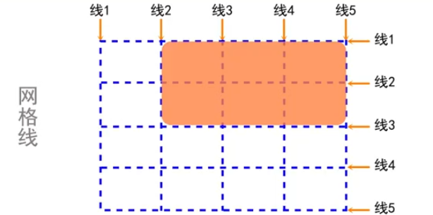

```css
.item {
    grid-column-start: 2;
    grid-column-end: 3;
    grid-row-start: 2;
    grid-row-end: 4;
}
```

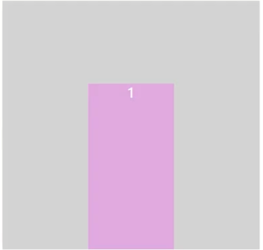

可以在定义网格宽度的时候给网格线起名

不推荐这种方式

```css
.container {
    grid-template-columns: [first] 1fr [second] 1fr [third] 1fr;
    grid-template-rows: [line1] 1fr [line2] 1fr [line3 ] 1fr
}
```

```css
.item {
    grid-column-start: second;
    grid-column-end: thrid;
    grid-row-start: line2;
    grid-row-end: line4;
}
```

推荐这种简化的方式

```css
.item {
    grid-column: 2 / span2;
    grid-row: 2 / 4;
}
```

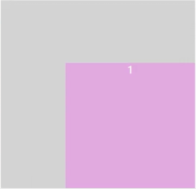

最简化的方式

```css
.item {
    /* 行的起点 列的起点 行的终点 列的终点 */
    grid-area: 2 / 2 / 4 / 4;
}
```

### 单元格内容对齐

justify-self属性设置单元格内容的水平位置（左中右），只作用于单个项目。
align-self属性设置单元格内容的垂直位置（上中下），只作用于单个项目。

place-self是简写

- start
- end
- center
- stretch

