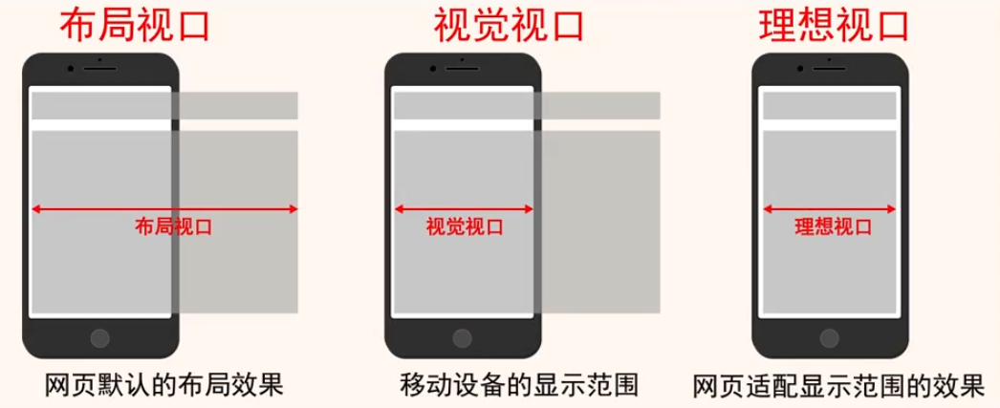
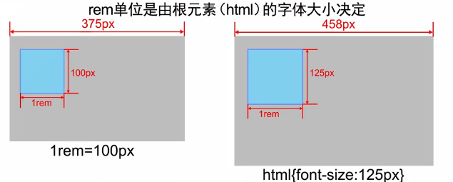
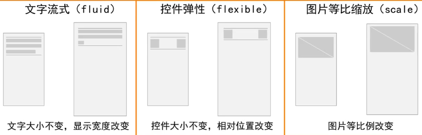
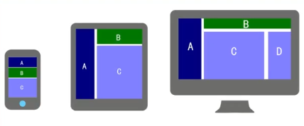
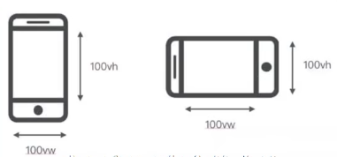
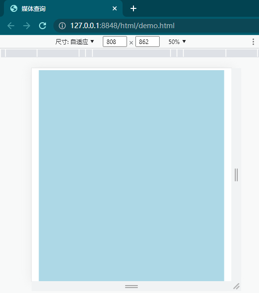
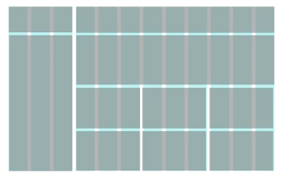
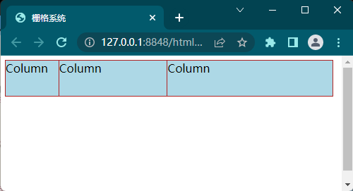

# 响应式布局

目的是为了同一个页面能在不同分辨率上的设备都能正常显示。

自适应布局:不同分辨率的终端设备上，网页自动调整元素尺寸，显示出相同的视觉效果。

适用场景:网页结构和内容较为复杂的情况。


采用逻辑像素的手段。

**逻辑像素**:通过设备尺寸的识别与单位换算,统一不同屏幕尺寸下的视觉效果。
pt: point，点，印刷行业常用单位，等于1/72英寸

不同分辨率，相同显示效果

1.根据浏览器宽度调整网页整体的缩放比例

2.根据分辨率调整内容的显示效果

- rem布局
- 流式布局


视口:viewport,是浏览器上显示网页的一块区域。

PC端:视口等于浏览器窗口的宽度和高度。

移动端:分为布局视口(layout viewport)、视觉视口(visualviewport)、理想视口(ideal viewport)。




为了让网页适应屏幕宽度，可以再网页头部定义meta标签

```html
<meta name="viewport" content="width=device-width, user-scalable=no,initial-scale=1.0,maximum-scale=1.0. minimum-scale=1.0">
```

- `width=device-width` :表示宽度是设备屏幕的宽度
- `initial-scale=1.0`:表示初始的缩放比例
- `minimum-scale=0.5`:表示最小的缩放比例
- `maximum-scale=2.0`:表示最大的缩放比例
- `user-scalable=yes`:表示用户是否可以调整缩放比例

## 自适应布局

### rem布局

比如爱奇艺官网

rem布局:也叫做等比缩放布局。

rem布局规则:
1.—般不给元素设置具体的宽度,(小图标除外)

2.根据设计稿，高度设置固定值

3.所有设置的固定值都用rem做单位

4、通过Javascript代码来获取真实屏幕的宽度,除以设计稿的宽度,算出比值，重新设定项目显示的真实尺寸。



| 宽度 | 屏幕对比比例 | Html font-size | 元素宽度(px) | 元素宽度(rem) |
| ---- | ------------ | -------------- | ------------ | ------------- |
| 640  | 1            | 20px           | 200px        | 10rem         |
| 480  | 0.75         | 15px           | 150px        | 10rem         |
| 384  | 0.6          | 12px           | 120px        | 10rem         |
| 320  | 0.5          | 10px           | 100px        | 10rem         |

### 流式布局

流式布局:也叫做百分比布局,就是flex弹性布局。

流式布局的实现有三个原则：文字流式、控件弹性、图片等比缩放。



流式布局的好处是:大屏幕下显示更多的内容;但宽屏下比例会有一些不协调。

等比缩放布局的好处是:不同设备下看起来比较协调。但显示的内容并不会因屏幕变大而展示更多。

## 响应式布局

响应式布局:同一个网页，在不同分辨率的终端设备上，展示出不同的视觉效果。

适用场景:网页结构和内容较为简单，针对不同设备优化浏览体验的情况。



 实现方式：

- 媒体查询
- 栅格系统

### 媒体查询

 **媒体查询**:使用@media规则指定一组样式的目标媒体类型(以逗号分隔），以花括号确定范围。

https://developer.mozilla.org/en-US/docs/Web/CSS/@media

| 值     | 描述                               |
| ------ | ---------------------------------- |
| all    | 用于所有设备                       |
| print  | 用于打印机和打印预览               |
| screen | 用于电脑屏幕，平板电脑，智能手机等 |
| speech | 应用于屏幕阅读器等发声设备         |

视口单位

- vw: 1vw等于视口宽度的1%
- vh：1vh等于视口高度的1%
- vmin：选取vw和vh中最小的那个。
- vmax：选取vw和vh中最大的那个。



 

视口单位和%单位的区别:视口单位是由**视口尺寸**的百分比来定义的;%单位则是由**父元素**的百分比来定义的。

```html
<!DOCTYPE html>
<html>
	<head>
		<meta charset="utf-8">
		<meta name="viewport" content="width=device-width,initial-scale=1,minimum-scale=1,maximum-scale=1,user-scalable=no" />
		<title>媒体查询</title>
		<link rel="stylesheet" href="./css/demo.css">
	</head>
	<body>
		<div class="container">
			<div class="row"></div>
		</div>
	</body>
</html>

```


```css
.container {
	padding-right: 15px;
	padding-left: 15px;
	margin-right: auto;
	margin-left: auto;
	background-color: lightgray;
}

.row {
	width: 100%;
	height: 100vh;
}

/* 屏幕宽度大于等于576px时，使用下面的样式设定*/
@media (min-width: 576px) {
	.container{
		width: 540px;
		background-color: green;
	}
}

/* 屏幕宽度大于等于768px时，使用下面的样式设定*/
@media (min-width: 768px) {
	.container{
		width: 720px;
		background-color: lightblue;
	}
}

/* 屏幕宽度大于等于992px时，使用下面的样式设定*/
@media (min-width: 992px) {
	.container{
		width: 960px;
		background-color: gold;
	}
}
```

改变屏幕宽度，可以看到不同的背景颜色



### 栅格系统

栅格系统:以规则的网格阵列来指导和规范网页中的版面布局以及信息分布的设计方法。



```html
<!DOCTYPE html>
<html>
	<head>
		<meta charset="utf-8">
		<meta name="viewport" content="width=device-width,initial-scale=1,minimum-scale=1,maximum-scale=1,user-scalable=no" />
		<title>栅格系统</title>
		<link rel="stylesheet" href="./css/demo.css">
	</head>
	<body>
		<div class="container">
			<div class="row">
				<div class="col col-md-2">Column</div>
				<div class="col col-md-4">Column</div>
				<div class="col col-md-6">Column</div>
			</div>
		</div>
	</body>
</html>
```

```css
.container {
	width: 100%;
	display: grid;
	row-gap: 10px;
}

.col {
	height: 50px;
	background-color: lightblue;
	float: left;
	border: 1px solid firebrick;
	margin: -2px;
}
.row {
	width: 100%;
	height: 100vh;
}

.col-md-12 {
	width: 100%;
}

.col-md-11 {
	width: 91.66666667%;
}

.col-md-10 {
	width: 83.33333333%;
}

.col-md-9 {
	width: 75%;
}

.col-md-8 {
	width: 66.66666667%;
}

.col-md-7 {
	width: 58.33333333%;
}

.col-md-6 {
	width: 50%;
}

.col-md-5 {
	width: 41.666666667%;
}

.col-md-4 {
	width: 33.33333333%;
}

.col-md-3 {
	width: 25%;
}

.col-md-2 {
	width: 16.6666667%;
}

.col-md-1 {
	width: 8.33333333%;
}
```



上面使用的是12格子的栅格

对于不同的分辨率，可以应用不同的栅格，比如对于小屏幕，可以使用另一套样式

这样在html就修改为

```html
<div class="col col-md-2 col-sm-4">Column</div>
<div class="col col-md-4 col-sm-4">Column</div>
<div class="col col-md-6 col-sm-4">Column</div>
```

css中

```css
@media (min-width: 768px) {
    .col-md-1: {...}
}

@media (max-width: 768px) {
    .col-sm-1: {...}
}
```

更进阶地可以使用Bootstrap框架

