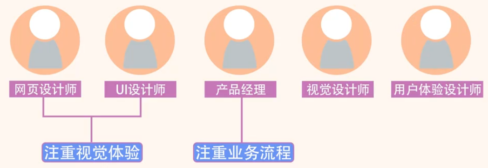
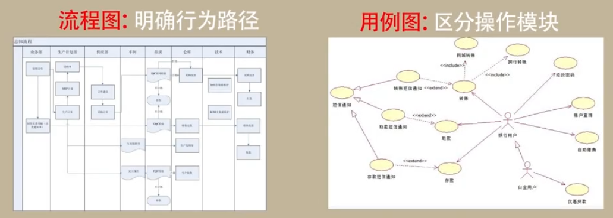
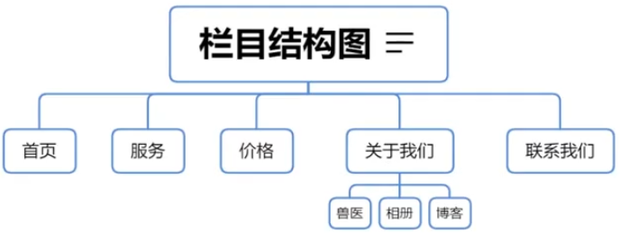
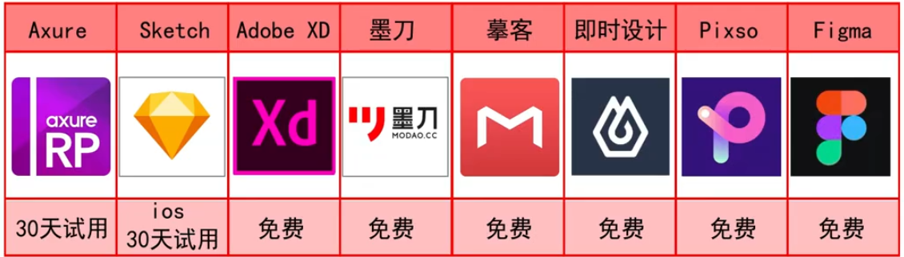

# 网站设计

从形式上来看,网站就是多个链接起来的网页。
从功能上来看，网站承担了信息展示和收集的作用。

早期的网站多为静态网站

现代的网站多为动态网站

B/S模式软件:BrowserlServer模式,通过浏览器中的网页进行数据收集和展示，以此提供信息服务的软件系统。

当时传统的软件形式主要为,Client/Server模式的软件,简称为C/S模式。例如:QQ、迅雷等。相对于C/S模式,与之相对的B/S模式表现出了极大的优势。

网页设计:侧重于信息的展示，以视觉体验为主。
软件设计:不但需要考虑信息的展示，还需要从业务流程的视角考虑交互体验。

网站/软件设计流程

1. 明确定位
2. 原型设计
3. UI设计
4. 前端实现

岗位说明

| 岗位       | 职责                   | 输出                                         |
| ---------- | ---------------------- | -------------------------------------------- |
| 产品设计   | 明确需求，梳理产品逻辑 | 原型图(产品设计文档)、线框图(或高保真原型图) |
| UI设计师   | 绘制页面,优化视觉体验  | 网页设计图                                   |
| 前端工程师 | 实现页面，保证页面适配 | 网页文件(前端交互逻辑)                       |

产品经理

需要解决的问题： 

网站的作用是什么?网站的目标人群是谁?网站的内容有哪些?如何推广网站，如何让网站盈利等。

工具：office、axure、sketch等 

UI设计师

需要解决的问题： 

确定网页风格，确定配色方案,确定不同的终端的适配效果等。

工具：photoshop illastrator

前端开发工程师

需要解决的问题： 

网页的适配问题，网页文件的大小,素材的加载速度等问题

工具：vscode等代码开发工具

# 思考方向

“宠爱有家”网站

网站定位:企业官网，营销型网站

网站作用:让目标用户了解我们的业务和价格，联系我们

目标人群:门店附近需要宠物服务的人们

网站内容:公司介绍、业务介绍、团队介绍、联系方式

功能扩展:未来能够实现在线预约、商城、博客、论坛就更好了

网站内容:

栏目结构图:网站有哪些菜单

信息结构图:板块有哪些内容

网站结构图:网页之间怎样链接

软件系统:

流程图:用户的行为路径

用例图:用户的操作模块

企业型网站:公司简介、企业动态、产品介绍、客户服务、
案例展示、联系方式、在线留言等基本内容。更多内容如:常见问题、营销网络、招贤纳士、在线论坛、英文版等。

个人网站:小型博客和论坛居多，
栏目设置通常由站长的个人喜好而定。

栏目数量控制在5-7个之间

营销型网站内容:标志、宣传语、标题、优势、行动号召、
成功案例、客户评价、内容呈现、生产过程、服务过程、社会证据、荣誉展示、常见问题、风险承诺、免费资源、说服逻辑等。

### 原型设计软件

Axure官网: https://www.axure.com/

即时设计: https://js.design/

Sketch官网: https://www.sketch.com/

墨刀官网: https://modao.cc/

**摹客官网**:https://www.mockplus.cn/

xd官网: https://www.adobe.com/cn/products/xd.html