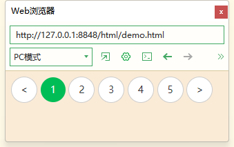

## 行级元素与块级元素

信息类的网站大多采用单列、两列或三列布局。以及混合结构。

可以多参考其他网站的界面。

块级元素特点：

- 独占一行
- 可以控制高宽、内外边距
- 宽度默认是容器（父级宽度）的100%
- 通常由容器级标签构成，可以容纳行内元素和块级元素。

> 容器级标签：能够嵌套其他所有标签的标签
>
> 文本级标签：只能嵌套文字、图片、超链接的标签
>
> p、h1~h6、dt里面不能嵌套块级元素

行级元素特点：

- 相邻行级元素在一行上，一行显示多个
- 高宽设置无效，水平方向内外边距可以设置、垂直方向无效
- 默认宽度就是内容宽度
- 只能容纳文本或其他行级元素。

img、input、td标签属于行内块元素

行内块元素特点：

- 可以设置可以设置宽高、内外边距和对齐属性
- 和相邻行内元素（行内块）在一行上，但是之间会有空白缝隙
- 默认宽度就是它本身内容的宽度。

### 显示模式转换

块级元素转行级元素

```css
div {
    display: inline;
}
```

行级元素转块级元素

```css
span {
    display: block;
}
```

转换为行内块元素

```css
div {
    display: inline-block;
}
```

## 分页案例

```css
body {
	background-color: antiquewhite;
}
.paging a{
	text-decoration: none;
	font-size: 14px;
	color: #333;
	border: 1px solid #ccc;
	border-radius: 50%;
	display: inline-block;
	width: 36px;
	height: 36px;
	text-align: center;
	line-height: 36px;
	background-color: white;
}

.paging .current {
	background-color: #00BD56;
	border: none;
	color: white;
}

```

```html
<div class="paging">
    <a href="#" class="prev">&lt;</a>
    <a href="#" class="current">1</a>
    <a href="#">2</a>
    <a href="#">3</a>
    <a href="#">4</a>
    <a href="#">5</a>
    <a href="#" class="next">&gt;</a>
</div>
```



## 文本溢出

文字内容超出边界

```css
p {
    width: 100px;
    height: 100px;
    border: 1px solid firebrick;
    color: #333
}

/* 单行文本溢出 */
p:nth-of-type(1) {
    /* 当前文字超过边框也不会换行 */
    white-space: nowrap;
    
    /* 让超出的文字消失 */
    overflow: hidden;
    
    /* 溢出的部分显示省略号 */
    text-overflow: ellipsis;
}

/* 多行文本溢出 

/* 多行文本溢出 方法1：只适用于webkit浏览器*/
p:nth-of-type(2) {
    /* 当前文字超过边框也不会换行 */
    display: -webkit-box;  /* 对象转换为弹性盒模式 */
    
    -webkit-box-orient: vertical;
    -webkit-line-clamp: 5;  /* 显示5行 */
    /* 超出部分添加省略号 */
    overflow: hidden;
    line-height: 1.3em; 
}

/* 多行文本溢出 方法2：*/
p:nth-of-type(3)::after {
    content: "...";
    position: absolute;
    bottom: 2px;
    right: 0px;
    padding: 0 3px;
    background: #fff;
    /* 边缘处理 */
    box-shadow: 0 0 10px #fff;
}
```


