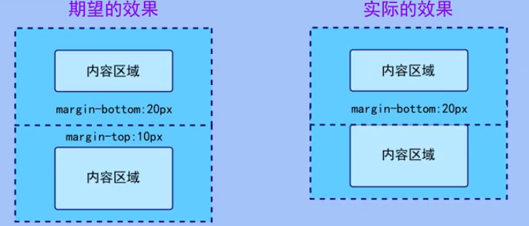
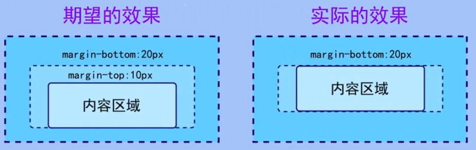

# 内外边距


可以用这个网站调试：http://output.jsbin.com/puyazix

**内边距**：指边框与内容之间的距离，用padding属性设置

外边距：指元素之间创建的看空白，通过margin属性设置。这段空白通常不能放置其他内容。


```css
div {
    padding: 0px;
    /* 上 右 下 左 */
    padding: 0px 10px 20px 50px;
    /* 上 左右 下 */
    padding: 0px 20px 50px;
    /* 上下 左右 */
    padding: 0px 50px;
}
```

### 通过外边距使元素水平居中

条件：

- 必须是块级元素
- 必须指定了宽度

```css
div {
    width: 100px;
    height: 100px;
    background: lightblue;
    border: 2px solid firebrick;
    margin: 0px auto; /* 上下为0，左右自动 */
}

span {
    text-align: center;  /* 没有效果 */
    margin: 20px; /* 行内元素上下边距无效 */
    background: gold;
    /* 需要改变为block来使它居中 */
    display: block;
}
```

### 清楚元素默认内外边距

```css
* {
/* 取消默认内边距 */
    padding: 0px;
    margin: 0;
}
li {
    /* 取消这个，前面的小黑点也不会回来了 */
    /* 列表项默认有内边距，但内边距不影响列表样式 */
    /* 如果内边距为0，会因为空间不足而无法显示 */
    list-style-type: none;
}
```

### 菜单样式

```css
* {
	margin: 0;
	padding: 0;
}

ul li {
	list-style: none;
	background-color: lightgrey;
	width: 200px;
	height: 50px;
	line-height: 50px;
	margin: 3px;
	text-align: right;
	padding-right: 30px;
	/* display: inline-block; */
}

ul li a {
	color: white;
	text-decoration: none;
	font-size: 20px;

}

.active, li:hover {
	background-color: lightgreen;
	border-bottom: 2px solid gold;
	/* 固定元素大小 使得总共高度还是50px */
	/* height: 48px; */
	margin-bottom: -2px;
	
	/* background: url(images/bg3.jpg) no-repeat center center; */
	/* background-size: cover; */
}


```

```html
<!-- nav>ul>(li[class='nav-item']>a[href='#'][class='nav-link'])*5 -->
<nav>
    <ul>
        <li class="nav-item active"><a href="#" class="nav-link">首页</a></li>
        <li class="nav-item"><a href="#" class="nav-link">关于我们</a></li>
        <li class="nav-item"><a href="#" class="nav-link">服务</a></li>
        <li class="nav-item"><a href="#" class="nav-link">价格</a></li>
        <li class="nav-item"><a href="#" class="nav-link">联系我们</a></li>
    </ul>
</nav>
```

### 可能的问题

使用marqin定义块元素的垂直方向外边距时,可能会出现外边距的合并。

**相邻块元素**垂直外边距的合并

**嵌套块元素**垂直外边距的合并

当上下相邻的两个块元素相遇时，如果上面的元素有下外边距margin-bottom，下面的元素有上外边距margin-top,则他们之间的垂直间距不是margin-bottom与margin-top之和,而是两者中的**较大者**。这种现象被称为相邻块元素垂直外边距的合并(也称外边距塌陷）。



解决方案

```css
div:nth-child(1) {
    margin-bottom: 50px;
}
div:nth-child(2) {
    margin-bottom: 100px;
}
```

**嵌套块元素**垂直外边距的合并

原因：子元素没有找到父元素的顶部边界。


对于两个嵌套关系的块元素，如果父元素没有顶部内边距及边框，则父元素的顶部外边距会与子元素的顶部外边距发生合并，合并后的外边距为两者中较大的数值，即使父元素的顶部外边距为0，也会发生合并。




```css
.father {
    width: 200px;
    height: 200px;
    
    background-color: red;
    margin-top: 30px;
    
    /* 方法1 给父元素添加顶部边框*/
    border: 1px solid green;
    
    /* 方法2 给父元素添加顶部内边距*/
    padding: 1px;
    
    /* 方法3 使用overflow*/
    /* 推荐 */
    overflow: hidden;
    
    /* 方法4 在当前元素上边加个看不见的元素 */
    
}
.father::before {
    content: "";
    display: table;
}
.son {
    /* 希望蓝色向下移动50个px */
    margin-top: 50px;
    background-color: blue;
}
```

```html
<div class="father">
    <!-- 方法4 -->
    <!-- <table></table> -->
    <div class="son"></div>
</div>
```

## 综合练习

文字卡牌效果

```css
* {
	margin: 0;
	padding: 0;
}

body {
	background-color: lightgrey;
}

.blog-entry {
	width: 250px;
	background-color: white;
	/* 一行显示3个卡片 */
	display: inline-block;
	margin: 0px 15px;
	border-radius: 3px 3px 0px 0px;
}

section {
	width: 850px;
	margin: 0px auto;
}


.blog-entry>a {
	display: block;
	height: 250px;
	/* background: url(../images/背景.png); */
	background-size: cover;
	border-radius: 5px;
}

.text {
	padding: 24px;
	font-size: 12px;
	/* 保证盒子大小不变来变去的 */
	box-sizing: border-box;
	height: 130px;
}

.text a {
	text-decoration: none;
	color: black;
	display: inline-block;
}

.text .pub_date,
.text .author {
	color: blue;
	/*不加.text 优先级权重较低 */
}

.text .comments {
	color: green;
}

.text a:hover {
	color: black;
}

.text .heading:hover {
	color: green;
}

/* 设置文本间距 */
.info {
	margin-bottom: 8px;
}

.heading {
	/* 行级元素无下边距 */
	margin-bottom: 16px;
	font-size: 18px;
}

.info a {
	margin-right: 5px;
	margin-bottom: 5px;
}
```

```html
<section>
    <div class="blog-entry">
        <a href="#" style="background-image: url(images/背景.png);"></a>
        <div class="text">
            <div class="info">
                <a href="#" class="pub_date">2022年2月22日</a>
                <a href="#" class="author">无名氏</a>
                <a href="#" class="comments">评论: 3</a>
            </div>
            <h3>
                <a href="#" class="heading">文章标题：此处填写文章标题</a>
            </h3>
        </div>
    </div>
    <div class="blog-entry">
        <a href="#" style="background-image: url(images/背景2.png);"></a>
        <div class="text">
            <div class="info">
                <a href="#" class="pub_date">2022年2月22日</a>
                <a href="#" class="author">无名氏</a>
                <a href="#" class="comments">评论: 3</a>
            </div>
            <h3>
                <a href="#" class="heading">文章标题：此处填写文章标题</a>
            </h3>
        </div>
    </div>
    <div class="blog-entry">
        <a href="#" style="background-image: url(images/背景3.png);"></a>
        <div class="text">
            <div class="info">
                <a href="#" class="pub_date">2022年2月22日</a>
                <a href="#" class="author">无名氏</a>
                <a href="#" class="comments">评论: 3</a>
            </div>
            <h3>
                <a href="#" class="heading">文章标题：此处填写文章标题</a>
            </h3>
        </div>
    </div>

</section>

```


