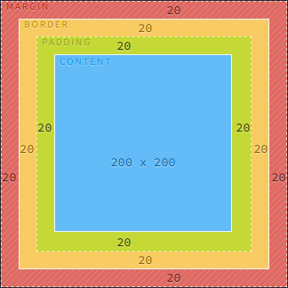
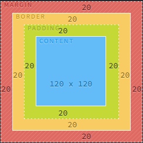
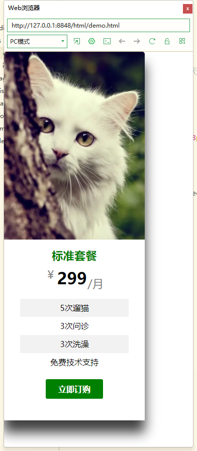

# 盒模型

## 盒模型概念

所谓的盒子模型就是把HTML页面的元素看作一个矩形盒子，矩形盒子由四部分组成：

- 内容(content)
- 内边距(padding)
- 边框(border)
- 外边距(margin)

这个网站可以了解一下盒模型：http://output.jsbin.com/puyazix

## **盒模型的分类**

W3C盒模型是content-box，IE浏览器的盒模型是border-box

> 一句话理解，两者的差别在于宽(width)和高的定义方式不同。
>
> content-box: 

二者差别：https://codepen.io/carolineartz/full/ogVXZj

假设上下左右的边框、内外边距都是20，内容是200x200。

content-box总共的宽高是320x320：



border-box总共的宽高是240x240：




## 盒模型真实尺寸

盒模型相关样式

- width
- height
- border
- padding
- margin

盒子的真实尺寸只会受到宽度、高度、边框、内边距四个属性的影响，**不受外边距属性影响**。

> 提示：
>
> - 宽(width)高(height)对行内元素(如span, a)无效。
> - 计算盒子模型的总高度时，还应考虑上下两个盒子垂直外边距合并的情况。
> - 如果一个盒子没有给定宽度/高度或者继承父亲的宽度/高度，则padding 不会影响本盒子大小。

哪个好用？

border-box 边框盒更好用，因为宽度不用考虑padding和border的影响，如果是处理文字，可以用text-overflow等来省略。

因为border-box的width会将padding和border包含在内，布局时更好控制，尤其是在响应式布局中。

## 盒子的阴影

语法

```css
div {
    /* 前两个属性必须，其他可以省略 */
    /* 水平阴影 垂直阴影 模糊距离 阴影尺寸 阴影颜色 内/外阴影 */
    box-shadow: 3px 3px 5px 4px rgba(0,0,0,1) inset;
    
    /* 默认外阴影(outset) 但是不能写 */
    box-shadow: 3px 3px 5px 4px rgba(0,0,0,1);
}
```

- 水平阴影：3px表示向右，-3px则表示向左
- 上下阴影：3px表示向下，-3px则表示向上
- 模糊距离：该值越大，阴影越模糊，该值越小，阴影越接近实体
- 阴影尺寸：该值越大，阴影范围越大。

## 案例

制作流程：

- 分析页面结构
- 设定页面元素
- 设定元素尺寸
- 设定元素袭击
- 设定动态效果
- 设定元素间距



```css
* {
	margin: 0;
	padding: 0;
	box-sizing: border-box;
	list-style: none;
}

.package_box {
	width: 280px;
}

.package_img {
	width: 100%;
	display: block;
	border-top-left-radius: 5px;
	border-top-right-radius: 5px;
}

.package_details {
	width: 100%;
	height: 360px;
	background-color: white;
	text-align: center;
	
	padding: 16px;
}

.package_name {
	display: block;
	font-size: 22.4px;
	font-weight: 600;
	color: green;
	
	margin-bottom: 8px;
}

.package_price {
	font-size: 32px;
	font-weight: 600;
	color: black;
}

.package_price sub,
.package_price sup {
	font-size: 22.4px;
	font-weight: 400;
	color: gray;
}

/* 调整文字间距 */
.package_price span,
.package_price sub{
	margin-left: -8px;
}
.package_list {
	font-size: 16px;
	padding: 16px;
}

.package_list_item:nth-of-type(odd) {
	background-color: rgba(0, 0, 0, 0.05);
}

.package_list_item {
	height: 36px;
	line-height: 36px;
}

.btn {
	color: white;
	font-size: 16px;
	font-weight: 600;
	background-color: green;
	/* 调整边界样式 transparent指定全透明边框 */
	border: 1px solid transparent;
	border-radius: 3px;
	
	padding: 8px 24px;
	
	/* 鼠标移到按钮上，图标变化*/
	cursor: pointer;
}

/* 动态效果 */
.package_box:hover {
	box-shadow: 0 24px 38px rgba(0, 0, 0, .75);
}

/* 选中文字的样式修改 */
*::selection {
	background-color: green;
	color: white;
}


```

```html
<!DOCTYPE html>
<html>
	<head>
		<meta charset="utf-8">
		<title></title>
		<link rel="stylesheet" href="./css/demo.css">
	</head>
	<body>
	<div class="package_box">
		
		<div class="package_details">
			<span class="package_name">标准套餐</span>
			<span class="package_price">
				<sup>￥</sup>
				<span>299</span>
				<sub>/月</sub>
			</span>
			<ul class="package_list">
				<li class="package_list_item">
					5次遛猫
				</li>
				<li class="package_list_item">
					3次问诊
				</li>
				<li class="package_list_item">
					3次洗澡
				</li>
				<li class="package_list_item">
					免费技术支持
				</li>
			</ul>
			<button class="btn">立即订购</button>
		</div>
	</div>
	</body>
</html>

```

## 鼠标箭头案例

```css
div {
    /* 使用图片表示图标，auto表示如果图片失效，则自动选择正常的样式 */
    cursor: url('images/heart.png'), auto;
}
```

