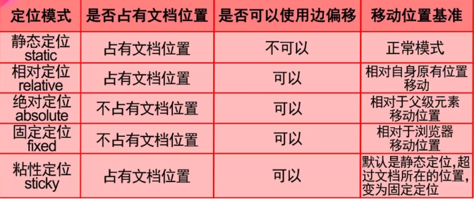
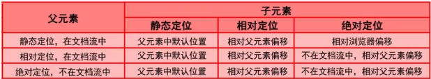
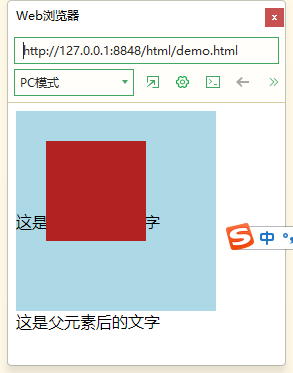
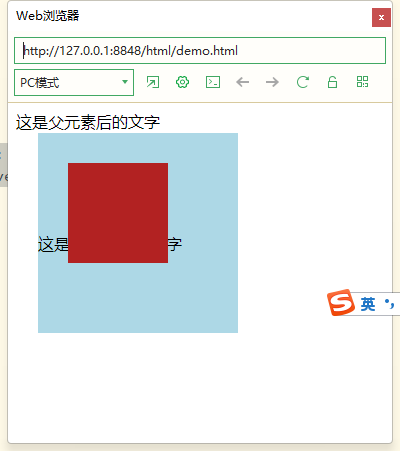

# 定位

定位在页面布局中应用广泛且重要，是**重点和难点**。 

CSS中元素的三种定位机制：

- 普通流（normal flow，文档流）：按照HTML文档代码定义的顺序显示
- 定位方案（position schema）：通过position属性和偏移量来决定元素的位置与显示
- 浮动（floats）：根据外部元素宽度，动态调整元素的相对位置，方便实现图文混排。

## 元素定位属性

元素的定位属性主要包括定位模式和边偏移两部分。

### 边偏移

- top：顶端偏移量，定义元素相对于其父元素上边线的距离
- bottom：底部偏移量，定义元素相对于其父元素下边线的距离
- left：左侧偏移量，定义元素相对于其父元素左边线的距离
- right：右侧偏移量，定义元素相对于其父元素右边线的距离

## 定位模式

在CSS中，position属性用于定义元素的定位模式：

```css
div {
    position: static;
}
```

- static：静态定位（默认定位方式）
- relative：相对定位，相对于其原文档流的位置进行定位
- absolute：绝对定位，相对于其上一个已经定位的父元素进行定位
- fixed：固定定位，相对于浏览器窗口进行定位
- sticky：粘性定位，根据用户的滚动位置进行定位

### 演示

```css
* {
	margin: 0;
}

#div_static {
	width: 80%;
	height: 50px;
	margin: 0px auto;
	background-color: lightblue;
	/* 默认就是静态 */
	position: static;

	/* 无效 */
	top: 50px;
	left: 100px;
}

#div_absolute {
	width: 30px;
	height: 100px;
	background-color: gold;
	text-align: center;
	line-height: 25px;
	/* 绝对定位元素脱离了文档流，不会影响其他div的排布 */
	position: absolute;
	/* 此时边偏移生效 */
	right: 0px;
	top: 100px;
}

#div_relative {
	width: 100px;
	height: 100px;
	background-color: orange;
	/* 相对定位元素没有脱离文档流 相对于原来的位置相偏移 */
	/* 此时边偏移生效 */
	position: relative;
	left: 100px;
	top: 10px;
}

#div_fixed {
	width: 200px;
	height: 200px;
	background-color: pink;
	/* 固定定位 相对于浏览器进行定位 */
	/* 滚动网页内容的时候，固定定位的标签不会变化 */
	/* 此时边偏移生效 */
	position: fixed;
    right: 0px;
	bottom: 0px; 
}

#div_sticky {
	width: 80%;
	height: 50px;
	background-color: lightgreen;
	margin: 0px auto;
	/* 默认是静态定位，超过文档所在位置变为固定定位 */
	/* 往下拖动的时候，这个标签会被粘到顶部 */
	position: sticky;
	top: 20px;
}

.demo {
	height: 300px;
	width: 100%;
	background-color: lightgrey;
	margin: 20px;
}
```

```html
<!DOCTYPE html>
<html>
	<head>
		<meta charset="utf-8">
		<title></title>
		<link rel="stylesheet" href="./css/demo.css">
	</head>
	<body>
		<div id="div_static">静态定位</div>
		<div id="div_absolute">绝对定位</div>
		<div id="div_relative">相对定位</div>
		<div id="div_fixed">固定定位</div>
		<div id="div_sticky">粘性定位</div>
		<div class="demo">文章1</div>
		<div class="demo">文章2</div>
	</body>
</html>

```


### **静态定位**

静态定位是所有元素的默认定位方式。元素定位于静态位置，也就是各个元素在HTML文档流中默认的位置。

在静态定位状态下，无法通过边偏移属性（top、bottom、left或right）来改变元素的位置。

### **相对定位**

相对定位是将元素相对于它在标准流中的位置进行定位，可以将元素定位于相对位置。

对元素设置相对定位后，可以通过边偏移属性改变元素的位置，但是它在文档流中的位置仍然保留。

就是说，相对定位的盒子仍在标准流中，它后面的盒子仍以标准流方式对待它。

### **绝对定位**

如果文档可滚动，绝对定位元素会随着它滚动，因为元素最终会相对于正常流的某一部分定位。

元素可以通过边偏移移动位置，但是它完全脱标，完全不占位置。

若所有父元素都没有定位，以浏览器为准对齐(document文档)。

父级有定位，绝对定位是将元素依据最近的已经定位（绝对、固定或相对定位）的父元素（祖先）进行定位。

如果只是给子盒子指定了绝对定位，但是没有给与边偏移，则该盒子以标准流来显示排序，和上一个盒子的底边对齐，但是不占有位置。

> 子级是绝对定位，不会占有位置， 可以放到父盒子里面的任何一个地方。
>
> 父盒子布局时，需要占有位置，因此父亲只能是相对定位.

### **固定定位**

固定定位是绝对定位的一种特殊形式，它以浏览器窗口作为参照物来定义网页元素。

当对元素设置固定定位后，它将脱离标准文档流的控制，始终依据浏览器窗口来定义自己的显示位置。不管浏览器滚动条如何滚动也不管浏览器窗口的大小如何变化，该元素都会始终显示在浏览器窗口的固定位置。

> 固定定位的元素跟父亲没有任何关系，只认浏览器。
>
> 固定定位完全脱标，不占有位置，不随着滚动条滚动。

### 粘性定位

占有文档位置，可以使用边偏移。

### 总结





- 子元素**相对定位**时，**相对父元素**偏移
- 子元素**绝对定位**时：
  - 父元素**静态定位**：子元素**相对浏览器偏移**
  - 父元素是**相对定位**或**绝对定位**：子元素**相对父元素偏移**
- 父子元素都准遵守：
  - **相对定位**时，元素**在文档流**中
  - **绝对定位**时，元素**不在文档流**中

案例

```html
<div class="father">
    <div class="son">
    </div>这是子元素后的文字
</div>这是父元素后的文字
```

```css
.father {
	width: 200px;
	height: 200px;
	background-color: lightblue;
}

.son {
	width: 100px;
	height: 100px;
	background-color: firebrick;
	position: relative;
	top: 30px;
	left: 30px;
}
```




子元素设置为相对定位时，相对于父元素进行偏移

```css
.father {
	width: 200px;
	height: 200px;
	background-color: lightblue;
	
	
	position: absolute;
	top: 30px;
	left: 30px;
}

.son {
	width: 100px;
	height: 100px;
	background-color: firebrick;
	position: relative;
	top: 30px;
	left: 30px;
}
```




## 叠放次序

当对多个元素同时设置定位时，定位元素之间有可能会发生重叠。

要想调整重叠定位元素的堆叠顺序，可以对定位元素应用z-index层叠等级属性。

```css
div {
    z-index: 2;
}
```

默认值为0，取值越大，越上层

取值相同，后来居上

值一定不能加单位

只有相对定位、绝对定位、固定定位有此属性，其他标准流、浮动、静态定位都无此属性，亦不可指定此属性。

## 定位模式转换

元素添加了绝对定位和固定定位之后， 元素模式会自动转换为**行内块模式**。

因此**行内元素**如果添加了 绝对定位或者固定定位后，可以不用转换模式，直接给高度和宽度就可以了。


## 元素的显示与隐藏

在CSS中有三个显示和隐藏的单词比较常见，我们要区分开，他们分别是 display visibility 和overflow。

他们的主要目的是让一个元素在页面中消失，但是不在文档源码中删除。 最常见的是网站广告，当我们点击类似关闭不见了，但是我们重新刷新页面，它们又会出现和你玩躲猫猫！！

### display

```css
div {
    /* 隐藏对象，隐藏之后不再保留位置 */
    /* 想要显示，复制block即可 */
    display: none;
}
```

### visibility

是否可见

```css
div {
    visibility: visible;
    /* 隐藏之后，继续保留原有位置 */
    visibility: hidden;
}
```

### overflow

检索或设置当对象的内容超过其指定高度及宽度时如何管理内容。

```css
div {
    /* 不剪切内容也不添加滚动条 */
    overflow: visible;
    
    /* 超出自动显示滚动条，不超出不显示滚动条 */
    overflow: auto;
    
    /* 不显示超过对象尺寸的内容，超出的部分隐藏掉 */
    overflow: hidden;
    
    /* 不管超出内容否，总是显示滚动条 */
    overflow: scroll;
}
```

## 子元素在父元素中居中

元素添加了绝对定位和固定定位之后， 元素模式会自动转换为**行内块模式**。

因此**行内元素**如果添加了 绝对定位或者固定定位后，可以不用转换模式，直接给高度和宽度就可以了。


```css
a {
    /* display: block; */
    width: 50px;
    height: 50px;
    position: absolute;
    /* 垂直方向居中 */
    top: 50%;
    margin-top: -25px;
    
    /* 水平方向居中 */
    left: 50%;
    margin-left: -25px;
    cursor: zoom-in;  /* 放大镜 */
}
```

## 案例


```html
<!DOCTYPE html>
<html>
	<head>
		<meta charset="utf-8">
		<title></title>
		<link rel="stylesheet" href="./css/demo.css">
	</head>
	<body>
	<div class="service_cards">
		<div class="service">
			<div class="service_icon" style="background-image: url(images/点赞.png);" ></div>
			<div class="service_intro">
				<h3 class="heading">遛狗</h3>
				<p>男主的宠物之旅从熊猫开始，熊猫作为可爱的萌宝宝，让人很期待主角和熊猫的互动,男主的宠物之旅从熊猫开始，熊猫作为可爱的萌宝宝，让人很期待主角和熊猫的互动，自然能够让读者有兴趣继续看下去。同时本文轻松的文风，让人读起来也不会费脑筋。</p>
			</div>
			<a href="#" class="service_detail">&gt;</a>
		</div>
	</div>
	</body>
</html>

```

```css
* {
	margin: 0;
	padding: 0;
	box-sizing: border-box;
}

body {
	background-color: lightblue;
}

.service {
	width: 380px;
	height: 280px;
	background-color: white;
	padding-left: 24px;
	padding-right: 24px;
	
	position: relative;
	top: 100px;
	left: 50px;
	
	/* 会把图标也隐藏 */
	/* overflow: hidden; */
	
}

/* 避免溢出 */
.service::before{
	content: "";
	display: table;
}

.service_icon {
	width: 100px;
	height: 100px;
	background: #f0f0f0 no-repeat center;
	background-size: 60px 60px;
	border-radius: 50%;
	
	position: absolute;
	top: -50px;
	left: 50%;
	margin-left: -50px;
}

.heading {
	text-align: center;
	font-size: 20px;
}

.service_intro > p {
	width: 100%;
	height: 130px;
	font-size: 15px;
	line-height: 1.8;
	text-align: center;
	color: #808080;
	
	/* background-color: gold; */
	overflow: hidden;
}

.service_intro{
	/* background-color: lightgray; */
	padding: 24px;
	margin-top: 40px;
}

.service_detail{
	text-decoration: none;
	line-height: 50px;
	text-align: center;
	font-size: 30px;
	color: white;
	background-color: green;
	display:block;
	width: 50px;
	height: 50px;
	border-radius: 50%;
	
	
	position: absolute;
	left: 50%;
	margin-left: -25px;
	bottom: -25px;
	
}

.service_detail:hover {
    color: green;
    background-color: lightgrey;
}
```

