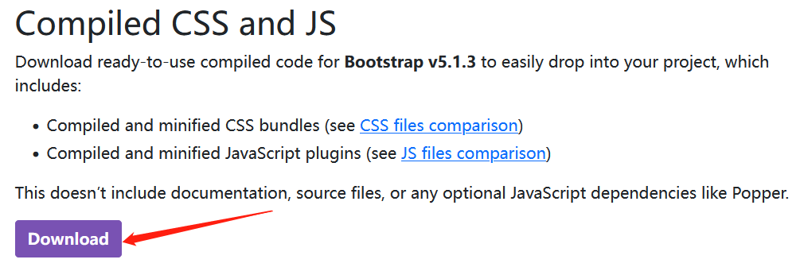
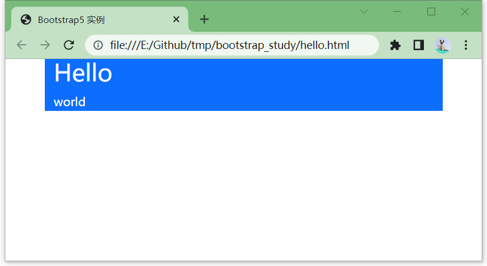
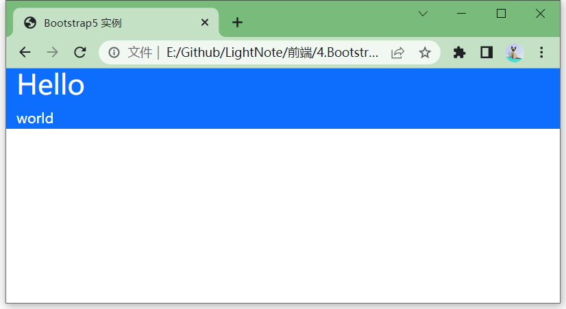
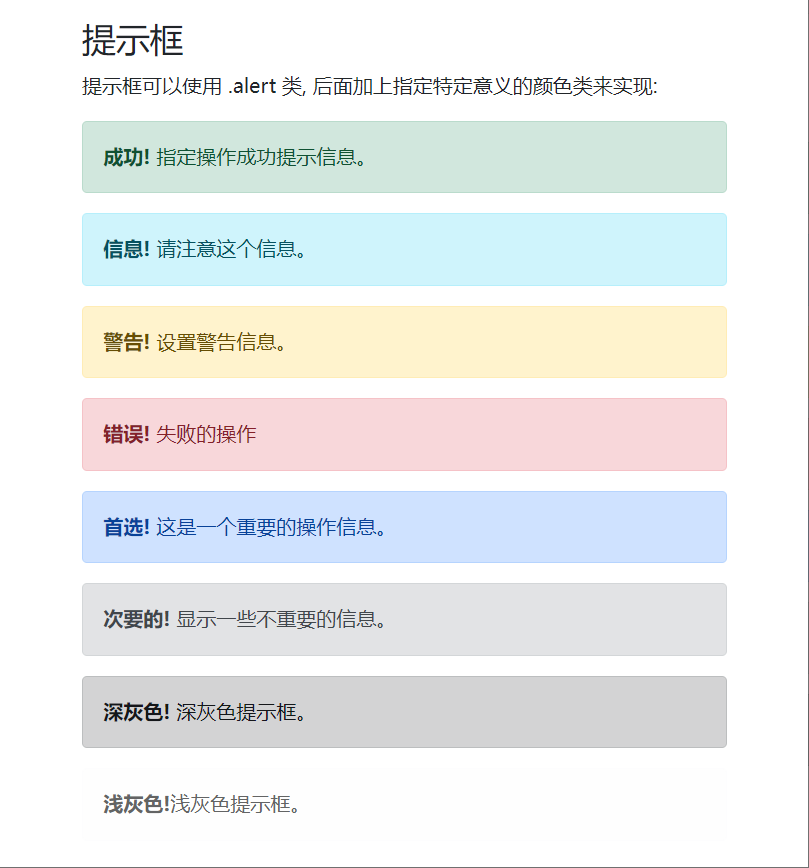

Bootstrap是基于HTML、cSs、JavaScript开发的简洁、直观、强悍的前端开源工具包。
它帮我们实现了很多常用的基本样式，组件和网页动态效果。

官网:https://getbootstrap.com/

中文网站(非官方):https://www.bootcss.com/

教程参考:https://www.runoob.com/bootstrap5/

## 安装使用

### 下载到本地

在[bootstrap下载地址](https://getbootstrap.com/docs/5.1/getting-started/download/)页面下载bootstrap，或直接点击[bootstrap-5.1.3-dist.zip](https://github.com/twbs/bootstrap/releases/download/v5.1.3/bootstrap-5.1.3-dist.zip)下载。




创建一个`bootstrap_study`文件夹，在这个目录下创建`static`文件夹，将下载好的压缩包`bootstrap-5.1.3-dist.zip`解压至该文件夹。形成的目录如下

```
  |- bootstrap_study
    |- static
      |- css
      |- js
```


### 使用CDN

```html
<!-- 新 Bootstrap5 核心 CSS 文件 -->
<link rel="stylesheet" href="https://cdn.staticfile.org/twitter-bootstrap/5.1.1/css/bootstrap.min.css">
 
<!-- 最新的 Bootstrap5 核心 JavaScript 文件 -->
<script src="https://cdn.staticfile.org/twitter-bootstrap/5.1.1/js/bootstrap.bundle.min.js"></script>
```

### 通用框架

bootstrap引入css和script就能使用。

```html
<!DOCTYPE html>
<html>
<head>
  <title>Bootstrap5 实例</title>
  <meta charset="utf-8">
  <meta name="viewport" content="width=device-width, initial-scale=1">
  <link href="./static/css/bootstrap.min.css" rel="stylesheet">
  <script src="./static/js/bootstrap.bundle.min.js"></script>
</head>
<body>
    ...
</body>
</html>
```


## 容器

bootstrap需要一个容器元素来包裹网站内容。

- `.container` 类用于固定宽度并支持响应式布局的容器。
- `.container-fluid` 类用于 100% 宽度，占据全部视口（viewport）的容器。

### 固定宽度

在`bootstrap_study`目录下创建`hello.py`文件演示第一个bootstrap页面。

```html
<div class="container bg-primary text-white">
  <h1>Hello</h1>
  <p>world</p> 
</div>
```

[hello.html](./bootstrap_study/hello.html)



bootstrap通过设置多个class来控制样式，比如这里的

- `bg-primary`：设置背景颜色
- `text-white`：设置字体为白色

### 100%宽度

使用`.container-fluid`类会占据全部视口(viewport)

```html
<div class="container-fluid bg-primary text-white">
  <h1>Hello</h1>
  <p>world</p> 
</div>
```

[hello_fluid.html](./bootstrap_study/hello_fluid.html)



### 容器格式

默认情况下容器只有左右两侧有内边距。

可以通过`pt-5`来设置顶部边距，比如：

```html
<div class="container pt-5 bg-primary text-white">
  <h1>Hello</h1>
  <p>world</p> 
</div>
```

还可以设置容器边框

```html
<div class="container pt-5 border bg-primary text-white">
  <h1>Hello</h1>
  <p>world</p> 
</div>
```

### 响应式容器

容器大小随着浏览器大小而改变。

```html
<div class="container-sm">.container-sm</div>
<div class="container-md">.container-md</div>
<div class="container-lg">.container-lg</div>
<div class="container-xl">.container-xl</div>
<div class="container-xxl">.container-xxl</div>
```

| Class | 超小屏幕<576px | 小屏幕≥576px | 中等屏幕≥768px | 大屏幕≥992px | 特大屏幕≥1200px | 超级大屏幕≥1400px |
| ---------------- | --------------- | ------------ | -------------- | ------ | ------------------------ | -------------------------- |
| `.container-sm`  | 100%            | 540px        | 720px          | 960px  | 1140px                   | 1320px                     |
| `.container-md`  | 100%            | 100%         | 720px          | 960px  | 1140px                   | 1320px                     |
| `.container-lg`  | 100%            | 100%         | 100%           | 960px  | 1140px                   | 1320px                     |
| `.container-xl`  | 100%            | 100%         | 100%           | 100%   | 1140px                   | 1320px                     |
| `.container-xxl` | 100%            | 100%         | 100%           | 100%   | 100%                     | 1320px                     |

## 网格系统

Bootstrap 5 网格系统有以下 6 个类:

- .col- 针对所有设备。
- .col-sm- 平板  - 屏幕宽度等于或大于 576px。
- .col-md- 桌面显示器  - 屏幕宽度等于或大于 768px。
- .col-lg- 大桌面显示器  - 屏幕宽度等于或大于 992px。
- .col-xl- 特大桌面显示器 - 屏幕宽度等于或大于 1200px。
- .col-xxl-  超大桌面显示器 - 屏幕宽度等于或大于 1400px。

可以控制不同屏幕宽度下，各列的宽度比例，比如

```html

<div class="container-fluid">
  <div class="row">
    <div class="col-sm-3 col-md-6">
      <p>RUNOOB</p>
    </div>
    <div class="col-sm-9 col-md-6">
      <p>菜鸟教程</p>
    </div>
  </div>
</div>

```

## 文字排版

### display

Bootstrap 还提供了四个 Display 类来控制标题的样式: .display-1, .display-2, .display-3, .display-4。

> Display 标题可以输出更大更粗的字体样式。

```html

<div class="container">
  <h1>Display 标题</h1>
  <p>Display 标题可以输出更大更粗的字体样式。</p>
  <h1 class="display-1">Display 1</h1>
  <h1 class="display-2">Display 2</h1>
  <h1 class="display-3">Display 3</h1>
  <h1 class="display-4">Display 4</h1>
</div>

```

### small

在 Bootstrap 5 中 HTML `<small> `元素用于创建字号更小的颜色更浅的文本:

```html
<div class="container">
  <h1>更小文本标题</h1>
  <p>small 元素用于字号更小的颜色更浅的文本:</p>       
  <h1>h1 标题 <small>副标题</small></h1>
  <h2>h2 标题 <small>副标题</small></h2>
  <h3>h3 标题 <small>副标题</small></h3>
  <span class="display-1">hello</span>
  <span><small>world</small></span>
</div>
```

### mark

Bootstrap 5 定义 `<mark>` 标签及 .mark 类为黄色背景及有一定的内边距:

```html
<div class="container">
  <h1>高亮文本</h1>    
  <p>使用 mark 元素来 <mark>高亮</mark> 文本。</p>
</div>
```

### abbr

Bootstrap 5 定义 HTML `<abbr> ` 元素的样式为显示在文本底部的一条虚线边框:

```html
<div class="container">
  <h1>Abbreviations</h1>
  <p>The abbr element is used to mark up an abbreviation or acronym:</p>
  <p>The <abbr title="World Health Organization">WHO</abbr> was founded in 1948.</p>
</div>
```

### blockquote

引用

```html
<div class="container">
  <h1>Blockquotes</h1>
  <p>The blockquote element is used to present content from another source:</p>
  <blockquote class="blockquote">
    <p>For 50 years, WWF has been protecting the future of nature. The world's leading conservation organization, WWF works in 100 countries and is supported by 1.2 million members in the United States and close to 5 million globally.</p>
    <footer class="blockquote-footer">From WWF's website</footer>
  </blockquote>
</div>
```

### dl与dd

定义与解释

```html
<div class="container">
  <h1>Description Lists</h1>    
  <p>The dl element indicates a description list:</p>
  <dl>
    <dt>Coffee</dt>
    <dd>- black hot drink</dd>
    <dt>Milk</dt>
    <dd>- white cold drink</dd>
  </dl>     
</div>
```

### code

类似markdown的反引号样式`var`

```html
<div class="container">
  <h1>代码片段</h1>
  <p>可以将一些代码元素放到 code 元素里面:</p>
  <p>以下 HTML 元素: <code>span</code>, <code>section</code>, 和 <code>div</code> 用于定义部分文档内容。</p>
</div>
```

### kbd

键盘输入样式，类似快捷键按钮。

```html
<div class="container">
  <p>Use <kbd>ctrl + p</kbd> to open the Print dialog box.</p>
</div>
```

### pre

类似python中的三引号`"""`

中间所有的空格都会保留。

```html
<div class="container">
<h1>Multiple Code Lines</h1>
<p>For multiple lines of code, use the pre element:</p>
<pre>
Text in a pre element
is displayed in a fixed-width
font, and it preserves
both      spaces and
line breaks.
</pre>
</div>
```

### 文本对齐

```html
<div class="container mt-3">
  <h2>排版</h2>
  <p class="text-start">左对齐</p>
  <p class="text-end">右对齐</p>      
  <p class="text-center">居中对齐文本</p>
  <p class="text-justify">设定文本对齐,段落中超出屏幕部分文字自动换行</p>      
  <p class="text-nowrap">段落中超出屏幕部分不换行</p>
  <p><strong>提示:</strong> 重置浏览器窗口大小查看换行效果。</p>      
</div>
```

### 英文字母大小写

```html
<div class="container mt-3">
  <h2>排版</h2>
  <p class="text-lowercase">Lowercased text.</p>
  <p class="text-uppercase">Uppercased text.</p>      
  <p class="text-capitalize">Capitalized text.</p>
</div>
```

### 所有列表项放同一行

```html
<div class="container mt-3">
  <h2>排版</h2>
  <p>The class .list-inline places all list items on a single line, when used together with the .list-inline-item:</p>
  <ul class="list-inline">
    <li class="list-inline-item">Coffee</li>
    <li class="list-inline-item">Tea</li>
    <li class="list-inline-item">Milk</li>
  </ul>
</div>
```

## 颜色

### 特殊含义颜色

```html
<div class="container">
  <h2>代表指定意义的文本颜色</h2>
  <p class="text-muted">柔和的文本。</p>
  <p class="text-primary">重要的文本。</p>
  <p class="text-success">执行成功的文本。</p>
  <p class="text-info">代表一些提示信息的文本。</p>
  <p class="text-warning">警告文本。</p>
  <p class="text-danger">危险操作文本。</p>
  <p class="text-secondary">副标题。</p>
  <p class="text-dark">深灰色文字。</p>
  <p class="text-body">默认颜色，为黑色。</p>
  <p class="text-light">浅灰色文本（白色背景上看不清楚）。</p>
  <p class="text-white">白色文本（白色背景上看不清楚）。</p>
</div>
```

### 透明度设置

```html
<p class="text-black-50">透明度为 50% 的黑色文本，背景为白色。</p>
<p class="text-white-50 bg-dark">透明度为 50% 的白色文本，背景为黑色。</p>
```

### 背景颜色设置

```html
<div class="container">
  <h2>背景颜色</h2>
  <p class="bg-primary text-white">重要的背景颜色。</p>
  <p class="bg-success text-white">执行成功背景颜色。</p>
  <p class="bg-info text-white">信息提示背景颜色。</p>
  <p class="bg-warning text-white">警告背景颜色</p>
  <p class="bg-danger text-white">危险背景颜色。</p>
  <p class="bg-secondary text-white">副标题背景颜色。</p>
  <p class="bg-dark text-white">深灰背景颜色。</p>
  <p class="bg-light text-dark">浅灰背景颜色。</p>
</div>
```

## 表格

Bootstrap5 通过 .table 类来设置基础表格的样式，实例如下:

```html
<table class="table">
    <thead>
      <tr>
        <th>Firstname</th>
        <th>Lastname</th>
        <th>Email</th>
      </tr>
    </thead>
    <tbody>
      <tr>
        <td>John</td>
        <td>Doe</td>
        <td>john@example.com</td>
      </tr>
      <tr>
        <td>Mary</td>
        <td>Moe</td>
        <td>mary@example.com</td>
      </tr>
      <tr>
        <td>July</td>
        <td>Dooley</td>
        <td>july@example.com</td>
      </tr>
    </tbody>
</table>
```

通过设置不同的类来控制表格样式

- `.table-striped`：条纹间隔
- `.table-bordered`：显示表格外边框
- `.table-hover`：鼠标悬停效果
- `.table-dark`：表格变为黑色背景
- `.table-borderless`：无边框表格

给表格的行或单元格设置不同的颜色

```html
<tr class="table-primary">
    <td>Primary</td>
    <td class='table-warning'>Joe</td>
    <td>joe@example.com</td>
</tr>
```

表头颜色调整

```html
<table class="table">
    <thead class="table-dark">
      <tr>
        <th>Firstname</th>
        <th>Lastname</th>
        <th>Email</th>
      </tr>
    </thead>
    ...
```

较小的表格

.table-sm 类用于通过减少内边距来设置较小的表格:

```html
<table class="table table-bordered table-sm">
    ...
</table>
```

响应式表格

`.table-responsive` 类用于创建响应式表格：在屏幕宽度小于 992px 时会创建水平滚动条，如果可视区域宽度大于 992px 则显示不同效果（没有滚动条）:

```html
<div class="table-responsive">
    <table class="table">
        ...
    </table>
</div>
```


你可以通过以下类设定在指定屏幕宽度下显示滚动条：

| 类名                    | 屏幕宽度 |
| ----------------------- | -------- |
| `.table-responsive-sm`  | < 576px  |
| `.table-responsive-md`  | < 768px  |
| `.table-responsive-lg`  | < 992px  |
| `.table-responsive-xl`  | < 1200px |
| `.table-responsive-xxl` | < 1400px |

## 图像形状

### 常用形状

修改``标签的`class`类

```html

```

- `rounded`：圆角
- `rounded-circle`：椭圆
- `img-thumbnail`：图片缩略图(图片有边框)

### 对齐方式

```html
 

```

- `float-start`：左对齐
- `float-end`：右对齐

居中对齐

使用 .mx-auto (margin:auto) 和 .d-block (display:block) 类来设置图片居中对齐：

```html

```

### 响应式图片

根据屏幕大小自动适应

`.img-fluid` 类设置了 `max-width: 100%; `、 `height: auto;` 

效果就是屏幕变小的时候，图片也变小，但是始终占满一行，高度随之改变。

```html

```

## Jumbotron

Jumbotron（超大屏幕）会创建一个大的灰色背景框，里面可以设置一些特殊的内容和信息。

在 Bootstrap 3 中引入了一个 jumbotron 来创建一个大的背景框，用于显示一些重要的信息。

在 Bootstrap 5 中，已经不再支持 Jumbotron。但是，我们可以使用`<div> `元素添加一些辅助类与颜色类来达到相同的效果：

```html
<div class="mt-4 p-5 bg-primary text-white rounded">
  <h1>菜鸟教程</h1> 
  <p>学的不仅是技术，更是梦想！！！</p> 
</div>
```

## 信息提示框

```html
<div class="container mt-3">
  <h2>提示框</h2>
  <p>提示框可以使用 .alert 类, 后面加上指定特定意义的颜色类来实现:</p>
  <div class="alert alert-success">
    <strong>成功!</strong> 指定操作成功提示信息。
  </div>
  <div class="alert alert-info">
    <strong>信息!</strong> 请注意这个信息。
  </div>
  <div class="alert alert-warning">
    <strong>警告!</strong> 设置警告信息。
  </div>
  <div class="alert alert-danger">
    <strong>错误!</strong> 失败的操作
  </div>
  <div class="alert alert-primary">
    <strong>首选!</strong> 这是一个重要的操作信息。
  </div>
  <div class="alert alert-secondary">
    <strong>次要的!</strong> 显示一些不重要的信息。
  </div>
  <div class="alert alert-dark">
    <strong>深灰色!</strong> 深灰色提示框。
  </div>
  <div class="alert alert-light">
    <strong>浅灰色!</strong>浅灰色提示框。
  </div>
</div>
```



### 提示框添加链接

`<a>`标签需要加上`alert-link`类，这样才能匹配提示框的颜色

```html
<div class="alert alert-success">
  <strong>成功!</strong> 你应该认真阅读 <a href="#" class="alert-link">这条信息</a>。
</div>
```

### 关闭提示框

```html
<div class="alert alert-success alert-dismissible">
  <button type="button" class="btn-close" data-bs-dismiss="alert"></button>
  <strong>成功!</strong> 指定操作成功提示信息。
</div>
```

- `.alert-dismissible`：设置提示框可关闭
- `.btn-close`：关闭按钮类
- `data-bs-dismiss="alert"`：给一个元素data-dimiss属性的话，可以通过点击该元素达到让目标消失的效果。

## 按钮

### 各种各样的按钮

```html
<button type="button" class="btn">基本按钮</button>
<button type="button" class="btn btn-primary">主要按钮</button>
<button type="button" class="btn btn-secondary">次要按钮</button>
<button type="button" class="btn btn-success">成功</button>
<button type="button" class="btn btn-info">信息</button>
<button type="button" class="btn btn-warning">警告</button>
<button type="button" class="btn btn-danger">危险</button>
<button type="button" class="btn btn-dark">黑色</button>
<button type="button" class="btn btn-light">浅色</button>
<button type="button" class="btn btn-link">链接</button>
```

### 按钮可应用的标签

按钮类可以用在`<a>`，`<button>`，`<input>`元素上

```html
<a href="#" class="btn btn-info" role="button">链接按钮</a>
<button type="button" class="btn btn-info">按钮</button>
<input type="button" class="btn btn-info" value="输入框按钮">
<input type="submit" class="btn btn-info" value="提交按钮">
<input type="reset" class="btn btn-info" value="重置按钮">
```

### 按钮边框

```html
<button type="button" class="btn btn-outline-primary">主要按钮</button>
```

### 不同大小的按钮

```html
<button type="button" class="btn btn-primary btn-lg">大号按钮</button>
<button type="button" class="btn btn-primary">默认按钮</button>
<button type="button" class="btn btn-primary btn-sm">小号按钮</button>
```

### 块级按钮

```html
<div class="d-grid">
    <button type="button" class="btn btn-primary btn-block">按钮 1</button>
</div>
```

### 多个块级按钮

```html

<div class="d-grid gap-3">
  <button type="button" class="btn btn-primary btn-block">100% 宽度的按钮</button>
  <button type="button" class="btn btn-primary btn-block">100% 宽度的按钮</button>
  <button type="button" class="btn btn-primary btn-block">100% 宽度的按钮</button>
</div>

```

### 激活和禁用的按钮

- `.active`：设置按钮是可用的
- `disabled`：设置按钮不可点击，注意这是个属性

`<a>`元素不支持disabled，可以用`.disabled`类来禁止链接的点击。

```html
<button type="button" class="btn btn-primary active">点击后的按钮</button>
<button type="button" class="btn btn-primary" disabled>禁止点击的按钮</button>
<a href="#" class="btn btn-primary disabled">禁止点击的链接</a>
```

### 加载中的按钮

```html
<button class="btn btn-primary">
  <span class="spinner-border spinner-border-sm"></span>
</button>
 
<button class="btn btn-primary">
  <span class="spinner-border spinner-border-sm"></span>
  Loading..
</button>
 
<button class="btn btn-primary" disabled>
  <span class="spinner-border spinner-border-sm"></span>
  Loading..
</button>
 
<button class="btn btn-primary" disabled>
  <span class="spinner-grow spinner-grow-sm"></span>
  Loading..
</button>
```

## 按钮组

Bootstrap 5 中允许我们将按钮放在同一行上。

可以在` <div> `元素上添加 `.btn-group` 类来创建按钮组。

```html
<div class="btn-group">
  <button type="button" class="btn btn-primary">Apple</button>
  <button type="button" class="btn btn-primary">Samsung</button>
  <button type="button" class="btn btn-primary">Sony</button>
</div>
```

### 设置按钮组大小

使用 `.btn-group-lg|sm|xs` 类来设置按钮组的大小。

```html
<div class="btn-group btn-group-lg">
  <button type="button" class="btn btn-primary">Apple</button>
  <button type="button" class="btn btn-primary">Samsung</button>
  <button type="button" class="btn btn-primary">Sony</button>
</div>
```

### 垂直按钮组

```html
<div class="btn-group-vertical">
  <button type="button" class="btn btn-primary">Apple</button>
  <button type="button" class="btn btn-primary">Samsung</button>
  <button type="button" class="btn btn-primary">Sony</button>
</div>
```

### 内嵌按钮组及下拉菜单

```html
<div class="btn-group">
  <button type="button" class="btn btn-primary">Apple</button>
  <button type="button" class="btn btn-primary">Samsung</button>
  <div class="btn-group">
    <button type="button" class="btn btn-primary dropdown-toggle" data-bs-toggle="dropdown">
       Sony
    </button>
    <div class="dropdown-menu">
      <a class="dropdown-item" href="#">Tablet</a>
      <a class="dropdown-item" href="#">Smartphone</a>
    </div>
  </div>
</div>
```

### 垂直按钮组及下拉菜单

```html
<div class="btn-group-vertical">
    <button type="button" class="btn btn-primary">Apple</button>
    <button type="button" class="btn btn-primary">Samsung</button>
    <div class="btn-group">
        <button type="button" class="btn btn-primary dropdown-toggle" data-bs-toggle="dropdown">Sony</button>
        <ul class="dropdown-menu">
            <li><a class="dropdown-item" href="#">Tablet</a></li>
            <li><a class="dropdown-item" href="#">Smartphone</a></li>
        </ul>
    </div>
</div>
```

### 多个按钮组

```html
<div class="btn-group">
  <button type="button" class="btn btn-primary">Apple</button>
  <button type="button" class="btn btn-primary">Samsung</button>
  <button type="button" class="btn btn-primary">Sony</button>
</div>
 
<div class="btn-group">
  <button type="button" class="btn btn-primary">BMW</button>
  <button type="button" class="btn btn-primary">Mercedes</button>
  <button type="button" class="btn btn-primary">Volvo</button>
</div>
```

## 徽章

- 用`.badge`类实现
- 可以通过`.bg-primary`类调整颜色
- 用于突出显示新的或未读的项。
- 徽章根据父元素的大小而变化

```html
<h1>测试标题 <span class="badge bg-secondary">New</span></h1>
<h2>测试标题 <span class="badge bg-secondary">New</span></h2>
<h3>测试标题 <span class="badge bg-secondary">New</span></h3>
```

### 各种颜色

```html
<span class="badge bg-primary">主要</span>
<span class="badge bg-secondary">次要</span>
<span class="badge bg-success">成功</span>
<span class="badge bg-danger">危险</span>
<span class="badge bg-warning">警告</span>
<span class="badge bg-info">信息</span>
<span class="badge bg-light text-black">浅色</span>
<span class="badge bg-dark">深色</span>
```

### 药丸形状

```html
<span class="badge rounded-pill bg-primary">主要</span>
```

### 徽章嵌入到元素内

```html
<button type="button" class="btn btn-primary">
  Messages <span class="badge bg-light">4</span>
</button>
```

## 进度条

创建一个基本的进度条的步骤如下：

- 添加一个带有 **.progress** 类的` <div>`。
- 接着，在上面的` <div> `内，添加一个带有 `class .progress-bar` 的空的 `<div>`。
- 添加一个带有百分比表示的宽度的 style 属性，例如 style="width:70%" 表示进度条在 **70%** 的位置。

```html
<div class="progress">
  <div class="progress-bar" style="width:70%"></div>
</div>
```

### 进度条高度

通过给父元素设置`height`

```html
<div class="progress" style="height:20px;">
  <div class="progress-bar" style="width:40%;"></div>
</div>
```

### 进度条标签

```html
<div class="progress">
  <div class="progress-bar" style="width:70%">70%</div>
</div>
```

### 更改颜色

```html
<div class="progress">
  <div class="progress-bar bg-success" style="width:40%"></div>
</div>
```

### 条纹进度条

```html
<div class="progress">
  <div class="progress-bar progress-bar-striped" style="width:40%"></div>
```

### 动态进度条

```html
<div class="progress">
	<div class="progress-bar progress-bar-striped progress-bar-animated" style="width: 40%"></div>
</div>
```

### 混合色彩进度条

```html
<div class="progress">
  <div class="progress-bar bg-success" style="width:40%">
    Free Space
  </div>
  <div class="progress-bar bg-warning" style="width:10%">
    Warning
  </div>
  <div class="progress-bar bg-danger" style="width:20%">
    Danger
  </div>
</div>
```

## 加载效果

各种网络卡的时候你会看到的效果

```html
<div class="spinner-border"></div>
```

### 不同颜色的圈

```html
<div class="spinner-border text-muted"></div>
```

### 闪烁效果

```html
<div class="spinner-grow text-primary"></div>
```

### 设置加载效果大小

```html
<div class="spinner-border spinner-border-sm"></div>
<div class="spinner-grow spinner-grow-lg"></div>
```

### 加载按钮

```html
<button class="btn btn-primary">
  <span class="spinner-border spinner-border-sm"></span>
</button>
 
<button class="btn btn-primary">
  <span class="spinner-border spinner-border-sm"></span>
  Loading..
</button>
 
<button class="btn btn-primary" disabled>
  <span class="spinner-border spinner-border-sm"></span>
  Loading..
</button>
 
<button class="btn btn-primary" disabled>
  <span class="spinner-grow spinner-grow-sm"></span>
  Loading..
</button>
```

## 分页

```html
<ul class="pagination">
  <li class="page-item"><a class="page-link" href="#">Previous</a></li>
  <li class="page-item"><a class="page-link" href="#">1</a></li>
  <li class="page-item"><a class="page-link" href="#">2</a></li>
  <li class="page-item"><a class="page-link" href="#">3</a></li>
  <li class="page-item"><a class="page-link" href="#">Next</a></li>
</ul>
```

### 当前页页码状态

当前页可以使用 `.active` 类来高亮显示

```html
<li class="page-item active"><a class="page-link" href="#">2</a></li>
```

### 不可点击的分页链接

```html
<li class="page-item disabled"><a class="page-link" href="#">Previous</a></li>
```

### 分页大小设置

```html
<ul class="pagination pagination-lg"></ul>
<ul class="pagination pagination-sm"></ul>
```

### 分页对齐方式

```html
<!-- 默认 (左对齐) -->
<ul class="pagination" style="margin:20px 0">
  <li class="page-item">...</li>
</ul>
 
<!-- 居中 -->
<ul class="pagination justify-content-center" style="margin:20px 0">
  <li class="page-item">...</li>
</ul>
 
<!-- 右对齐 -->
<ul class="pagination justify-content-end" style="margin:20px 0">
  <li class="page-item">...</li>
</ul>
```

### 面包屑导航

`.breadcrumb` 和 `.breadcrumb-item`  类用于设置面包屑导航：

```html
<ul class="breadcrumb">
  <li class="breadcrumb-item"><a href="#">Photos</a></li>
  <li class="breadcrumb-item"><a href="#">Summer 2017</a></li>
  <li class="breadcrumb-item"><a href="#">Italy</a></li>
  <li class="breadcrumb-item active">Rome</li>
</ul>
```

## 列表组

https://www.runoob.com/bootstrap5/bootstrap5-list-groups.html

```html
<ul class="list-group">
  <li class="list-group-item">第一项</li>
  <li class="list-group-item">第二项</li>
  <li class="list-group-item">第三项</li>
</ul>
```

### 激活状态

```html
<li class="list-group-item active">激活列表项</li>
```

### 禁用状态

```html
<li class="list-group-item disabled">禁用列表项</li>
```

### 链接列表项

将`<ul>`和`<li>`替换为`<div>`和`<a>`

- `.list-group-item-action`：鼠标悬停显示灰色背景

```html
<div class="list-group">
  <a href="#" class="list-group-item list-group-item-action">第一项</a>
  <a href="#" class="list-group-item list-group-item-action">第二项</a>
  <a href="#" class="list-group-item list-group-item-action">第三项</a>
</div>
```

### 移除列表边框

```html
<ul class="list-group list-group-flush">
  <li class="list-group-item">第一项</li>
  <li class="list-group-item">第二项</li>
  <li class="list-group-item">第三项</li>
</ul>
```

### 水平列表组

```html
<ul class="list-group list-group-horizontal">
  <li class="list-group-item">第一项</li>
  <li class="list-group-item">第二项</li>
  <li class="list-group-item">第三项</li>
  <li class="list-group-item">第四项</li>
</ul>
```

### 颜色设置

```html
<li class="list-group-item list-group-item-primary">主要列表项</li>
```

## 卡片

我们可以通过 Bootstrap5 的 .card 与 .card-body 类来创建一个简单的卡片，卡片可以包含头部、内容、底部以及各种颜色设置，实例如下

```html
<div class="card">
  <div class="card-body">简单的卡片</div>
</div>
```

### 头部和底部

- `.card-header`类用于创建卡片的头部样式
- `.card-footer`类用于创建卡片的底部样式

```html
<div class="card">
  <div class="card-header">头部</div>
  <div class="card-body">内容</div> 
  <div class="card-footer">底部</div>
</div>
```

### 卡片颜色设置

```html
<div class="card bg-primary text-white">
    <div class="card-body">主要卡片</div>
</div>
```

### 标题、文本和链接

- `.card-title`：设置卡片的标题
- `.card-body`：设置卡片正文的内容
- `.card-text`：用于设置卡 `.card-body` 类中的` <p> `标签，如果是最后一行可以移除底部边距。 
- `.card-link`：用于给链接设置颜色。

```html
<div class="card">
  <div class="card-body">
    <h4 class="card-title bg-primary text-white">Card title</h4>
    <p class="card-text">Some example text. Some example text.</p>
    <a href="#" class="card-link">Card link</a>
    <a href="#" class="card-link">Another link</a>
  </div>
</div>
```

### 图片卡片

给``标签添加类：

-  `.card-img-top`：图片在文字上方
-  `.card-img-bottom`：图片在文字下方
- `.card-img-overlay`：图片设置为背景

案例1：图片在上方

```html
<div class="card" style="width:400px">
  
  <div class="card-body">
    <h4 class="card-title">John Doe</h4>
    <p class="card-text">Some example text.</p>
    <a href="#" class="btn btn-primary">See Profile</a>
  </div>
</div>
```

案例2：图片为背景

```html
<div class="card" style="width:500px">
  
  <div class="card-img-overlay">
    <h4 class="card-title">John Doe</h4>
    <p class="card-text">Some example text.</p>
    <a href="#" class="btn btn-primary">See Profile</a>
  </div>
</div>
```

## 下拉菜单

## 折叠

## 导航

## 导航栏