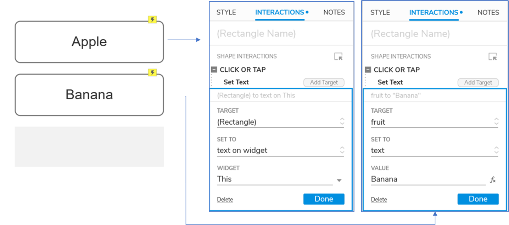
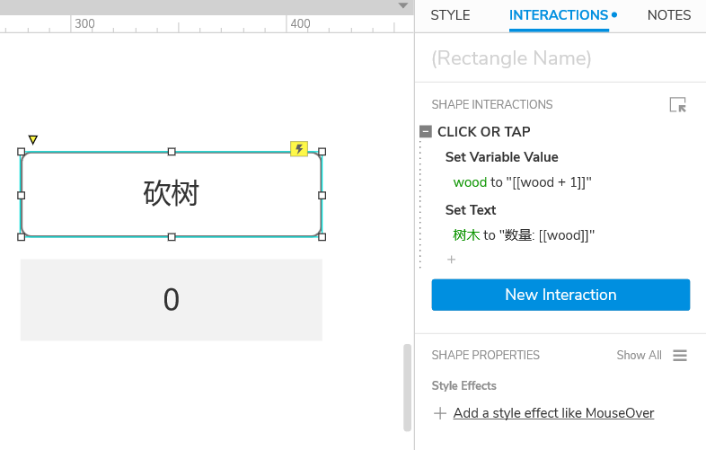

### 按钮与文本框联动

有两个按钮，名称分别为`apple`，`banana`

有一个Label框，初始状态是空的。

点击任意一个按钮，在Label框中显示按钮的名称。

这里用了两种方式来设置

- Apple：设置目标用自己按钮上的文本填充
- Banana：手动指定要填充的内容

### 按钮数字+1

效果是点击砍树按钮，下面的数字就增加。

逻辑：

点击按钮的时

- 让指定的变量+1
- 将变量设置到文本框上