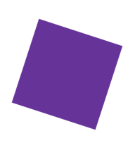

# CSS基础

https://developer.mozilla.org/zh-CN/docs/Learn/CSS

## 什么是CSS

https://developer.mozilla.org/zh-CN/docs/Learn/CSS/First_steps/What_is_CSS

css是层叠样式表，用来美化网页的。

比如可以用来改变文字的字体、颜色、大小等。也可以创建图片的布局。还可以做一些特效、动画。

### css的语法是怎样的

写出一个改变h1标签字体颜色和大小的样式。

```css
h1 {
    color: red;
    font-size: 5em;
}
```

css的语法由一个[选择器](https://developer.mozilla.org/zh-CN/docs/Glossary/CSS_Selector)作为来头，用大括号包裹多个**属性**(property)和**值**(value)的**声明**(declarations)。

[颜色参考](https://developer.mozilla.org/en-US/docs/Learn/CSS/Building_blocks/Values_and_units#color)

[字体大小参考](https://developer.mozilla.org/en-US/docs/Learn/CSS/Building_blocks/Values_and_units#numbers_lengths_and_percentages)

[CSS参考](ttps://developer.mozilla.org/zh-CN/docs/Web/CSS/Reference)

### css模块是什么

css由许多模块(modules)构成。比如我想查找一下 MDN reference 的 [Backgrounds and Borders](https://developer.mozilla.org/zh-CN/docs/Web/CSS/CSS_Backgrounds_and_Borders) 模块的相关内容，来了解它是用来做什么的、它还包括什么属性、它还有什么其它特性等。你也可以在 *CSS Specification* 查找

### 如何给网页添加css？

在网页的head标签内添加

```html
<link rel="stylesheet" href="styles.css">
```

例如

```html
<!doctype html>
<html lang="en">
<head>
    <meta charset="utf-8">
    <title>开始学习CSS</title>
    <link rel="stylesheet" href="styles.css">
</head>

<body>
    <h1>我是一级标题</h1>
    <p>这是一个段落文本. 在文本中有一个 <span>span element</span>
并且还有一个 <a href="http://example.com">链接</a>.</p>
    <p>这是第二段. 包含了一个 <em>强调</em> 元素.</p>
    <ul>
        <li>项目1</li>
        <li>项目2</li>
        <li>项目 <em>三</em></li>
    </ul>
</body>
</html>
```

然后创建`"styles.css"`文件并填入以下内容

```css
h1 {
  color: red;
}
```

### 如何同时给多种标签添加样式？

使用逗号隔开选择器

```css
p, li {
    color: green;
}
```

### 如何给某个类添加特定的样式？

对于如下的html

```html
<ul>
  <li>项目一</li>
  <li class="special">项目二</li>
  <li>项目 <em>三</em></li>
</ul>
```

通过指定类名来添加样式

```css
.special {
  color: orange;
  font-weight: bold;
}
```

也可以给特定标签的类添加样式

```css
li.special,
span.special {
  color: orange;
  font-weight: bold;
}
```

> 一般来说，只用管类就好

### 如何根据元素在文档中的位置确定样式？

例如：改变`<li>`元素内部的`<em>`元素字体颜色

css语法：使用空格连接

```css
li em {
    color: purple;
}
```

例2：改变标题1之后的第一个`<p>`标签的字体大小

css语法：使用加号(+)连接

```css
h1 + p {
  font-size: 200%;
}
```

### 如何根据a标签的状态确定样式？

```css
a:link {
  color: pink;
}

a:visited {
  color: green;
}

a:hover {
  text-decoration: none;
}
```

上述css代码分别展示了`<a>`标签在未被点击时、点击过了、和悬停时的样式。

## 如何构建css

https://developer.mozilla.org/zh-CN/docs/Learn/CSS/First_steps/How_CSS_is_structured

### 什么是外部样式表？

就是css以文件形式存在外面，然后在html文件的`<head>`元素内引用。

```html
<!-- Inside a subdirectory called styles inside the current directory -->
<link rel="stylesheet" href="styles/style.css">

<!-- Inside a subdirectory called general, which is in a subdirectory called styles, inside the current directory -->
<link rel="stylesheet" href="styles/general/style.css">

<!-- Go up one directory level, then inside a subdirectory called styles -->
<link rel="stylesheet" href="../styles/style.css">
```


### 什么是内部样式表？

直接放到head标签内，用`<style>`标签包裹

```html
  <head>
	...
    <style>
      p {
        color: red;
      }
    </style>
  </head>
```


### 什么是内联样式？

就是写在元素属性里的样式，但是只能影响一个元素

```html
<body>
    <h1 style="color: blue;background-color: yellow;border: 1px solid black;">Hello World!</h1>
    <p style="color:red;">This is my first CSS example</p>
</body>
```

> 注意：强烈不建议这么写

### 样式优先级是怎样的？

同样的选择器，后面的会覆盖前面的。

```css
p {
  color: red;
}

p {
  color: blue;
}
```


类选择器 > 标签选择器

```css
.special {
  color: red;
}

p {
  color: blue;
}
```


**尝试查找以下属性的不同值，并编写将它们应用于不同HTML元素的CSS规则：** 

- **[`font-size`](https://developer.mozilla.org/zh-CN/docs/Web/CSS/font-size)**
- **[`width`](https://developer.mozilla.org/zh-CN/docs/Web/CSS/width)**
- **[`background-color`](https://developer.mozilla.org/zh-CN/docs/Web/CSS/background-color)**
- **[`color`](https://developer.mozilla.org/zh-CN/docs/Web/CSS/color)**
- **[`border`](https://developer.mozilla.org/zh-CN/docs/Web/CSS/border)**

### css的常用函数有哪些？

calc函数，使得能在css中进行简单的计算

html

```html
<div class="outer"><div class="box">The inner box is 90% - 30px.</div></div>
```

css

```css
.outer {
  border: 5px solid black;
}

.box {
  padding: 10px;
  width: calc(90% - 30px);
  background-color: rebeccapurple;
  color: white;
}
```

效果


rorate()函数

html

```html
<div class="box"></div>
```

css

```css
.box {
  margin: 30px;
  width: 100px;
  height: 100px;
  background-color: rebeccapurple;
  transform: rotate(0.8turn)
}
```

效果




### @规则是什么，怎么用？

例1：导入额外的样式表

```css
@import 'styles2.css';
```

例2：仅当条件成立时才应用某个样式

如果浏览器的宽度大于30em，则背景色将为蓝色。

```css
body {
  background-color: pink;
}

@media (min-width: 30em) {
  body {
    background-color: blue;
  }
}
```

### 速记属性是什么

一些属性，如 [font](https://developer.mozilla.org/zh-CN/docs/Web/CSS/font), [background](https://developer.mozilla.org/zh-CN/docs/Web/CSS/background), [padding](https://developer.mozilla.org/zh-CN/docs/Web/CSS/padding), [border](https://developer.mozilla.org/zh-CN/docs/Web/CSS/border), and [margin](https://developer.mozilla.org/zh-CN/docs/Web/CSS/margin) 等属性称为速记属性--这是因为它们允许您在一行中设置多个属性值，从而节省时间并使代码更整洁。


允许在一行中设置多个属性值，省时间并使代码更简洁

```css
padding: 10px 15px 15px 5px;
```

与下面的代码等价

```css
padding-top: 10px;
padding-right: 15px;
padding-bottom: 15px;
padding-left: 5px;
```


```css
background: red url(bg-graphic.png) 10px 10px repeat-x fixed;
```

```css
background-color: red;
background-image: url(bg-graphic.png);
background-position: 10px 10px;
background-repeat: repeat-x;
background-attachment: fixed;
```

### css的注释怎么写

`/*注释内容*/`

## css工作原理

浏览器工作流程

1. 浏览器载入HTML文件（比如从网络上获取）。
2. 将HTML文件转化成一个DOM（Document Object Model），DOM是文件在计算机内存中的表现形式，下一节将更加详细的解释DOM。
3. 接下来，浏览器会拉取该HTML相关的大部分资源，比如嵌入到页面的图片、视频和CSS样式。JavaScript则会稍后进行处理，简单起见，同时此节主讲CSS，所以这里对如何加载JavaScript不会展开叙述。
4. 浏览器拉取到CSS之后会进行解析，根据选择器的不同类型（比如element、class、id等等）把他们分到不同的“桶”中。浏览器基于它找到的不同的选择器，将不同的规则（基于选择器的规则，如元素选择器、类选择器、id选择器等）应用在对应的DOM的节点中，并添加节点依赖的样式（这个中间步骤称为渲染树）。
5. 上述的规则应用于渲染树之后，渲染树会依照应该出现的结构进行布局。
6. 网页展示在屏幕上（这一步被称为着色）。


### HTML与DOM的转换

```html
<p>
  Let's use:
  <span>Cascading</span>
  <span>Style</span>
  <span>Sheets</span>
</p>

```

转化为DOM就是

```
P
├─ "Let's use:"
├─ SPAN
|  └─ "Cascading"
├─ SPAN
|  └─ "Style"
└─ SPAN
   └─ "Sheets"
```

