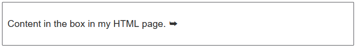
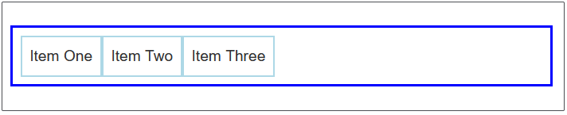
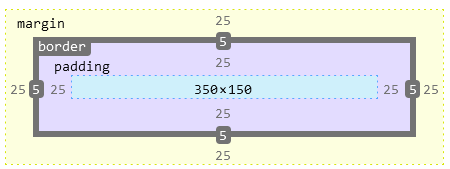
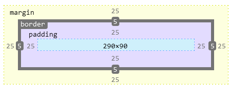

# CSS构建

https://developer.mozilla.org/zh-CN/docs/Learn/CSS/Building_blocks

## 层叠与继承

https://developer.mozilla.org/zh-CN/docs/Learn/CSS/Building_blocks/Cascade_and_inheritance

### 冲突规则

对于同一个元素创建了两个相同的规则，就会发生冲突，此时该选哪个规则渲染HTML呢？

- 类选择器 > 元素选择器
- 后出现的 > 早出现的

### 继承

有些能继承，比如`color`，`font-family`设置一个元素的字体颜色，它包裹的其他元素的颜色也会继承。

但有一些不能继承，比如`width`, `margin`, `border`属性。

是否能被继承参见 [color property Specifications section](https://developer.mozilla.org/en-US/docs/Web/CSS/color#specifications)

CSS 为控制继承提供了四个特殊的通用属性值。每个css属性都接收这些值。

- [`inherit`](https://developer.mozilla.org/zh-CN/docs/Web/CSS/inherit)

  设置该属性会使子元素属性和父元素相同。实际上，就是 "开启继承".

- [`initial`](https://developer.mozilla.org/zh-CN/docs/Web/CSS/initial)

  设置属性值和浏览器默认样式相同。如果浏览器默认样式中未设置且该属性是自然继承的，那么会设置为 `inherit` 。

- [`unset`](https://developer.mozilla.org/zh-CN/docs/Web/CSS/unset)

  将属性重置为自然值，也就是如果属性是自然继承那么就是 `inherit`，否则和 `initial`一样

> 还有一个新的属性, [`revert` (en-US)](https://developer.mozilla.org/en-US/docs/Web/CSS/revert)， 只有很少的浏览器支持。

### 如何继承父元素

html

```html
<ul>
    <li>Default <a href="#">link</a> color</li>
    <li class="my-class-1">Inherit the <a href="#">link</a> color</li>
    <li class="my-class-2">Reset the <a href="#">link</a> color</li>
    <li class="my-class-3">Unset the <a href="#">link</a> color</li>
</ul>
    
```

```css
body {
    color: green;
}
          
.my-class-1 a {
    color: inherit;
}
          
.my-class-2 a {
    color: initial;
}
          
.my-class-3 a {
    color: unset;
}
    
```

### 重设所有属性值

```css
blockquote {
    background-color: red;
    border: 2px solid green;
}
        
.fix-this {
    all: unset;
}
```

### 计算优先级的具体方法

## CSS选择器

https://developer.mozilla.org/zh-CN/docs/Learn/CSS/Building_blocks/Selectors

| 选择器                                                       | 示例                | 学习CSS的教程                                                |
| ------------------------------------------------------------ | ------------------- | ------------------------------------------------------------ |
| [类型选择器](https://developer.mozilla.org/zh-CN/docs/Web/CSS/Type_selectors) | `h1 { }`            | [类型选择器](https://developer.mozilla.org/zh-CN/docs/user:chrisdavidmills/CSS_Learn/CSS_Selectors/Type_Class_and_ID_Selectors#Type_selectors) |
| [通配选择器](https://developer.mozilla.org/zh-CN/docs/Web/CSS/Universal_selectors) | `* { }`             | [通配选择器](https://developer.mozilla.org/zh-CN/docs/user:chrisdavidmills/CSS_Learn/CSS_Selectors/Type_Class_and_ID_Selectors#The_universal_selector) |
| [类选择器](https://developer.mozilla.org/zh-CN/docs/Web/CSS/Class_selectors) | `.box { }`          | [类选择器](https://developer.mozilla.org/zh-CN/docs/user:chrisdavidmills/CSS_Learn/CSS_Selectors/Type_Class_and_ID_Selectors#Class_selectors) |
| [ID选择器](https://developer.mozilla.org/zh-CN/docs/Web/CSS/ID_selectors) | `#unique { }`       | [ID选择器](https://developer.mozilla.org/zh-CN/docs/user:chrisdavidmills/CSS_Learn/CSS_Selectors/Type_Class_and_ID_Selectors#ID_Selectors) |
| [标签属性选择器](https://developer.mozilla.org/zh-CN/docs/Web/CSS/Attribute_selectors) | `a[title] { }`      | [标签属性选择器](https://developer.mozilla.org/zh-CN/docs/User:chrisdavidmills/CSS_Learn/CSS_Selectors/Attribute_selectors) |
| [伪类选择器](https://developer.mozilla.org/zh-CN/docs/Web/CSS/Pseudo-classes) | `p:first-child { }` | [伪类](https://developer.mozilla.org/zh-CN/docs/User:chrisdavidmills/CSS_Learn/CSS_Selectors/Pseuso-classes_and_Pseudo-elements#What_is_a_pseudo-class) |
| [伪元素选择器](https://developer.mozilla.org/zh-CN/docs/Web/CSS/Pseudo-elements) | `p::first-line { }` | [伪元素](https://developer.mozilla.org/zh-CN/docs/User:chrisdavidmills/CSS_Learn/CSS_Selectors/Pseuso-classes_and_Pseudo-elements#What_is_a_pseudo-element) |
| [后代选择器](https://developer.mozilla.org/zh-CN/docs/Web/CSS/Descendant_combinator) | `article p`         | [后代运算符](https://developer.mozilla.org/zh-CN/docs/User:chrisdavidmills/CSS_Learn/CSS_Selectors/Combinators#Descendant_Selector) |
| [子代选择器](https://developer.mozilla.org/zh-CN/docs/Web/CSS/Child_combinator) | `article > p`       | [子代选择器](https://developer.mozilla.org/zh-CN/docs/User:chrisdavidmills/CSS_Learn/CSS_Selectors/Combinators#Child_combinator) |
| [相邻兄弟选择器](https://developer.mozilla.org/zh-CN/docs/Web/CSS/Adjacent_sibling_combinator) | `h1 + p`            | [相邻兄弟](https://developer.mozilla.org/zh-CN/docs/User:chrisdavidmills/CSS_Learn/CSS_Selectors/Combinators#Adjacent_sibling) |
| [通用兄弟选择器](https://developer.mozilla.org/zh-CN/docs/Web/CSS/General_sibling_combinator) | `h1 ~ p`            | [通用兄弟](https://developer.mozilla.org/zh-CN/docs/User:chrisdavidmills/CSS_Learn/CSS_Selectors/Combinators#General_sibling) |

选择器列表：一次性使用多个选择器，用逗号连接，一般会给每个选择器另起一行

```css
h1,
.special {
    color: blue;
}
```

> 如果任何一个选择器失效，整条规则都失效

### 类型选择器

```css
span {
    background-color: yellow;
}

strong {
    color: rebeccapurple;
}
```

### 全局选择器

选中了文档中的所有内容（或者是父元素中的所有内容）

```css
* {
    margin: 0;
}
```

增加选择器可读性

下面这个选择器表示选择作为其他元素长子`article`元素

```css
article:first-child {
    color: blue;
}
```

> 伪类是表示状态的类，比如：
>
> - `p:hover`表示：选择鼠标悬浮的p标签
> - `p:first-child`表示：选择作为长子的p标签

而我们想选择所有article标签下的长子元素。可以这么写

```css
article :first-child
```

这样看起来就会有点混淆，因为只多了一个空格，这时候可以改为

```css
article *:first-child
```

### class选择器

```css
.highlight {
    background-color: yellow;
}
```

指向特定类型的选择器

```css
h1.highlight {
    background-color: pink;
}
```

一个元素可以赋予多个类，用空格隔开，可以分别多不同的类设定css

有点类似继承的概念，先对`notebox`设定一个通用的样式，然后对不同的子类设定不同的边框颜色。

```html
<div class="notebox">
    This is an informational note.
</div>

<div class="notebox warning">
    This note shows a warning.
</div>

<div class="notebox danger">
    This note shows danger!
</div>

<div class="danger">
    This won't get styled — it also needs to have the notebox class
</div>
```

```css
.notebox {
  border: 4px solid #666;
  padding: .5em;
}

.notebox.warning {
  border-color: orange;
  font-weight: bold;
}

.notebox.danger {
  border-color: red;
  font-weight: bold;
}
```


### ID选择器

ID的优先级是比较高的


```css
#one {
    background-color: yellow;
}

h1#heading {
    color: rebeccapurple;
}
```

### 属性选择器

| 选择器          | 示例                            | 描述                                                         |
| --------------- | ------------------------------- | ------------------------------------------------------------ |
| `[attr]`        | `a[title]`                      | 匹配带有一个名为*attr*的属性的元素——方括号里的值。           |
| `[attr=value]`  | `a[href="https://example.com"]` | 匹配带有一个名为*attr*的属性的元素，其值正为*value*——引号中的字符串。 |
| `[attr~=value]` | `p[class~="special"]`           | 匹配带有一个名为*attr*的属性的元素 ，其值正为*value*，或者匹配带有一个*attr*属性的元素，其值有一个或者更多，至少有一个和*value*匹配。     注意，在一列中的好几个值，是用空格隔开的。 |
| `[attr|=value]` | `div[lang|="zh"]`               | 匹配带有一个名为*attr*的属性的元素，其值可正为*value*，或者开始为*value*，后面紧随着一个连字符。 |


例：`p[class~="fruit"]`可以匹配`class="fruit"`也可以匹配`class="fruit apple"`

​	而`p[class="fruit"]`只能匹配`class="fruit"`

### 子字符串匹配选择器

| 选择器          | 示例                | 描述                                                         |
| --------------- | ------------------- | ------------------------------------------------------------ |
| `[attr^=value]` | `li[class^="box-"]` | 匹配带有一个名为*attr*的属性的元素，其值开头为*value*子字符串。 |
| `[attr$=value]` | `li[class$="-box"]` | 匹配带有一个名为*attr*的属性的元素，其值结尾为*value*子字符串 |
| `[attr=value]`  | `li[class*="box"]`  | 匹配带有一个名为*attr*的属性的元素，其值的字符串中的任何地方，至少出现了一次*value*子字符串。 |

### 设置为大小写不敏感

下面第二个选择器就会匹配大小写不敏感的字符串

```css
li[class^="a"] {
    background-color: yellow;
}

li[class^="a" i] {
    color: red;
}
```

### 伪类和伪元素

https://developer.mozilla.org/zh-CN/docs/Learn/CSS/Building_blocks/Selectors/Pseudo-classes_and_pseudo-elements

伪类是特定状态的元素，比如：

- `a:hover`表示选择鼠标悬浮状态下的a元素
- `p:first-child`表示选择作为长子的p元素
- `:last-child`
- `only-child`
- `:invalid`

一些伪类只会在用户以某种方式和文档交互的时候应用。这些**用户行为伪类**，有时叫做**动态伪类**，表现得就像是一个类在用户和元素交互的时候加到了元素上一样。案例包括：

- `:hover`——上面提到过，只会在用户将指针挪到元素上的时候才会激活，一般就是链接元素。
- `:focus`——只会在用户使用键盘控制，选定元素的时候激活。


### 伪元素

其实感觉类似伪类

```css
p::first-line {
    font-size: 120%;
    font-weight: bold;
} 
```


作用是选中所有p标签的第一行

虽然随着字体大小的变化，一行字数可能变多也可能变少。不管一行有5个字还是15个字，这个选择器都会准确地选中第一行，然后应用样式。


```css
.box::after {
    content: " ➥"
}
```

```html
<p class="box">Content in the box in my HTML page.</p>
```

效果



`::before`和`::after`会在文本前面或后面增加指定的字符，用`content`属性指定字符。

[伪类](https://developer.mozilla.org/zh-CN/docs/Learn/CSS/Building_blocks/Selectors/Pseudo-classes_and_pseudo-elements#伪类)

| 选择器                                                       | 描述                                                         |
| ------------------------------------------------------------ | ------------------------------------------------------------ |
| [`:active`](https://developer.mozilla.org/zh-CN/docs/Web/CSS/:active) | 在用户激活（例如点击）元素的时候匹配。                       |
| [`:any-link`](https://developer.mozilla.org/zh-CN/docs/Web/CSS/:any-link) | 匹配一个链接的`:link`和`:visited`状态。                      |
| [`:blank`](https://developer.mozilla.org/zh-CN/docs/Web/CSS/:blank) | 匹配空输入值的[``元素](https://developer.mozilla.org/en-US/docs/Web/HTML/Element/input)。 |
| [`:checked`](https://developer.mozilla.org/zh-CN/docs/Web/CSS/:checked) | 匹配处于选中状态的单选或者复选框。                           |
| [`:current` (en-US)](https://developer.mozilla.org/en-US/docs/Web/CSS/:current) | 匹配正在展示的元素，或者其上级元素。                         |
| [`:default`](https://developer.mozilla.org/zh-CN/docs/Web/CSS/:default) | 匹配一组相似的元素中默认的一个或者更多的UI元素。             |
| [`:dir`](https://developer.mozilla.org/zh-CN/docs/Web/CSS/:dir) | 基于其方向性（HTML`dir`属性或者CSS`direction`属性的值）匹配一个元素。 |
| [`:disabled`](https://developer.mozilla.org/zh-CN/docs/Web/CSS/:disabled) | 匹配处于关闭状态的用户界面元素                               |
| [`:empty`](https://developer.mozilla.org/zh-CN/docs/Web/CSS/:empty) | 匹配除了可能存在的空格外，没有子元素的元素。                 |
| [`:enabled`](https://developer.mozilla.org/zh-CN/docs/Web/CSS/:enabled) | 匹配处于开启状态的用户界面元素。                             |
| [`:first`](https://developer.mozilla.org/zh-CN/docs/Web/CSS/:first) | 匹配[分页媒体](https://developer.mozilla.org/en-US/docs/Web/CSS/Paged_Media)的第一页。 |
| [`:first-child`](https://developer.mozilla.org/zh-CN/docs/Web/CSS/:first-child) | 匹配兄弟元素中的第一个元素。                                 |
| [`:first-of-type`](https://developer.mozilla.org/zh-CN/docs/Web/CSS/:first-of-type) | 匹配兄弟元素中第一个某种类型的元素。                         |
| [`:focus`](https://developer.mozilla.org/zh-CN/docs/Web/CSS/:focus) | 当一个元素有焦点的时候匹配。                                 |
| [`:focus-visible`](https://developer.mozilla.org/zh-CN/docs/Web/CSS/:focus-visible) | 当元素有焦点，且焦点对用户可见的时候匹配。                   |
| [`:focus-within`](https://developer.mozilla.org/zh-CN/docs/Web/CSS/:focus-within) | 匹配有焦点的元素，以及子代元素有焦点的元素。                 |
| [`:future` (en-US)](https://developer.mozilla.org/en-US/docs/Web/CSS/:future) | 匹配当前元素之后的元素。                                     |
| [`:hover`](https://developer.mozilla.org/zh-CN/docs/Web/CSS/:hover) | 当用户悬浮到一个元素之上的时候匹配。                         |
| [`:indeterminate`](https://developer.mozilla.org/zh-CN/docs/Web/CSS/:indeterminate) | 匹配未定态值的UI元素，通常为[复选框](https://developer.mozilla.org/en-US/docs/Web/HTML/Element/input/checkbox)。 |
| [`:in-range`](https://developer.mozilla.org/zh-CN/docs/Web/CSS/:in-range) | 用一个区间匹配元素，当值处于区间之内时匹配。                 |
| [`:invalid`](https://developer.mozilla.org/zh-CN/docs/Web/CSS/:invalid) | 匹配诸如`<input>`的位于不可用状态的元素。                    |
| [`:lang`](https://developer.mozilla.org/zh-CN/docs/Web/CSS/:lang) | 基于语言（HTML[lang](https://developer.mozilla.org/zh-CN/docs/Web/HTML/Global_attributes/lang)属性的值）匹配元素。 |
| [`:last-child`](https://developer.mozilla.org/zh-CN/docs/Web/CSS/:last-child) | 匹配兄弟元素中最末的那个元素。                               |
| [`:last-of-type`](https://developer.mozilla.org/zh-CN/docs/Web/CSS/:last-of-type) | 匹配兄弟元素中最后一个某种类型的元素。                       |
| [`:left`](https://developer.mozilla.org/zh-CN/docs/Web/CSS/:left) | 在[分页媒体 (en-US)](https://developer.mozilla.org/en-US/docs/Web/CSS/CSS_Pages)中，匹配左手边的页。 |
| [`:link`](https://developer.mozilla.org/zh-CN/docs/Web/CSS/:link) | 匹配未曾访问的链接。                                         |
| [`:local-link` (en-US)](https://developer.mozilla.org/en-US/docs/Web/CSS/:local-link) | 匹配指向和当前文档同一网站页面的链接。                       |
| [`:is()`](https://developer.mozilla.org/zh-CN/docs/Web/CSS/:is) | 匹配传入的选择器列表中的任何选择器。                         |
| [`:not`](https://developer.mozilla.org/zh-CN/docs/Web/CSS/:not) | 匹配作为值传入自身的选择器未匹配的物件。                     |
| [`:nth-child`](https://developer.mozilla.org/zh-CN/docs/Web/CSS/:nth-child) | 匹配一列兄弟元素中的元素——兄弟元素按照an+b形式的式子进行匹配（比如2n+1匹配元素1、3、5、7等。即所有的奇数个）。 |
| [`:nth-of-type`](https://developer.mozilla.org/zh-CN/docs/Web/CSS/:nth-of-type) | 匹配某种类型的一列兄弟元素（比如，`<p>`元素）——兄弟元素按照an+b形式的式子进行匹配（比如2n+1匹配元素1、3、5、7等。即所有的奇数个）。 |
| [`:nth-last-child`](https://developer.mozilla.org/zh-CN/docs/Web/CSS/:nth-last-child) | 匹配一列兄弟元素，从后往前倒数。兄弟元素按照an+b形式的式子进行匹配（比如2n+1匹配按照顺序来的最后一个元素，然后往前两个，再往前两个，诸如此类。从后往前数的所有奇数个）。 |
| [`:nth-last-of-type`](https://developer.mozilla.org/zh-CN/docs/Web/CSS/:nth-last-of-type) | 匹配某种类型的一列兄弟元素（比如，`<p>`元素），从后往前倒数。兄弟元素按照an+b形式的式子进行匹配（比如2n+1匹配按照顺序来的最后一个元素，然后往前两个，再往前两个，诸如此类。从后往前数的所有奇数个）。 |
| [`:only-child`](https://developer.mozilla.org/zh-CN/docs/Web/CSS/:only-child) | 匹配没有兄弟元素的元素。                                     |
| [`:only-of-type`](https://developer.mozilla.org/zh-CN/docs/Web/CSS/:only-of-type) | 匹配兄弟元素中某类型仅有的元素。                             |
| [`:optional`](https://developer.mozilla.org/zh-CN/docs/Web/CSS/:optional) | 匹配不是必填的form元素。                                     |
| [`:out-of-range`](https://developer.mozilla.org/zh-CN/docs/Web/CSS/:out-of-range) | 按区间匹配元素，当值不在区间内的的时候匹配。                 |
| [`:past` (en-US)](https://developer.mozilla.org/en-US/docs/Web/CSS/:past) | 匹配当前元素之前的元素。                                     |
| [`:placeholder-shown`](https://developer.mozilla.org/zh-CN/docs/Web/CSS/:placeholder-shown) | 匹配显示占位文字的input元素。                                |
| [`:playing` (en-US)](https://developer.mozilla.org/en-US/docs/Web/CSS/:playing) | 匹配代表音频、视频或者相似的能“播放”或者“暂停”的资源的，且正在“播放”的元素。 |
| [`:paused` (en-US)](https://developer.mozilla.org/en-US/docs/Web/CSS/:paused) | 匹配代表音频、视频或者相似的能“播放”或者“暂停”的资源的，且正在“暂停”的元素。 |
| [`:read-only`](https://developer.mozilla.org/zh-CN/docs/Web/CSS/:read-only) | 匹配用户不可更改的元素。                                     |
| [`:read-write`](https://developer.mozilla.org/zh-CN/docs/Web/CSS/:read-write) | 匹配用户可更改的元素。                                       |
| [`:required`](https://developer.mozilla.org/zh-CN/docs/Web/CSS/:required) | 匹配必填的form元素。                                         |
| [`:right`](https://developer.mozilla.org/zh-CN/docs/Web/CSS/:right) | 在[分页媒体 (en-US)](https://developer.mozilla.org/en-US/docs/Web/CSS/CSS_Pages)中，匹配右手边的页。 |
| [`:root`](https://developer.mozilla.org/zh-CN/docs/Web/CSS/:root) | 匹配文档的根元素。                                           |
| [`:scope`](https://developer.mozilla.org/zh-CN/docs/Web/CSS/:scope) | 匹配任何为参考点元素的的元素。                               |
| [`:valid`](https://developer.mozilla.org/zh-CN/docs/Web/CSS/:valid) | 匹配诸如`<input>`元素的处于可用状态的元素。                  |
| [`:target`](https://developer.mozilla.org/zh-CN/docs/Web/CSS/:target) | 匹配当前URL目标的元素（例如如果它有一个匹配当前[URL分段](https://en.wikipedia.org/wiki/Fragment_identifier)的元素）。 |
| [`:visited`](https://developer.mozilla.org/zh-CN/docs/Web/CSS/:visited) | 匹配已访问链接。                                             |

[伪元素](https://developer.mozilla.org/zh-CN/docs/Learn/CSS/Building_blocks/Selectors/Pseudo-classes_and_pseudo-elements#伪元素)

| 选择器                                                       | 描述                                                 |
| ------------------------------------------------------------ | ---------------------------------------------------- |
| [`::after`](https://developer.mozilla.org/zh-CN/docs/Web/CSS/::after) | 匹配出现在原有元素的实际内容之后的一个可样式化元素。 |
| [`::before`](https://developer.mozilla.org/zh-CN/docs/Web/CSS/::before) | 匹配出现在原有元素的实际内容之前的一个可样式化元素。 |
| [`::first-letter`](https://developer.mozilla.org/zh-CN/docs/Web/CSS/::first-letter) | 匹配元素的第一个字母。                               |
| [`::first-line`](https://developer.mozilla.org/zh-CN/docs/Web/CSS/::first-line) | 匹配包含此伪元素的元素的第一行。                     |
| [`::grammar-error`](https://developer.mozilla.org/zh-CN/docs/Web/CSS/::grammar-error) | 匹配文档中包含了浏览器标记的语法错误的那部分。       |
| [`::selection`](https://developer.mozilla.org/zh-CN/docs/Web/CSS/::selection) | 匹配文档中被选择的那部分。                           |
| [`::spelling-error`](https://developer.mozilla.org/zh-CN/docs/Web/CSS/::spelling-error) | 匹配文档中包含了浏览器标记的拼写错误的那部分。       |

### 后代选择器

https://developer.mozilla.org/zh-CN/docs/Learn/CSS/Building_blocks/Selectors/Combinators

空格连接，选择类`.box`包含的所有p子元素（会包含孙子及以下的元素）

```css
ul li {
    color: red;
}  
```

```
|-ul
  |-li  # 匹配成功
  |-li
    |-ol
      |-li  # 匹配成功
      |-li  # 匹配成功
```


### 子代关系选择器

选择所有`ul`元素之后的`li`元素（不会包含孙子及以后的元素）

```css
ul > li {
    border-top: 5px solid red;
}  
```

```
|-ul
  |-li  # 匹配成功
  |-li
    |-ol
      |-li  # 匹配失败
      |-li  # 匹配失败
```


### 邻接兄弟

选择**紧挨**p标签**之后**的img标签

```css
p + img
```

```
|-p
|-img  # 匹配成功
```


如果p标签之后跟的是a标签再接img标签，就不会生效

```
|-p
|-a
|-img  # 匹配失败
```


### 通用兄弟

选择p标签**之后所有的**img标签

```css
p ~ img
```

只要是同级标签，都会被选中

```
|-p
|-a
|-img  # 匹配成功
|-span
|-img  # 匹配成功
```

## [盒模型](https://developer.mozilla.org/zh-CN/docs/Learn/CSS/Building_blocks/The_box_model)

在 CSS 中，所有的元素都被一个个的“盒子（box）”包围着，理解这些“盒子”的基本原理，是我们使用CSS实现准确布局、处理元素排列的关键

**块级盒子** (**block box**) 和 **内联盒子** (**inline box**)

块级：

- 盒子会在内联的方向上扩展并占据父容器在该方向上的所有可用空间，在绝大数情况下意味着盒子会和父容器一样宽
- 每个盒子都会换行
- [`width`](https://developer.mozilla.org/zh-CN/docs/Web/CSS/width) 和 [`height`](https://developer.mozilla.org/zh-CN/docs/Web/CSS/height) 属性可以发挥作用
- 内边距（padding）, 外边距（margin） 和 边框（border） 会将其他元素从当前盒子周围“推开”。除非特殊指定，诸如标题(`<h1>`等)和段落(`<p>`)默认情况下都是块级的盒子。

内联：

- 盒子不会产生换行。
-  [`width`](https://developer.mozilla.org/zh-CN/docs/Web/CSS/width) 和 [`height`](https://developer.mozilla.org/zh-CN/docs/Web/CSS/height) 属性将不起作用。
- 垂直方向的内边距、外边距以及边框会被应用但是不会把其他处于 `inline` 状态的盒子推开。
- 水平方向的内边距、外边距以及边框会被应用且会把其他处于 `inline` 状态的盒子推开。

用做链接的 `<a>` 元素、 `<span>`、 `<em>` 以及 `<strong>` 都是默认处于 `inline` 状态的。

我们通过对盒子[`display`](https://developer.mozilla.org/zh-CN/docs/Web/CSS/display) 属性的设置，比如 `inline` 或者 `block` ，来控制盒子的外部显示类型。


**内部** 和 **外部** 显示类型。如上所述， css的box模型有一个外部显示类型，来决定盒子是块级还是内联。

同样盒模型还有内部显示类型，它决定了盒子内部元素是如何布局的。默认情况下是按照 **[正常文档流](https://developer.mozilla.org/en-US/docs/Learn/CSS/CSS_layout/Normal_Flow)** 布局，也意味着它们和其他块元素以及内联元素一样(如上所述).

可以通过使用类似 `flex` 的 `display` 属性值来更改内部显示类型。 如果设置 `display: flex`，在一个元素上，外部显示类型是 `block`，但是内部显示类型修改为 `flex`。


`flex`，可以把换行的`li`元素变成堆在一行显示，塞满一行才换行

```css
ul {
  display: flex;  /* flex布局 */
  list-style: none;  /* 取消列表每个元素前面的点 */
  border: 3px solid blue;
  padding: .5em;
}

li {
  border: 2px solid lightblue;
  padding: .5em;
}
```

```html
<ul>
  <li>Item One</li>
  <li>Item Two</li>
  <li>Item Three</li>
</ul>
```



将内联元素转换为块级元素

本来正常情况`span`元素不会换行的，把`display`设置成`block`以后就变成了块级元素。

```css
p {
  border: 2px solid rebeccapurple;
  padding: .5em;
}

.block {
  border: 2px solid blue;
  padding: .5em;
  display: block;
}
```

```html
<p>I am another paragraph. Some of the <span class="block">words</span> have been wrapped in a <span>span element</span>.</p>
```


### 盒模型的结构

- **Content box**: 这个区域是用来显示内容，大小可以通过设置 [`width`](https://developer.mozilla.org/zh-CN/docs/Web/CSS/width) 和 [`height`](https://developer.mozilla.org/zh-CN/docs/Web/CSS/height).
- **Padding box**: 包围在内容区域外部的空白区域； 大小通过 [`padding`](https://developer.mozilla.org/zh-CN/docs/Web/CSS/padding) 相关属性设置。
- **Border box**: 边框盒包裹内容和内边距。大小通过 [`border`](https://developer.mozilla.org/zh-CN/docs/Web/CSS/border) 相关属性设置。
- **Margin box**: 这是最外面的区域，是盒子和其他元素之间的空白区域。大小通过 [`margin`](https://developer.mozilla.org/zh-CN/docs/Web/CSS/margin) 相关属性设置。


### 标准盒模型与替代盒模型

标准盒模型计算比较复杂，要把上面那几项的宽度都加起来，比如：

```css
.box {
  width: 350px;
  height: 150px;
  margin: 25px;
  padding: 25px;
  border: 5px solid black;
}
```


盒子的总高宽为：

- 高度 = 210px (150 + 25 + 25 + 5 + 5)
- 宽度 = 410px (350 + 25 + 25 + 5 + 5)



**替代盒模型**

使用这个模型，所有宽度都是可见宽度，所以内容宽度是该宽度减去边框和填充部分。使用上面相同的样式得到 (width = 350px, height = 150px).


内容的高和宽变为：

- 高度：`150 - 25*2- 5*2 = 90`
- 宽度：`350 - 25*2- 5*2 = 290`



### 如何切换标准、替代盒模型

浏览器默认标准盒模型，替代盒模型使用如下代码切换

```css
.box {
  box-sizing: border-box;
} 
```

让所有元素都使用替代模式

```css
html {
  box-sizing: border-box;
}
*, *::before, *::after {
  box-sizing: inherit;
}
```


