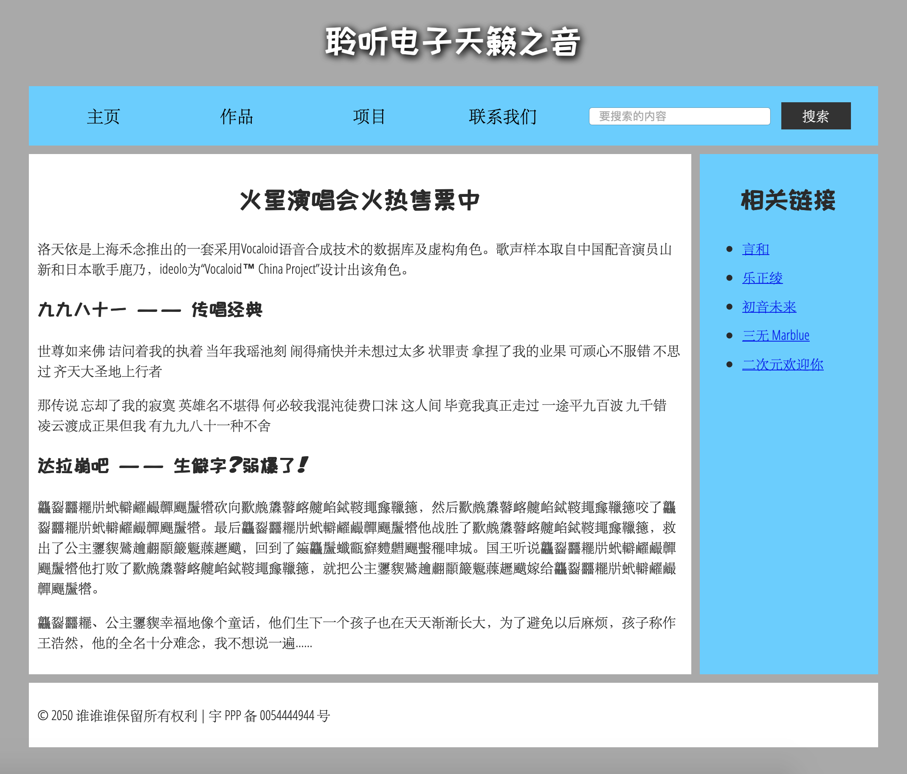

# HTML介绍

## 开始学习HTML

https://developer.mozilla.org/zh-CN/docs/Learn/HTML/Introduction_to_HTML/Getting_started

### 什么是HTML？

HTML的全称是HyperText Markup Language，是一种**标记语言**，它告诉浏览器该怎样组织页面，HTML由一堆元素组成。


### 什么是元素和标签？

```html
<p>hello world</p>
```

上面的例子中：

- `<p>hello world</p>`是一个元素(**element**)
- `<p>`和`</p>`是一对标签，分别是开始标签(**opening tag**)和结束标签(**closing tag**)。
- `hello world`是内容(**content**)

### 如何嵌套元素？

```html
<p>hello <strong>world</strong></p>
```

### 什么是块级元素和内联元素

- 块级元素(block level element)：这种元素单独占一行，相当于在头和尾都加了一个换行符。
- 内联元素(inline level element)：一般放在块级元素内，不会导致文本换行。

> 一个以block形式展现的块级元素不会被嵌套进内联元素中，但可以嵌套在其它块级元素中。:question:

`<p></p>`是一个块级元素

`<em></em>`是一个内联元素

```html
<em>第一</em><em>第二</em><em>第三</em>

<p>第四</p><p>第五</p><p>第六</p>
```

使用上面的例子可以具体观察区别

### 什么是空元素？

空元素没有内容和结束标签，比如元素``，用来插入一张图片，不需要内容和结束标签。

```html

```

### 什么是元素的属性？

```html
<p class="note">hello world</p>
```

上述例子中`class="note"`就是一个属性

属性的书写格式

- 属性名前需要有个空格与元素名或其他属性隔开
- 属性名=属性值
- 属性值由双引号括起来

### 什么是布尔属性？

这些属性没有值，写值的话也只能和属性名一样。例如[disabled](https://developer.mozilla.org/zh-CN/docs/Web/HTML/Element/Input#attr-disabled) 属性，他们可以标记表单输入使之变为不可用(变灰色)，此时用户不能向他们输入任何数据。

```html
<input type="text" disabled>
<input type="text" disabled="disabled">
```

### 为什么不能省略包围属性值的引号？

有些情况是可以省略，但是强烈不建议省略比如下面这种就会出错

```html
<a href=https://www.mozilla.org/ title=The Mozilla homepage>收藏页面</a>
```


### 单引号和双引号有什么区别？

没什么区别，使用什么都可以

可以使用双引号包括单引号，或单引号包括双引号

```html
<a href="http://www.example.com" title="你觉得'好玩吗'？">示例站点链接</a>
```

### 手写一个最简单的HTML文档

```html
<!DOCTYPE html>
<html>
  <head>
    <meta charset="utf-8">
    <title>我的测试站点</title>
  </head>
  <body>
    <p>这是我的页面</p>
  </body>
</html>
```


- `<!DOCTYPE html>`：声明文档类型，放在文档开头
- `<html>`元素：是一个根元素，包裹了整个页面
- `<head>`元素：包含了关键字、页面描述、CSS、JS脚本等各种内容。
- `<meta charset="utf-8">`：设置文档使用utf-8字符集
- `<title>`元素：设置页面标题，显示在浏览器标签上
- `<body>`元素：包含了你访问页面时所有显示在页面上的内容，文本，图片，音频，游戏等等。

### 元素中写很多个空格会怎样？

很多个空格或者换行会被自动替换为1个空格。

空格主要是为了可读性。

> 似乎换行的话，会删去换行，不会添加空格

```html
<p>
    你 
    好 
    啊 
</p>

<p>你    好   啊</p>
```

### 什么是实体引用？

HTML中有些字符是特殊字符，是HTML语法的一部分。想显示这些字符需要使用字符引用。

比如想显示 `<`就要

```html
<p>这是小于号: &lt;。 这是大于号: &gt; </p>
```

常用的转义

| 原义字符 | 转义字符 |
| -------- | -------- |
| `<`      | `&lt;`   |
| `>`      | `&gt;`   |
| `"`      | `&quot;` |
| `'`      | `&apos;` |
| `&`      | `&amp;`  |

> **提示**: 维基百科上有一个包含所有可用HTML字符实体引用的列表：[XML和HTML字符实体引用列表](http://en.wikipedia.org/wiki/List_of_XML_and_HTML_character_entity_references)。

### 怎样写HTML注释？

```html
<p>我在注释外！</p>

<!-- <p>我在注释内！</p> -->
```

## head标签与元数据

### 什么是HTML头部元素？

head元素的内容不在浏览器中显示，它的作用是保存页面的一些 [元数据](https://developer.mozilla.org/zh-CN/docs/Glossary/Metadata)。

```html
<head>
  <meta charset="utf-8">
  <title>我的测试站点</title>
</head>
```

比如添加标题

### 什么是元数据？

元数据就是`<meta>`元素，放在`<head>`元素内。

常用的元数据比如说：指定文档中的字符编码

```html
<meta charset="utf-8">
```


### 元数据的name和content属性有什么用？

- `name`指定了meta元素的类型，说明该元素包含了什么类型的信息
- `content`指定了实际的元数据内容

例子：

```html
<meta name="author" content="Chris Mills">
<meta name="description" content="The MDN Learning Area aims to provide
complete beginners to the Web with all they need to know to get
started with developing web sites and applications.">
```

> 指定包含关于页面内容的关键字的页面内容的描述是很有用的，因为它可能或让你的页面在搜索引擎的相关的搜索出现得更多 （这些行为术语上被称为 [Search Engine Optimization](https://developer.mozilla.org/zh-CN/docs/Glossary/SEO), or [SEO](https://developer.mozilla.org/zh-CN/docs/Glossary/SEO).）

### 怎么添加站点的自定义图标？

将图标文件以`favicon.ico`保存到与网站索引页相同的目录中。

在head元素中添加下面这一行

```html
<link rel="shortcut icon" href="favicon.ico" type="image/x-icon">
```

### 如何添加css和JavaScript引用

使用[link元素](https://developer.mozilla.org/zh-CN/docs/Web/HTML/Element/link)元素和[script元素](https://developer.mozilla.org/zh-CN/docs/Web/HTML/Element/script)

```html
<link rel="stylesheet" href="my-css-file.css">
```

- `rel="stylesheet"`属性表示这是文档的样式表
- `href`指明了样式表文件的路径，可以是网络路径或本地路径

```html
<script src="my-js-file.js"></script>
```

script元素没必要放到文档头部，可以放到文档尾部（要在`</body>`之前）

### 如何设定文档的主语言？

```html
<html lang="zh-CN">
    ...
</html>
```

这些codes是根据 [ISO 639-1](https://en.wikipedia.org/wiki/ISO_639-1) 标准定义的。你可以在[Language tags in HTML and XML](https://www.w3.org/International/articles/language-tags/)找到更多相关的。

## HTML文字处理基础

https://developer.mozilla.org/zh-CN/docs/learn/HTML/Introduction_to_HTML/HTML_text_fundamentals

### 标题和段落标签怎么用？

标题元素标签一共有六个`<h1>`~`<h6>`

段落标签为`<p>`

使用举例：

```html
<h1>三国演义</h1>

<p>罗贯中</p>

<h2>第一回 宴桃园豪杰三结义 斩黄巾英雄首立功</h2>

<p>话说天下大势，分久必合，合久必分。周末七国分争，并入于秦。及秦灭之后，楚、汉分争，又并入于汉……</p>
```

使用技巧：

- 一个页面最好只有一个`<h1>`标签
- 标签层次不要超过3层

### 无序列表怎么用？

Unordered List

```html
<ul>
  <li>豆浆</li>
  <li>油条</li>
  <li>豆汁</li>
  <li>焦圈</li>
</ul>
```

### 有序列表怎么用？

Ordered List

```html
<ol>
  <li>沿着条路走到头</li>
  <li>右转</li>
  <li>直行穿过第一个十字路口</li>
  <li>在第三个十字路口处左转</li>
  <li>继续走 300 米，学校就在你的右手边</li>
</ol>
```

### 嵌套列表怎么用？

Nesting lists

```html
<h1>市场</h1>
<ol>
   <li>花店</li>
    <ul>
        <li>水仙花</li>
        <li>紫罗兰</li>
    </ul>
    <li>水果店</li>
    <ul>
        <li>苹果</li>
        <li>梨</li>
    </ul>
</ol>
```

### 文字的样式怎么设置？

强调：`<em></em>`一般显示为斜体

非常重要：`<strong></strong>`一般显示为粗体


斜体：`<i></i>`

粗体：`<b></b>`

下划线：`<u></u>`

这三种不太推荐使用，因为用`<em>`标签能让我们知道想强调这个词，而传统的斜体粗体下划线起不到这个作用。

最好不要用下划线，因为默认情况下下划线是一个超链接，如果要用，可以通过CSS改变`<u>`元素的样式。

## 建立超链接

https://developer.mozilla.org/zh-CN/docs/Learn/HTML/Introduction_to_HTML/Creating_hyperlinks

### 什么是超链接？

超链接能够将我们的文档链接到任何其他文档，也可以链接到文档的指定部分。

点击超链接会使浏览器跳转到另一个网址。

> URL可以指向HTML文件、文本文件、图像、文本文档、视频和音频文件以及可以在网络上保存的任何其他内容。 

```html
<p>我创建了一个指向
<a href="https://www.mozilla.org/zh-CN/">Mozilla 主页</a>
的超链接。
</p>
```

### 超链接的title属性有什么用？

鼠标悬停在超链接上面时，会有提示信息

```html
<p>我创建了一个指向
<a href="https://www.mozilla.org/zh-CN/"
   title="了解 Mozilla 使命以及如何参与贡献的最佳站点。">Mozilla 主页</a>
的超链接。
</p>
```

### 怎么创建一个图片超链接

```html
<a href="https://www.mozilla.org/zh-CN/">
  
</a>
```

### 什么是URL和path？

统一资源定位符（英文：**U**niform **R**esource **L**ocator，简写：URL）是一个定义了在网络上的位置的一个文本字符串。例如 Mozilla 的中文主页定位在 `https://www.mozilla.org/zh-CN/`.

可以看一下一个简单目录结构

```
|-creating-hyperlinks
  |-projects
    |-index.html
  |-pdfs
    |-project-brief.pdf
  |-index.html
  |-contacts.html
```

**根目录**为`creating-hyperlinks`

`index.html`就是网站的主页

除此之外还有`pdfs`和`projects`文件夹。

如果目录顶层的`index.html`想要包含一个指向`contacks.html`的超链接，输入相对路径即可

```html
<p>要联系某位工作人员，请访问我们的 <a href="contacts.html">联系人页面</a>。</p>
```

如果想指向子目录

```html
<p>请访问 <a href="projects/index.html">项目页面</a>。</p>
```

指向上级目录

```html
<p>点击打开 <a href="../pdfs/project-brief.pdf">项目简介</a>。</p>
```

### 如何链接到文档的特定部分？

给要链接到的元素分配一个`id`属性

```html
<h2 id="Mailing_address">邮寄地址</h2>
```

在url的结尾用井号#指向它

```html
<a href="contacts.html#Mailing_address">我们的地址</a>
```

如果是相同的文档，直接# + id

```html
<a href="#Mailing_address">公司邮寄地址</a>
```

### 使用链接的注意事项有哪些？

使用清晰明确的链接措辞：

- [下载Firefox]() :heavy_check_mark:
- [点击这里]()下载Firefox :x:

尽可能使用相对链接

链接到非HTML页面时，留下清晰的指示

比如以下的例子会令人反感

- 你网很卡，单击一个链接后开始下载大文件
- 没有安装Flash播放器，点击一个链接突然被带到一个需要Flash的页面

这些情况下的链接文本应该设计成这样：

```html
<p><a href="http://www.example.com/large-report.pdf">
  下载销售报告（PDF, 10MB）
</a></p>

<p><a href="http://www.example.com/video-stream/">
  观看视频（将在新标签页中播放, HD画质）
</a></p>

<p><a href="http://www.example.com/car-game">
  进入汽车游戏（需要Flash插件）
</a></p>
```

在下载时使用download属性

当您链接到要下载的资源而不是在浏览器中打开时，您可以使用 download 属性来提供一个默认的保存文件名（译注：此属性仅适用于同源URL）。下面是一个下载链接到Firefox 的 Windows最新版本的示例：

```html
<a href="https://download.mozilla.org/?product=firefox-latest-ssl&os=win64&lang=zh-CN"
   download="firefox-latest-64bit-installer.exe">
  下载最新的 Firefox 中文版 - Windows（64位）
</a>
```

> 同源：协议、根路径(host)、端口相同

## HTML文字排版进阶

https://developer.mozilla.org/zh-CN/docs/learn/HTML/Introduction_to_HTML/Advanced_text_formatting

### 什么是描述列表，如何使用？

描述列表(description list)

用于标记一组项目，以及项目的描述。比如问题和答案、术语和定义。

```html
<dl>
  <dt>内心独白</dt>
    <dd>戏剧中，某个角色对自己的内心活动或感受进行念白表演，这些台词只面向观众，而其他角色不会听到。</dd>
  <dt>语言独白</dt>
    <dd>戏剧中，某个角色把自己的想法直接进行念白表演，观众和其他角色都可以听到。</dd>
  <dt>旁白</dt>
    <dd>戏剧中，为渲染幽默或戏剧性效果而进行的场景之外的补充注释念白，只面向观众，内容一般都是角色的感受、想法、以及一些背景信息等。</dd>
</dl>
```

- `<dl></dl>`整个描述列表
- `<dt></dt>` description term，术语
- `<dd></dd>`description definition，定义

浏览器的默认样式会在**描述列表的描述部分**（description definition）和**描述术语**（description terms）之间产生缩进。

### 如何使用HTML引用？

块引用，类似markdown语法的`>`

直接用`<blockquote></blockquote>`括起来要引用的元素即可

使用`cite`属性指向被引用的URL

```html
<blockquote cite="https://www.baidu.com">
  <p>百度是一个搜索引擎</p>
</blockquote>
```

### 如何使用行内引用？

不分段引用短文本的时候使用`<q>`元素

```html
<p>今天<q cite="https://weather.com">天气</q>不错</p>
```

### 什么是引文？

浏览器不会显示`cite`属性，如果想确保浏览器显示引用来源，可以使用`<cite></cite>`元素，其默认的样式是斜体。

```html
<p>
    今天<a href="https://weather.com"><cite>天气</cite></a>不错
</p>
```

### 什么是缩略语？

`<abbr></abbr>`元素，用来包裹一个简写，鼠标放在上面悬停可以查看解释，解释由`title`属性定义。

```html
<p>我们使用 <abbr title="超文本标记语言（Hyper text Markup Language）">HTML</abbr> 来组织网页文档。</p>
```

### 怎么标记联系方式？

`<address></address>`标签

```html
<address>
  <p>Page written by <a href="../authors/chris-mills/">Chris Mills</a>.</p>
</address>
```

### 上标和下标怎么用？

使用`<sup></sup>`和`<sub></sub>`元素

```html
<p>咖啡因的化学方程式是 C<sub>8</sub>H<sub>10</sub>N<sub>4</sub>O<sub>2</sub>。</p>
```

### 怎么展示代码

- `<code>`用于标记计算机通用代码。
- `<pre>`用于保留空白字符（通常用于代码块）——如果您在文本中使用缩进或多余的空白，浏览器将忽略它，您将不会在呈现的页面上看到它。但是，如果您将文本包含在`<pre></pre>`标签中，那么空白将会以与你在文本编辑器中看到的相同的方式渲染出来。
- `<var>`用于标记具体变量名。
- `<kbd>`用于标记输入电脑的键盘（或其他类型）输入。
- `<samp>`用于标记计算机程序的输出。

### 如何标记日期和时间？

```html
<time datetime="2016-01-20">2016年1月20日</time>
```

为什么要这么标记？因为世界上有许多种书写日期的格式，上边的日期可能被写成：

- 20 January 2016
- 20th January 2016
- Jan 20 2016

其他格式如下：

```html
<!-- 标准简单日期 -->
<time datetime="2016-01-20">20 January 2016</time>
<!-- 只包含年份和月份-->
<time datetime="2016-01">January 2016</time>
<!-- 只包含月份和日期 -->
<time datetime="01-20">20 January</time>
<!-- 只包含时间，小时和分钟数 -->
<time datetime="19:30">19:30</time>
<!-- 还可包含秒和毫秒 -->
<time datetime="19:30:01.856">19:30:01.856</time>
<!-- 日期和时间 -->
<time datetime="2016-01-20T19:30">7.30pm, 20 January 2016</time>
<!-- 含有时区偏移值的日期时间 -->
<time datetime="2016-01-20T19:30+01:00">7.30pm, 20 January 2016 is 8.30pm in France</time>
<!-- 调用特定的周 -->
<time datetime="2016-W04">The fourth week of 2016</time>
```

## 文档与网站架构

### 文档的基本组成部分有哪些？

- 页眉：`<header>`
- 导航栏：`<nav>`
- 主内容：`<main>`
- 侧边栏：`<aside>`
- 页脚：`<footer>`

如下



应用到代码

```html
<!DOCTYPE html>
<html>
  <head>
    <meta charset="utf-8">
    <title>二次元俱乐部</title>
    <link href="https://fonts.googleapis.com/css?family=Open+Sans+Condensed:300|Sonsie+One" rel="stylesheet">
    <link href="https://fonts.googleapis.com/css?family=ZCOOL+KuaiLe" rel="stylesheet">
    <link href="style.css" rel="stylesheet">
  </head>

  <body>
    <header> <!-- 本站所有网页的统一主标题 -->
      <h1>聆听电子天籁之音</h1>
    </header>

    <nav> <!-- 本站统一的导航栏 -->
      <ul>
        <li><a href="#">主页</a></li>
        <!-- 共n个导航栏项目，省略…… -->
      </ul>

      <form> <!-- 搜索栏是站点内导航的一个非线性的方式。 -->
        <input type="search" name="q" placeholder="要搜索的内容">
        <input type="submit" value="搜索">
      </form>
    </nav>

    <main> <!-- 网页主体内容 -->
      <article>
        <!-- 此处包含一个 article（一篇文章），内容略…… -->
      </article>

      <aside> <!-- 侧边栏在主内容右侧 -->
        <h2>相关链接</h2>
        <ul>
          <li><a href="#">这是一个超链接</a></li>
          <!-- 侧边栏有n个超链接，略略略…… -->
        </ul>
      </aside>
    </main>

    <footer> <!-- 本站所有网页的统一页脚 -->
      <p>© 2050 某某保留所有权利</p>
    </footer>
  </body>
</html>
```

