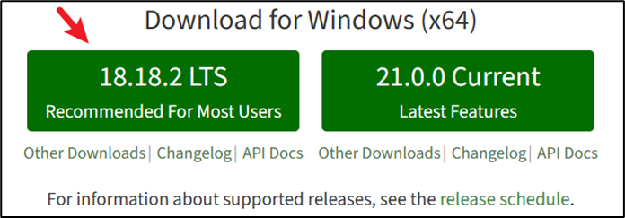

## 学习之前

- 怎么学
- 如何安装
- 第一个页面，如何定制这个页面
- VUE项目的文件组织结构是怎样的

怎么学：

- 官方教程：https://cn.vuejs.org/guide/introduction.html
- 菜鸟教程：https://www.runoob.com/vue3/vue3-tutorial.html

## 快速上手

学习了Vue的官方示例（点击一个按钮，计数器加1）后，怎样在本地实现一个相同效果的Vue项目？

首先就需要安装Vue，而安装Vue还需要有几个前置步骤。

### 安装Node.js

安装Vue需要版本高于16.0的Node.js

打开Node.js的安装页面：[Node.js (nodejs.org)](https://nodejs.org/en)

点击左边的LTS版本（实际上选哪个版本应该是无所谓的）



点击后会下载一个以`msi`为后缀的文件，我这里是：`node-v18.18.2-x64.msi`

一路点同意即可，中间注意选一下安装目录。

确认是否安装完毕，打开cmd，查看npm版本

```
# 查看npm版本
npm -v
# 9.8.1

# 查看node版本
node -v
# v18.18.2
```

使用国内的镜像（淘宝）安装cnpm

```
npm install -g cnpm --registry=https://registry.npmmirror.com
```

设置淘宝镜像

```
npm config set registry https://registry.npm.taobao.org 
```

检查是否成功

```
npm config get registry
```


然后之后安装东西就可以直接使用 cnpm命令了

```
cnpm install [name]
```

常用命令

```
#升级 npm
cnpm install npm -g

# 升级或安装 cnpm
npm install cnpm -g
```

### 创建Vue应用

然后在任意位置，创建一个目录，用于之后项目的创建，比如我创建了一个名为`vue_learn`的文件夹

进入这个文件夹，执行命令

```cmd
npm create vue@latest
```

初学的话，遇到接下来的可选功能选择时，全部选no就行了。

项目构建完以后，运行以下命令

```
cd <your-project-name>
npm install
```

启动vue项目

```
npm run dev
```

```
  VITE v4.5.0  ready in 411 ms

  ➜  Local:   http://localhost:5173/
  ➜  Network: use --host to expose
  ➜  press h to show help
```

访问：http://localhost:5173/ 就打开了vue项目

### 实现点击按钮计数加一

编辑`src/App.vue`

将里面的内容改为

```vue
<script setup>
import { ref } from 'vue'

const count = ref(0)

function increment() {
  count.value++
}
</script>

<template>

  <button @click="increment">count is: {{ count }}</button>

</template>
```

就实现了示例类似的内容

## Vue基础

我个人的理解`<script>`中，就类似于python编程，这里可以编写各种变量。

然后在`<template>`中使用这些变量。如果之前有使用过python的Flask框架，并且用Jinjia模板编写过一些页面的话。对于Vue的理解可能会容易些。

### 声明式渲染

[教程 | 声明式渲染](https://cn.vuejs.org/tutorial/#step-2)

Vue能够在`<script>`中定义一些变量，然后在`<template>`中使用这些变量。

有点类似于 jinjia 模板那种编程方式。

代码如下

```vue
<script setup>
import { reactive, ref } from 'vue'

const counter = reactive({ count: 0 })
const message = ref('Hello World!')
</script>

<template>
  <h1>{{ message }}</h1>
  <p>Count is: {{ counter.count }}</p>
</template>
```

在下面的`<template>`中，就通过双大括号的方式调用了这些变量。

> 注：直接把这个代码拷贝到 App.vue 即可测试

### Attribute 绑定

[教程 | Attribute 绑定](https://cn.vuejs.org/tutorial/#step-3)

和上面的类似，就是在`<script>`中定义一些**类名**，然后在`<template>`中使用这些**类名**。

就是使用方式有些不同，不能用双大括号，要用特定的语法

```
v-bind:class = "[变量名]"
# 简写
:class = "[变量名]"
```

代码如下

```vue
<script setup>
import { ref } from 'vue'

const titleClass = ref('title')
</script>

<template>
  <h1 :class="titleClass">Make me red</h1>
</template>

<style>
.title {
  color: red;
}
</style>
```

说明：

在`<style> `中，定义了一个类名为 `title`的样式。

在`<script>`中，定义了一个变量`titleClass`，值为 `title`。

在`<template>`中，通过`:class="titleClass"`的方式使用这个变量。

### 事件监听

[教程 | 事件监听](https://cn.vuejs.org/tutorial/#step-4)

可以在`<script>`中定义一些事件触发函数，当点击按钮等操作时，触发这个函数。

语法

```vue
<button v-on:click="increment"></button>
<button @click="increment"></button>
```

代码示例

```vue
<script setup>
import { ref } from 'vue'

const count = ref(0)

function increment() {
  count.value++
}
</script>

<template>
  <button @click="increment">count is: {{ count }}</button>
</template>
```

### 表单绑定

[教程 | 表单绑定](https://cn.vuejs.org/tutorial/#step-5)

就是属性绑定和事件监听的结合使用。

比如有个输入框，当你输入内容时，想实现一个内容同步在下方展示预览。

**核心就是**：把`<script>`中的变量的值，与表单填写的值关联到一起。

执行逻辑：

- 输入内容时，触发事件，在事件函数中更新变量的值
- 展示变量的值。

核心语法

```vue
<input v-model="text">
```

代码案例：下面的代码先展示一个完整版的，然后使用上面的语法去简化。

```vue
<script setup>
import { ref } from 'vue'
const text = ref('')

function onInput(e) {
  text.value = e.target.value
}
</script>

<template>
  <input :value="text" @input="onInput" placeholder="Type here">
  <p>{{ text }}</p>
</template>
```

这里把`<input>`中的 value 属性绑定到了变量 `text`，因为变量 `text` 初始是空的，因此初始状态下，输入框也是空的。

当更改输入框内容时，触发了事件，会修改变量 `text` 的值。

由于这个方法十分常用，因此可以简化为

```vue
<script setup>
import { ref } from 'vue'

const text = ref('')
</script>

<template>
  <input v-model="text" placeholder="Type here">
  <p>{{ text }}</p>
</template>
```


### 条件渲染

[教程 | 条件渲染](https://cn.vuejs.org/tutorial/#step-6)

比如你在`<script>`中定义了一些布尔类型的变量，只希望变量为True时才展示元素。

核心语法：

```vue
<h1 v-if="awesome">Vue is awesome!</h1>
<h1 v-else>Oh no 😢</h1>
```

只有当`awesome`变量为True时，才渲染这个标签。

示例代码

```vue
<script setup>
import { ref } from 'vue'

const awesome = ref(true)

function toggle() {
  awesome.value = !awesome.value
}
</script>

<template>
  <button @click="toggle">toggle</button>
  <h1 v-if="awesome">Vue is awesome!</h1>
  <h1 v-else>Oh no 😢</h1>
</template>
```

点击按钮会切换变量 awesome的值，然后界面根据awesome的值去变化。


### 列表渲染

[教程 | 列表渲染](https://cn.vuejs.org/tutorial/#step-7)

定义一个名为`id`的临时变量。

定义一个变量名为 `todos`的列表，每个元素是一个对象，对象包含2个字段，分别为`id`和`text`。

```js
let id = 0
// 定义 todos
```

定义一个名为`newTodo`的变量

定义一个名为`addTodo()`的函数，作用是向列表里加入一个新的元素，其中id的值自增，text的值取自 newTodo 变量存储的字符串。

```js
function addTodo() {
    // ...
}
```


就是备忘录的功能，在输入框中输入一些记录，然后可以动态的添加到页面上

也可以点 x 去删掉这条备忘录。

示例代码

```vue
<script setup>
import { ref } from 'vue'

// 给每个 todo 对象一个唯一的 id
let id = 0

const newTodo = ref('')
const todos = ref([
  { id: id++, text: 'Learn HTML' },
  { id: id++, text: 'Learn JavaScript' },
  { id: id++, text: 'Learn Vue' }
])

function addTodo() {
  todos.value.push({ id: id++, text: newTodo.value })
  newTodo.value = ''
}

function removeTodo(todo) {
  todos.value = todos.value.filter((t) => t !== todo)
}
</script>

<template>
  <form @submit.prevent="addTodo">
    <input v-model="newTodo">
    <button>Add Todo</button>    
  </form>
  <ul>
    <li v-for="todo in todos" :key="todo.id">
      {{ todo.text }}
      <button @click="removeTodo(todo)">X</button>
    </li>
  </ul>
</template>
```

下面详细解释这段代码

#### 列表和对象

```js
const todos = ref([
  { id: id++, text: 'Learn HTML' },
  { id: id++, text: 'Learn JavaScript' },
  { id: id++, text: 'Learn Vue' }
])
```

`todos` 的数据类型是JavaScript 对象，该对象包含一个 `value` 属性。

 `value` 属性的数据类型是数组（Array）。

数组里面的每一个元素都是对象（Object），每个对象都包含 `id` 和 `text` 两个属性。

修改某个 todo 的文本

```js
let todoToEdit = todos.value.find(t => t.id === someId);
if (todoToEdit) {
    todoToEdit.text = 'Updated Task';
}
```

> `find` 方法会遍历 `todos.value` 中的每一个 todo，并对每个 todo 使用箭头函数来判断其 `id` 是否等于 `someId`。当找到第一个满足条件的 todo 时，它就会返回这个 todo。

新增一个 todo

```js
todos.value.push({ id: someId, text: 'New Task' });
```

删除一个todo

```js
todos.value = todos.value.filter(t => t.id !== someId);
```

#### 箭头函数

箭头函数：`t => t.id !== someId`

它的效果相当于

```js
function(t) {
    return t.id === someId;
}
```

箭头函数通常配合 `filter`和 `find`

> 类似与 python 中的 lambda表达式

#### 表单行为

```html
  <form @submit.prevent="addTodo">
    <input v-model="newTodo">
    <button>Add Todo</button>    
  </form>
```

**`@submit.prevent="addTodo"` 是什么意思**？

`@submit`  表示监听 submit 事件。

`.prevent` 是一个事件修饰符，设置这个修饰符后， Vue 在执行事件处理程序之前会阻止事件的默认行为。

对于 `submit` 事件，其默认行为是提交表单并刷新页面。

因此，`@submit.prevent="addTodo"` 的意思是：“当表单被提交时，阻止其默认行为（即不刷新页面）并执行 `addTodo` 函数。”


**为什么这个button按钮会触发 submit事件 **

在 HTML的 `<form>` 元素内，如果一个 `<button>` 没有指定 `type` 属性

就相当于默认 `type="submit"`

因此点击该按钮会提交表单。

### 计算属性

[教程 | 计算属性](https://cn.vuejs.org/tutorial/#step-8)

核心语法`computed`

`computed` 属性用于声明一个依赖其他响应式属性的属性。

当依赖的响应式属性发生改变时，`computed` 属性的值会自动更新。

> “响应式属性”是 Vue.js 中的一个核心概念。它指的是当属性值发生变化时，能够自动触发视图更新的属性。换句话说，当这些属性的值变化时，与它们相关联的任何内容（如 UI 组件或计算属性）都会被重新渲染或重新计算。
>
> `const newTodo = ref('')`
>
> 上面这个代码就声明了一个响应式属性

```js
const hideCompleted = ref(false)

const filteredTodos = computed(() => {
  return hideCompleted.value
    ? todos.value.filter((t) => !t.done)
    : todos.value
})
```

效果是根据 `hideCompleted`的状态返回一个todo列表。

当`todos`或者`hideCompleted`发生改变时，都会重新计算一下`filteredTodos`

>  `computed` 返回的结果不仅仅局限于列表。`computed` 可以返回任何类型的值`


```vue
<script setup>
import { ref, computed } from 'vue'

let id = 0

const newTodo = ref('')
const hideCompleted = ref(false)
const todos = ref([
  { id: id++, text: 'Learn HTML', done: true },
  { id: id++, text: 'Learn JavaScript', done: true },
  { id: id++, text: 'Learn Vue', done: false }
])

const filteredTodos = computed(() => {
  return hideCompleted.value
    ? todos.value.filter((t) => !t.done)
    : todos.value
})

function addTodo() {
  todos.value.push({ id: id++, text: newTodo.value, done: false })
  newTodo.value = ''
}

function removeTodo(todo) {
  todos.value = todos.value.filter((t) => t !== todo)
}
</script>

<template>
  <form @submit.prevent="addTodo">
    <input v-model="newTodo">
    <button>Add Todo</button>
  </form>
  <ul>
    <li v-for="todo in filteredTodos" :key="todo.id">
      <input type="checkbox" v-model="todo.done">
      <span :class="{ done: todo.done }">{{ todo.text }}</span>
      <button @click="removeTodo(todo)">X</button>
    </li>
  </ul>
  <button @click="hideCompleted = !hideCompleted">
    {{ hideCompleted ? 'Show all' : 'Hide completed' }}
  </button>
</template>

<style>
.done {
  text-decoration: line-through;
}
</style>
```

##### 动态类名绑定

```vue
<span :class="{ done: todo.done }">
```

这个的效果是判断，如果属性名对应的值是True，那效果相当于

```html
<span class="done">
```

这vue的一种特殊的语法，通过给绑定的属性传入一个对象来控制类的选项

比如还可以这样写

```html
<span :class="{ done: todo.done, active: isActive }">
```

当两个属性的值都是true时，渲染的效果相当于

```html
<span class="done active">
```


### 生命周期和模板引用

[教程 | 生命周期和模板引用](https://cn.vuejs.org/tutorial/#step-9)

```vue
<script setup>
import { ref, onMounted } from 'vue'

const pElementRef = ref(null)

onMounted(() => {
  pElementRef.value.textContent = 'mounted!'
})
</script>

<template>
  <p ref="pElementRef">hello</p>
</template>
```

就是说在写代码的时候，有时候可能要用代码操作某个特定的DOM的元素。

有一种方式就能让代码获取到这个DOM元素。就是上面的语法

> 事实上大部分情况是不会这样使用的。


### 侦听器

[教程 | 侦听器](https://cn.vuejs.org/tutorial/#step-10)

核心代码

```js
watch(count, func)
```

效果就是当count这个变量改变时，执行一次 func函数


```vue
<script setup>
import { ref, watch } from 'vue'

const todoId = ref(1)
const todoData = ref(null)

async function fetchData() {
  todoData.value = null
  const res = await fetch(
    `https://jsonplaceholder.typicode.com/todos/${todoId.value}`
  )
  todoData.value = await res.json()
}

fetchData()

watch(todoId, fetchData)
</script>

<template>
  <p>Todo id: {{ todoId }}</p>
  <button @click="todoId++">Fetch next todo</button>
  <p v-if="!todoData">Loading...</p>
  <pre v-else>{{ todoData }}</pre>
</template>
```


### 组件

[教程 | 组件](https://cn.vuejs.org/tutorial/#step-11)

目前为止，我们只使用了单个组件。真正的 Vue 应用往往是由嵌套组件创建的。

父组件可以在模板中渲染另一个组件作为子组件。要使用子组件，我们需要先导入它：

假设现在有两个文件

`App.vue`

```vue
<script setup>
import ChildComp from './ChildComp.vue'
</script>

<template>
  <ChildComp />
</template>
```

`ChildComp.vue`

```vue
<template>
  <h2>A Child Component!</h2>
</template>
```


### 传参数给子组件Props

[教程 | Props](https://cn.vuejs.org/tutorial/#step-12)

子组件可以通过 **props** 从父组件接受动态数据。首先，子组件要声明它接受的 props：

```js
// 在子组件中
export default {
  props: {
    msg: String
  }
}
```

`defineProps()` 是一个编译时的宏，不需要导入

一旦声明，`msg`就可以在子组件的模板中使用。它也可以通过 `defineProps()` 所返回的对象在 JavaScript 中访问。

给子组件传值，有两种方式：

 `v-bind` 语法，可以动态传值

```vue
<ChildComp :msg="greeting" />
```

属性传值，传一个固定值

```vue
<ChildComp msg="hello child" />
```


案例

`App.vue`

```vue
<script setup>
import { ref } from 'vue'
import ChildComp from './ChildComp.vue'

const greeting = ref('Hello from parent')
</script>

<template>
  <ChildComp msg="hello child" />
</template>
```

`ChildComp.vue`

```vue
<script setup>
const props = defineProps({
  msg: String
})
</script>

<template>
  <h2>{{ msg || 'No props passed yet' }}</h2>
</template>
```


### 向父组件触发事件Emits

[教程 | Emits](https://cn.vuejs.org/tutorial/#step-13)

除了接收 props，子组件还可以向父组件触发事件：

在子组件中

```vue
<script setup>
const emit = defineEmits(['response'])

emit('response', 'hello from child')
</script>
```

`emit()` 的第一个参数是事件的名称。其他所有参数都将传递给事件监听器。

父组件可以使用 `v-on` 监听子组件触发的事件——这里的处理函数接收了子组件触发事件时的额外参数并将它赋值给了本地状态：

```vue
<ChildComp @response="(msg) => childMsg = msg" />
```

示例

`App.vue`

```vue
<script setup>
import { ref } from 'vue'
import ChildComp from './ChildComp.vue'

const childMsg = ref('No child msg yet')
</script>

<template>
  <ChildComp @response="(msg) => childMsg = msg" />
  <p>{{ childMsg }}</p>
</template>
```

`ChildComp.vue`

```vue
<script setup>
const emit = defineEmits(['response'])

emit('response', 'hello from child')
</script>

<template>
  <h2>Child component</h2>
</template>
```

在 Vue 3 中，`defineEmits` 的设计是接收一个数组，该数组包含了组件可能触发的所有事件名。这是为了保持清晰性和一致性，特别是当组件有多个可能的 emit 事件时。

就是说还可以这么写

```js
const emit = defineEmits(['response', 'update', 'completed'])
```

发送信号

```js
emit('update', 'this is update')
```


### 插槽

[教程 | 插槽](https://cn.vuejs.org/tutorial/#step-14)

相当于模板的默认设置

除了通过 props 传递数据外，父组件还可以通过**插槽** (slots) 将模板片段传递给子组件：

```vue
<ChildComp>
  This is some slot content!
</ChildComp>
```


**场景**

假设你正在开发一个 Web 应用，你想创建一个通用的弹出框组件，这个弹出框应该能展示各种内容，如提示、确认信息、表单等。你希望这个组件足够通用，以便可以在不同的上下文中使用。

为了达到这个目的，你可以使用 Vue 的插槽功能。

1. **ModalComponent.vue**（子组件）

```vue
<template>
  <div class="modal">
    <div class="modal-header">
      <slot name="header">默认标题</slot>
    </div>
    <div class="modal-body">
      <slot>默认内容</slot>
    </div>
    <div class="modal-footer">
      <slot name="footer">默认的底部内容，比如一些按钮</slot>
    </div>
  </div>
</template>

<style>
/* 一些样式来美化模态框... */
</style>
```

这个 `ModalComponent` 有三个插槽：一个默认插槽用于主体内容，一个名为 `header` 的命名插槽用于标题，还有一个名为 `footer` 的命名插槽用于底部的动作按钮。

2. **ParentComponent.vue**（父组件）

```vue
<template>
  <ModalComponent>
    <template #header>
      删除确认
    </template>
    
    确定要删除这个项目吗？

    <template #footer>
      <button @click="cancel">取消</button>
      <button @click="confirm">确认</button>
    </template>
  </ModalComponent>
</template>

<script>
import ModalComponent from './ModalComponent.vue';

export default {
  components: {
    ModalComponent
  },
  methods: {
    cancel() {
      // 取消逻辑
    },
    confirm() {
      // 确认逻辑
    }
  }
}
</script>
```

在这个 `ParentComponent` 中，我们使用了 `ModalComponent` 并填充了所有的插槽。当我们显示此组件时，它将呈现一个标题为“删除确认”的模态框，询问用户是否要删除一个项目，并提供取消和确认的按钮。

这就是插槽的魔力。通过使用插槽，你可以创建非常灵活和可重用的组件。子组件定义了结构和样式，而父组件可以插入自定义的内容。这使得组件更加模块化，也更容易维护。