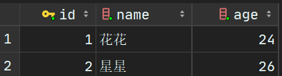

https://docs.djangoproject.com/en/3.1/

https://www.liujiangblog.com/course/django/

专注与用案例学习django，暂时忽略前端的表现，着重与视图函数和模型的使用。

其实主要是和数据库的交互要搞懂。

比如我最想弄懂的就是外键相关的操作。

先打好基础

# 模型操作

这里的模型指的是ORM（Object Relational Mapping）模型，用了它和数据库交互就会变得非常简单。

首先创建模型和模型迁移的方式应当烂熟于心。

其次就是要了解如何给模型加新的字段。

## 创建模型

在`./mysite/models.py`中定义新的模型。

**记得一定要继承`models.Model`，否则迁移数据库命令会无效。**

```python
class Student(models.Model):
    name = models.CharField(max_length=30)
    age = models.IntegerField()
    sex = models.BooleanField()
    e_time = models.DateTimeField("入学时间", auto_now_add=True)
```

这四个字段，需要烂熟于心，是最常见的4个字段。

编写完毕后执行

```
python manage.py makemigrations mysite
```

```
python manage.py migrate
```

然后查看数据库


## 编写脚本

在主目录创建一个`test_code`文件夹，专门用于编写测试代码，在这个文件夹下创建一个`demo.py`文件。

### 写入数据到数据库

在`demo.py`文件中写入下面的代码，右键选择Run File in Python Console查看结果

```python
from mysite.models import Student
students = Student.objects.all()
print(students)
```

结果

```
<QuerySet []>
```

说明表目前为空，下面往表里写入数据，先定义几个学生

```python
from mysite.models import Student
myfriends = [{'name': 'lily', 'age': 12, 'sex': 0},
             {'name': 'tom', 'age': 14, 'sex': 1},
             {'name': 'alice', 'age': 13, 'sex': 0}]

for friend in myfriends:
    Student.objects.create(name=friend['name'],
                           age=friend['age'],
                           sex=friend['sex'])
```

右键执行后，查看数据库


ps:后面输入测试部分，测试完以后要把添加的测试数据删掉。

**如果往整形字段插入`"16"`会怎样？**

```python
# 不会报错
Student.objects.create(name='test1', age='16', sex=1)
```

**如果往整形字段插入`"sixteen"`会怎样？**

```python
# 会报错
Student.objects.create(name='test2', age='sixteen', sex=1)
```

```
ValueError: Field 'age' expected a number but got 'sixteen'.
```

下面是对字符串字段和布尔字段的测试

```python
# 往bool字段插入字符串 【报错】
Student.objects.create(name='test3', age=12, sex="10")
# 往bool字段插入负数 【报错】
Student.objects.create(name='test4', age=12, sex=-5)
# django.core.exceptions.ValidationError: ['“10” value must be either True or False.']
# 往bool字段插入字符串 "0" 【通过】
Student.objects.create(name='test5', age=12, sex="0")

# 往char字段插入数字 【通过】
Student.objects.create(name=123, age=12, sex=1)
# 而且可以通过Student.objects.get(name=123) 找到它

# 往char字段插入bool值 【通过】
Student.objects.create(name=True, age=12, sex=1)
# 而且可以通过Student.objects.get(name=True) 找到它

# ps: 默认都不能插入None值，一插就报错
```

### 使模型更直观显示

修改`demo.py`

```python
from mysite.models import Student
students = Student.objects.all()
print(students)
```

结果

```
<QuerySet [<Student: Student object (1)>, <Student: Student object (2)>, <Student: Student object (3)>]>
```

可以看到，这样其实还是挺不直观的，修改下模型(不需要迁移)，定义`__str__()`

```python
# ./mysite/models.py
class Student(models.Model):
    name = models.CharField(max_length=30)
    age = models.IntegerField()
    sex = models.BooleanField()
    e_time = models.DateTimeField("入学时间", auto_now_add=True)
    
    def __str__(self):
        return self.name
```

再重新执行`test_code/demo.py`

```
<QuerySet [<Student: lily>, <Student: tom>, <Student: alice>]>
```

## 修改模型在数据库中的表名

数据表在数据库的名称是自动生成的，要想修改名称：

只需在原来的基础上加入：

```python
class Student(models.Model):
    name = models.CharField(max_length=30)
    age = models.IntegerField()
    sex = models.BooleanField()
    e_time = models.DateTimeField("入学时间", auto_now_add=True)
    
    def __str__(self):
        return self.name
    
    class Meta:
        db_table = 'student'
```

然后再执行：

```
python manage.py makemigrations mysite
python manage.py migrate
```

再次查看数据库会发现表名变了


## 修改字段的定义

如果觉得原来的性别定义不够直观，想要修改成用`male`代表男，`female`代表女。就需要**把原来的bool字段改成char字段**。

```python
class Student(models.Model):
    SEX = (
        ('male', '男'),
        ('female', '女'),
        ('unknown', '保密'),
    )
    name = models.CharField(max_length=30)
    age = models.IntegerField()
    sex = models.CharField(max_length=10, choices=SEX, default='unknown')
    e_time = models.DateTimeField("入学时间", auto_now_add=True)
    
    def __str__(self):
        return self.name
    
    class Meta:
        db_table = 'student'
```

这里定义了一个SEX的二维元组，里边每个元组的左边的值表示数据库中实际存放的值，右边的值表示页面上具体显示的内容。

执行数据库迁移

注：仅仅是这样的话，原来数据库的值不会发生任何改变。比如如果你原来数据库的值是这样的，迁移后不会发生变化：


如果想修改sex的值怎么办？

回到之前的`test_code/demo.py`，手动批量更新一下即可

```python
from mysite.models import Student

Student.objects.filter(sex=1).update(sex='male')
Student.objects.filter(sex=0).update(sex='female')
```

## 增加一个字段

随着业务需求的增加，也许需要新增一个字段。

```python
class Student(models.Model):
    SEX = (
        ('male', '男'),
        ('female', '女'),
        ('unknown', '保密'),
    )
    name = models.CharField(max_length=30)
    age = models.IntegerField()
    sex = models.CharField(max_length=10, choices=SEX, default='unknown')
    e_time = models.DateTimeField("入学时间", auto_now_add=True)
    # 新增字段
    school = models.CharField(max_length=30, default='unknown')
    
    def __str__(self):
        return self.name
    
    class Meta:
        db_table = 'student'
```

直接新增就行，执行数据库迁移后，数据表内就多了新的字段


## 删除一个字段

直接注释掉那个字段，然后迁移数据库即可。

## 数据库迁移的回退

如果发现不小心删除了一个字段，怎么撤销到上一次的状态。

https://blog.csdn.net/victor2code/article/details/105282826

查看当前应用的migrations文件夹可以看到，里边记录了每次的操作


只需手动迁移一下

回到很久以前还没有更名的时候

```
python manage.py migrate mysite 0002_auto_20201216_2054
```

回到删除school之前

```
python manage.py migrate mysite 0009_student_school
```

注意：此时`./mysite/models.py`中关于`Student`类的代码是没有变化的，记得及时修改。

可以用`-n`指定数据库迁移的的文件名帮助记忆。

```
python manage.py makemigrations mysite -n 0011_rename_age_field
```

# 外键

```
python manage.py startapp foreign
```

新建一个app，并且在`settings.py`里注册它

```python
INSTALLED_APPS = [
    'django.contrib.admin',
    'django.contrib.auth',
    'django.contrib.contenttypes',
    'django.contrib.sessions',
    'django.contrib.messages',
    'django.contrib.staticfiles',
    'mysite.apps.MysiteConfig',
    'foreign'
]
```

## 多对一

比如说，北京，上海，广州，深圳都属于中国的城市。纽约，华盛顿，西雅图属于美国的城市。在这个案例中，城市就是“多”的一方，国家就是“一”的一方。

再比如，小明，小红是清华大学的学生，小蓝，小华是北京大学的学生。

此处学生是“多”，学校是“一”。还是用之前的例子

### 外键字段的写法

```python
school = models.ForeignKey('School',
                           null=True,
                           default=None,
                           on_delete=models.CASCADE)
```


编写`./mysite/models.py`，加入学校模型，同时在学生类这里把学校改成用外键来表示。

```python
from django.db import models


# Create your models here.
class Student(models.Model):
    SEX = (
        ('male', '男'),
        ('female', '女'),
        ('unknown', '保密'),
    )
    name = models.CharField(max_length=30)
    age = models.IntegerField()
    sex = models.CharField(max_length=10, choices=SEX, default='unknown')
    e_time = models.DateTimeField("入学时间", auto_now_add=True)
    school = models.ForeignKey('School',
                               null=True,
                               default=None,
                               on_delete=models.CASCADE)

    def __str__(self):
        return self.name

    class Meta:
        db_table = 'student'


class School(models.Model):
    name = models.CharField(max_length=30)
    city = models.CharField(max_length=30)
    c_date = models.DateField('建校日')
    population = models.FloatField('人数(万)')
```

### on_delete参数

`on_delete`参数可选的值都内置在`django.db.models`中（全部为大写），包括：

- CASCADE：模拟SQL语言中的`ON DELETE CASCADE`约束，将定义有外键的模型对象同时删除！
- PROTECT:阻止上面的删除操作，但是弹出`ProtectedError`异常
- SET_NULL：将外键字段设为null，只有当字段设置了`null=True`时，方可使用该值。
- SET_DEFAULT:将外键字段设为默认值。只有当字段设置了default参数时，方可使用。
- DO_NOTHING：什么也不做。
- SET()：设置为一个传递给SET()的值或者一个回调函数的返回值。注意大小写。

迁移后：


### 给“多”的那一方加上外键对象

创建几个学校：

```python
from mysite.models import Student, School

School.objects.create(name='清花小学',
                      city='北京',
                      c_date='1999-04-11',
                      population=3.28)

School.objects.create(name='芙丹小学',
                      city='上海',
                      c_date='2004-03-27',
                      population=1.74)
```


给这几个学生添上学校

```python
from mysite.models import Student, School

boys = Student.objects.filter(sex='male')
girls = Student.objects.filter(sex='female')

qinghua = School.objects.get(name='清花小学')
fudan = School.objects.get(name='芙丹小学')

boys.update(school=qinghua)
girls.update(school=fudan)
```


### 外键正反查询

```python
from mysite.models import Student, School

# 多查一
lily = Student.objects.get(name='lily')
print('lily 的学校是', lily.school)

# 一查多
fudan = School.objects.get(name='芙丹小学')
students = fudan.student_set.all()
print('芙丹小学有以下学生：', students)
```

结果：

```
lily 的学校是 芙丹小学
芙丹小学有以下学生： <QuerySet [<Student: lily>, <Student: alice>]>
```

### 有外键约束的情况下删除

```python
from mysite.models import Student, School
# 可以删除
lily = Student.objects.get(name='lily')
lily.delete()

# 会把所有属于fudan小学的学生都删掉
fudan = School.objects.get(name='芙丹小学')
fudan.delete()
```

## 多对多

首先清空学校表和学生表（手动删除即可）


下面建立个多对多的模型，一个学生可以有多个老师，同样一个老师可以教多个学生。定义多对多字段的时候，只需要定义一个就行。

- 给Student类新增一个teacher字段
- 新增一个Teacher类

```python
from django.db import models


# Create your models here.
class Student(models.Model):
    SEX = (
        ('male', '男'),
        ('female', '女'),
        ('unknown', '保密'),
    )
    name = models.CharField(max_length=30)
    age = models.IntegerField()
    sex = models.CharField(max_length=10, choices=SEX, default='unknown')
    e_time = models.DateTimeField("入学时间", auto_now_add=True)
    school = models.ForeignKey('School',
                               null=True,
                               default=None,
                               on_delete=models.CASCADE)
    teachers = models.ManyToManyField('Teacher')

    def __str__(self):
        return self.name

    class Meta:
        db_table = 'student'


class Teacher(models.Model):
    name = models.CharField(max_length=30)
    age = models.IntegerField()

    def __str__(self):
        return self.name
```

建议为多对多字段名使用复数形式。

多对多关系需要一个位置参数：关联的对象模型，其它用法和外键多对一基本类似。

如果要创建一个关联自己的多对多字段，依然是通过`'self'`引用。

**在数据库后台，Django实际上会额外创建一张用于体现多对多关系的中间表**。默认情况下，该表的名称是“`多对多字段名+包含该字段的模型名+一个独一无二的哈希码`”，例如‘author_books_9cdf4’，当然你也可以通过`db_table`选项，自定义表名。

### 创建数据

```python
from mysite.models import Student, Teacher

students = [{'name': 'lily', 'age': 13, 'sex': 'female'},
            {'name': 'andy', 'age': 12, 'sex': 'female'},
            {'name': 'tom', 'age': 14, 'sex': 'male'},
            {'name': 'jack', 'age': 13, 'sex': 'male'}]

teachers = [{'name': '花花', 'age': 24},
            {'name': '星星', 'age': 26}]

for s in students:
    Student.objects.create(name=s['name'],
                           age=s['age'],
                           sex=s['sex'])

for t in teachers:
    Teacher.objects.create(name=t['name'],
                           age=t['age'])

```



### 相互关联

```python
from mysite.models import Student, Teacher

teams = {
    '花花': ['lily', 'andy', 'jack'],
    '星星': ['lily', 'andy', 'tom'],
}

for teacher in teams:
    t = Teacher.objects.get(name=teacher)
    for student in teams[teacher]:
        s = Student.objects.get(name=student)
        s.teachers.add(t)
```

添加完后，可以看到student_teachers这张表就多了这些信息


### 相互查找

```python
from mysite.models import Student, Teacher

lily = Student.objects.get(name='lily')
huahua = Teacher.objects.get(name='花花')

print(lily.teachers.all())
print(huahua.student_set.all())
```

结果

```
<QuerySet [<Teacher: 花花>, <Teacher: 星星>]>
<QuerySet [<Student: lily>, <Student: andy>, <Student: jack>]>
```

### 取消关联

以下5步，建议一步一步执行，然后边执行边查看`student_teachers`数据表

- lily不要星星老师了!
- 花花老师不要jack了！
- andy决定自学成才了！
- 花花老师一怒之下不教了！
- 花花老师冷静了一下，重新收回了lily，andy，jack

```python
from mysite.models import Student, Teacher
lily = Student.objects.get(name='lily')
jack = Student.objects.get(name='jack')
andy = Student.objects.get(name='andy')
huahua = Teacher.objects.get(name='花花')
xingxing = Teacher.objects.get(name='星星')
# lily不要星星老师了!
lily.teachers.remove(xingxing)
# 花花老师不要jack了！
huahua.student_set.remove(jack)
# andy决定自学成才了！
andy.teachers.clear()
# 花花老师一怒之下不教了！
huahua.student_set.clear()
# 花花老师冷静了一下，重新收回了lily，andy，jack
huahua.student_set.set([lily, andy, jack])
```

### 删除

可以直接删除，同时会把中间表中关联到的数据也进行删除。

```python
from mysite.models import Student, Teacher
lily = Student.objects.get(name='lily')
huahua = Teacher.objects.get(name='花花')

lily.delete()
huahua.delete()
```

## 一对一

https://docs.djangoproject.com/en/3.1/topics/db/examples/one_to_one/

在进行这个操作之前，把老学生都删了。


这种关系类型多数用于当一个模型需要从别的模型扩展而来的情况。比如，Django自带auth模块的User用户表，如果你想在自己的项目里创建用户模型，又想方便的使用Django的auth中的一些功能，那么一个方案就是在你的用户模型里，使用一对一关系，添加一个与auth模块User模型的关联字段。

一个学生只能有一张校园卡，一张校园卡的主人也只能有一个学生

### 定义模型

定义新的校园卡模型，一对一关联到学生

```python
class Card(models.Model):
    student = models.OneToOneField('Student', on_delete=models.SET_NULL, null=True)
    money = models.IntegerField()
```

### 创建并关联一对一关系

创建几个学生和几张校园卡

```python
from mysite.models import Student, Card

students = [{'name': 'lily', 'age': 13, 'sex': 'female'},
            {'name': 'andy', 'age': 12, 'sex': 'female'},
            {'name': 'tom', 'age': 14, 'sex': 'male'},
            {'name': 'jack', 'age': 13, 'sex': 'male'}]

for s in students:
    student = Student.objects.create(name=s['name'],
                                     age=s['age'],
                                     sex=s['sex'])
    Card.objects.create(money=100, student=student)

```


### 相互查找

```python
from mysite.models import Student, Card

lily = Student.objects.get(name='lily')
jacks_card = Card.objects.get(student__name='jack')

print(lily.card.money)
print(jacks_card.student)
```

结果

```
100
jack
```

### 取消关联

```python
from mysite.models import Student, Card

toms_card = Card.objects.get(student__name='tom')
toms_card.student = None
toms_card.save()
```

### 删除

直接删除卡不会影响到student表

```python
from mysite.models import Student, Card

lily = Student.objects.get(name='lily')
jacks_card = Card.objects.get(student__name='jack')

lily.card.delete()
jacks_card.delete()
```

删除student会把卡的`student_id`列设为空，因为之前设定了`on_delete=models.SET_NULL`

```python
from mysite.models import Student, Card

andy = Student.objects.get(name='andy')
andy.delete()
```

