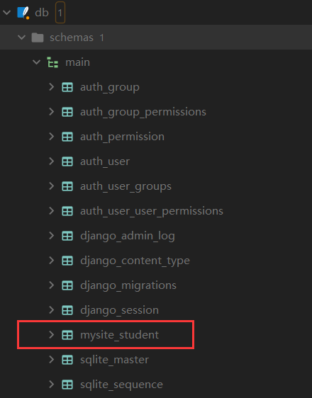
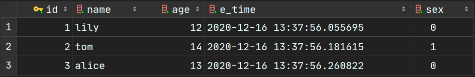
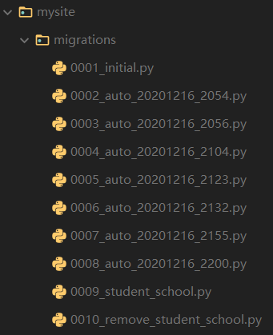

https://docs.djangoproject.com/en/3.1/

https://www.liujiangblog.com/course/django/

专注与用案例学习django，暂时忽略前端的表现，着重与视图函数和模型的使用。

其实主要是和数据库的交互要搞懂。

比如我最想弄懂的就是外键相关的操作。

先打好基础

# 模型操作

这里的模型指的是ORM（Object Relational Mapping）模型，用了它和数据库交互就会变得非常简单。

首先创建模型和模型迁移的方式应当烂熟于心。

其次就是要了解如何给模型加新的字段。

## 创建模型

在`./mysite/models.py`中定义新的模型。

**记得一定要继承`models.Model`，否则迁移数据库命令会无效。**

```python
class Student(models.Model):
    name = models.CharField(max_length=30)
    age = models.IntegerField()
    sex = models.BooleanField()
    e_time = models.DateTimeField("入学时间", auto_now_add=True)
```

这四个字段，需要烂熟于心，是最常见的4个字段。

编写完毕后执行

```
python manage.py makemigrations mysite
```

```
python manage.py migrate
```

然后查看数据库



## 编写脚本

在主目录创建一个`test_code`文件夹，专门用于编写测试代码，在这个文件夹下创建一个`demo.py`文件。

### 写入数据到数据库

在`demo.py`文件中写入下面的代码，右键选择Run File in Python Console查看结果

```python
from mysite.models import Student
students = Student.objects.all()
print(students)
```

结果

```
<QuerySet []>
```

说明表目前为空，下面往表里写入数据，先定义几个学生

```python
from mysite.models import Student
myfriends = [{'name': 'lily', 'age': 12, 'sex': 0},
             {'name': 'tom', 'age': 14, 'sex': 1},
             {'name': 'alice', 'age': 13, 'sex': 0}]

for friend in myfriends:
    Student.objects.create(name=friend['name'],
                           age=friend['age'],
                           sex=friend['sex'])
```

右键执行后，查看数据库



ps:后面输入测试部分，测试完以后要把添加的测试数据删掉。

**如果往整形字段插入`"16"`会怎样？**

```python
# 不会报错
Student.objects.create(name='test1', age='16', sex=1)
```

**如果往整形字段插入`"sixteen"`会怎样？**

```python
# 会报错
Student.objects.create(name='test2', age='sixteen', sex=1)
```

```
ValueError: Field 'age' expected a number but got 'sixteen'.
```

下面是对字符串字段和布尔字段的测试

```python
# 往bool字段插入字符串 【报错】
Student.objects.create(name='test3', age=12, sex="10")
# 往bool字段插入负数 【报错】
Student.objects.create(name='test4', age=12, sex=-5)
# django.core.exceptions.ValidationError: ['“10” value must be either True or False.']
# 往bool字段插入字符串 "0" 【通过】
Student.objects.create(name='test5', age=12, sex="0")

# 往char字段插入数字 【通过】
Student.objects.create(name=123, age=12, sex=1)
# 而且可以通过Student.objects.get(name=123) 找到它

# 往char字段插入bool值 【通过】
Student.objects.create(name=True, age=12, sex=1)
# 而且可以通过Student.objects.get(name=True) 找到它

# ps: 默认都不能插入None值，一插就报错
```

### 使模型更直观显示

修改`demo.py`

```python
from mysite.models import Student
students = Student.objects.all()
print(students)
```

结果

```
<QuerySet [<Student: Student object (1)>, <Student: Student object (2)>, <Student: Student object (3)>]>
```

可以看到，这样其实还是挺不直观的，修改下模型(不需要迁移)，定义`__str__()`

```python
# ./mysite/models.py
class Student(models.Model):
    name = models.CharField(max_length=30)
    age = models.IntegerField()
    sex = models.BooleanField()
    e_time = models.DateTimeField("入学时间", auto_now_add=True)
    
    def __str__(self):
        return self.name
```

再重新执行`test_code/demo.py`

```
<QuerySet [<Student: lily>, <Student: tom>, <Student: alice>]>
```

## 修改模型在数据库中的表名

数据表在数据库的名称是自动生成的，要想修改名称：

只需在原来的基础上加入：

```python
class Student(models.Model):
    name = models.CharField(max_length=30)
    age = models.IntegerField()
    sex = models.BooleanField()
    e_time = models.DateTimeField("入学时间", auto_now_add=True)
    
    def __str__(self):
        return self.name
    
    class Meta:
        db_table = 'student'
```

然后再执行：

```
python manage.py makemigrations mysite
python manage.py migrate
```

再次查看数据库会发现表名变了


## 修改字段的定义

如果觉得原来的性别定义不够直观，想要修改成用`male`代表男，`female`代表女。就需要**把原来的bool字段改成char字段**。

```python
class Student(models.Model):
    SEX = (
        ('male', '男'),
        ('female', '女'),
        ('unknown', '保密'),
    )
    name = models.CharField(max_length=30)
    age = models.IntegerField()
    sex = models.CharField(max_length=10, choices=SEX, default='unknown')
    e_time = models.DateTimeField("入学时间", auto_now_add=True)
    
    def __str__(self):
        return self.name
    
    class Meta:
        db_table = 'student'
```

这里定义了一个SEX的二维元组，里边每个元组的左边的值表示数据库中实际存放的值，右边的值表示页面上具体显示的内容。

执行数据库迁移

注：仅仅是这样的话，原来数据库的值不会发生任何改变。比如如果你原来数据库的值是这样的，迁移后不会发生变化：


如果想修改sex的值怎么办？

回到之前的`test_code/demo.py`，手动批量更新一下即可

```python
from mysite.models import Student

Student.objects.filter(sex=1).update(sex='male')
Student.objects.filter(sex=0).update(sex='female')
```

## 增加一个字段

随着业务需求的增加，也许需要新增一个字段。

```python
class Student(models.Model):
    SEX = (
        ('male', '男'),
        ('female', '女'),
        ('unknown', '保密'),
    )
    name = models.CharField(max_length=30)
    age = models.IntegerField()
    sex = models.CharField(max_length=10, choices=SEX, default='unknown')
    e_time = models.DateTimeField("入学时间", auto_now_add=True)
    # 新增字段
    school = models.CharField(max_length=30, default='unknown')
    
    def __str__(self):
        return self.name
    
    class Meta:
        db_table = 'student'
```

直接新增就行，执行数据库迁移后，数据表内就多了新的字段


## 删除一个字段

直接注释掉那个字段，然后迁移数据库即可。

## 数据库迁移的回退

如果发现不小心删除了一个字段，怎么撤销到上一次的状态。

https://blog.csdn.net/victor2code/article/details/105282826

查看当前应用的migrations文件夹可以看到，里边记录了每次的操作



只需手动迁移一下

回到很久以前还没有更名的时候

```
python manage.py migrate mysite 0002_auto_20201216_2054
```

回到删除school之前

```
python manage.py migrate mysite 0009_student_school
```

注意：此时`./mysite/models.py`中关于`Student`类的代码是没有变化的，记得及时修改。

可以用`-n`指定数据库迁移的的文件名帮助记忆。

```
python manage.py makemigrations mysite -n 0011_rename_age_field
```

