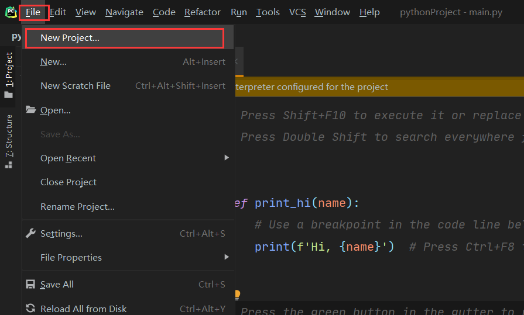
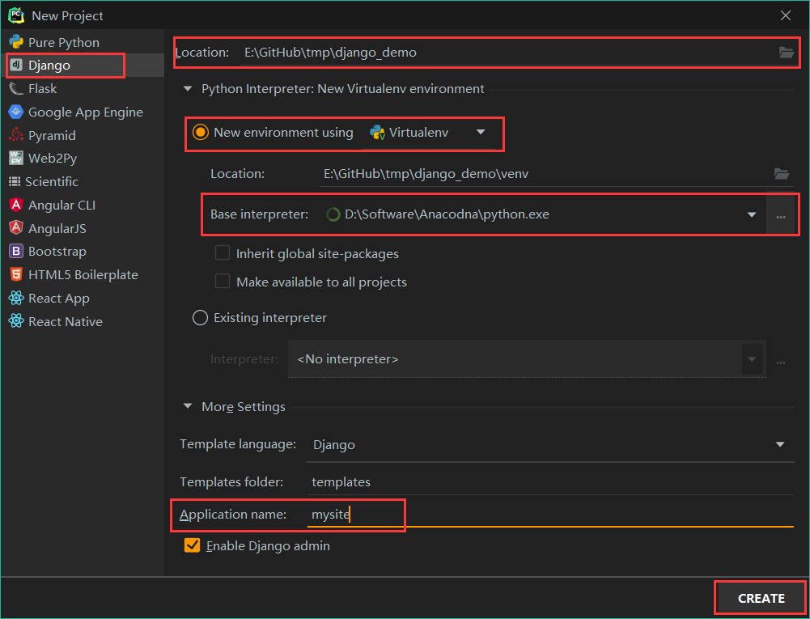

# 环境配置

需要安装Anaconda和PyCharm

首先打开PyCharm



- 在弹出的页面选择Django项目
- 根据需要修改项目位置
- 使用Virtualenv作为虚拟环境
- 选择Anaconda的python作为base interpreter
- 设定Application name（可选）设定这一项会自动帮你创建一个app
- 设定完毕后点右下角的create



点击CREATE后需要等待一定时间安装虚拟环境和下载django所需的包。 

环境创建好后可以进去终端查看目前有哪些包

```
(venv) E:\GitHub\tmp\django_demo>pip list
Package    Version
---------- -------
asgiref    3.3.1
Django     3.1.4
pip        20.3.3
pytz       2020.4
setuptools 51.0.0
sqlparse   0.4.1
```

文件目录结构如下:

