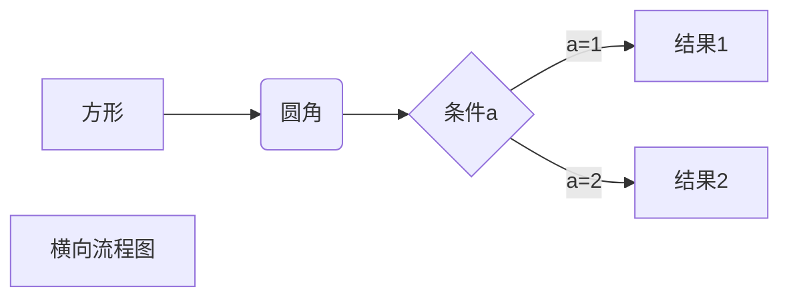

# Markdown


### 删除线


~~删除线用两个波浪线~~`~~文字~~`

### 画流程图



### Markdown跳转

ctrl+左键点击链接

[官方文档](https://support.typora.io/Links/#Internal%20Links)

#### 1 Link to Local Files

[Readme1](Readme1.md)

[Readme2](../Docs/Readme2.markdown)

[Readme3](Readme3)

[Readme4](/User/root/Docs/Readme1.md)

[Readme4](C:/Develop/Docs/Readme1.md)

[Readme4](file:///User/root/Docs/Readme1.md)

#### 2 Internal Links

[跳转到标题](#Markdown)

#### **3 html标签实现**

1. 定义一个锚(id)：`<span id="jump">跳转到的地方</span>`
2. 使用markdown语法：`[点击跳转](#jump)`


### 引用

`ctrl + shift + Q`

`>`

> 怎么引用？


### 高亮

```
==要高亮的文字==
```

==要高亮的文字==


