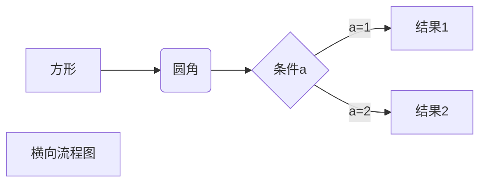

# Markdown


### 删除线


~~删除线用两个波浪线~~`~~文字~~`

### 画流程图



### Markdown跳转

ctrl+左键点击链接

[官方文档](https://support.typora.io/Links/#Internal%20Links)

#### 1 Link to Local Files

[Readme1](Readme1.md)

[Readme2](../Docs/Readme2.markdown)

[Readme3](Readme3)

[Readme4](/User/root/Docs/Readme1.md)

[Readme4](C:/Develop/Docs/Readme1.md)

[Readme4](file:///User/root/Docs/Readme1.md)

#### 2 Internal Links

[跳转到标题](#Markdown)

#### **3 html标签实现**

1. 定义一个锚(id)：`<span id="jump">跳转到的地方</span>`
2. 使用markdown语法：`[点击跳转](#jump)`


### 引用

`ctrl + shift + Q`

`>`

> 怎么引用？


### 高亮

```
==要高亮的文字==
```

==要高亮的文字==


## 常用latex

[官方文档](https://support.typora.io/Math/)

[参考网址](<https://katex.org/docs/supported.html>)

[基本Latex语法](https://www.zybuluo.com/codeep/note/163962#mjx-eqn-eqsample)

[关于Typora数学公式自动编号](https://www.cnblogs.com/nowgood/p/Latexstart.html#_nav_8)

[在线公式编辑器](<http://latex.codecogs.com/eqneditor/editor.php>)

| 效果      | 代码      | 效果          | 代码            | 效果 | 代码 |
| --------- | --------- | ------------- | --------------- | ---- | ---- |
| $\bar{a}$ | `\bar{a}` | $\mathcal{L}$ | `$\mathbb{L}$`  |      |      |
| $\hat{a}$ | `\hat{a}` | $\mathscr{L}$ | `$\mathscr{L}$` |      |      |
|           |           | $\mathbb{L}$  | `$\mathbb{L}$`  |      |      |

### 公式对齐

使用`&`确定对齐的位置

[公式对齐](https://blog.csdn.net/bendanban/article/details/77336206)

```
$$
\begin{align}
f(x) =& x^2 + 2x + 1 \\
g(x) =& 2x + 2
\end{align}
$$
```

$$
\begin{align}
f(x) =& x^2 + 2x + 1 \\
g(x) =& 2x + 2
\end{align}
$$

### 常用数学公式

**带大括号的公式**
$$
a_{i}=
\left\{ 
    \begin{aligned}
        0 & & {a>p}\\ 
        1 & & {a \leq p} \\
    \end{aligned} 
\right.
$$

**数组**
$$
\mathbf{x}=[x_1, x_2,...,x_n]
$$


$r_i \in \{0, 1\}$

