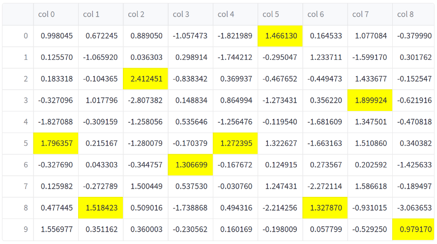
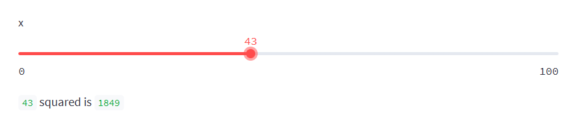
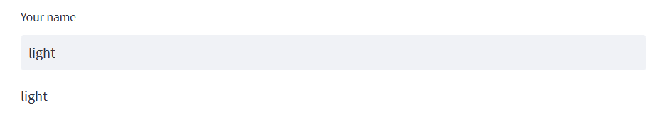

## 安装

https://docs.streamlit.io/library/get-started/installation

创建虚拟环境

```
conda create -n streamlit python=3.9
```

安装

```
pip install streamlit
```

测试是否安装完成

```
streamlit hello
```

运行你自己的脚本

```
# Running
python -m streamlit run your_script.py

# is equivalent to:
streamlit run your_script.py
```

甚至可以直接运行Github的项目

```
streamlit run https://raw.githubusercontent.com/streamlit/demo-uber-nyc-pickups/master/streamlit_app.py
```

## 使用

[Main concepts - Streamlit Docs](https://docs.streamlit.io/library/get-started/main-concepts)

创建这个脚本

```python
# demo.py
import streamlit as st
import pandas as pd

st.write("Here's our first attempt at using data to create a table:")
st.write(pd.DataFrame({
    'first column': [1, 2, 3, 4],
    'second column': [10, 20, 30, 40]
}))
```

运行就能看到结果

```
streamlit run demo.py
```

### 绘制表格

可以带格式

```python
import streamlit as st
import numpy as np
import pandas as pd

dataframe = pd.DataFrame(
    np.random.randn(10, 20),
    columns=('col %d' % i for i in range(20)))

st.dataframe(dataframe.style.highlight_max(axis=0))
```



### 绘制折线图


```python
import streamlit as st
import numpy as np
import pandas as pd

chart_data = pd.DataFrame(
     np.random.randn(20, 3),
     columns=['a', 'b', 'c'])

st.line_chart(chart_data)
```


### 绘制散点图


地图散点图

```python
import streamlit as st
import numpy as np
import pandas as pd

map_data = pd.DataFrame(
    np.random.randn(1000, 2) / [50, 50] + [37.76, -122.4],
    columns=['lat', 'lon'])

st.map(map_data)
```


### Widgets

比如滑条、按钮、下拉选择框

- [`st.slider()`](https://docs.streamlit.io/library/api-reference/widgets/st.slider)
-  [`st.button()`](https://docs.streamlit.io/library/api-reference/widgets/st.button) 
-  [`st.selectbox()`](https://docs.streamlit.io/library/api-reference/widgets/st.selectbox)

```python
import streamlit as st
x = st.slider('x')  # 👈 this is a widget
st.write(x, 'squared is', x * x)
```



```python
import streamlit as st
st.text_input("Your name", key="name")

# You can access the value at any point with:
st.session_state.name
```



```python
import streamlit as st
import numpy as np
import pandas as pd

if st.checkbox('Show dataframe'):
    chart_data = pd.DataFrame(
       np.random.randn(20, 3),
       columns=['a', 'b', 'c'])

    chart_data
```


可以切换是否显示数据


```python
import streamlit as st
import pandas as pd

df = pd.DataFrame({
    'first column': [1, 2, 3, 4],
    'second column': [10, 20, 30, 40]
    })

option = st.selectbox(
    'Which number do you like best?',
     df['first column'])

'You selected: ', option
```

下拉选项框

