首页>从文件中导入

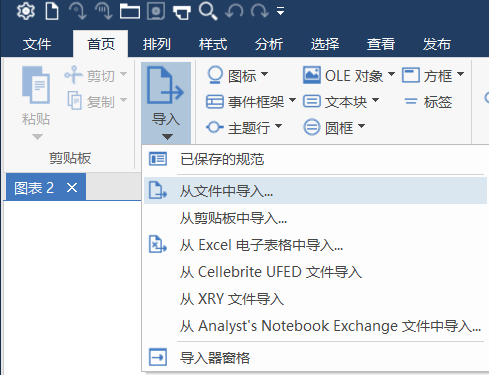

选择一个文件

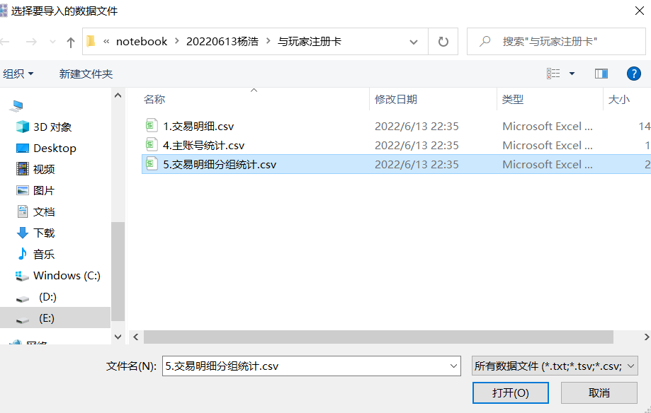

选择【创建新规范】

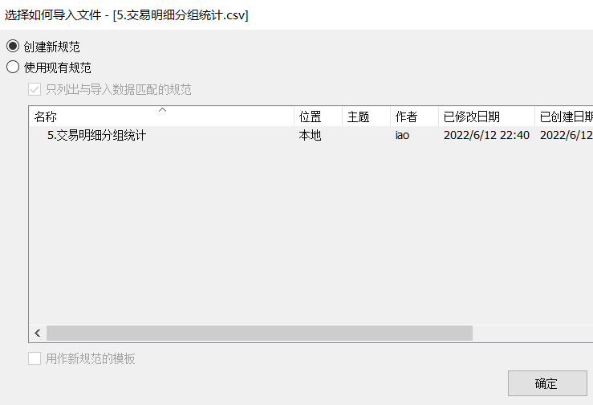

根据具体情况选择分隔符

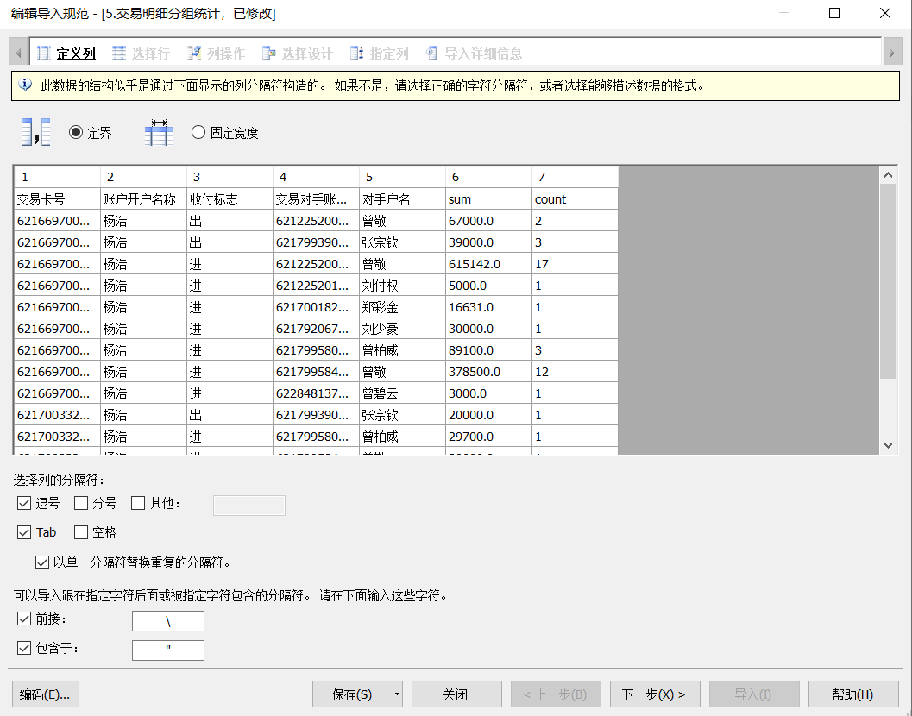

勾选从行提取列名

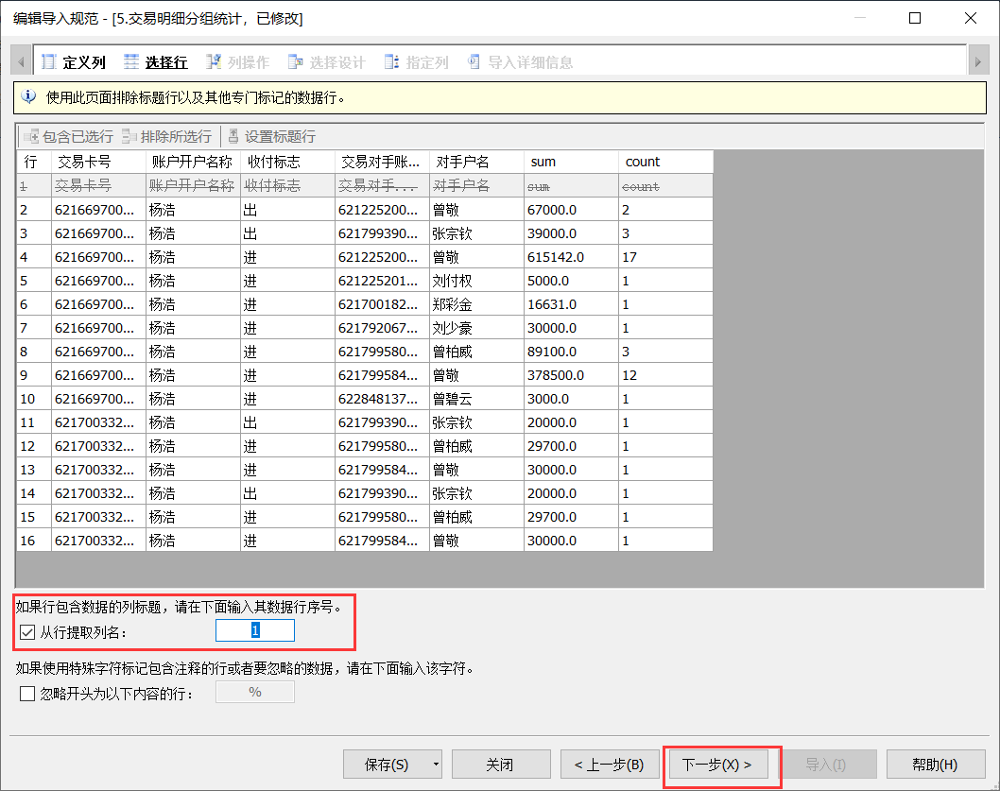

这一步一般可以跳过

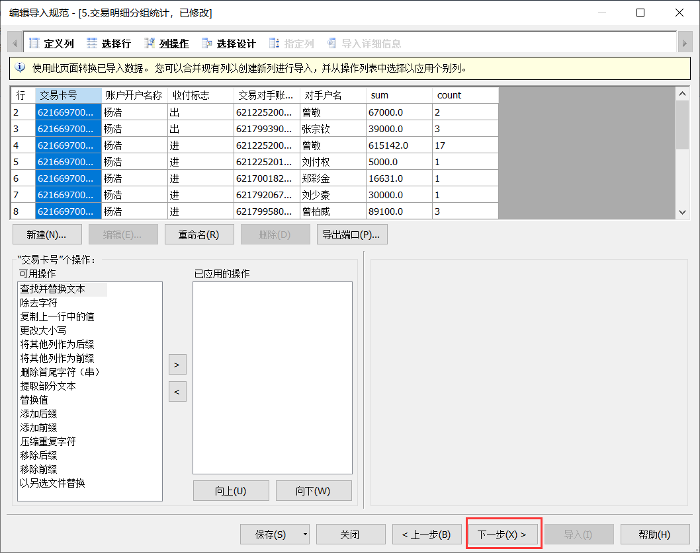

选择交易网络

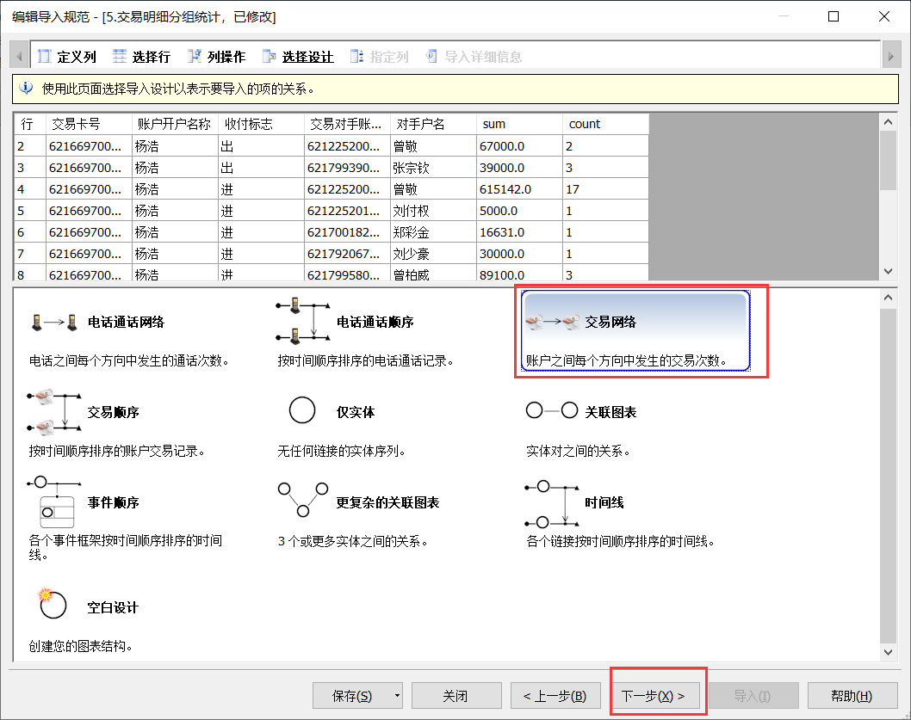

单击左边的实体，这个就是主账号实体。

单击后会在右侧显示相关的属性，主要关注以下属性：

- **标识**：相当于这个实体的身份证号，需要全局唯一
- **标签**：相当于这个实体名称，一般用姓名

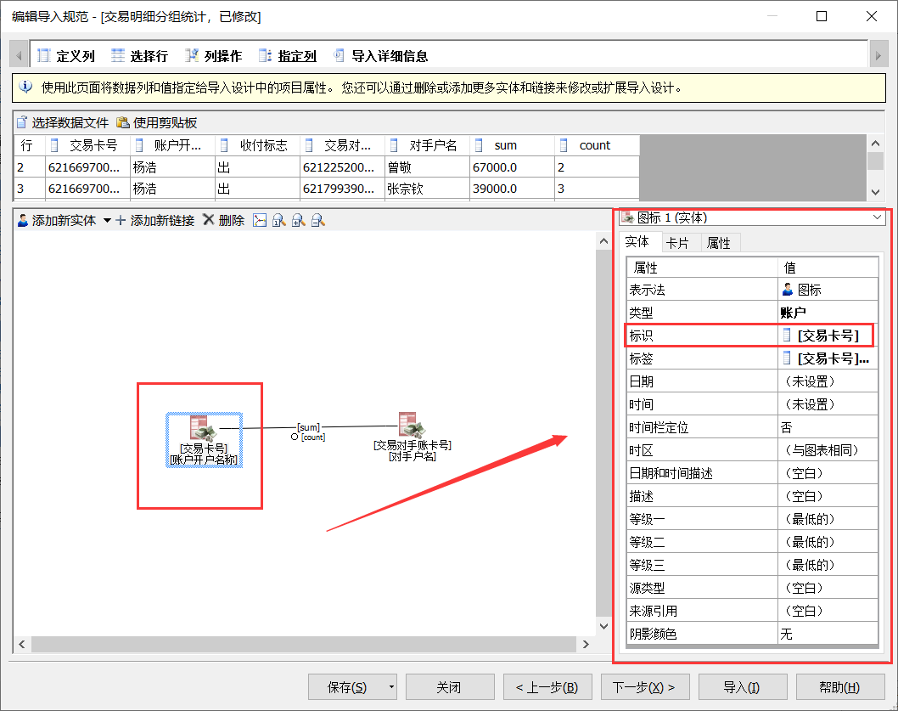

双击**标识**实体属性

在插入列中选择交易卡号

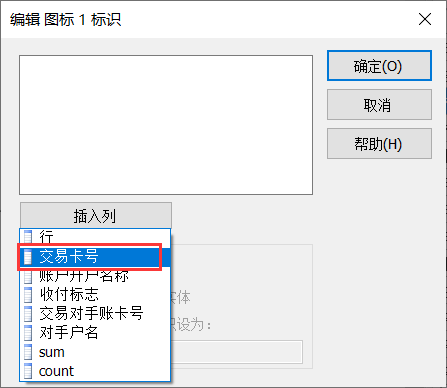

点击确定

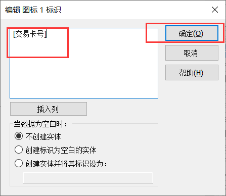

标签属性的设置

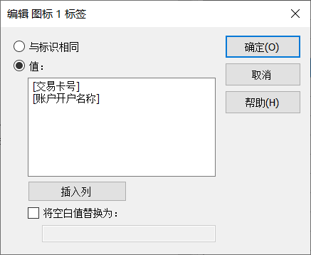

## 可视化搜索

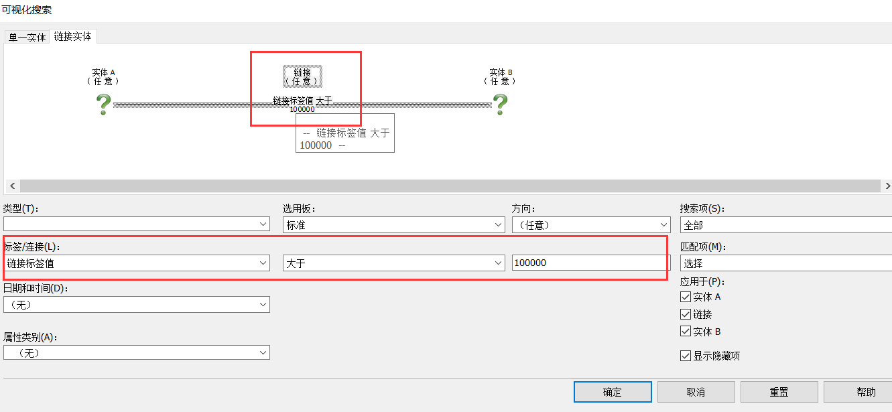

## 列出项目

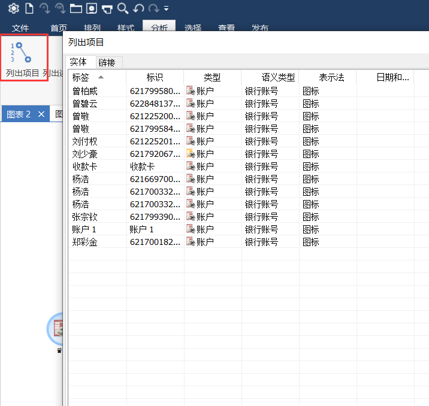

## 样式设置

重点实体更醒目

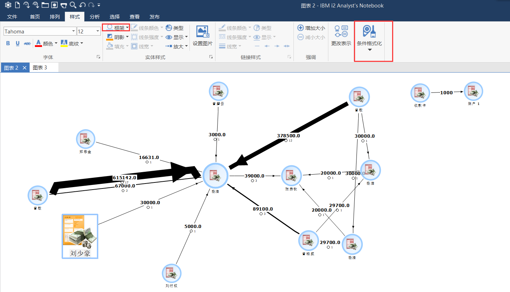

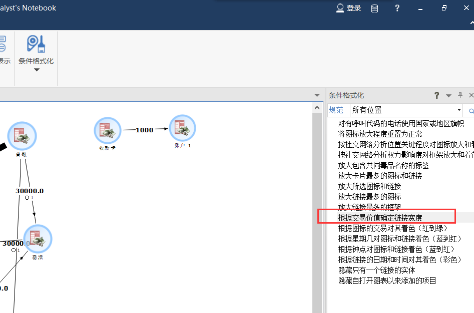

## 加入集合

ctrl + 1，选中集合 alt + 1

## 出入站排列

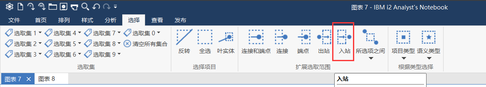

取消中心账户，然后点排列，点组织架构