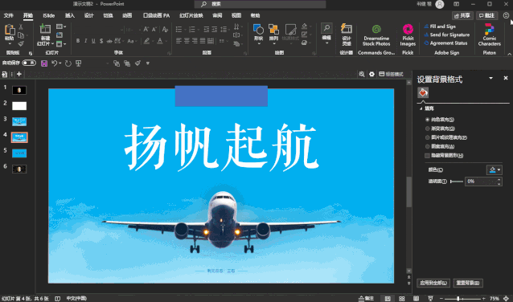

https://www.zhihu.com/question/29363114/answer/1351847108

## 素材网

样机素材**[mockupplanet.com](https://link.zhihu.com/?target=http%3A//mockupplanet.com)**：提供手机、平板电脑的外框素材

在线抠图[remove.bg](https://www.remove.bg/)

pdf处理网站[SmallPDF](https://smallpdf.com/)

### 汉字不同的偏旁部首设置不同的颜色

- 打一段汉字
- 随便创建一个形状
- 选中汉字和形状，选择合并形状->拆分。

### 图片形状填充

随意插入一些形状，组合这些形状，然后右键该形状 填充->图片或纹理

